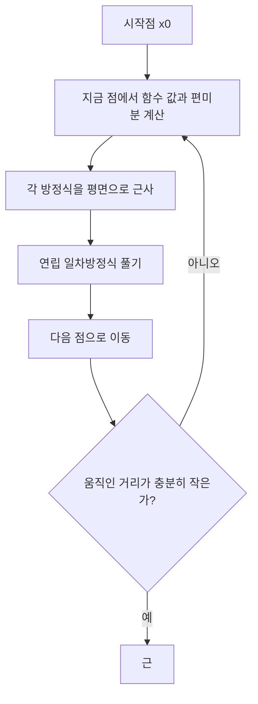



요약

미지수가 여럿인 비선형 연립방정식을 뉴턴 방법으로 푼다. 지금 점에서 각 방정식을 평면(1차 근사)으로 바꾸면 연립 일차방정식이 되고, 그것을 풀어 다음 점으로 간다. 근 근처에서는 오차가 매번 대략 제곱으로 줄어 아주 빠르다. 대신 매 반복 편미분 네 개(변수가 $$n$$개면 $$n^2$$개)를 계산하고 일차방정식을 풀어야 하며, 시작점이 멀면 다른 근으로 가거나 발산한다.

## 예시로 보기

$$u(x, y) = x^2 + xy - 10 = 0$$, $$v(x, y) = y + 3xy^2 - 57 = 0$$을 $$(x_0, y_0) = (1.5, 3.5)$$에서 푼다. 참값은 $$(2, 3)$$이다[^1].

편미분은 $$\frac{\partial u}{\partial x} = 2x + y = 6.5$$, $$\frac{\partial u}{\partial y} = x = 1.5$$, $$\frac{\partial v}{\partial x} = 3y^2 = 36.75$$, $$\frac{\partial v}{\partial y} = 1 + 6xy = 32.5$$다. 다음 점은 $$(2.03603, 2.84388)$$이다[^1][^2].

| 반복 | 0 | 1 | 2 | 3 | 4 |
|---|---|---|---|---|---|
| $$(2, 3)$$까지 거리 | $$7.1 \times 10^{-1}$$ | $$1.6 \times 10^{-1}$$ | $$2.6 \times 10^{-3}$$ | $$5.9 \times 10^{-7}$$ | $$7.8 \times 10^{-14}$$ |

오차의 자릿수가 매번 대략 두 배가 된다. 같은 문제의 고정점 반복(방법 ii)은 훨씬 천천히 다가간다[^s1].

왼쪽에서 파란 곡선($$u = 0$$)과 초록 곡선($$v = 0$$)이 만나는 곳이 근 $$(2, 3)$$이다. 뉴턴(주황)은 두 걸음 만에 근에 닿고, 고정점 반복(보라 점선)은 근 둘레를 맴돌며 다가간다. 오른쪽은 근까지 거리를 한 칸이 10배인 눈금으로 그렸다. 뉴턴은 아래로 꺾여 떨어지고, 고정점은 일정한 기울기로 천천히 내려간다[^s2].

검증: 편미분 값, 첫 반복 $$(2.03603, 2.84388)$$, 이차 수렴, $$J\Delta = -F$$와 같음, 먼 시작점의 다른 근, 카드 C2 — [31_multivariate-newton_impl.py](/Hongs_Blog/studies/numerical-analysis/code/31_multivariate-newton_impl/)

## 정의

1차원 뉴턴 방법은 테일러 급수의 1차 근사 $$f(x_{i+1}) \approx f(x_i) + (x_{i+1} - x_i)f'(x_i)$$에서 $$f(x_{i+1}) = 0$$으로 둔 것이다[^3]. 두 변수에서도 같은 1차 근사를 쓴다[^4].

$$u_{i+1} = u_i + (x_{i+1} - x_i)\frac{\partial u_i}{\partial x} + (y_{i+1} - y_i)\frac{\partial u_i}{\partial y}, \qquad v_{i+1} = v_i + (x_{i+1} - x_i)\frac{\partial v_i}{\partial x} + (y_{i+1} - y_i)\frac{\partial v_i}{\partial y}$$

근에서는 $$u_{i+1} = v_{i+1} = 0$$이므로 $$x_{i+1}$$, $$y_{i+1}$$에 대한 연립 일차방정식이 된다[^4][^5].

$$\frac{\partial u_i}{\partial x}x_{i+1} + \frac{\partial u_i}{\partial y}y_{i+1} = -u_i + x_i\frac{\partial u_i}{\partial x} + y_i\frac{\partial u_i}{\partial y}$$

$$\frac{\partial v_i}{\partial x}x_{i+1} + \frac{\partial v_i}{\partial y}y_{i+1} = -v_i + x_i\frac{\partial v_i}{\partial x} + y_i\frac{\partial v_i}{\partial y}$$

크라메르 공식으로 풀면 다음과 같다. 분모는 편미분 행렬(야코비 행렬)의 행렬식이다[^5].

$$x_{i+1} = x_i - \frac{u_i\frac{\partial v_i}{\partial y} - v_i\frac{\partial u_i}{\partial y}}{\frac{\partial u_i}{\partial x}\frac{\partial v_i}{\partial y} - \frac{\partial u_i}{\partial y}\frac{\partial v_i}{\partial x}}, \qquad y_{i+1} = y_i - \frac{v_i\frac{\partial u_i}{\partial x} - u_i\frac{\partial v_i}{\partial x}}{\frac{\partial u_i}{\partial x}\frac{\partial v_i}{\partial y} - \frac{\partial u_i}{\partial y}\frac{\partial v_i}{\partial x}}$$

행렬로 쓰면 $$J\Delta\mathbf x = -\mathbf F$$를 풀고 $$\mathbf x_{i+1} = \mathbf x_i + \Delta\mathbf x$$로 가는 것이다. $$J$$는 야코비 행렬, $$\mathbf F = (u, v)$$다. 변수가 $$n$$개여도 같다[^s1].

고리 한 바퀴마다 편미분을 새로 계산하고 일차방정식을 한 번 푼다. 한 바퀴가 비싼 대신 바퀴 수가 적다[^s2].

## 활용

- 회로·구조물의 비선형 방정식, 로봇 팔의 역기구학, [비선형 최소제곱](/Hongs_Blog/studies/numerical-analysis/data-linearization/)의 가우스-뉴턴 방법이 이 방법의 변형이다[^s1].
- 복잡도: 매 반복 야코비 행렬 계산($$n^2$$개 편미분)과 $$n \times n$$ 일차방정식 풀이(약 $$\frac23n^3$$). 변수가 많으면 야코비를 가끔만 다시 계산하는 변형을 쓴다.
- 흔한 실수: 시작점을 아무렇게나 고르는 것. $$(-3, -4)$$에서 시작하면 $$(4.39374, -2.11778)$$이라는 다른 근으로 간다(검증 코드).

## 연결

- 선수: [선형 근사와 뉴턴 방법](/Hongs_Blog/studies/calculus/linear-approx-newton/)(1차원판), [다변수 연쇄 법칙과 야코비 행렬](/Hongs_Blog/studies/calculus/multivariable-chain-rule/), [고정점 반복](/Hongs_Blog/studies/numerical-analysis/fixed-point-iteration/)(같은 문제의 느린 방법)
- 매 반복 푸는 일차방정식: [가우스 소거법](/Hongs_Blog/studies/linear-algebra/gaussian-elimination/)

## 확인 문제

**C1** 두 방정식 $$u = 0$$, $$v = 0$$에 대한 다변수 뉴턴 방법의 한 걸음을 행렬로 쓰라.

**답:** $$\begin{pmatrix}u_x & u_y\\ v_x & v_y\end{pmatrix}\begin{pmatrix}\Delta x\\ \Delta y\end{pmatrix} = -\begin{pmatrix}u\\ v\end{pmatrix}$$를 풀고 $$(x, y) \leftarrow (x + \Delta x, y + \Delta y)$$. 편미분은 모두 지금 점에서 계산한다.

**C2** $$u = x^2 + y^2 - 4$$, $$v = x - y$$를 $$(1, 2)$$에서 한 걸음 가라.

**답:** $$u = 1$$, $$v = -1$$, $$J = \begin{pmatrix}2 & 4\\ 1 & -1\end{pmatrix}$$, $$\det J = -6$$. $$\Delta x = -\frac{1\cdot(-1) - (-1)\cdot4}{-6} = 0.5$$, $$\Delta y = -\frac{(-1)\cdot2 - 1\cdot1}{-6} = -0.5$$. 다음 점 $$(1.5, 1.5)$$. 참값은 $$(\sqrt2, \sqrt2) \approx (1.414, 1.414)$$.

**C3** 다변수 뉴턴 방법은 왜 매 반복 연립 일차방정식을 풀게 되는가?

**답:** 지금 점에서 각 방정식을 1차 근사(평면)로 바꾸면 미지수에 대해 일차식이 된다. "근사한 평면들이 모두 0이 되는 점"을 찾는 것이 바로 연립 일차방정식이다.

[^1]: 수치해석 17회 강의 자료 「na17_nonlinear2」, p.13
[^2]: 같은 자료, p.14
[^3]: 같은 자료, p.10
[^4]: 같은 자료, p.11
[^5]: 같은 자료, p.12
[^s1]: 보충 오차 표, 행렬 꼴 $$J\Delta\mathbf x = -\mathbf F$$, 활용과 복잡도, 다른 근 예, 카드 C2·C3은 원본에 없다. 구현 코드로 확인했다.
[^s2]: 보충 그림은 원본에 없다. [31_multivariate-newton_plot.py](/Hongs_Blog/studies/numerical-analysis/code/31_multivariate-newton_plot/)로 그렸고, 같은 코드로 다음 값을 확인했다: 첫 반복 $$(2.03603, 2.84388)$$, 거리 표의 값, 고정점 방법 ii의 첫 값 $$(2.17945, 2.86051)$$.
[^s2]: 보충 다이어그램 1개는 원본에 없다. 이 문서 '정의'의 1차 근사와 연립 일차방정식(원본 17.na17_nonlinear2.pdf p.10~12), '활용'의 복잡도로 그렸다. 멈추는 기준은 예시 표의 근까지 거리를 보고 일반적인 꼴로 적었다.

