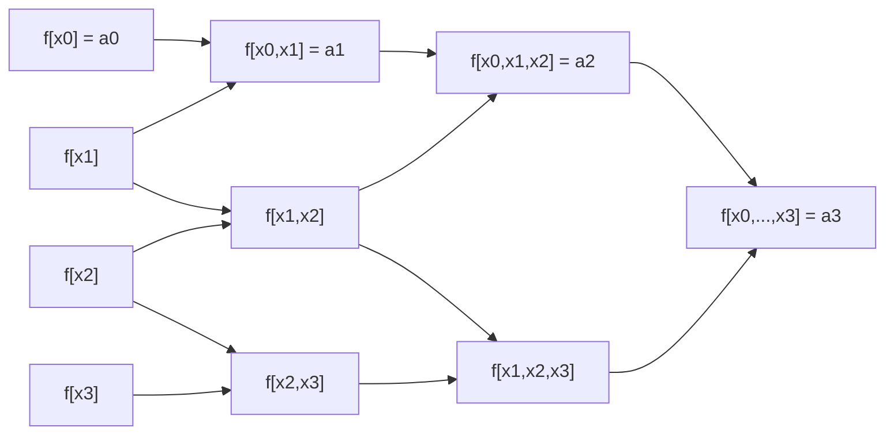



요약

라그랑주 공식은 점을 하나 더하면 처음부터 다시 계산해야 한다. 뉴턴 다항식은 "지금까지의 다항식에 항 하나를 덧붙이는" 꼴이라 점이 늘어도 앞 계산을 그대로 쓴다. 덧붙이는 항의 계수는 분할 차분이라는 기울기의 기울기를 표로 쌓아 얻는다. 같은 점들이면 결과는 라그랑주와 같은 다항식이다. 계산 순서만 다르다.

## 예시로 보기

$$f(x) = x^3 - 4x$$를 $$x = 1, 2, 3, 4, 5, 6$$에서 안다. 표의 각 칸은 바로 왼쪽 열의 이웃 두 칸 차이를 $$x$$의 차이로 나눈 것이다[^1].

| $$x_k$$ | $$f[x_k]$$ | 1계 | 2계 | 3계 | 4계 | 5계 |
|---|---|---|---|---|---|---|
| 1 | **−3** | | | | | |
| 2 | 0 | **3** | | | | |
| 3 | 15 | 15 | **6** | | | |
| 4 | 48 | 33 | 9 | **1** | | |
| 5 | 105 | 57 | 12 | 1 | **0** | |
| 6 | 192 | 87 | 15 | 1 | 0 | **0** |

굵은 대각선이 뉴턴 계수다. 앞 넷만 써서 $$P_3(x) = -3 + 3(x - 1) + 6(x - 1)(x - 2) + (x - 1)(x - 2)(x - 3)$$이다. $$f$$가 3차라 3계 차분이 모두 1로 같고, 4계부터 0이다. 그래서 $$P_3 = f$$다[^1][^s1].

$$P_0$$은 첫 점만 지나는 수평선이다. 항을 하나 더할 때마다 지나는 점이 하나씩 늘고, 앞의 점들은 그대로 지난다. 점 4개를 쓴 $$P_3$$(점선)은 $$f$$와 완전히 겹친다[^s2].

검증: 분할 차분표 전체, $$P_3 = f$$, 앞 계수가 점을 더해도 그대로, 슬라이드 p.18의 값 2, 1.625, 1.5125, 1.50575, 1계 차분과 도함수, 카드 C2 — [22_newton-divided-difference_impl.py](/Hongs_Blog/studies/numerical-analysis/code/22_newton-divided-difference_impl/)

## 정의

**입력:** 서로 다른 점 $$x_0, \dots, x_N$$과 값 $$f(x_k)$$. **출력:** 이 점들을 지나는 $$N$$차 이하 다항식.

**뉴턴 다항식.** 중심 $$x_0, x_1, \dots$$을 쓰는 다음 꼴이다[^2].

$$P_N(x) = a_0 + a_1(x - x_0) + a_2(x - x_0)(x - x_1) + \cdots + a_N(x - x_0)\cdots(x - x_{N-1})$$

차수를 하나 올릴 때는 항 하나만 더한다[^2][^3].

$$P_N(x) = P_{N-1}(x) + a_N(x - x_0)(x - x_1)\cdots(x - x_{N-1})$$

슬라이드의 예: 중심 $$1, 3, 4, 4.5$$, 계수 $$5, -2, 0.5, -0.1, 0.003$$이면 $$x = 2.5$$에서 $$P_1 = 2$$, $$P_2 = 1.625$$, $$P_3 = 1.5125$$, $$P_4 = 1.50575$$다[^4].

**분할 차분.** 계수 $$a_k$$를 구하는 재귀 공식이다[^5].

$$f[x_k] = f(x_k), \qquad f[x_{k-j}, \dots, x_k] = \frac{f[x_{k-j+1}, \dots, x_k] - f[x_{k-j}, \dots, x_{k-1}]}{x_k - x_{k-j}}$$

1계 분할 차분은 두 점을 잇는 직선의 기울기다. 2계는 1계 차분끼리의 차이, 곧 기울기의 기울기다[^6][^7]. 그리고 $$a_k = f[x_0, \dots, x_k]$$다[^8].

칸마다 왼쪽 열의 이웃 두 칸에서 화살표를 받는다. 계수 $$a_k$$는 각 열의 맨 위 칸, 곧 $$x_0$$에서 시작하는 차분이다[^s3].

평균값 정리로 $$f[x_0, x_1] = f'(c)$$인 $$c$$가 $$x_0$$과 $$x_1$$ 사이에 있다. 그래서 1계 차분은 가운데 점의 도함수 근삿값으로 쓴다: $$f'\left(\frac{x_0 + x_1}{2}\right) \approx f[x_0, x_1]$$[^9]. 같은 방식으로 $$k$$계 차분은 $$\frac{f^{(k)}(c)}{k!}$$와 같다. 2차식 $$3x^2 - x + 2$$이면 2계 차분이 정확히 $$\frac{6}{2} = 3$$이다[^s1].

**값 계산(중첩 곱셈).** $$P_N(x) = a_0 + (x - x_0)\big(a_1 + (x - x_1)(a_2 + \cdots)\big)$$로 안쪽부터 계산하면 곱셈이 $$N$$번이다[^s1].

## 활용

- 측정 점이 하나씩 늘어나는 상황(실시간 자료), 수치 미분 공식(분할 차분), 미분방정식의 다단계 방법(아담스 방법)의 바탕이다[^s1].
- 복잡도: 표 만들기 $$O(N^2)$$, 값 하나 계산 $$O(N)$$. 점을 하나 더하면 표의 한 줄($$O(N)$$)만 더 계산한다.
- 흔한 실수: 분모를 이웃 두 점의 차이로 쓰는 것. $$j$$계 차분의 분모는 양 끝 $$x_k - x_{k-j}$$다.

## 연결

- 선수: [다항식 보간](/Hongs_Blog/studies/numerical-analysis/polynomial-interpolation/)(같은 다항식), [평균값 정리](/Hongs_Blog/studies/calculus/mean-value-theorem/)
- 분할 차분과 도함수: [테일러 급수](/Hongs_Blog/studies/calculus/taylor-series/)(모든 점이 한 점에 모이면 뉴턴 다항식이 테일러 다항식이 된다)
- 표를 아래에서 위로 채우는 방식: [동적 계획법](/Hongs_Blog/studies/algorithms/dynamic-programming/)

## 확인 문제

**C1** 뉴턴 다항식의 꼴과 계수를 주는 분할 차분의 재귀식을 쓰라.

**답:** $$P_N = a_0 + a_1(x - x_0) + \cdots + a_N\prod_{j<N}(x - x_j)$$, $$a_k = f[x_0, \dots, x_k]$$. $$f[x_{k-j}, \dots, x_k] = \frac{f[x_{k-j+1}, \dots, x_k] - f[x_{k-j}, \dots, x_{k-1}]}{x_k - x_{k-j}}$$.

**C2** $$(0, 1)$$, $$(1, 3)$$, $$(2, 7)$$의 분할 차분표를 만들고 뉴턴 다항식으로 $$x = 3$$의 값을 구하라.

**답:** 1계 $$2, 4$$, 2계 $$\frac{4 - 2}{2 - 0} = 1$$. 계수 $$1, 2, 1$$. $$P_2(x) = 1 + 2x + x(x - 1)$$, $$P_2(3) = 1 + 6 + 6 = 13$$.

**C3** 점을 하나 더할 때 뉴턴 다항식은 앞 계수를 그대로 쓸 수 있는데 라그랑주는 왜 다시 계산해야 하는가?

**답:** 뉴턴의 새 항 $$a_N\prod(x - x_j)$$는 앞의 모든 점에서 0이라, 덧붙여도 앞 점들을 지나는 성질이 깨지지 않는다. 라그랑주의 기저 함수 $$L_i$$는 모든 점의 곱으로 되어 있어 점이 하나 늘면 모든 $$L_i$$가 바뀐다.

**C4** 중첩 곱셈 `s ← a[N]; for k = N−1 down to 0: s ← a[k] + (x − x[k])·s`가 하는 일을 한 문장으로 쓰라.

**답:** 뉴턴 다항식을 안쪽 괄호부터 계산해, 곱셈 $$N$$번만으로 $$P_N(x)$$의 값을 구한다.

[^1]: 2-2학기/수치해석/1.수업자료/12.na12_interpolation.pdf, p.28
[^2]: 같은 자료, p.16~17
[^3]: 같은 자료, p.19~20
[^4]: 같은 자료, p.18
[^5]: 같은 자료, p.21
[^6]: 같은 자료, p.22
[^7]: 같은 자료, p.23~24
[^8]: 같은 자료, p.25~27
[^9]: 같은 자료, p.22
[^s1]: 에이전트 보충. 4·5계가 0인 이유, $$k$$계 차분과 $$f^{(k)}/k!$$, 2차식 예, 중첩 곱셈, 활용과 복잡도, 흔한 실수, 카드 C2~C4는 원본에 없다. 구현 코드로 확인했다.
[^s2]: 에이전트 보충. 그림은 원본에 없다. [22_newton-divided-difference_plot.py](/Hongs_Blog/studies/numerical-analysis/code/22_newton-divided-difference_plot/)로 그렸고, 같은 코드로 다음 값을 확인했다: 뉴턴 계수 $$-3, 3, 6, 1, 0, 0$$과 $$P_3 = f$$.
[^s3]: 에이전트 보충. 다이어그램 1개는 원본에 없다. 이 문서 '정의'의 분할 차분 재귀식과 $$a_k = f[x_0, \dots, x_k]$$(원본 12.na12_interpolation.pdf p.21~27)로 그렸다.

