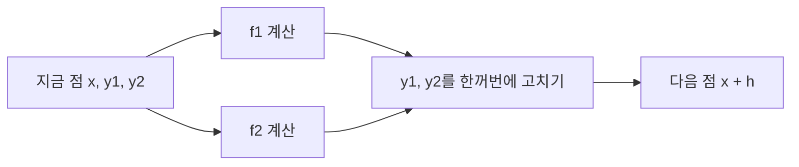



요약

실제 문제는 미지 함수가 여럿이고 서로의 변화에 영향을 준다(예: 포식자와 먹이의 수). 이런 연립 방정식도 미지 함수들을 한 목록(벡터)으로 묶으면, 오일러나 룽게-쿠타 공식을 목록의 각 칸에 똑같이 적용해 푼다. $$y'' = \dots$$ 같은 2계 이상의 방정식도 $$y'$$을 새 미지 함수로 두면 1계 연립이 되어 같은 방법을 쓴다. 다만 시작점에서 미지 함수의 수만큼 처음 값을 알아야 한다.

## 예시로 보기

두 양이 서로 영향을 주며 변한다[^1].

$$\frac{dy_1}{dx} = -0.5y_1, \qquad \frac{dy_2}{dx} = 4 - 0.3y_2 - 0.1y_1, \qquad y_1(0) = 4,\ y_2(0) = 6$$

오일러 방법($$h = 0.5$$)을 두 칸에 동시에 쓴다. $$x = 0.5$$에서 $$y_1 = 4 + 0.5(-2) = 3$$, $$y_2 = 6 + 0.5(4 - 1.8 - 0.4) = 6.9$$다[^1].

| $$x$$ | 0 | 0.5 | 1.0 | 1.5 | 2.0 |
|---|---|---|---|---|---|
| $$y_1$$ | 4 | 3 | 2.25 | 1.6875 | 1.265625 |
| $$y_2$$ | 6 | 6.9 | 7.715 | 8.44525 | 9.094087 |

$$y_2$$를 고칠 때 같은 걸음의 옛 $$y_1$$을 쓴다. $$y_1$$의 참값 $$4e^{-x/2}$$와 비교하면 $$x = 2$$에서 오일러는 1.27, 참값은 1.47이다. RK4로 같은 걸음을 가면 오차가 $$10^{-4}$$ 아래다[^s1].

실선이 참값, 빈 동그라미가 오일러($$h = 0.5$$), ×가 같은 걸음의 RK4다. 오일러는 $$x$$가 커질수록 참값에서 조금씩 벗어나고, RK4는 참값 위에 그대로 놓인다[^s2].

검증: 오일러 표, RK4와 참값, $$y'' = -y$$를 연립으로 바꿔 $$\sin x$$ 재현, 카드 C2 — [35_ode-systems_impl.py](/Hongs_Blog/studies/numerical-analysis/code/35_ode-systems_impl/)

## 정의

**연립 상미분방정식**은 미지 함수 $$n$$개의 방정식 $$n$$개다[^2].

$$\frac{dy_k}{dx} = f_k(x, y_1, y_2, \dots, y_n), \qquad k = 1, \dots, n$$

풀려면 시작점 $$x_0$$에서 처음 값 $$n$$개가 필요하다[^2]. 모든 조건이 같은 $$x$$(보통 $$t = 0$$)에서 주어지면 **초깃값 문제**다[^3]. 조건이 서로 다른 $$x$$에서 주어지는 경계값 문제는 [사격법](/Hongs_Blog/studies/numerical-analysis/shooting-method/)과 [유한 차분법](/Hongs_Blog/studies/numerical-analysis/finite-difference-bvp/)에서 다룬다.

벡터 $$\mathbf y = (y_1, \dots, y_n)$$, $$\mathbf f = (f_1, \dots, f_n)$$으로 쓰면 $$\mathbf y' = \mathbf f(x, \mathbf y)$$가 되어, 한 개짜리 방정식의 방법을 그대로 쓴다[^4]. RK4라면 $$\mathbf k_1, \dots, \mathbf k_4$$가 모두 벡터이고, $$\mathbf k_2$$를 잴 때는 모든 칸을 $$\frac h2\mathbf k_1$$만큼 옮긴 점에서 잰다[^s1].

두 기울기를 모두 같은 점에서 잰 뒤에 두 칸을 함께 고친다. 새 $$y_1$$이 $$f_2$$ 계산으로 들어가는 화살표는 없다[^s3].

**고계 방정식을 1계 연립으로.** $$y'' = g(x, y, y')$$이면 $$z = y'$$로 두어 다음과 같이 쓴다[^s1].

$$y' = z, \qquad z' = g(x, y, z)$$

처음 값은 $$y(x_0)$$와 $$y'(x_0) = z(x_0)$$ 두 개다. $$n$$계 방정식이면 $$y, y', \dots, y^{(n-1)}$$을 미지 함수로 두어 $$n$$개짜리 연립이 된다.

## 활용

- 행성 운동(위치와 속도 6개), 포식자-먹이 모형, 회로의 전류와 전압, 화학 반응 속도가 모두 연립 상미분방정식이다. SciPy `solve_ivp`도 벡터 함수 하나를 받는다[^s1].
- 흔한 실수: 한 걸음 안에서 앞 칸을 먼저 고친 뒤 그 새 값으로 다음 칸의 기울기를 재는 것. 오일러와 RK는 모든 칸의 기울기를 같은 점에서 잰 뒤 한꺼번에 고친다.

## 연결

- 선수: [룽게-쿠타 방법](/Hongs_Blog/studies/numerical-analysis/runge-kutta/)(벡터로 그대로 씀)
- 경계값 문제로: [사격법](/Hongs_Blog/studies/numerical-analysis/shooting-method/)
- 신호 및 시스템의 미분방정식 모형: [1계 선형 미분방정식](/Hongs_Blog/studies/signals-and-systems/first-order-linear-ode/)

## 확인 문제

**C1** $$y'' = g(x, y, y')$$를 1계 연립으로 바꾸는 방법과 필요한 처음 값을 쓰라.

**답:** $$z = y'$$로 두어 $$y' = z$$, $$z' = g(x, y, z)$$. 처음 값은 $$y(x_0)$$와 $$z(x_0) = y'(x_0)$$ 두 개.

**C2** $$y'' + 3y' + 2y = 0$$, $$y(0) = 1$$, $$y'(0) = 0$$을 연립으로 바꿔 오일러 방법 $$h = 0.1$$로 한 걸음 가라.

**답:** $$y' = z$$, $$z' = -3z - 2y$$. $$(y, z) = (1, 0)$$에서 기울기 $$(0, -2)$$. 다음 값 $$(1 + 0, 0 - 0.2) = (1, -0.2)$$.

**C3** 연립 방정식을 풀 때 처음 값이 미지 함수의 수만큼 필요한 이유는?

**답:** 각 방정식은 자기 함수가 어떻게 변하는지(기울기)만 알려 준다. 출발 높이는 함수마다 따로 정해 주지 않으면, 같은 기울기 규칙을 따르는 풀이가 무수히 많다.

[^1]: 2-2학기/수치해석/1.수업자료/19.na19_diff_eq2.pdf, p.3
[^2]: 같은 자료, p.2
[^3]: 같은 자료, p.4
[^4]: 같은 자료, p.3
[^s1]: 에이전트 보충. 참값과 RK4 비교, 벡터 RK4의 설명, 고계 방정식 바꾸기, 활용, 흔한 실수, 카드 C2·C3은 원본에 없다. 구현 코드로 확인했다.
[^s2]: 에이전트 보충. 그림은 원본에 없다. [35_ode-systems_plot.py](/Hongs_Blog/studies/numerical-analysis/code/35_ode-systems_plot/)로 그렸고, 같은 코드로 다음 값을 확인했다: 오일러 표의 값, RK4 오차 $$10^{-4}$$ 아래. $$y_2$$의 참값 $$\frac{40}{3} + 2e^{-x/2} - \frac{28}{3}e^{-0.3x}$$는 일차 방정식을 손으로 풀어 얻었고, 같은 코드에서 방정식을 만족하는지 확인했다.
[^s3]: 에이전트 보충. 다이어그램 1개는 원본에 없다. 이 문서 예시의 오일러 계산(원본 19.na19_diff_eq2.pdf p.3)과 '활용'의 흔한 실수로 그렸다.

