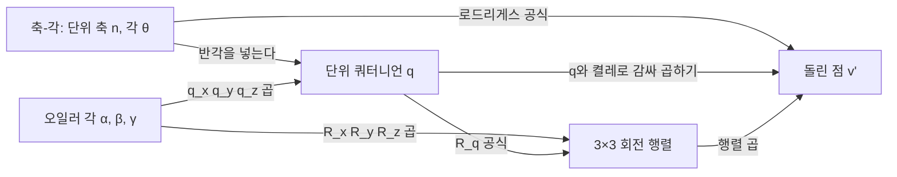



요약

복소수 하나($$\cos\theta + i\sin\theta$$)를 곱하면 평면에서 회전하듯, 숫자 네 개짜리 쿼터니언 하나로 3차원 회전을 나타낸다. 회전 축과 각을 그대로 담아 짐벌 잠금이 없고, 두 자세 사이를 공 표면을 따라 매끄럽게 이어 갈 수 있다. 대신 오일러 각보다 숫자를 보고 자세를 떠올리기 어렵다. 또 곱하는 순서를 바꾸면 결과가 달라진다.

## 예시로 보기

복소수 $$i$$를 곱하면 평면의 점이 90° 돈다. 3차원 회전에는 축이 필요하니 허수 단위를 셋($$i, j, k$$)으로 늘린다.

$$z$$축을 중심으로 90° 돌리는 쿼터니언은 $$q = \cos45° + k\sin45° = (\frac{\sqrt2}{2}, 0, 0, \frac{\sqrt2}{2})$$다. 각의 절반(45°)이 들어간다. 점 $$(1, 0, 0)$$을 순허수 쿼터니언 $$0 + 1i + 0j + 0k$$로 두고 $$q\,v\,\bar q$$를 계산하면 $$(0, 1, 0)$$이 나온다. $$z$$축으로 90° 돈 것이 맞다[^s1].

검증: $$i, j, k$$ 곱셈 규칙, 예시, 무작위 축·각 300개에서 $$qv\bar q$$ = 로드리게스 공식 = 행렬 공식, $$q$$와 $$-q$$가 같은 회전, $$q_xq_yq_z \leftrightarrow R_xR_yR_z$$, 곱의 순서, 카드 C2 — [10_quaternion_verify.py](/Hongs_Blog/studies/numerical-analysis/code/10_quaternion_verify/)

## 정의

**쿼터니언**은 해밀턴이 복소수를 넓혀 만든 수로, 곱셈의 교환법칙이 통하지 않는다. 숫자 네 개 $$w + xi + yj + zk$$이고, $$i, j, k$$는 다음 규칙을 따르는 특별한 허수다[^1].

$$i^2 = j^2 = k^2 = -1, \qquad ij = -ji = k, \quad jk = -kj = i, \quad ki = -ik = j$$

$$ij = k$$인데 $$ji = -k$$라 곱하는 순서가 중요하다. 이 규칙으로 두 쿼터니언을 분배해 곱한다(해밀턴 곱).

**회전.** 3차원의 어떤 회전이든 쿼터니언 $$(w, x, y, z)$$로 나타낼 수 있다[^2]. 단위 벡터 $$\mathbf n$$을 축으로 $$\theta$$만큼 도는 회전은 다음 쿼터니언이다. 길이가 1이라 단위 쿼터니언이라 부른다.

$$q = \left(\cos\frac\theta2,\ \sin\frac\theta2\,\mathbf n\right)$$

축마다 쓰면 $$q_x = (\cos\frac\alpha2, \sin\frac\alpha2, 0, 0)$$, $$q_y = (\cos\frac\beta2, 0, \sin\frac\beta2, 0)$$, $$q_z = (\cos\frac\gamma2, 0, 0, \sin\frac\gamma2)$$다[^2]. 점 $$\mathbf v$$는 $$(0, \mathbf v)$$로 두고 $$q$$와 켤레 $$\bar q = (w, -x, -y, -z)$$로 감싸 돌린다[^s1].

$$\mathbf v' = q\,\mathbf v\,\bar q$$

오일러 각은 기본 회전 쿼터니언을 곱한다: $$q = q_xq_yq_z$$는 $$X' = R_xR_yR_zX$$와 같다[^2]. 쿼터니언을 회전 행렬로 바꾸는 식은 다음과 같다[^3].

$$R_q = \begin{pmatrix}1 - 2y^2 - 2z^2 & 2xy - 2wz & 2xz + 2wy\\ 2xy + 2wz & 1 - 2x^2 - 2z^2 & 2yz - 2wx\\ 2xz - 2wy & 2yz + 2wx & 1 - 2x^2 - 2y^2\end{pmatrix}$$

세 표현은 모두 같은 회전을 적는다. 화살표는 이 문서와 앞 두 문서가 주는 바꾸기 공식이고, 어느 길로 가도 같은 점 $$\mathbf v'$$에 닿는다[^s2].

**보간.** 단위 쿼터니언은 4차원 단위 구 위의 점이다. 두 회전 사이를 보간하는 것은 구 위의 두 점 사이를 잇는 것이다. 한 경로가 정해지고, 오일러 각보다 예측 가능하고 안정적이다[^3]. 구 위를 일정한 빠르기로 잇는 방법은 [구면 선형 보간](/Hongs_Blog/studies/numerical-analysis/slerp/)이다.

### 스스로 설명해 보기

1. $$q$$에 $$\theta$$가 아니라 $$\frac\theta2$$가 들어가는 이유

$$\mathbf v$$를 $$q$$와 $$\bar q$$로 양쪽에서 감싸 곱하므로 각이 두 번 들어간다. 반씩 두 번이라 합쳐서 $$\theta$$가 된다.

2. $$q$$와 $$-q$$가 같은 회전인 이유

$$(-q)\mathbf v(\overline{-q}) = (-1)^2q\mathbf v\bar q = q\mathbf v\bar q$$이다. 부호가 두 번 곱해져 사라진다. 각으로 보면 $$\frac\theta2$$에 180°를 더한 것이라, $$\theta$$에 360°를 더한 같은 회전이다.

3. $$q = q_xq_yq_z$$가 $$R_xR_yR_z$$와 같은 이유

$$q\mathbf v\bar q = q_x\big(q_y(q_z\mathbf v\bar q_z)\bar q_y\big)\bar q_x$$이다. 곱의 켤레는 순서가 뒤집혀 $$\overline{q_xq_yq_z} = \bar q_z\bar q_y\bar q_x$$이기 때문이다. 가장 안쪽 $$q_z$$가 먼저 작용하니 행렬로 $$R_xR_yR_z$$다.

이 방법의 핵심 아이디어는?

회전을 "축 하나와 각 하나"로 직접 담는다. 축 세 개를 차례로 쓰는 오일러 각과 달리 축이 겹칠 일이 없다.

이 방법을 쓸 수 있는 다른 상황은?

복소수 $$e^{i\theta}$$로 2차원 회전을 하는 것([덧셈정리 ↔ 복소수 곱 ↔ 회전 행렬](/Hongs_Blog/studies/linear-algebra/rotation-bridge/))이 같은 구조의 2차원판이다.

## 활용

- 게임 엔진(Unity의 `Quaternion`, Unreal의 `FQuat`), 로봇·드론의 자세 추정, 우주선 자세 제어에서 회전을 저장하고 보간하는 기본 표현이다[^s1].
- 숫자 네 개라 $$3 \times 3$$ 행렬(아홉 개)보다 작다. 곱셈을 반복해 오차가 쌓이면 길이로 나눠 다시 단위로 맞추기만 하면 된다. 행렬은 다시 직교로 맞추기가 더 번거롭다[^s1].
- 흔한 실수: 각의 절반을 쓰지 않는 것. $$\cos\theta$$를 넣으면 두 배 돈다.

## 연결

- 선수: [오일러 각과 짐벌 잠금](/Hongs_Blog/studies/numerical-analysis/euler-angles/)(해결하려는 문제), [복소수의 극형식과 오일러 공식](/Hongs_Blog/studies/college-math/euler-formula/)
- 같은 회전의 다른 표현: [임의 축 회전](/Hongs_Blog/studies/numerical-analysis/axis-rotation/)(로드리게스 공식)

## 자주 하는 오해

"쿼터니언 $$q$$와 회전은 일대일로 짝지어진다"

틀렸다. $$q$$와 $$-q$$는 같은 회전이다. 슬라이드의 "두 회전 사이의 유일한 경로"라는 말 때문에 쿼터니언도 하나뿐이라고 생각하기 쉽다. 실제로는 한 회전에 쿼터니언이 둘씩 있다. 그래서 두 쿼터니언을 보간할 때 내적이 음수이면 한쪽 부호를 뒤집어 짧은 쪽 길로 간다. 검증 코드에서 무작위 300개 모두 $$q$$와 $$-q$$가 같은 결과를 냈다.

## 확인 문제

**C1** 단위 벡터 $$\mathbf n$$을 축으로 $$\theta$$ 도는 쿼터니언과, 점 $$\mathbf v$$를 돌리는 식을 쓰라.

**답:** $$q = (\cos\frac\theta2, \sin\frac\theta2\,\mathbf n)$$. $$\mathbf v' = q(0, \mathbf v)\bar q$$, $$\bar q = (w, -x, -y, -z)$$.

**C2** $$x$$축으로 180° 도는 쿼터니언은? 이것으로 $$(0, 1, 0)$$을 돌리면?

**답:** $$q = (\cos90°, \sin90°, 0, 0) = (0, 1, 0, 0)$$, 곧 $$i$$다. $$(0, 1, 0)$$은 $$(0, -1, 0)$$이 된다.

**C3** 회전을 저장하고 두 자세를 매끄럽게 이어야 하는 게임 캐릭터에 오일러 각과 쿼터니언 중 무엇을 쓰나? 다른 쪽은 왜 아닌가?

**답:** 쿼터니언. 오일러 각은 가운데 각이 90°일 때 짐벌 잠금이 생기고, 같은 자세에 각도 묶음이 여럿이라 각도 보간이 이상한 길로 돌 수 있다. 사람이 숫자를 입력하는 편집 화면에서는 오일러 각이 읽기 쉬워 함께 쓴다.

**C4** $$q\mathbf v\bar q$$에서 각이 반으로 들어가는 이유를 대라.

**답:** $$\mathbf v$$의 양쪽에서 $$q$$와 $$\bar q$$를 곱해, 축에 수직인 성분이 $$\frac\theta2$$씩 두 번 돈다. 그래서 $$q$$에는 $$\frac\theta2$$를 넣어야 전체가 $$\theta$$가 된다.

[^1]: 2-2학기/수치해석/1.수업자료/06.na06_rotation.pdf, p.24~25
[^2]: 같은 자료, p.26
[^3]: 같은 자료, p.27
[^s1]: 에이전트 보충. 예시, 단위 벡터 축-각 공식과 $$q\mathbf v\bar q$$(슬라이드는 축별 쿼터니언과 행렬만 적는다), 스스로 설명해 보기, 게임 엔진·자세 제어, 정규화, 흔한 실수, 오해, 카드 C2~C4는 원본에 없다. 검증 코드로 확인했다.
[^s2]: 에이전트 보충. 다이어그램 1개는 원본에 없다. 이 문서 '정의'의 축-각 쿼터니언, $$q = q_xq_yq_z$$, $$R_q$$ 공식(원본 06.na06_rotation.pdf p.26~27)과 [임의 축 회전](/Hongs_Blog/studies/numerical-analysis/axis-rotation/)의 로드리게스 공식, [오일러 각과 짐벌 잠금](/Hongs_Blog/studies/numerical-analysis/euler-angles/)의 행렬 곱으로 그렸다.

