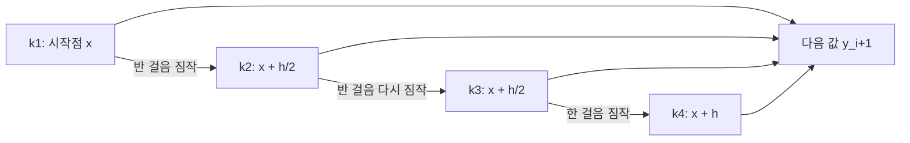


<div class="callout callout-summary" markdown="1">
<div class="callout-title callout-title--default" markdown="span">요약</div>

테일러 급수 방법은 정확하지만 $$f$$를 여러 번 미분해야 한다. 룽게-쿠타 방법은 미분하지 않고, 한 걸음 안의 몇 군데에서 기울기 $$f$$를 재어 무게를 붙여 평균 낸다. 무게와 재는 위치를 테일러 급수와 같은 결과가 나오도록 고르면, 미분 없이 같은 정확도를 얻는다. 가장 많이 쓰는 4차 방법(RK4)은 한 걸음에 기울기를 네 번 재고, 오일러보다 같은 걸음에서 수만 배 정확하다. 다만 기울기를 여러 번 재는 만큼 한 걸음이 비싸다.

</div>


## 예시로 보기

$$y' = x + y$$, $$y(0) = 1$$을 $$x = 1$$까지 $$h = 0.1$$로 풀면 오차가 다음과 같다(참값 $$2e - 2$$)[^s1].

| 방법 | 기울기를 재는 횟수/걸음 | 오차 | $$h$$를 반으로 하면 |
|---|---|---|---|
| 오일러 | 1 | $$2.5 \times 10^{-1}$$ | 1/2 |
| 호인(2차 RK) | 2 | $$8.4 \times 10^{-3}$$ | 1/4 |
| RK4 | 4 | $$4.2 \times 10^{-6}$$ | 1/16 |

호인 방법의 한 걸음은 이렇다. 시작점의 기울기 $$k_1 = f(0, 1) = 1$$로 끝점을 짐작해 $$(0.1, 1.1)$$에서 기울기 $$k_2 = 1.2$$를 잰다. 두 기울기의 평균 1.1로 가서 $$y_1 = 1 + 0.1 \times 1.1 = 1.11$$이다.


가로축은 $$x = 1$$까지 기울기 $$f$$를 계산한 총횟수다. 같은 40번이라도 오일러($$h = 0.025$$)보다 RK4($$h = 0.1$$)의 오차가 만 배 넘게 작다. 계산 횟수보다 기울기에 붙이는 무게가 정확도를 더 크게 가른다[^s2].

<div class="callout callout-check" markdown="1">
<div class="callout-title" markdown="span">검증: 2차 RK 세 가지의 전역 차수 2와 한 걸음 차수 3, 조건을 어기면 차수 1, RK4 차수 4, 표의 오차, 카드 C2, 적분이면 RK4 = 심프슨 공식 — [34_runge-kutta_impl.py](/Hongs_Blog/studies/numerical-analysis/code/34_runge-kutta_impl/)</div>

</div>


## 정의

**입력:** $$y' = f(x, y)$$, $$y(x_0) = y_0$$, 걸음 $$h$$. **출력:** $$x_i = x_0 + ih$$에서의 근삿값 $$y_i$$.

모든 방법은 $$y(x_i + h) = y(x_i) + hF(x_i, y_i)$$ 꼴이다[^1]. RK 방법은 $$F$$를 기울기 몇 개의 무게 합으로 둔다[^2].

$$F(x_i, y_i) = \sum_{j=1}^{n}w_jf(u_j, v_j)$$


재는 점 $$(u_j, v_j)$$와 무게 $$w_j$$를 $$F$$가 $$k$$차 테일러 함수 $$T_k$$와 맞도록 고른다[^2].

### 2차 RK 만들기

기울기 두 개를 쓴다. 하나는 시작점, 하나는 $$a$$만큼 앞으로 오일러로 짐작한 점이다[^3].

$$F = w_1f(x_i, y_i) + w_2f\big(x_i + ah,\ y_i + ahf(x_i, y_i)\big)$$


뒤의 항을 테일러로 펼치면 $$f(x_i + ah, y_i + ahf) = f + ah\left[\frac{\partial f}{\partial x} + f\frac{\partial f}{\partial y}\right] + R$$이다. 괄호 안은 $$f$$를 $$x$$로 전미분한 $$f'$$이다. 그래서 다음과 같다[^3][^4].

$$F = (w_1 + w_2)f + w_2ah\,f' + w_2R, \qquad T_2 = f + \frac h2 f'$$


$$h$$의 차수끼리 맞추면 두 조건이 나온다[^4].

$$w_1 + w_2 = 1, \qquad aw_2 = \frac12 \quad\Longrightarrow\quad w_2 = \frac{1}{2a},\ w_1 = 1 - \frac{1}{2a}$$


$$a$$를 하나 고르면 방법 하나가 정해진다. $$a = 1$$이 호인 방법($$w_1 = w_2 = \frac12$$), $$a = \frac12$$가 중점 방법($$w_1 = 0$$, $$w_2 = 1$$), $$a = \frac34$$가 랄스턴 방법이다[^s1].

### RK4

같은 방식으로 4차 테일러에 맞춘 가장 흔한 꼴이다[^s1].

```
RK4_STEP(f, x, y, h)
  k1 ← f(x, y)
  k2 ← f(x + h/2, y + h/2·k1)
  k3 ← f(x + h/2, y + h/2·k2)
  k4 ← f(x + h,   y + h·k3)
  return y + h/6·(k1 + 2k2 + 2k3 + k4)
```



각 기울기는 바로 앞 기울기로 $$y$$를 짐작해 옮긴 점에서 잰다. 그래서 $$k_1$$부터 $$k_4$$까지 차례대로만 계산할 수 있다[^s3].

### 스스로 설명해 보기

<details class="callout callout-question" markdown="1">
<summary class="callout-title" markdown="span">1. $$w_1 + w_2 = 1$$이 필요한 이유</summary>

$$F$$의 $$h^0$$ 항 $$(w_1 + w_2)f$$가 테일러의 $$f$$와 같아야 한다. 이 조건이 깨지면 기울기 자체가 틀려 오일러만큼의 정확도(1차)도 얻지 못한다.

</details>


<details class="callout callout-question" markdown="1">
<summary class="callout-title" markdown="span">2. $$aw_2 = \frac12$$가 필요한 이유</summary>

$$F$$의 $$h^1$$ 항 $$w_2ahf'$$이 테일러의 $$\frac h2f'$$과 같아야 2차가 된다. 검증 코드에서 $$aw_2 = \frac14$$로 어기면 전역 오차가 1차로 떨어졌다.

</details>


<details class="callout callout-question" markdown="1">
<summary class="callout-title" markdown="span">3. 조건은 둘인데 미지수는 셋($$w_1, w_2, a$$)이라는 것의 뜻</summary>

2차 RK는 하나가 아니라 무수히 많은 방법의 모임이다. $$a$$를 자유롭게 고를 수 있고, 어떤 $$a$$든 2차 정확도를 준다. 오차의 상수만 다르다.

</details>


<details class="callout callout-question" markdown="1">
<summary class="callout-title" markdown="span">이 방법의 핵심 아이디어는?</summary>

미분을 하는 대신 여러 곳에서 함수 값을 재어 무게 평균을 내면, 그 평균이 테일러 급수의 고계 항을 흉내 낸다. 계수는 테일러 전개와 항별로 맞춰 정한다.

</details>


<details class="callout callout-question" markdown="1">
<summary class="callout-title" markdown="span">이 방법을 쓸 수 있는 다른 상황은?</summary>

수치 적분 공식 만들기. $$f$$가 $$y$$에 달리지 않으면 호인 방법은 사다리꼴 공식, RK4는 심프슨 공식이 된다(검증 코드). 수치 미분 공식도 같은 "항별로 맞추기"로 만든다.

</details>


## 활용

- 연습: [예제 사다리](/Hongs_Blog/studies/numerical-analysis/runge-kutta-ladder/)(완전한 풀이 → 빈칸 → 독립 문제)
- 복잡도: RK4는 걸음마다 $$f$$ 계산 4번. 같은 정확도면 오일러보다 훨씬 큰 $$h$$를 쓸 수 있어 전체 계산은 오히려 적다.
- 물리 시뮬레이션, 궤도 계산, 회로 해석의 기본이다. SciPy `solve_ivp`의 기본값 RK45는 4차와 5차 결과의 차이로 오차를 짐작해 걸음 크기를 스스로 조절한다[^s1].
- 흔한 실수: $$k_2$$, $$k_3$$을 잴 때 $$y$$를 옮기지 않고 $$x$$만 옮기는 것. 또 RK4의 무게 $$1, 2, 2, 1$$을 6으로 나누는 것을 빠뜨리는 것.

## 연결

- 선수: [테일러 급수 방법](/Hongs_Blog/studies/numerical-analysis/taylor-method/)(맞출 대상), [다변수 연쇄 법칙과 야코비 행렬](/Hongs_Blog/studies/calculus/multivariable-chain-rule/)(전미분)
- 연립과 고차 방정식에 쓰기: [연립 상미분방정식](/Hongs_Blog/studies/numerical-analysis/ode-systems/), 경계값 문제에 쓰기: [사격법](/Hongs_Blog/studies/numerical-analysis/shooting-method/)

## 자주 하는 오해

<div class="callout callout-misconception" markdown="1">
<div class="callout-title" markdown="span">"룽게-쿠타는 기울기를 여러 번 재니까 오일러를 여러 번 한 것과 같다"</div>

틀렸다. 걸음을 $$\frac h4$$로 줄인 오일러 4번도 기울기를 4번 재지만 여전히 1차 방법이라, 오차는 $$h$$에 비례해 줄 뿐이다. RK4는 네 기울기에 테일러 전개와 맞춘 무게를 붙여 4차가 된다. 같은 계산량이라도 무게를 어떻게 붙이느냐가 정확도를 정한다. 표에서 오일러($$h = 0.1$$) 오차는 0.25, RK4는 $$4.2 \times 10^{-6}$$이다.

</div>


## 확인 문제

<details class="callout callout-question" markdown="1">
<summary class="callout-title" markdown="span">**C1** 2차 RK의 꼴과 두 조건, RK4의 네 기울기와 결합식을 쓰라.</summary>

**답:** $$y_{i+1} = y_i + h[w_1f(x_i, y_i) + w_2f(x_i + ah, y_i + ahf)]$$, $$w_1 + w_2 = 1$$, $$aw_2 = \frac12$$. RK4: $$k_1 = f(x, y)$$, $$k_2 = f(x + \frac h2, y + \frac h2k_1)$$, $$k_3 = f(x + \frac h2, y + \frac h2k_2)$$, $$k_4 = f(x + h, y + hk_3)$$, $$y + \frac h6(k_1 + 2k_2 + 2k_3 + k_4)$$.

</details>


<details class="callout callout-question" markdown="1">
<summary class="callout-title" markdown="span">**C2** $$y' = x + y$$, $$y(0) = 1$$에 호인 방법($$a = 1$$)으로 $$h = 0.1$$ 한 걸음을 가라. $$k_1$$, $$k_2$$, $$y_1$$은?</summary>

**답:** $$k_1 = f(0, 1) = 1$$, $$k_2 = f(0.1, 1 + 0.1\cdot1) = 1.2$$, $$y_1 = 1 + 0.1\cdot\frac{1 + 1.2}{2} = 1.11$$.

</details>


<details class="callout callout-question" markdown="1">
<summary class="callout-title" markdown="span">**C3** 2차 RK 유도에서 $$f(x_i + ah, y_i + ahf)$$를 펼친 괄호 $$\frac{\partial f}{\partial x} + f\frac{\partial f}{\partial y}$$를 $$f'$$이라 놓을 수 있는 근거는?</summary>

**답:** 풀이 곡선 위에서 $$f(x, y(x))$$를 $$x$$로 미분하면 연쇄 법칙으로 $$\frac{\partial f}{\partial x} + \frac{\partial f}{\partial y}\frac{dy}{dx}$$이고, $$\frac{dy}{dx} = f$$이기 때문이다(전미분).

</details>


<details class="callout callout-question" markdown="1">
<summary class="callout-title" markdown="span">**C4** RK4 의사코드의 `return y + h/6·(k1 + 2k2 + 2k3 + k4)` 한 줄이 하는 일을 한 문장으로 쓰라.</summary>

**답:** 걸음의 시작·가운데(두 번)·끝에서 잰 기울기를 가운데에 두 배 무게를 주어 평균 내고, 그 평균 기울기로 한 걸음 간다.

</details>


[^1]: 수치해석 18회 강의 자료 「na18_diff_eq」, p.8
[^2]: 같은 자료, p.8
[^3]: 같은 자료, p.9
[^4]: 같은 자료, p.10
[^s1]: <span class="fn-tag" title="수업 자료에 없고 따로 보탠 내용">보충</span> 오차 표와 호인 걸음, 세 2차 방법의 이름, RK4 공식(슬라이드는 2차 유도까지만 있다), 스스로 설명해 보기, 활용·RK45, 흔한 실수, 오해, 카드 C2~C4는 원본에 없다. 구현 코드로 확인했다.
[^s2]: <span class="fn-tag" title="수업 자료에 없고 따로 보탠 내용">보충</span> 그림은 원본에 없다. [34_runge-kutta_plot.py](/Hongs_Blog/studies/numerical-analysis/code/34_runge-kutta_plot/)로 그렸고, 같은 코드로 다음 값을 확인했다: $$h = 0.1$$에서 세 방법의 오차, 호인 첫 걸음 $$y_1 = 1.11$$, 계산 40번에서 오일러 오차 0.066과 RK4 오차 $$4.2 \times 10^{-6}$$의 비가 1만 이상.
[^s3]: <span class="fn-tag" title="수업 자료에 없고 따로 보탠 내용">보충</span> 다이어그램 1개는 원본에 없다. 이 문서 'RK4' 절의 의사코드로 그렸다.

