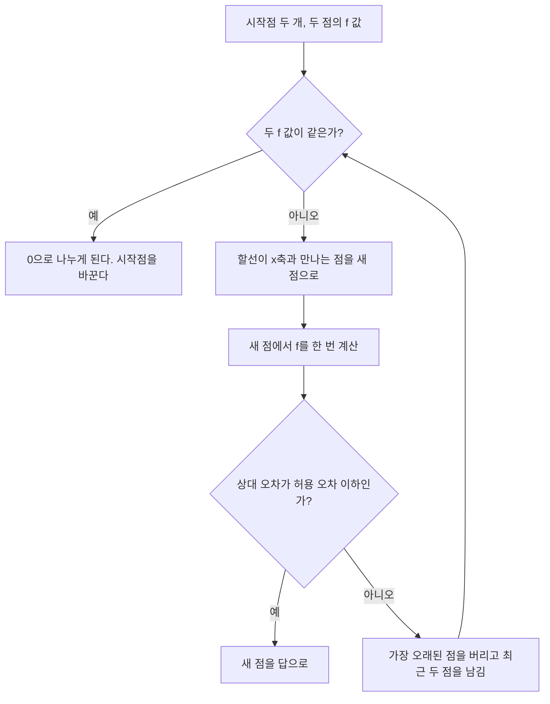



요약

뉴턴 방법은 접선의 기울기, 곧 도함수가 필요하다. 할선법은 도함수 대신 최근 두 점을 잇는 직선(할선)의 기울기를 써서, 그 직선이 $$x$$축과 만나는 곳으로 간다. 도함수를 계산할 필요가 없고 뉴턴 방법에 가깝게 빠르다. 시작점이 두 개 필요하지만 이분법처럼 근을 사이에 둘 필요는 없다. 다만 두 점의 함수 값이 같으면 0으로 나누게 되고, 수렴이 보장되지 않는다.

## 예시로 보기

$$f(x) = e^{-x} - x$$의 근(참값 0.56714329…)을 $$x_{-1} = 0$$, $$x_0 = 1$$에서 찾는다[^1].

| 반복 | 두 점 | 함수 값 | 새 점 | $$\lvert\epsilon_t\rvert$$ |
|---|---|---|---|---|
| 1 | $$x_{-1} = 0$$, $$x_0 = 1$$ | $$1.00000$$, $$-0.63212$$ | $$x_1 = 1 - \frac{-0.63212(0 - 1)}{1 - (-0.63212)} = 0.61270$$ | 8.0% |
| 2 | $$x_0 = 1$$, $$x_1 = 0.61270$$ | $$-0.63212$$, $$-0.07081$$ | $$x_2 = 0.61270 - \frac{-0.07081(1 - 0.61270)}{-0.63212 - (-0.07081)} = 0.56384$$ | 0.58% |

둘째 반복의 두 점은 모두 근의 오른쪽에 있다(함수 값이 둘 다 음수). 이분법이었다면 이렇게 할 수 없다.

할선은 곡선 위 두 점을 잇는 직선이고, 이 직선이 $$x$$축과 만나는 곳(×)이 다음 점이다. 둘째 할선(주황)은 근 오른쪽의 두 점으로 그었는데도 근 바로 옆에 떨어진다[^s2].

검증: 예시 표, 뉴턴 방법 표, 수렴 차수(뉴턴 약 2.0, 할선 약 1.65), 근을 사이에 두지 않은 시작점, 분모 0의 실패, 카드 C2 — [29_secant-method_impl.py](/Hongs_Blog/studies/numerical-analysis/code/29_secant-method_impl/)

## 정의

뉴턴 방법 $$x_{i+1} = x_i - \frac{f(x_i)}{f'(x_i)}$$에서 도함수를 최근 두 점의 기울기(1계 분할 차분)로 바꾼다[^2].

$$f'(x_i) \approx \frac{f(x_i) - f(x_{i-1})}{x_i - x_{i-1}}$$

넣으면 할선법이다[^2].

$$x_{i+1} = x_i - \frac{f(x_i)(x_i - x_{i-1})}{f(x_i) - f(x_{i-1})}$$

**입력:** 시작점 두 개 $$x_{-1}$$, $$x_0$$, 허용 오차. **출력:** 근의 근삿값. 매 반복 $$f$$를 한 번만 새로 계산한다(앞 점의 값은 다시 쓴다).

고리를 한 번 돌 때마다 점 하나가 새로 들어오고 가장 오래된 점이 빠진다. 이분법과 달리 부호를 보고 고르는 단계가 없다[^s3].

| 장점 | 단점 |
|---|---|
| 수렴하면 빠르다 | 실패할 수 있다(수렴 보장 없음) |
| 두 시작점이 근을 사이에 둘 필요가 없다 | $$f(x_i) = f(x_{i-1})$$이면 0으로 나눈다 |

표는 슬라이드 p.21을 옮긴 것이다[^3]. 근 근처에서 오차는 대략 $$e_{i+1} \propto e_i^{1.618}$$로 준다. 뉴턴 방법(지수 2)보다 조금 느리지만 도함수 계산이 없어 한 반복이 싸다[^s1].

## 활용

- 도함수를 식으로 구하기 어렵거나 계산이 비쌀 때 뉴턴 대신 쓴다. 이분법과 섞어 안전장치를 둔 방법이 가위치법(regula falsi)과 브렌트 방법이다[^s1].
- 흔한 실수: 두 시작점의 함수 값이 같거나 거의 같게 고르는 것. $$f(x) = x^2 - 4$$에서 $$-1$$과 $$1$$을 고르면 분모가 0이다.

## 연결

- 선수: [선형 근사와 뉴턴 방법](/Hongs_Blog/studies/calculus/linear-approx-newton/)(도함수를 쓰는 원형), [뉴턴 다항식과 분할 차분](/Hongs_Blog/studies/numerical-analysis/newton-divided-difference/)(기울기 = 1계 분할 차분)
- 근을 사이에 두는 안전한 방법: [이분법](/Hongs_Blog/studies/numerical-analysis/bisection-method/)
- 네 방법 비교: [근 찾기 방법 비교](/Hongs_Blog/studies/numerical-analysis/root-finding-compared/)

## 확인 문제

**C1** 할선법의 갱신식을 쓰고, 뉴턴 방법의 무엇을 바꾼 것인지 말하라.

**답:** $$x_{i+1} = x_i - \frac{f(x_i)(x_i - x_{i-1})}{f(x_i) - f(x_{i-1})}$$. 도함수 $$f'(x_i)$$를 두 점의 기울기 $$\frac{f(x_i) - f(x_{i-1})}{x_i - x_{i-1}}$$로 바꿨다.

**C2** $$f(x) = x^2 - 2$$, 시작점 $$1$$과 $$2$$로 할선법을 한 번 하라.

**답:** $$f(1) = -1$$, $$f(2) = 2$$. $$x = 2 - \frac{2(2 - 1)}{2 - (-1)} = 2 - \frac23 = \frac43 \approx 1.333$$.

**C3** 할선법도 시작점이 둘이고 이분법도 둘이다. 두 방법이 시작점에 요구하는 것과 보장하는 것은 어떻게 다른가?

**답:** 이분법은 두 점의 부호가 달라야 하고(근을 사이에 둠), 대신 늘 수렴한다. 할선법은 그런 조건이 없지만 수렴이 보장되지 않는다. 할선법은 수렴하면 훨씬 빠르다.

[^1]: 2-2학기/수치해석/1.수업자료/16.na16_nonlinear.pdf, p.20
[^2]: 같은 자료, p.19
[^3]: 같은 자료, p.21
[^s1]: 에이전트 보충. 수렴 차수(황금비 1.618, 실험값 1.65), 가위치법과 브렌트 방법, 흔한 실수의 예, 카드 C2·C3은 원본에 없다. 구현 코드로 확인했다.
[^s2]: 에이전트 보충. 그림은 원본에 없다. [29_secant-method_plot.py](/Hongs_Blog/studies/numerical-analysis/code/29_secant-method_plot/)로 그렸고, 같은 코드로 다음 값을 확인했다: $$x_1 = 0.61270$$, $$x_2 = 0.56384$$, 둘째 반복의 두 점에서 함수 값이 모두 음수.
[^s3]: 에이전트 보충. 다이어그램 1개는 원본에 없다. 이 문서 '정의'의 갱신식, 입출력과 장단점 표(원본 16.na16_nonlinear.pdf p.19~21)로 그렸다. 상대 오차로 멈추는 기준은 [이분법](/Hongs_Blog/studies/numerical-analysis/bisection-method/)과 같은 것을 썼다.

