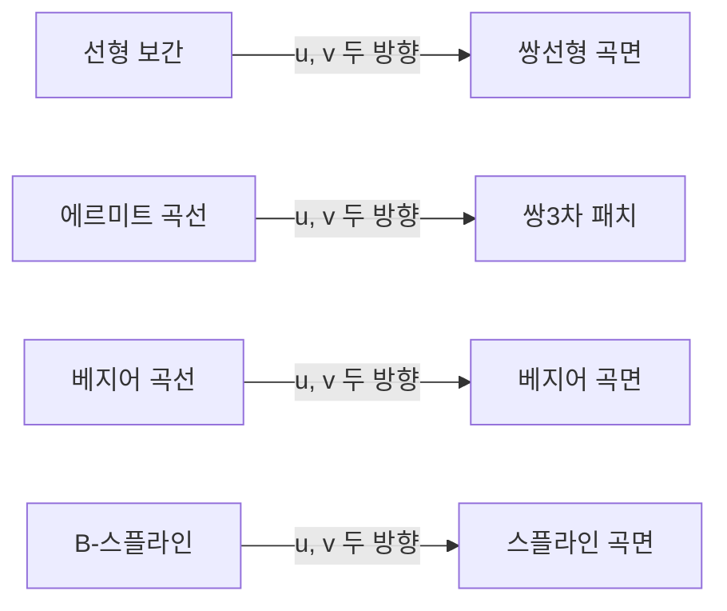



요약

곡선에서 $$u$$ 하나로 점을 만들었듯, 곡면은 $$u$$와 $$v$$ 두 개로 점을 만든다. 천 조각(패치)을 이어 붙이듯 큰 곡면을 작은 패치로 나눠 만든다. 패치를 만드는 방법은 곡선 방법을 두 방향으로 넓힌 것이다. 네 꼭짓점만 섞는 쌍선형, 에르미트를 두 방향으로 쓰는 쌍3차, 베지어 곡면, 스플라인 곡면이 있다. 방법마다 조절하기 쉬운 정도와, 점 하나를 옮겼을 때 어디까지 바뀌는지가 다르다.

## 예시로 보기

물체의 겉면을 나타내는 방법은 둘이다. 삼각형·사각형을 잔뜩 이어 붙인 폴리곤 메시와, 식으로 정확히 적는 곡면 패치다[^1]. 메시는 그리기 쉽지만 확대하면 각이 보인다. 패치는 얼마든지 확대해도 매끄럽다.

가장 단순한 패치는 네 꼭짓점 $$\mathbf P_{00} = (0, 0, 0)$$, $$\mathbf P_{10} = (2, 0, 1)$$, $$\mathbf P_{01} = (0, 2, 1)$$, $$\mathbf P_{11} = (2, 2, 0)$$만으로 만든다. 먼저 $$v$$ 방향 두 변에서 각각 비율 $$v$$인 점을 잡고, 그 두 점을 다시 비율 $$u$$로 잇는다. 가운데 $$(u, v) = (\frac12, \frac12)$$는 네 꼭짓점의 평균 $$(1, 1, \frac12)$$이다[^s1].

파란 선은 $$u$$를, 주황 선은 $$v$$를 고정한 선이다. 이 선들은 모두 곧은 선인데, 면 전체는 말안장처럼 비틀린다. 네 꼭짓점이 한 평면 위에 있지 않기 때문이다[^s2].

검증: 쌍선형 = 두 번의 선형 보간, 직선 경계, 카드 C2, 쌍3차 패치가 꼭짓점·접선·꼬임 벡터를 재현, 경계가 에르미트 곡선, 베지어 곡면의 꼭짓점·가장자리, 국소 조절 없음, 스플라인 곡면의 합 1 — [17_surface-patches_verify.py](/Hongs_Blog/studies/numerical-analysis/code/17_surface-patches_verify/)

## 정의

곡면도 음함수로 $$f(x, y, z) = 0$$(평면 $$ax + by + cz + d = 0$$, 구 $$x^2 + y^2 + z^2 - r^2 = 0$$)처럼 쓸 수 있다[^2]. **매개변수 곡면**은 각 성분이 독립변수 둘 $$u$$, $$v$$에 달린 $$\mathbf P(u, v) = (x(u, v), y(u, v), z(u, v))$$다[^3]. 곡면을 여러 패치로 나누고 패치마다 매개변수 식을 둔다[^4].

왼쪽 곡선 방법을 $$u$$와 $$v$$에 한 번씩 쓰면 오른쪽 곡면 방법이 된다.[^s3]

### 쌍선형 곡면

네 꼭짓점을 $$u$$, $$v$$ 두 방향으로 선형 보간한다[^5].

$$\mathbf P(u, v) = (1 - u)(1 - v)\mathbf P_{00} + u(1 - v)\mathbf P_{10} + (1 - u)v\mathbf P_{01} + uv\mathbf P_{11}, \qquad 0 \le u, v \le 1$$

네 꼭짓점만 정하면 된다. 하지만 경계가 직선이고 곡면이 대체로 평평하다[^6].

### 쌍3차 패치

$$u$$와 $$v$$ 각각에 대해 3차식이다. 성분마다 계수가 16개라 $$16 \times 3$$개 미지수에 식 16개(점으로)가 필요하다[^7][^8]. 에르미트처럼 정한다.

- 꼭짓점 넷: $$\mathbf P(0, 0)$$, $$\mathbf P(0, 1)$$, $$\mathbf P(1, 0)$$, $$\mathbf P(1, 1)$$
- 꼭짓점의 $$u$$ 방향 접선 넷 $$\mathbf P_u$$와 $$v$$ 방향 접선 넷 $$\mathbf P_v$$
- 꼬임 벡터 넷: $$\mathbf P_{uv} = \frac{\partial^2\mathbf P}{\partial u\,\partial v}$$

$$F_1..F_4$$를 에르미트 블렌딩 함수($$1 - 3u^2 + 2u^3$$, $$3u^2 - 2u^3$$, $$u - 2u^2 + u^3$$, $$-u^2 + u^3$$)라 하면 다음과 같다[^9].

$$\mathbf P(u, v) = \begin{pmatrix}F_1(u) & F_2(u) & F_3(u) & F_4(u)\end{pmatrix}\begin{pmatrix}\mathbf P(0,0) & \mathbf P(0,1) & \mathbf P_v(0,0) & \mathbf P_v(0,1)\\ \mathbf P(1,0) & \mathbf P(1,1) & \mathbf P_v(1,0) & \mathbf P_v(1,1)\\ \mathbf P_u(0,0) & \mathbf P_u(0,1) & \mathbf P_{uv}(0,0) & \mathbf P_{uv}(0,1)\\ \mathbf P_u(1,0) & \mathbf P_u(1,1) & \mathbf P_{uv}(1,0) & \mathbf P_{uv}(1,1)\end{pmatrix}\begin{pmatrix}F_1(v)\\ F_2(v)\\ F_3(v)\\ F_4(v)\end{pmatrix}$$

경계 곡선이 에르미트 곡선이고 안쪽도 조절할 수 있다. 하지만 꼬임 벡터에 어떤 값을 줘야 할지, 그 효과가 어떤지 떠올리기 어렵다[^10].

### 베지어 곡면

조절점 $$(n + 1) \times (m + 1)$$개를 베른슈타인 다항식 두 방향으로 섞는다[^11].

$$\mathbf P(u, v) = \sum_{i=0}^{n}\sum_{j=0}^{m}\mathbf P_{i,j}B_{i,n}(u)B_{j,m}(v)$$

$$u = v = 0$$을 넣으면 $$B_{i,n}(0)$$은 $$i = 0$$일 때만 1이라 $$\mathbf P(0, 0) = \mathbf P_{0,0}$$이다. 꼭짓점을 지난다[^12]. $$u = 0$$을 넣으면 $$\mathbf P(0, v) = \sum_j\mathbf P_{0,j}B_{j,m}(v)$$로 가장자리가 베지어 곡선이다[^13]. 안쪽을 조절점으로 직관적으로 조절하고, 도함수도 같은 방법으로 계산한다. 그러나 국소 조절이 없다. 조절점 하나를 옮기면 곡면 전체가 바뀐다[^14].

### 스플라인 곡면

스플라인 곡선을 두 방향으로 넓힌다. 조절점 $$4 \times 4$$를 행렬 $$P$$로 두면 다음과 같다[^15][^16].

$$\mathbf p(u, v) = \mathbf u^\top M_S\,P\,M_S^\top\mathbf v, \qquad \mathbf u = (1, u, u^2, u^3)^\top,\ \mathbf v = (1, v, v^2, v^3)^\top$$

## 활용

- 자동차 차체와 항공기 날개 설계(CAD)에 베지어·스플라인 곡면이 쓰이고, 유타 찻주전자는 베지어 패치 32개로 만든 유명한 예다[^s1].
- 흔한 실수: 쌍3차 패치의 꼬임 벡터를 아무 값으로 두는 것. 꼬임 벡터를 0으로 두면 꼭짓점 근처가 평평해지는 등 모양이 크게 바뀐다.

## 연결

- 선수: [에르미트 곡선](/Hongs_Blog/studies/numerical-analysis/hermite-curve/)(쌍3차), [B-스플라인](/Hongs_Blog/studies/numerical-analysis/b-spline/)(스플라인 곡면), [다변수 함수와 편미분](/Hongs_Blog/studies/calculus/partial-derivatives/)(꼬임 벡터)
- 베지어 곡면의 바탕: [추상 벡터공간과 베지어 곡선](/Hongs_Blog/studies/linear-algebra/abstract-vector-spaces/)
- 곡면을 그리기: [베지어 곡선의 세분화](/Hongs_Blog/studies/numerical-analysis/bezier-subdivision/)

## 확인 문제

**C1** 쌍3차 패치를 정하는 16개 값은 무엇인가?

**답:** 네 꼭짓점의 위치, 꼭짓점마다 $$u$$ 방향 접선 $$\mathbf P_u$$와 $$v$$ 방향 접선 $$\mathbf P_v$$, 꼭짓점마다 꼬임 벡터 $$\mathbf P_{uv}$$. 4 × 4 = 16개.

**C2** 예시의 쌍선형 곡면에서 $$\mathbf P(\frac12, \frac12)$$는?

**답:** 네 무게가 모두 $$\frac14$$라 네 꼭짓점의 평균. $$\frac14((0,0,0) + (2,0,1) + (0,2,1) + (2,2,0)) = (1, 1, \frac12)$$.

**C3** 곡면의 한 부분만 살짝 고치고 싶다. 베지어 곡면과 스플라인 곡면 중 무엇이 나은가? 다른 쪽은 왜 아닌가?

**답:** 스플라인 곡면. 조절점 하나는 근처 패치에만 영향을 준다. 베지어 곡면은 모든 베른슈타인 무게가 안쪽 어디서나 0보다 커서, 조절점 하나를 옮기면 곡면 전체가 바뀐다.

[^1]: 2-2학기/수치해석/1.수업자료/08.na08_surfaces.pdf, p.2
[^2]: 같은 자료, p.3
[^3]: 같은 자료, p.4
[^4]: 같은 자료, p.5
[^5]: 같은 자료, p.6
[^6]: 같은 자료, p.7
[^7]: 같은 자료, p.8
[^8]: 같은 자료, p.9
[^9]: 같은 자료, p.10
[^10]: 같은 자료, p.11
[^11]: 같은 자료, p.12
[^12]: 같은 자료, p.13
[^13]: 같은 자료, p.14
[^14]: 같은 자료, p.15
[^15]: 같은 자료, p.16
[^16]: 같은 자료, p.17
[^s1]: 에이전트 보충. 메시와 패치의 비교, 쌍선형 예와 카드 C2, CAD·유타 찻주전자, 흔한 실수, 카드 C3은 원본에 없다. 검증 코드로 확인했다.
[^s2]: 에이전트 보충. 그림은 원본에 없다. [17_surface-patches_plot.py](/Hongs_Blog/studies/numerical-analysis/code/17_surface-patches_plot/)로 그렸고, 같은 코드로 다음 값을 확인했다: 가운데 $$(1, 1, \frac12)$$, 꼭짓점 통과, $$u$$를 고정한 선 위의 가운데 점이 양 끝의 평균(곧은 선).
[^s3]: 에이전트 보충. 다이어그램 1개는 원본에 없다. 이 문서 요약과 '정의'의 네 곡면 방법(원본 08.na08_surfaces.pdf p.6~17)으로 그렸다.

