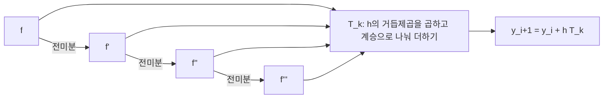



요약

오일러 방법은 한 걸음을 기울기 하나로만 가서 부정확하다. 테일러 급수 방법은 그 걸음을 기울기뿐 아니라 기울기가 바뀌는 정도(2계, 3계 도함수)까지 넣은 테일러 급수로 간다. 넣는 항을 하나 늘릴 때마다 걸음 크기를 반으로 줄였을 때 오차가 줄어드는 비율이 두 배씩 커진다. 대신 미분방정식의 오른쪽 $$f(x, y)$$를 여러 번 미분해야 해서, 식이 복잡하면 손으로 하기 어렵다.

## 예시로 보기

$$y' = x + y$$, $$y(0) = 1$$을 $$x = 1$$까지 걸음 $$h = 0.1$$로 푼다. 참값은 $$y = 2e^x - x - 1$$이다[^s1].

| 넣는 항 수 $$k$$ | 1 (오일러) | 2 | 3 | 4 |
|---|---|---|---|---|
| $$x = 1$$에서 오차 | $$2.5 \times 10^{-1}$$ | $$8.4 \times 10^{-3}$$ | $$2.1 \times 10^{-4}$$ | $$4.2 \times 10^{-6}$$ |
| $$h$$를 반으로 줄일 때 오차 | 약 1/2 | 약 1/4 | 약 1/8 | 약 1/16 |

항을 하나 늘릴 때마다 오차가 한 자릿수 이상 준다.

가로축과 세로축 모두 한 칸이 10배인 눈금이다. 이런 눈금에서는 오차가 $$h^k$$에 비례하면 기울기 $$k$$인 곧은 선이 된다. 항을 늘릴수록 선이 더 가파르다[^s2].

검증: $$k = 1$$이 오일러, $$k = 1..4$$에서 오차 비율 $$2^k$$, 표의 오차, 카드 C2 — [33_taylor-method_impl.py](/Hongs_Blog/studies/numerical-analysis/code/33_taylor-method_impl/)

## 정의

함수 $$f$$를 $$x = c$$ 근처에서 $$n$$차 다항식으로 근사하면, 계수를 도함수로 맞춰 $$a_k = \frac{f^{(k)}(c)}{k!}$$다[^1]. 남는 오차는 $$r_n(x) = \frac{f^{(n+1)}(z_0)}{(n+1)!}(x - c)^{n+1}$$이다. $$z_0$$은 $$c$$와 $$x$$ 사이의 어떤 점이다[^2].

$$f(x) = \sum_{k=0}^{n}\frac{f^{(k)}(c)}{k!}(x - c)^k + r_n(x)$$

상미분방정식 $$y' = f(x, y)$$의 풀이를 한 걸음 $$h$$만큼 테일러 급수로 펼친다[^3].

$$y(x_i + h) = y(x_i) + hy'(x_i) + \frac{h^2}{2!}y''(x_i) + \frac{h^3}{3!}y'''(x_i) + \cdots$$

$$y' = f(x, y)$$이므로 $$y^{(n)}(x) = f^{(n-1)}(x, y)$$다. 여기서 $$f'$$은 $$x$$에 대해 전미분한 것이다. $$y$$도 $$x$$에 따라 바뀌므로 연쇄 법칙으로 $$f' = \frac{\partial f}{\partial x} + f\frac{\partial f}{\partial y}$$다[^3][^s1]. $$k$$개 항까지 쓰면 다음과 같다[^4].

$$y(x_i + h) = y(x_i) + hT_k(x_i, y_i), \qquad T_k(x_i, y_i) = f(x_i, y_i) + \frac{h}{2!}f'(x_i, y_i) + \cdots + \frac{h^{k-1}}{k!}f^{(k-1)}(x_i, y_i)$$

$$k = 1$$이면 오일러 방법과 같다[^4].

$$k = 4$$이면 $$f$$를 전미분하는 사슬을 세 번 지나야 $$T_4$$를 만든다. 한 번 지날 때마다 $$\frac{\partial f}{\partial x} + f\frac{\partial f}{\partial y}$$ 꼴의 계산이 붙어 식이 길어진다[^s3].

한 걸음에서 버린 첫 항이 $$h^{k+1}$$에 비례하므로 한 걸음 오차(국소 절단 오차)는 $$h^{k+1}$$ 차수다. 구간 끝까지 $$\frac{1}{h}$$걸음을 가며 쌓이면 전역 오차는 $$h^k$$ 차수다. 그래서 $$h$$를 반으로 줄이면 오차가 $$2^k$$분의 1이 된다[^s1].

## 활용

- 도함수를 기호 계산(컴퓨터 대수)이나 자동 미분으로 얻을 수 있으면 높은 차수를 쉽게 쓴다. 천체 궤도 계산 같은 고정밀 계산에 쓰인다[^s1].
- 흔한 실수: $$f'$$을 $$x$$에 대한 편미분만으로 계산하는 것. $$y$$가 $$x$$에 따라 바뀌는 부분 $$f\frac{\partial f}{\partial y}$$를 빠뜨린다.
- 미분을 피하고 같은 차수를 얻는 방법이 [룽게-쿠타 방법](/Hongs_Blog/studies/numerical-analysis/runge-kutta/)이다.

## 연결

- 선수: [미분방정식과 오일러 방법](/Hongs_Blog/studies/calculus/ode-euler/)($$k = 1$$), [테일러 급수](/Hongs_Blog/studies/calculus/taylor-series/)
- 전미분의 연쇄 법칙: [다변수 연쇄 법칙과 야코비 행렬](/Hongs_Blog/studies/calculus/multivariable-chain-rule/)

## 확인 문제

**C1** $$k$$차 테일러 급수 방법의 한 걸음 공식을 쓰라. $$k = 1$$이면 무엇인가?

**답:** $$y_{i+1} = y_i + h\left[f + \frac{h}{2!}f' + \cdots + \frac{h^{k-1}}{k!}f^{(k-1)}\right]_{(x_i, y_i)}$$. $$k = 1$$이면 오일러 방법 $$y_{i+1} = y_i + hf(x_i, y_i)$$.

**C2** $$y' = x + y$$, $$y(0) = 1$$에 $$k = 2$$, $$h = 0.1$$로 한 걸음 가라.

**답:** $$f(0, 1) = 1$$, $$f' = 1 + y' = 1 + x + y = 2$$. $$y_1 = 1 + 0.1\left(1 + \frac{0.1}{2}\cdot2\right) = 1.11$$. 참값 $$2e^{0.1} - 1.1 \approx 1.1103$$.

**C3** 한 걸음 오차가 $$h^{k+1}$$ 차수인데 전역 오차는 왜 $$h^k$$ 차수인가?

**답:** 구간 끝까지 가려면 $$\frac{L}{h}$$걸음이 필요하고, 걸음마다의 오차가 대략 더해진다. $$\frac{L}{h}\cdot h^{k+1} = Lh^k$$이라 한 차수 낮아진다.

[^1]: 2-2학기/수치해석/1.수업자료/18.na18_diff_eq.pdf, p.4
[^2]: 같은 자료, p.5
[^3]: 같은 자료, p.6
[^4]: 같은 자료, p.7
[^s1]: 에이전트 보충. 예시 문제와 오차 표, 전미분의 연쇄 법칙 식, 국소·전역 오차 차수, 활용, 흔한 실수, 카드 C2·C3은 원본에 없다. 구현 코드로 확인했다.
[^s2]: 에이전트 보충. 그림은 원본에 없다. [33_taylor-method_plot.py](/Hongs_Blog/studies/numerical-analysis/code/33_taylor-method_plot/)로 그렸고, 같은 코드로 다음 값을 확인했다: $$h = 0.1$$에서 오차 $$2.5 \times 10^{-1}$$, $$8.4 \times 10^{-3}$$, $$2.1 \times 10^{-4}$$, $$4.2 \times 10^{-6}$$, $$h$$를 반으로 하면 오차가 약 $$2^k$$분의 1.
[^s3]: 에이전트 보충. 다이어그램 1개는 원본에 없다. 이 문서 '정의'의 $$y^{(n)} = f^{(n-1)}$$, 전미분, $$T_k$$ 식(원본 18.na18_diff_eq.pdf p.6~7)으로 그렸다.

