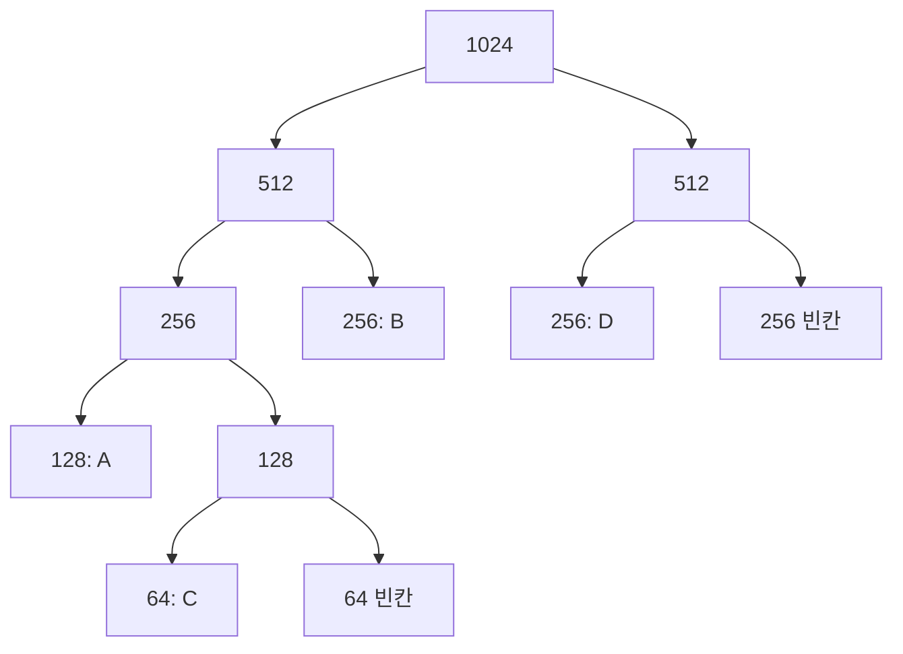



요약

버디 시스템은 메모리를 반, 반의 반, … 으로 쪼개 2의 거듭제곱 크기 블록만 나눠 주는 방법이다. 초콜릿 판을 반으로 쪼개고 또 반으로 쪼개 필요한 크기에 가장 가까운 조각을 주고, 돌려받으면 옆 조각(짝)과 다시 붙이는 식이다. 고정 분할과 동적 분할의 중간이라, 쪼개고 합치는 일이 빠르고 외부 단편화가 적다. 대신 요청 크기를 2의 거듭제곱으로 올려 주므로 블록 안 낭비(내부 단편화)가 생긴다.

## 예시로 보기

1 MB(1024 K)에서 시작한다. 요청은 다음 2의 거듭제곱으로 올린다[^s1].

| 사건 | 메모리 모습 (앞에서부터, K) |
|---|---|
| 처음 | 1024 |
| A 요청 100K → 128K | A 128 · 128 · 256 · 512 |
| B 요청 240K → 256K | A 128 · 128 · B 256 · 512 |
| C 요청 64K → 64K | A 128 · C 64 · 64 · B 256 · 512 |
| D 요청 256K | A 128 · C 64 · 64 · B 256 · D 256 · 256 |
| B 해제 | A 128 · C 64 · 64 · 256 · D 256 · 256 |
| A 해제 | 128 · C 64 · 64 · 256 · D 256 · 256 |
| E 요청 75K → 128K | E 128 · C 64 · 64 · 256 · D 256 · 256 |
| C 해제 (짝 64와 합쳐 128) | E 128 · 128 · 256 · D 256 · 256 |
| E 해제 (128+128 → 256, 256+256 → 512) | 512 · D 256 · 256 |
| D 해제 (256+256 → 512, 512+512 → 1024) | 1024 |

A 요청 때 1024를 512·512로, 앞 512를 256·256으로, 앞 256을 128·128로 쪼개 앞 128을 A에 준다.

D 요청까지 마친 순간의 모습이다. 같은 부모에서 나온 두 칸이 서로의 짝이고, 해제할 때는 짝이 둘 다 비어야 부모로 합쳐진다[^s2].

B 해제 뒤에도 256 블록이 합쳐지지 않는 것을 보라. B의 짝은 앞쪽 256(A와 빈 128로 나뉘어 있음)이라, 짝 전체가 비어 있지 않다.

검증: 위 표의 모든 단계와 카드 C2 — [35_buddy-system_impl.py](/Hongs_Blog/studies/operating-systems/code/35_buddy-system_impl/)

## 정확히 말하면

메모리 전체 크기를 $$2^U$$, 나눠 줄 가장 작은 블록을 $$2^L$$이라 하자. 크기가 $$2^k$$($$L \le k \le U$$)인 블록만 쓴다[^s1].

**할당.** 요청 크기 $$s$$가 $$2^{k-1} < s \le 2^k$$이면 크기 $$2^k$$ 블록을 준다. 그 크기의 빈 블록이 없으면 더 큰 빈 블록을 반으로 쪼개 크기 $$2^k$$가 될 때까지 되풀이한다. 쪼개서 생긴 두 반쪽을 서로의 **짝**(buddy)이라고 부른다.

**해제.** 블록을 돌려받으면 그 짝도 비어 있는지 본다. 비어 있으면 둘을 합쳐 한 단계 큰 블록으로 만들고, 그 블록의 짝에 대해 다시 본다.

**짝 찾기.** 크기 $$2^k$$ 블록의 시작 주소가 $$a$$이면, 짝의 시작 주소는 $$a$$의 $$k$$번째 비트만 뒤집은 값이다($$a \oplus 2^k$$). 예: 크기 64, 시작 128인 블록의 짝은 $$128 \oplus 64 = 192$$에서 시작한다. 이 계산이 비트 연산 한 번이라 합치기가 빠르다[^s1].

**복잡도.** 쪼개기와 합치기는 많아야 $$U - L$$번이다. 1 MB를 1 K까지 쪼개면 10번이다[^s1].

| 좋은 점 | 나쁜 점 |
|---|---|
| 쪼개기·합치기가 빠르다 | 2의 거듭제곱으로 올림해서 내부 단편화. 최악이면 거의 절반을 낭비한다(예: 129 K → 256 K) |
| 짝끼리 다시 합쳐 큰 블록을 되살리므로 외부 단편화가 적다 | 짝이 아닌 이웃 빈 블록끼리는 합칠 수 없다 |

## 활용

- 리눅스 커널은 물리 페이지 프레임을 나눠 줄 때 버디 시스템을 쓴다[^s1].
- 위 예에서 A(100K)는 128K를 받아 28K가 블록 안에서 남는다. 이것이 버디 시스템의 내부 단편화다.

## 연결

- 선수: [메모리 분할](/Hongs_Blog/studies/operating-systems/memory-partitioning/) (고정·동적 분할과 단편화)

## 확인 문제

<b>C1</b> 버디 시스템이 순수 동적 분할보다 외부 단편화가 적은 이유는?

**답:** 블록 크기가 2의 거듭제곱으로 정해져 있고, 해제할 때 짝이 비어 있으면 곧바로 합쳐 원래 큰 블록을 되살린다. 동적 분할처럼 제각각인 크기의 자잘한 구멍이 쌓이지 않는다.

<b>C2</b> 1024K 버디 시스템이 비어 있다. P 70K, Q 35K, R 80K 요청이 차례로 온다. 최종 메모리 모습과 내부 단편화 합계는?

**답:** P 128 · Q 64 · 빈 64 · R 128 · 빈 128 · 빈 512. 내부 단편화는 (128 − 70) + (64 − 35) + (128 − 80) = 58 + 29 + 48 = 135K. 
**이유:** P 때 1024 → 512·512 → 256·256 → 128·128. Q는 남은 128을 64·64로 쪼갠다. R은 128 크기 빈 블록이 없어 다음 256을 128·128로 쪼갠다.

<b>C3</b> 크기 32, 시작 주소 96인 블록의 짝은 어디서 시작하는가? 크기 32, 시작 주소 64인 블록의 짝은?

**답:** $$96 \oplus 32 = 64$$. $$64 \oplus 32 = 96$$. 둘은 서로의 짝이다(64~95와 96~127, 합치면 64부터 시작하는 크기 64 블록).

[^s1]: 보충 공개 7장 슬라이드(Stony Brook)에 버디 시스템이 없어 문서 전체를 Stallings, *Operating Systems: Internals and Design Principles* 6판, 7.2절(그림 7.6, 7.7)로 채웠다. 짝 주소의 XOR 계산, 복잡도, 리눅스 사용은 교재 밖의 표준 설명이다(리눅스: Bovet & Cesati, *Understanding the Linux Kernel*, 8장 "Buddy System Algorithm").
[^s2]: 보충 다이어그램 1개는 원본에 없다. "예시로 보기" 표의 D 요청 행을 쪼개기 나무로 옮겼다.

