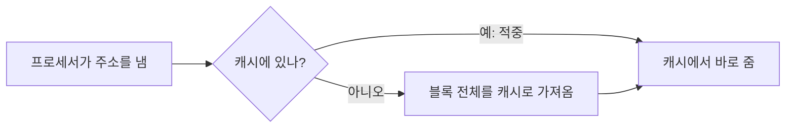


<div class="callout callout-summary" markdown="1">
<div class="callout-title callout-title--default" markdown="span">요약</div>

캐시는 프로세서와 주기억장치 사이에 둔 작고 빠른 메모리다. 주기억장치 내용 일부를 복사해 두었다가, 프로세서가 찾으면 먼저 여기서 꺼내 준다. 프로그램은 방금 쓴 곳과 그 근처를 곧 다시 쓰는 경향이 있어서, 작은 캐시로도 대부분의 요청을 빠르게 처리한다. 하지만 캐시가 가득 차면 무엇을 내보낼지, 캐시에서 고친 내용을 언제 주기억장치에 반영할지 정해야 한다.

</div>


## 예시로 보기

프로세서는 명령어 사이클마다 최소 한 번은 메모리에 간다. 명령어를 가져오려면 반드시 가야 하고, 피연산자를 읽거나 결과를 쓰려고 더 가기도 한다[^1]. 그런데 프로세서는 주기억장치보다 훨씬 빨라졌고, 그 차이는 해마다 벌어졌다. 그래서 프로세서가 메모리를 기다리는 시간이 실행 속도를 막는다. 주기억장치 전부를 레지스터만큼 빠른 기술로 만들면 해결되지만 너무 비싸다[^1].

배열을 처음부터 끝까지 더하는 반복문을 보자[^s1].

```c
for (i = 0; i < 1000; i++) sum += a[i];
```

- `a[0]`을 읽으려고 주기억장치에 가면, `a[0]` 한 칸만이 아니라 `a[0]`~`a[7]`처럼 이웃한 칸들을 한 덩어리(블록)로 캐시에 가져온다.
- 그러면 `a[1]`~`a[7]`은 주기억장치에 다시 가지 않고 캐시에서 바로 읽는다.
- 반복문의 명령어들도 1000번 되풀이되므로 첫 회 뒤로는 계속 캐시에 있다.

이렇게 방금 쓴 것을 곧 다시 쓰고, 쓴 곳 근처를 곧 쓰는 경향을 **지역성**(principle of locality)이라고 부른다[^2].

## 정확히 말하면

**구조.** 주기억장치는 $$n$$비트 주소로 가리키는 $$2^n$$개의 워드로 이루어진다. 이것을 워드 $$K$$개짜리 블록으로 나누면 블록은 $$M = 2^n / K$$개다. 캐시는 워드 $$K$$개짜리 칸(슬롯, 라인)을 $$C$$개 가지며, $$C$$는 $$M$$보다 훨씬 작다($$C \ll M$$). 블록이 칸보다 많으므로 한 칸에 어떤 블록이 들어 있는지 표시하는 꼬리표(태그)를 칸마다 붙인다. 태그는 보통 주소의 앞쪽 비트 몇 개다[^3].

예를 들어 주소가 16비트이고 블록이 워드 4개면 블록은 $$2^{16}/4 = 16{,}384$$개다. 캐시 칸이 128개면 한 번에 블록 128개만 들어간다[^s1].

```
 캐시 (칸 C개)                       주기억장치 (블록 M개, C ≪ M)
 칸    태그   데이터 (워드 K개)       블록    워드 K개
+----+------+------------------+     +-----+------------------+
|  0 | 태그 | w  w  w  w       |     | 0   | w  w  w  w       |
+----+------+------------------+     +-----+------------------+
|  1 | 태그 | w  w  w  w       |     | 1   | w  w  w  w       |
+----+------+------------------+     +-----+------------------+
| .. | ...  | ...              |     | ... | ...              |
+----+------+------------------+     +-----+------------------+
|C-1 | 태그 | w  w  w  w       |     | M-1 | w  w  w  w       |
+----+------+------------------+     +-----+------------------+
  태그 = 이 칸에 지금 주기억장치의 몇 번 블록이 들어 있는지
```

캐시와 주기억장치는 같은 크기(워드 K개)의 덩어리로 주고받는다. 칸 수가 블록 수보다 훨씬 적어서, 칸마다 태그를 보고 어느 블록의 복사본인지 가린다[^s2].

**읽기.** 프로세서가 주소를 내면 캐시에 그 워드가 있는지 본다. 있으면(적중) 바로 준다. 없으면 그 워드가 든 블록 전체를 주기억장치에서 캐시로 가져온 뒤 준다[^4].



**설계할 때 정할 다섯 가지**[^5]

| 항목 | 정하는 것 | 맞바꾸는 것 |
|---|---|---|
| 캐시 크기 | 칸을 몇 개 둘까 | 작은 캐시로도 성능이 크게 좋아진다 |
| 블록 크기 | 한 번에 몇 워드를 가져올까 | 키우면 처음에는 적중이 늘지만, 너무 크면 새로 가져온 데이터를 쓸 확률이 내보낸 데이터를 다시 쓸 확률보다 작아져 적중이 준다 |
| 매핑 함수 | 새 블록을 어느 칸에 넣을까 | 유연할수록 교체를 잘 고를 수 있지만, 캐시를 뒤지는 회로가 복잡해진다 |
| 교체 알고리즘 | 칸이 다 찼을 때 무엇을 내보낼까 | 곧 다시 쓸 블록을 내보내면 손해 |
| 쓰기 정책 | 고친 내용을 언제 주기억장치에 쓸까 | 아래 설명 |

**교체 알고리즘.** 앞으로 가장 안 쓸 블록을 내보내는 것이 가장 좋지만, 미래를 알 수 없으니 불가능하다. 대신 **가장 오랫동안 쓰이지 않은** 블록을 내보낸다. 이것이 LRU(least recently used)다[^6].

<div class="callout callout-warning" markdown="1">
<div class="callout-title" markdown="span">원본 오류 의심</div>

원문: "Effective strategy is to replace a block that has been used less than others — Least Recently Used (LRU)" (슬라이드 53) / 문제점: "다른 블록보다 덜 쓰인 블록"은 쓴 **횟수**가 적은 블록을 내보내는 LFU(least frequently used)의 설명이다. LRU는 마지막으로 쓴 **때**가 가장 오래된 블록을 내보낸다 / 수정안: "가장 오랫동안 쓰이지 않은 블록을 내보낸다" / 근거: 같은 슬라이드 노트는 "has been in the cache longest with no reference to it"으로 바르게 적었다[^6]. 칸 2개에 A, A, A, B, C를 차례로 쓰면 LRU는 A를, LFU는 B를 내보낸다 — [06_cache-memory_verify.py](/Hongs_Blog/studies/operating-systems/code/06_cache-memory_verify/)

</div>


**쓰기 정책.** 캐시의 블록을 고치면 언젠가 주기억장치에도 써야 한다. 한쪽 끝은 블록을 고칠 때마다 쓰는 것이다. 다른 쪽 끝은 그 블록을 내보낼 때만 쓰는 것이다. 뒤쪽은 쓰기 횟수가 가장 적다. 대신 그동안 주기억장치에는 낡은 값이 남는다. 그러면 프로세서가 여럿이거나 입출력 장치가 주기억장치를 직접 읽을 때(DMA) 낡은 값을 읽을 수 있다[^7].

<div class="callout callout-check" markdown="1">
<div class="callout-title" markdown="span">검증: LRU와 LFU가 다른 블록을 내보내는 예, 지역성이 있는 반복 참조에서 칸 3개면 30번 중 27번 적중 — [06_cache-memory_verify.py](/Hongs_Blog/studies/operating-systems/code/06_cache-memory_verify/)</div>

</div>


## 활용

- 캐시는 운영체제에 보이지 않는다. 하드웨어가 알아서 한다. 그래도 운영체제의 메모리 관리 하드웨어와 맞물려 돌아간다[^1].
- 캐시 크기, 블록 크기, 매핑, 교체, 쓰기 정책이라는 같은 고민이 [가상 메모리](/Hongs_Blog/studies/operating-systems/virtual-memory/)와 디스크 캐시 설계에서도 그대로 나온다[^4]. 8장의 페이지 교체가 그 예다.
- 2-1학기 알고리즘에서 배열을 순서대로 도는 코드가 빠른 이유도 지역성이다.

## 연결

- 선수: [메모리 계층](/Hongs_Blog/studies/operating-systems/memory-hierarchy/)

## 자주 하는 오해

<div class="callout callout-misconception" markdown="1">
<div class="callout-title" markdown="span">"LRU는 가장 적게 쓴 블록을 내보낸다"</div>

틀렸다. 이름의 "least"와 슬라이드 문구가 "가장 적게"로 읽힌다. LRU의 기준은 횟수가 아니라 **마지막으로 쓴 시점**이다. 아무리 많이 썼어도 한동안 안 썼으면 내보내진다. 칸 2개에 A, A, A, B, C 순서로 쓰면 LRU는 세 번 쓴 A를 내보낸다. 횟수를 보는 규칙은 LFU라는 별개의 알고리즘이다.

</div>


## 확인 문제

<details markdown="1"><summary markdown="span"><b>C1</b> 작은 캐시로도 성능이 크게 좋아지는 이유를 지역성으로 설명하라.</summary>


**답:** 프로그램은 방금 쓴 데이터와 그 근처를 곧 다시 쓴다. 한 번 실패해서 블록을 가져오면 이어지는 많은 접근이 그 블록 안에서 적중한다. 그래서 전체 메모리 중 지금 쓰는 작은 부분만 캐시에 있어도 대부분의 요청을 처리한다.

</details>

<details markdown="1"><summary markdown="span"><b>C2</b> 칸이 2개인 캐시가 비어 있다. LRU로 교체할 때 매번 실패하게 되는 참조 순서를 블록 3개로 만들라.</summary>


**답:** A, B, C, A, B, C, … 를 되풀이한다. C가 들어올 때 가장 오래 안 쓴 A를 내보내는데, 바로 다음에 A를 쓴다. 이후로도 늘 다음에 쓸 블록을 내보내서 한 번도 적중하지 않는다.<br>
**왜 중요한가:** 반복하는 데이터가 캐시보다 한 칸만 커도 LRU의 적중률이 0으로 떨어질 수 있다.

</details>

<details markdown="1"><summary markdown="span"><b>C3</b> 쓰기 정책 두 극단(고칠 때마다 쓰기, 내보낼 때만 쓰기) 중 DMA를 쓰는 입출력 장치와 문제를 일으킬 수 있는 쪽은? 이유는?</summary>


**답:** 내보낼 때만 쓰는 쪽. 캐시에서 고친 값이 아직 주기억장치에 반영되지 않았는데, DMA 장치는 프로세서와 캐시를 거치지 않고 주기억장치를 직접 읽으므로 낡은 값을 가져간다.

</details>

[^1]: 운영체제 1회 강의 자료 「Chapter01-new」, 슬라이드 44와 발표자 노트
[^2]: 같은 자료, 슬라이드 45
[^3]: 같은 자료, 슬라이드 47 발표자 노트 (그림 1.17 설명)
[^4]: 같은 자료, 슬라이드 46~49와 발표자 노트
[^5]: 같은 자료, 슬라이드 50~52와 발표자 노트
[^6]: 같은 자료, 슬라이드 53과 슬라이드 52의 발표자 노트
[^7]: 같은 자료, 슬라이드 54와 슬라이드 53의 발표자 노트
[^s1]: <span class="fn-tag" title="수업 자료에 없고 따로 보탠 내용">보충</span> 배열 합 예시, 16비트 주소의 숫자 예, 알고리즘 과목과의 연결, 확인 문제 C2는 원본에 없다. 숫자는 원본의 $$M = 2^n/K$$에 대입한 것이다.
[^s2]: <span class="fn-tag" title="수업 자료에 없고 따로 보탠 내용">보충</span> 다이어그램 1개는 원본에 없다. "정확히 말하면"의 구조 설명(각주 3: 슬라이드 47, 그림 1.17)을 ASCII로 그렸다.

