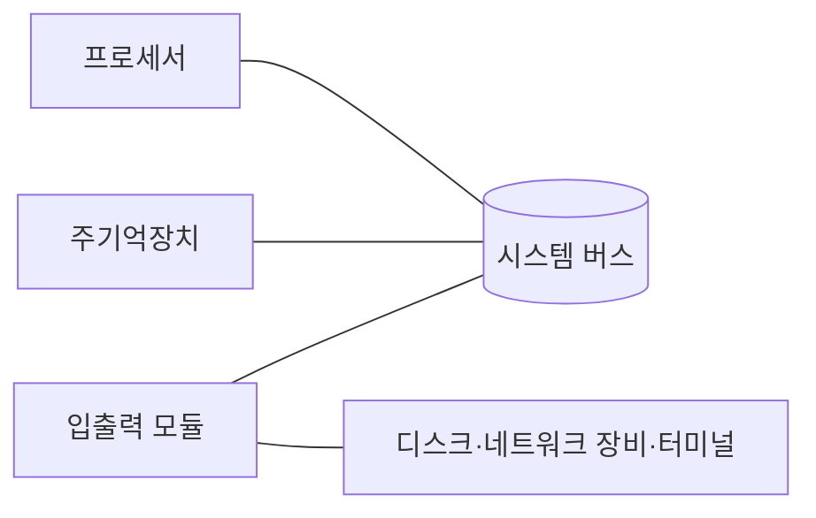



요약

컴퓨터는 네 부분으로 이루어진다. 일을 하는 일꾼(프로세서), 일감과 작업 지시서를 펼쳐 두는 책상(주기억장치), 바깥 세상과 물건을 주고받는 창구(입출력 모듈), 이 셋을 잇는 복도(시스템 버스)다. 운영체제는 이 하드웨어를 대신 관리하는 프로그램이라서, 하드웨어가 어떻게 생겼는지 알아야 운영체제가 왜 그렇게 일하는지 보인다. 책상은 전원이 꺼지면 깨끗이 비워진다는 점이 중요하다.

## 예시로 보기

"엑셀 파일을 열어 합계를 구한다"는 일을 네 부분으로 나눠 보면 이렇다[^s1].

| 하는 일 | 맡는 부분 |
|---|---|
| 디스크에 있던 파일 내용을 컴퓨터 안으로 들여온다 | 입출력 모듈 (디스크 쪽 창구) |
| 들여온 숫자와 엑셀 프로그램의 명령어를 펼쳐 둔다 | 주기억장치 |
| 명령어를 하나씩 읽어 덧셈을 한다 | 프로세서 |
| 위 세 부분 사이로 데이터와 명령을 나른다 | 시스템 버스 |

"책상" 비유는 주기억장치가 일하는 동안 펼쳐 두는 곳이라는 점까지만 맞다. 실제 주기억장치는 칸마다 번호(주소)가 붙어 있고, 프로세서는 그 번호로 칸을 하나씩 집어서 읽고 쓴다.

## 네 부분이 하는 일

- **프로세서.** 컴퓨터 전체의 동작을 지휘하고 계산을 한다. 하나뿐이면 중앙 처리 장치(CPU)라고 부른다. 주기억장치와 데이터를 주고받을 때는 안쪽의 작은 저장 칸 두 개를 쓴다. 하나는 다음에 읽거나 쓸 주소를 담는 칸(MAR)이고, 다른 하나는 쓸 데이터나 읽어 온 데이터를 담는 칸(MBR)이다[^1].
- **주기억장치.** 데이터와 프로그램을 담는다. 전원이 꺼지면 내용이 사라진다(휘발성). 칸마다 0번부터 차례로 번호가 붙어 있다. 한 칸에 든 비트 묶음은 명령어로도, 데이터로도 읽힐 수 있다[^2]. 실제 메모리(real memory), 1차 메모리(primary memory)라고도 부른다.
- **입출력 모듈.** 컴퓨터와 바깥 장치(디스크 같은 저장 장치, 통신 장비, 터미널) 사이에서 데이터를 옮긴다. 안에 잠깐 데이터를 맡아 두는 공간(버퍼)이 있다. 어느 장치와 일할지는 입출력 주소 레지스터(I/OAR)가, 주고받을 데이터는 입출력 버퍼 레지스터(I/OBR)가 담는다[^3].
- **시스템 버스.** 프로세서, 주기억장치, 입출력 모듈이 서로 데이터를 주고받는 길이다[^4].

## 활용

- 운영체제가 관리하는 대상이 바로 이 네 부분이다. 프로세서 시간을 누구에게 줄지, 주기억장치의 어느 칸을 누구에게 줄지, 어떤 입출력 장치를 언제 쓰게 할지 정한다. 자세한 것은 [운영체제의 역할](/Hongs_Blog/studies/operating-systems/os-role/)에 있다.
- 주기억장치가 휘발성이라서 오래 남길 데이터는 디스크 같은 2차 기억장치에 둔다. 이 차이는 [메모리 계층](/Hongs_Blog/studies/operating-systems/memory-hierarchy/)에서 다시 나온다.

## 연결

- 다음: 프로세서 안의 저장 칸은 [프로세서 레지스터](/Hongs_Blog/studies/operating-systems/processor-registers/), 프로세서가 일하는 순서는 [명령어 사이클](/Hongs_Blog/studies/operating-systems/instruction-cycle/)
- 2-1학기 어셈블리어의 1~2장(x86 프로세서 구조)이 같은 내용을 x86 기준으로 다룬다.

## 확인 문제

<b>C1</b> 컴퓨터의 네 가지 기본 구성 요소와 각각이 하는 일을 한 줄씩 쓰라.

**답:** 프로세서: 동작을 지휘하고 계산한다. 주기억장치: 데이터와 프로그램을 담는다(휘발성). 입출력 모듈: 컴퓨터와 바깥 장치 사이에서 데이터를 옮긴다. 시스템 버스: 앞의 셋이 서로 통신하는 길. 
**흔한 오답:** 디스크를 기본 구성 요소로 적는 것. 디스크는 입출력 모듈 너머의 바깥 장치다.

<b>C2</b> MAR과 MBR은 각각 무엇을 담는가? 프로세서가 주기억장치 500번지 값을 읽을 때 두 칸에는 각각 무엇이 들어가는가?

**답:** MAR에는 읽거나 쓸 주소, MBR에는 쓸 데이터나 읽어 온 데이터가 들어간다. 500번지를 읽으면 MAR에 500이 들어가고, 읽어 온 값이 MBR에 들어온다. 
**흔한 오답:** 둘을 거꾸로 적는 것. 이름의 A는 address(주소), B는 buffer(데이터를 잠깐 맡아 두는 곳)다.

[^1]: 3-1학기/운영체제/1.수업자료/01.Chapter01-new.pptx, 슬라이드 5와 발표자 노트
[^2]: 같은 자료, 슬라이드 6과 발표자 노트
[^3]: 같은 자료, 슬라이드 7과 발표자 노트
[^4]: 같은 자료, 슬라이드 8
[^s1]: 에이전트 보충. 엑셀 예시와 표, 그림은 원본에 없다. 슬라이드 4의 네 구성 요소를 일상 작업에 대어 본 것이다.

