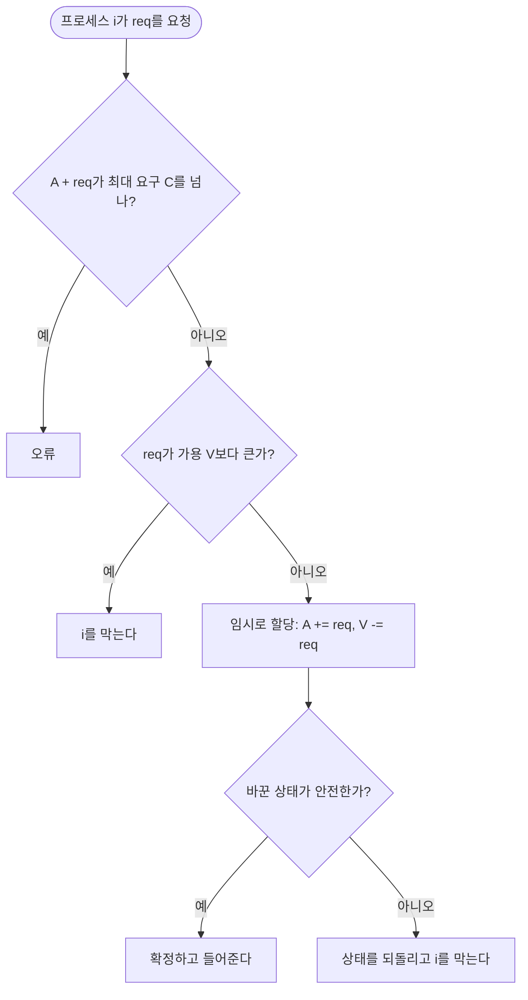


<div class="callout callout-summary" markdown="1">
<div class="callout-title callout-title--default" markdown="span">요약</div>

은행이 대출을 내줄 때 "이 돈을 빌려줘도, 모든 고객이 최대 한도까지 빌려 가는 최악의 경우에 누군가부터 차례로 갚을 수 있는가"를 따지는 것과 같다. 운영체제는 자원 요청이 올 때마다 들어준 뒤의 상태를 미리 계산해, 모두가 끝날 수 있는 순서가 하나라도 있으면(안전 상태) 들어주고 아니면 기다리게 한다. 예방보다 자원을 넉넉히 쓰고, 탐지처럼 프로세스를 되돌릴 일도 없다. 대신 각 프로세스가 앞으로 필요한 최대 자원을 미리 밝혀야 하고, 요청마다 계산이 든다.

</div>


## 예시로 보기

자원 R1, R2, R3이 각각 9, 3, 6개 있고 프로세스 넷이 있다(그림 6.7a)[^1]. $$C$$는 각자가 밝힌 최대 요구, $$A$$는 지금 가진 것, $$C - A$$는 앞으로 더 필요한 것이다.

| | $$C$$ (최대 요구) | $$A$$ (할당) | $$C - A$$ (더 필요) |
|---|---|---|---|
| P1 | 3 2 2 | 1 0 0 | 2 2 2 |
| P2 | 6 1 3 | 6 1 2 | 0 0 1 |
| P3 | 3 1 4 | 2 1 1 | 1 0 3 |
| P4 | 4 2 2 | 0 0 2 | 4 2 0 |

자원 총량 $$R = (9, 3, 6)$$에서 할당 합 $$(8, 2, 5)$$를 빼면 사용 가능 $$V = (0, 1, 1)$$이다.

이 상태가 안전한지 따라가 본다[^2].

| 단계 | 끝낼 프로세스 | 조건 확인 ($$C - A \le$$ 가용) | 끝난 뒤 가용 |
|---|---|---|---|
| 0 | | | (0, 1, 1) |
| 1 | P2 | (0,0,1) ≤ (0,1,1) ✓. P1은 R1이 2 더 필요해 안 됨 | (0,1,1) + (6,1,2) = (6, 2, 3) |
| 2 | P1 | (2,2,2) ≤ (6,2,3) ✓ | (7, 2, 3) |
| 3 | P3 | (1,0,3) ≤ (7,2,3) ✓ | (9, 3, 4) |
| 4 | P4 | (4,2,0) ≤ (9,3,4) ✓ | (9, 3, 6) |

모두 끝낼 수 있는 순서 P2 → P1 → P3 → P4가 있으므로 **안전 상태**다[^3].

다른 초기 상태(그림 6.8a)에서 P1이 R1과 R3를 하나씩 더 달라고 한다. 들어주면 가용이 (0, 1, 1)이 되고, 더 필요한 양은 P1 (1,2,1), P2 (1,0,2), P3 (1,0,3), P4 (4,2,0)이다. 모두 R1이 하나 이상 필요한데 R1 가용이 0이라 아무도 끝낼 수 없다. **불안전 상태**이므로 요청을 거절하고 P1을 기다리게 한다[^4].

<div class="callout callout-check" markdown="1">
<div class="callout-title" markdown="span">검증: 그림 6.7a의 안전 순서, 그림 6.8의 요청 거절, 카드와 예제 사다리의 모든 판정 — [30_bankers-algorithm_impl.py](/Hongs_Blog/studies/operating-systems/code/30_bankers-algorithm_impl/)</div>

</div>


## 정확히 말하면

<div class="callout callout-definition" markdown="1">
<div class="callout-title callout-title--default" markdown="span">정의</div>

**교착상태 회피**는 지금 들어온 자원 요청을 들어주면 교착상태로 갈 **수도** 있는지를 그때그때 판단해서 결정한다. 그러려면 프로세스가 앞으로 할 요청을 알아야 한다[^5].

</div>


두 방식이 있다[^6].

| 방식 | 규칙 | 문제 |
|---|---|---|
| 프로세스 시작 거부 | 지금 프로세스들의 최대 요구 합에 새 프로세스의 최대 요구를 더해도 자원 총량 안이면 시작한다 | 모든 프로세스가 최대 요구를 동시에 한다는 최악만 가정하므로 지나치게 보수적이다[^7] |
| 자원 할당 거부 (은행원 알고리즘) | 요청을 들어준 뒤의 상태가 안전할 때만 들어준다 | 아래 제약 |

**입력과 출력.** 프로세스 $$n$$개, 자원 종류 $$m$$개다.

- $$R = (R_1, \dots, R_m)$$: 자원 $$j$$의 총량.
- $$V = (V_1, \dots, V_m)$$: 지금 쓸 수 있는 자원 $$j$$의 양.
- $$C_{ij}$$: 프로세스 $$i$$가 자원 $$j$$를 최대 얼마까지 요구하는가.
- $$A_{ij}$$: 프로세스 $$i$$가 지금 자원 $$j$$를 얼마나 가졌는가.

이들 사이에는 늘 다음이 맞는다. 모든 $$j$$에 대해 $$R_j = V_j + \sum_{i=1}^{n} A_{ij}$$(총량 = 남은 것 + 나눠 준 것), 모든 $$i, j$$에 대해 $$C_{ij} \le R_j$$(아무도 총량보다 많이 요구할 수 없다), $$A_{ij} \le C_{ij}$$(아무도 밝힌 최대보다 많이 받지 않는다)[^s1].

**안전 상태.** 프로세스를 하나씩 끝까지 실행시킬 수 있는 순서가 적어도 하나 있는 상태다. 그런 순서가 없으면 불안전 상태다[^8]. 프로세스 $$i$$를 지금 끝까지 실행시킬 수 있다는 것은 다음과 같다[^2].

$$C_{ij} - A_{ij} \le V_j \quad \text{(모든 } j = 1, \dots, m\text{)}$$


"더 필요한 양이 지금 남은 양 이하"라는 뜻이다. 끝나면 그 프로세스가 가진 $$A_{i\cdot}$$를 모두 돌려주므로 $$V$$가 늘어난다.

**알고리즘**[^9]

```
요청(i, req):
    if A[i] + req > C[i]: 오류 (밝힌 최대를 넘음)
    if req > V: 프로세스 i를 막는다 (지금 자원이 없음)
    상태를 임시로 바꾼다: A[i] += req, V -= req
    if 안전(상태): 그대로 확정하고 들어준다
    else: 상태를 되돌리고 프로세스 i를 막는다

안전(상태):
    work = V, rest = 모든 프로세스
    while rest에 C[k] - A[k] <= work 인 k가 있다:
        work += A[k]       # k가 끝나 자원을 돌려줌
        rest에서 k를 뺀다
    return rest가 비었는가
```



요청을 들어주지 않는 길은 셋이다. 그중 마지막 길은 자원이 남아 있는데도 막히는 경우다. 안전 검사가 이 길을 가른다[^s2].

**정확성.** 안전 함수가 지키는 성질(루프 불변식)은 "rest 밖의 프로세스는 모두 차례로 끝낼 수 있고, work는 그들이 돌려준 뒤의 가용 자원이다"이다. 처음에는 rest 밖이 비어 있고 work = V이므로 맞다. 반복마다 끝낼 수 있는 $$k$$ 하나를 끝내고 그 할당을 work에 더하므로 계속 맞다. 끝났을 때 rest가 비었으면 그 순서 자체가 안전 순서다[^s1].

조건을 만족하는 $$k$$가 여럿이면 아무거나 골라도 결과(안전한가)는 같다. 하나를 끝내면 work는 줄지 않고 늘기만 하므로, 그때 끝낼 수 있던 다른 프로세스는 나중에도 끝낼 수 있기 때문이다[^s1].

**복잡도.** 안전 검사 한 번에 반복이 최대 $$n$$번, 반복마다 프로세스 $$n$$개 × 자원 $$m$$개를 비교하므로 $$O(m n^2)$$이다[^s1].

### 좋은 점과 제약

| 좋은 점[^10] | 제약[^11] |
|---|---|
| 탐지와 달리 프로세스를 선점하거나 되돌릴 필요가 없다 | 각 프로세스의 최대 요구를 미리 밝혀야 한다 |
| 예방보다 덜 제한적이다 | 프로세스들이 서로 독립이어야 한다(동기화 요구가 없어야 한다) |
| | 나눠 줄 자원 수가 고정되어 있어야 한다 |
| | 자원을 쥔 채로 끝나면 안 된다 |

## 스스로 설명해 보기

1. 그림 6.7a에서 처음 끝낼 수 있는 것은 P2뿐이다.
   <details class="inline-fold" markdown="1"><summary markdown="span">근거</summary>
   가용 R1이 0이다. P1, P3, P4는 모두 R1이 더 필요하다(2, 1, 4). P2만 R1이 더 필요 없고 R3 하나만 필요한데 R3 가용이 1이다.
   </details>
2. P2가 끝나면 가용이 (6, 2, 3)이 된다.
   <details class="inline-fold" markdown="1"><summary markdown="span">근거</summary>
   P2는 R3 하나를 더 받아 끝나고, 그 하나를 포함해 가진 것 전부를 돌려준다. 받기 전 가용 (0,1,1)에서 1을 빼고 P2의 최대 (6,1,3)를 더하면 (6,2,3). 같은 계산을 "가용 + 원래 할당 (6,1,2)"로 해도 된다.
   </details>
3. 불안전 상태라고 해서 바로 교착상태는 아니다.
   <details class="inline-fold" markdown="1"><summary markdown="span">근거</summary>
   안전 판단은 모든 프로세스가 최대 요구까지 요청한다는 최악을 가정한다. 실제로는 어떤 프로세스가 최대보다 적게 쓰고 끝날 수도 있다. 불안전은 "교착상태를 피할 보장이 없다"는 뜻이다.
   </details>
- 핵심 아이디어는?
  <details class="inline-fold" markdown="1"><summary markdown="span">답</summary>
  최악의 경우에도 모두 끝낼 수 있는 순서가 있는 상태에만 머문다. 그런 상태에서는 무슨 일이 생겨도 그 순서대로 진행하면 되므로 교착상태에 빠지지 않는다.
  </details>
- 같은 생각을 쓰는 다른 곳은?
  <details class="inline-fold" markdown="1"><summary markdown="span">답</summary>
  은행 대출(이름의 유래), 클라우드에서 가상 머신에 메모리를 약속할 때 과하게 약속하지 않는 정책.
  </details>

## 활용

- 최대 요구를 미리 알기 어렵고 프로세스 수가 계속 바뀌어서, 일반 운영체제는 은행원 알고리즘을 거의 쓰지 않는다. 자원과 작업이 미리 정해진 시스템에서 쓸모가 있다[^s1].
- 계산 연습: [은행원 알고리즘 예제 사다리](/Hongs_Blog/studies/operating-systems/bankers-ladder/)

## 연결

- 선수: [교착상태](/Hongs_Blog/studies/operating-systems/deadlock/), [교착상태 예방](/Hongs_Blog/studies/operating-systems/deadlock-prevention/) (더 보수적인 방법)
- 반대쪽 끝: [교착상태 탐지와 복구](/Hongs_Blog/studies/operating-systems/deadlock-detection/). 탐지 알고리즘은 안전 검사와 모양이 거의 같지만 $$C - A$$ 대신 지금 요청 $$Q$$를 쓴다.

## 자주 하는 오해

<div class="callout callout-misconception" markdown="1">
<div class="callout-title" markdown="span">"불안전 상태 = 교착상태"</div>

틀렸다. 둘 다 "위험한 상태"라 같아 보인다. 불안전 상태는 모든 프로세스가 최대 요구를 한꺼번에 하면 막힐 수 있다는 뜻일 뿐이다. 실제로 그 요구를 하지 않으면 모두 끝날 수 있다. 은행원 알고리즘은 확실히 안전한 쪽에만 머물려고 불안전 상태로 가는 요청을 미리 막을 뿐이다.

</div>


<div class="callout callout-misconception" markdown="1">
<div class="callout-title" markdown="span">"요청한 자원이 남아 있으면 들어준다"</div>

틀렸다. 그림 6.8에서 P1의 요청 (1, 0, 1)은 가용 (1, 1, 2)로 충분히 줄 수 있다. 그래도 들어주면 불안전 상태가 되어 거절된다. 은행원 알고리즘은 "지금 있나"가 아니라 "주고 나서도 모두 끝낼 수 있나"를 본다.

</div>


## 확인 문제

<details markdown="1"><summary markdown="span"><b>C1</b> 안전 상태를 정의하고, 프로세스 i를 지금 끝까지 실행시킬 수 있는 조건을 식으로 쓰라.</summary>


**답:** 모든 프로세스를 하나씩 끝까지 실행시킬 수 있는 순서가 적어도 하나 있는 상태. 조건: 모든 자원 $$j$$에 대해 $$C_{ij} - A_{ij} \le V_j$$.

</details>

<details markdown="1"><summary markdown="span"><b>C2</b> 은행원 알고리즘의 "안전(상태)" 함수가 하는 일을 쉬운 말 한 문장으로 쓰라.</summary>


**답:** 지금 남은 자원으로 끝낼 수 있는 프로세스를 하나씩 끝내며 그 자원을 돌려받는 일을 되풀이해, 모두 끝낼 수 있으면 안전하다고 답한다.

</details>

<details markdown="1"><summary markdown="span"><b>C3</b> 그림 6.8a 상태(할당 P1 1 0 0, P2 5 1 1, P3 2 1 1, P4 0 0 2, 가용 1 1 2, 최대 요구는 그림 6.7과 같음)에서 (가) P2가 R1 하나를 요청한다. (나) 대신 P3가 R3 하나를 요청한다. 각각 들어주는가?</summary>


**답:** (가) 들어준다. 들어주면 가용 (0,1,2), P2가 더 필요한 것은 (0,0,2) ≤ 가용이라 P2가 끝나고 가용 (6,2,3). 이어서 P1 (2,2,2), P3 (1,0,3), P4 (4,2,0) 순서로 모두 끝난다. (나) 거절한다. 들어주면 가용 (1,1,1), 더 필요한 것은 P1 (2,2,2), P2 (1,0,2), P3 (1,0,2), P4 (4,2,0). 아무도 조건을 만족하지 못해 불안전이다.

</details>

<details markdown="1"><summary markdown="span"><b>C4</b> 그림 6.7a 상태에서 P4가 R1 하나를 요청한다. 어떻게 되는가?</summary>


**답:** 지금 R1 가용이 0이라 안전 검사까지 가지도 않고 P4가 기다린다. 요청이 가용보다 크면 먼저 막힌다.

</details>

<details markdown="1"><summary markdown="span"><b>C5</b> 은행원 알고리즘이 "자원을 쥔 채로 끝나면 안 된다"는 제약을 두는 이유는?</summary>


**답:** 안전 검사는 끝난 프로세스가 가진 자원을 모두 돌려준다고 가정하고 work에 더한다. 자원을 쥔 채 끝나면 그 자원이 돌아오지 않아, 계산상 안전 순서가 실제로는 진행되지 못한다.

</details>

[^1]: 운영체제 6회 강의 자료 「Chapter06-new」, p.32 (그림 6.7a)
[^2]: 같은 자료, p.33
[^3]: 같은 자료, p.34~36 (그림 6.7b~d)
[^4]: 같은 자료, p.37 (그림 6.8)
[^5]: 같은 자료, p.28
[^6]: 같은 자료, p.29
[^7]: 같은 자료, p.30
[^8]: 같은 자료, p.31
[^9]: 같은 자료, p.38~40 (그림 6.9)
[^10]: 같은 자료, p.41
[^11]: 같은 자료, p.42
[^s1]: <span class="fn-tag" title="수업 자료에 없고 따로 보탠 내용">보충</span> 이 장은 교수 자료가 없어 지금 자료와 같은 시리즈(Stallings 6판, Dave Bremer 작성)의 공개본(Radboud 대학)을 원본으로 썼다. 슬라이드 p.39~40의 알고리즘 그림은 이미지라 Stallings 6판 그림 6.9를 의사코드로 옮겼다. 은행 비유, 불변식과 선택 순서 무관성, 복잡도, 쓰임새, 확인 문제 C3~C5는 교재 6.3절을 바탕으로 보탰다. 슬라이드 p.32의 "Allocations are made to processors"는 "processes"의 오타로 보인다.
[^s2]: <span class="fn-tag" title="수업 자료에 없고 따로 보탠 내용">보충</span> 다이어그램 1개는 원본에 없다. "알고리즘"의 의사코드(p.38~40, 그림 6.9)를 흐름도로 옮겼다.

