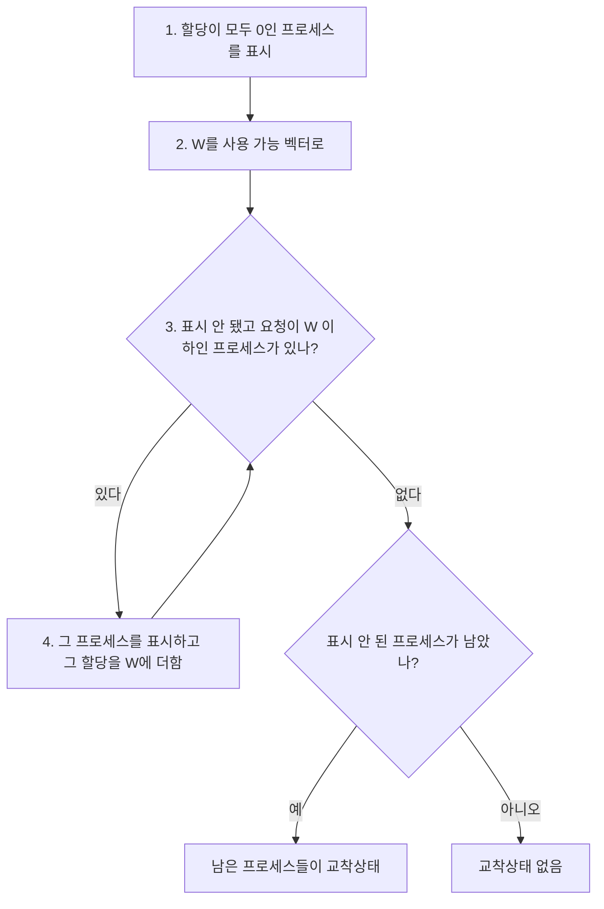



요약

탐지는 예방과 정반대다. 요청이 오면 줄 수 있는 한 다 주고, 대신 주기적으로 교착상태가 생겼는지 찾아본다. 소방서가 불을 아예 못 나게 하는 대신 순찰을 돌다 불이 나면 끄는 것과 같다. 프로세스가 시작을 기다리는 일이 없고 자원을 넉넉히 쓴다. 하지만 교착상태가 생기면 프로세스를 끝내거나 되돌려야 해서 그동안 한 일을 잃는다.

## 예시로 보기

자원 R1~R5, 프로세스 P1~P4가 있다(그림 6.10)[^1].

| | 요청 $$Q$$ (R1~R5) | 할당 $$A$$ (R1~R5) |
|---|---|---|
| P1 | 0 1 0 0 1 | 1 0 1 1 0 |
| P2 | 0 0 1 0 1 | 1 1 0 0 0 |
| P3 | 0 0 0 0 1 | 0 0 0 1 0 |
| P4 | 1 0 1 0 1 | 0 0 0 0 0 |

자원 총량은 (2, 1, 1, 2, 1)이고 할당 합은 (2, 1, 1, 2, 0)이므로 사용 가능 벡터는 (0, 0, 0, 0, 1)이다.

| 단계 | 일 | W |
|---|---|---|
| 1 | P4는 아무것도 안 가졌으니 표시 | |
| 2 | W = 사용 가능 | (0, 0, 0, 0, 1) |
| 3 | P3의 요청 (0,0,0,0,1) ≤ W → 표시, P3의 할당을 W에 더함 | (0, 0, 0, 1, 1) |
| 4 | P1의 요청은 R2가, P2의 요청은 R3가 W보다 커서 표시할 것이 없음 → 끝 | |

표시되지 않은 P1과 P2가 교착상태다[^2].

원본 오류 의심

원문: 슬라이드 p.48 그림 6.10의 오른쪽 아래 벡터 이름 "Allocation vector" / 문제점: 값 (0,0,0,0,1)은 자원 총량에서 할당 합을 뺀 **사용 가능** 벡터다. 알고리즘 2단계도 "W를 Available 벡터로 초기화"한다 / 수정안: "Available vector" / 근거: (2,1,1,2,1) − (2,1,1,2,0) = (0,0,0,0,1) — [31_deadlock-detection_impl.py](/Hongs_Blog/studies/operating-systems/code/31_deadlock-detection_impl/), Stallings 6판 그림 6.10

검증: 그림 6.10에서 P1, P2가 교착상태로 남고 카드 C2의 바뀐 요청에서는 아무도 남지 않음 — [31_deadlock-detection_impl.py](/Hongs_Blog/studies/operating-systems/code/31_deadlock-detection_impl/)

## 정확히 말하면

예방은 자원 접근을 제한하고 프로세스에 제약을 거는 아주 보수적인 방법이다. 탐지는 반대로, 줄 수 있으면 언제나 주고 정기적으로 교착상태를 확인한다[^3].

**탐지 알고리즘**[^4]

$$Q_{ik}$$는 프로세스 $$i$$가 지금 요청 중인 자원 $$k$$의 양이다. 할당 행렬 $$A$$와 사용 가능 벡터 $$V$$는 회피에서와 같다. 교착상태가 아닌 프로세스를 "표시"해 나간다. 처음에는 모두 표시되지 않은 상태다.

1. 할당 행렬의 행이 모두 0인 프로세스를 표시한다. 가진 것이 없으니 남을 막을 수 없다.
2. 임시 벡터 $$W$$를 $$V$$로 초기화한다.
3. 표시되지 않았고 $$Q$$의 $$i$$행이 $$W$$ 이하인($$Q_{ik} \le W_k$$, $$1 \le k \le m$$) 프로세스 $$i$$를 찾는다. 없으면 끝낸다.
4. 찾으면 $$i$$를 표시하고, $$A$$의 $$i$$행을 $$W$$에 더한다($$W_k \leftarrow W_k + A_{ik}$$). 3단계로 돌아간다.

3단계와 4단계 사이를 도는 동안 W는 한 번도 줄지 않는다. 더 이상 표시할 프로세스가 없을 때 남은 쪽이 교착상태다[^s2].

끝났을 때 표시되지 않은 프로세스가 있을 때, 그리고 그때만 교착상태가 있다. 표시되지 않은 프로세스가 모두 교착상태에 빠진 것들이다[^5].

4단계에서 $$i$$의 할당을 $$W$$에 더하는 것은 "$$i$$의 요청을 들어줄 수 있으니 $$i$$가 끝나 자원을 돌려준다고 낙관적으로 가정"하는 것이다. 이 가정이 틀려 $$i$$가 나중에 또 막히더라도, 그것은 이번 검사 이후의 일이고 다음 검사에서 잡힌다[^s1].

### 회피와의 차이

| | 회피(안전 검사) | 탐지 |
|---|---|---|
| 비교하는 것 | $$C - A$$ (최대까지 더 필요한 양) | $$Q$$ (지금 요청 중인 양) |
| 묻는 것 | 최악의 경우에도 모두 끝낼 수 있나 | 지금 막힌 프로세스들이 영원히 막혔나 |
| 언제 | 요청이 올 때마다, 들어주기 전에 | 주기적으로, 이미 들어준 뒤에 |

### 복구

교착상태를 찾으면 다음 중 하나로 푼다. 위로 갈수록 거칠다[^6].

1. 교착상태인 프로세스를 모두 끝낸다.
2. 각 프로세스를 미리 정해 둔 체크포인트로 되돌리고 모두 다시 시작한다. 같은 교착상태가 다시 생길 위험이 있다.
3. 교착상태가 풀릴 때까지 프로세스를 하나씩 끝낸다.
4. 교착상태가 풀릴 때까지 자원을 하나씩 빼앗는다.

3, 4에서 누구를 고를지는 지금까지 쓴 프로세서 시간이 가장 적은 것, 출력이 가장 적은 것, 남은 시간이 가장 긴 것, 우선순위가 가장 낮은 것 같은 기준으로 정한다[^s1].

### 세 방법 비교 (표 6.1)

| 방법 | 자원 할당 정책 | 좋은 점 | 나쁜 점 |
|---|---|---|---|
| 예방 | 보수적, 자원을 덜 내줌 | 실행 중 계산이 거의 없음 | 비효율적, 시작이 늦어짐 |
| 회피 | 탐지와 예방의 중간 | 선점이 필요 없음 | 앞으로의 요구를 운영체제가 알아야 함, 오래 막힐 수 있음 |
| 탐지 | 매우 너그러움, 줄 수 있으면 줌 | 프로세스 시작을 늦추지 않음, 실행 중 처리가 쉬움 | 선점으로 인한 손실 |

이 표는 슬라이드 표 6.1을 줄인 것이다[^7].

## 활용

- 데이터베이스는 트랜잭션끼리의 기다림 그래프에서 사이클을 찾아, 하나를 취소(롤백)하는 방식으로 교착상태를 푼다[^s1].
- 탐지를 자주 하면 일찍 찾지만 계산이 많고, 드물게 하면 그동안 교착상태인 프로세스들이 자원을 붙잡고 있다[^s1].

## 연결

- 선수: [교착상태 회피](/Hongs_Blog/studies/operating-systems/deadlock-avoidance/) (같은 행렬 표기)
- 전체 그림: [교착상태](/Hongs_Blog/studies/operating-systems/deadlock/)

## 확인 문제

<b>C1</b> 탐지 알고리즘의 3단계는 $$Q_i \le W$$를 보고, 은행원 알고리즘의 안전 검사는 $$C_i - A_i \le W$$를 본다. 왜 다른가?

**답:** 탐지는 "지금" 교착상태인지를 본다. 지금 요청한 것만 받으면 진행할 수 있는지가 기준이다. 회피는 "앞으로" 교착상태로 갈 수 있는지를 본다. 최대 요구까지 다 요청하는 최악의 경우를 기준으로 삼는다.

<b>C2</b> 그림 6.10에서 P2의 요청만 (0,0,0,1,1)로 바꾼다(R3 대신 R4를 요청). 표시되는 순서와 교착상태인 프로세스는?

**답:** P4(할당 0) → P3(W = (0,0,0,1,1)) → P2(요청 (0,0,0,1,1) ≤ W, W = (1,1,0,1,1)) → P1(요청 (0,1,0,0,1) ≤ W). 모두 표시되어 교착상태가 없다.

<b>C3</b> 복구 방법 2(체크포인트로 되돌려 모두 다시 시작)에서 같은 교착상태가 다시 생길 수 있는 이유는?

**답:** 되돌린 뒤 같은 프로세스들이 같은 순서로 자원을 요청하면, 처음과 같은 순환 대기가 다시 만들어진다. 실행 순서가 비결정적이라 다시 생기지 않을 수도 있지만 보장은 없다.

[^1]: 운영체제 6회 강의 자료 「Chapter06-new」, p.48 (그림 6.10)
[^2]: 같은 자료, p.46~48. 따라가기 표는 알고리즘을 그림 6.10에 적용한 것이다.
[^3]: 같은 자료, p.44
[^4]: 같은 자료, p.45~47
[^5]: 같은 자료, p.47
[^6]: 같은 자료, p.49
[^7]: 같은 자료, p.50 (표 6.1)
[^s1]: 보충 이 장은 교수 자료가 없어 지금 자료와 같은 시리즈(Stallings 6판, Dave Bremer 작성)의 공개본(Radboud 대학)을 원본으로 썼다. 4단계의 낙관적 가정, 회피와의 비교표, 희생자 고르는 기준, 데이터베이스·탐지 주기 이야기, 확인 문제는 Stallings 6판 6.4절을 바탕으로 보탰다.
[^s2]: 보충 다이어그램 1개는 원본에 없다. "탐지 알고리즘"의 1~4단계와 그 뒤 판정(p.45~47)을 흐름도로 옮겼다.

