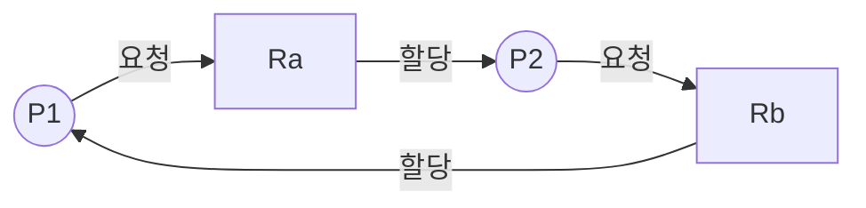



요약

신호등 없는 네거리에 네 방향 차가 동시에 들어와, 각자 앞 칸을 차지한 채 옆 차가 비켜 주기를 기다리면 아무도 움직이지 못한다. 프로세스들이 서로 상대가 쥔 자원을 기다리며 영원히 멈추는 것이 교착상태다. 네 가지 조건이 모두 맞을 때만 생기므로, 하나만 깨면 막을 수 있다. 하지만 어느 조건을 깨든 자원을 덜 효율적으로 쓰게 되어서, 일반적으로 효율적인 해결책은 없다.

## 예시로 보기

네거리를 네 칸 A, B, C, D로 나눈다. 차는 앞으로 가려면 두 칸이 필요하다[^1].

| 차 | 필요한 칸 | 이미 차지한 칸 | 기다리는 칸 |
|---|---|---|---|
| 1 | A, B | A | B |
| 2 | B, C | B | C |
| 3 | C, D | C | D |
| 4 | D, A | D | A |

차 1은 차 2가, 차 2는 차 3이, 차 3은 차 4가, 차 4는 차 1이 비켜 주기를 기다린다. 기다림이 원을 이루어 아무도 비켜 줄 수 없다[^2].

화살표는 "앞 차가 뒤 차의 칸이 비기를 기다린다"는 뜻이다. 화살표를 따라가면 출발한 차로 돌아오므로, 어느 차도 먼저 움직일 수 없다[^s2].

원본 오류 의심

원문: 슬라이드 4의 세 번째 차 "I need quad C and B" / 문제점: 다음 슬라이드(p.5)에서 세 번째 차는 "D가 빌 때까지 멈춤"이다. C와 B가 필요하다면 D를 기다릴 이유가 없고, 네 차가 원을 이루지도 않는다 / 수정안: "I need quad C and D" / 근거: 같은 자료 p.5와 Stallings 6판 그림 6.1

컴퓨터에서도 같다. 프로세스 P는 디스크 파일 D를 잠그고 테이프 드라이브 T를 요청한다. 프로세스 Q는 T를 잠그고 D를 요청한다. 두 요청이 엇갈리면 둘 다 멈춘다[^3].

메모리도 자원이다. 200 KB를 나눠 줄 수 있을 때, P1은 80 KB를 받은 뒤 60 KB를 더 달라 하고, P2는 70 KB를 받은 뒤 80 KB를 더 달라 한다. 첫 요청 뒤 남은 것은 $$200 - 80 - 70 = 50$$ KB라서 두 번째 요청은 둘 다 들어줄 수 없다. 서로 상대가 내놓기를 기다리며 멈춘다[^4].

검증: 메모리 예의 남은 양 50 KB — [31_deadlock-detection_impl.py](/Hongs_Blog/studies/operating-systems/code/31_deadlock-detection_impl/)

## 정확히 말하면

정의

프로세스 집합의 각 프로세스가, 같은 집합의 다른 막힌 프로세스만 일으킬 수 있는 사건을 기다리며 막혀 있을 때, 그 집합은 **교착상태**다. 보통 같은 자원 집합을 두고 경쟁하는 프로세스들 사이에서 생긴다[^5].

### 자원의 두 종류

| 종류 | 뜻 | 예 | 교착상태가 생기는 방식 |
|---|---|---|---|
| 재사용 자원 | 한 번에 한 프로세스만 안전하게 쓰고, 써도 없어지지 않는다 | 프로세서, 입출력 채널, 주기억장치·2차 기억장치, 장치, 파일·데이터베이스·세마포어 같은 자료 구조 | 각자 하나씩 쥐고 다른 것을 요청할 때[^6] |
| 소모성 자원 | 만들어지고(생산) 쓰이면 없어진다(소비) | 인터럽트, 시그널, 메시지, 입출력 버퍼의 정보 | 받기(receive)가 막히는 연산일 때. 드문 사건 조합에서만 생기기도 한다[^7] |

소모성 자원의 예: 두 프로세스가 각각 "상대에게서 메시지를 받은 뒤 상대에게 보낸다"로 짜여 있으면, 둘 다 받기에서 영원히 멈춘다[^8].

### 네 가지 조건

| 조건 | 뜻 |
|---|---|
| 상호 배제 | 한 자원을 한 번에 한 프로세스만 쓸 수 있다 |
| 점유와 대기 | 자원을 쥔 채로 다른 자원을 기다릴 수 있다 |
| 비선점 | 쥐고 있는 자원을 강제로 빼앗을 수 없다 |
| 순환 대기 | 프로세스들이 닫힌 사슬을 이루어, 각자 다음 프로세스가 필요로 하는 자원을 하나 이상 쥐고 있다 |

앞의 세 조건은 교착상태가 **생길 수 있는** 조건이다. 실제로 생기려면 네 번째 조건까지 맞아야 한다[^9]. 앞의 셋은 시스템의 성질(정책)이고, 순환 대기는 그 정책 아래서 실제로 벌어진 사건의 순서다[^s1].

**기호로 쓰면.** 교착상태 $$\Leftrightarrow$$ (상호 배제) $$\wedge$$ (점유와 대기) $$\wedge$$ (비선점) $$\wedge$$ (순환 대기). 셋 다 맞아도 순환 대기가 없으면 교착상태가 아니고, 넷 다 맞으면 교착상태다(Stallings는 순환 대기를 앞 세 조건 아래서 해결할 수 없는 상태로 정의한다)[^s1].

### 자원 할당 그래프

시스템의 자원과 프로세스 상태를 그린 방향 그래프다[^10]. 프로세스는 원, 자원은 네모, 네모 안의 점은 자원 하나하나다.

프로세스 → 자원 화살표는 요청, 자원 → 프로세스 화살표는 할당이다. 위 그림처럼 화살표가 원을 이루고 각 자원이 하나뿐이면 교착상태다. 자원이 여러 개(점이 여러 개)이면 원이 있어도 교착상태가 아닐 수 있다. 원 밖의 프로세스가 자원을 놓아줄 수 있기 때문이다[^11].

### 다루는 세 방법

| 방법 | 생각 | 문서 |
|---|---|---|
| 예방 | 네 조건 중 하나가 아예 생기지 못하게 설계한다 | [교착상태 예방](/Hongs_Blog/studies/operating-systems/deadlock-prevention/) |
| 회피 | 요청마다, 들어주면 교착상태로 갈 수 있는지 따져 보고 결정한다 | [교착상태 회피](/Hongs_Blog/studies/operating-systems/deadlock-avoidance/) |
| 탐지 | 일단 들어주고, 주기적으로 교착상태를 찾아 푼다 | [교착상태 탐지와 복구](/Hongs_Blog/studies/operating-systems/deadlock-detection/) |

슬라이드는 여기에 Tanenbaum이 말한 "타조 정책"(모래에 머리를 묻듯 문제를 무시하기)을 덧붙인다[^12]. 교착상태가 드물고 막는 비용이 크면 그냥 두고, 생기면 사람이 재시작한다[^s1].

## 스스로 설명해 보기

1. 네거리 예에서 네 조건이 모두 맞는다.
   

근거

   칸 하나에는 차 하나(상호 배제), 한 칸을 차지한 채 다음 칸을 기다림(점유와 대기), 남의 칸에서 차를 들어낼 수 없음(비선점), 1→2→3→4→1로 기다림이 원을 이룸(순환 대기).
   

2. 메모리 예에서 P1이 두 번째 요청을 첫 요청과 합쳐 처음부터 140 KB를 달라고 했다면 교착상태가 없다.
   

근거

   140 KB를 한 번에 받고 끝나면 점유와 대기가 생기지 않는다. P2는 P1이 끝날 때까지 기다렸다가 150 KB를 받는다(또는 P2가 먼저 받는다). 이것이 예방의 "한 번에 다 요청하기"다.
   

3. 자원 할당 그래프에 원이 있어도 교착상태가 아닐 수 있다.
   

근거

   원 안의 프로세스가 기다리는 자원 종류에 원 밖 프로세스가 쥔 단위가 있으면, 그 프로세스가 끝나며 놓아줄 때 원이 풀린다. 자원 종류마다 단위가 하나일 때만 원 = 교착상태다.
   

- 핵심 아이디어는?
  

답

  교착상태는 네 조건이 동시에 맞을 때만 생긴다. 그러니 어느 조건을 어떤 비용으로 깨느냐가 해결책을 가른다.
  

- 같은 구조가 다른 곳에도 있는가?
  

답

  데이터베이스의 행 잠금, 스레드의 뮤텍스 두 개를 반대 순서로 잡는 코드, 그래프의 사이클 탐지. 자원 할당 그래프에서 교착상태를 찾는 일은 방향 그래프에서 사이클을 찾는 일이다.
  

## 활용

- 멀티스레드 프로그램에서 가장 흔한 교착상태는 잠금 두 개를 스레드마다 다른 순서로 잡는 것이다. 모든 코드가 잠금을 정해진 순서로 잡게 하면 순환 대기가 생기지 않는다 → [교착상태 예방](/Hongs_Blog/studies/operating-systems/deadlock-prevention/)[^s1]
- 데이터베이스는 대개 탐지를 쓴다. 기다림 그래프에서 사이클을 찾으면 트랜잭션 하나를 취소한다[^s1].
- 일반 운영체제(Windows, Linux)는 사용자 프로그램 사이의 교착상태를 대부분 타조 정책으로 다룬다[^s1].

## 연결

- 선수: [경쟁 조건과 임계 구역](/Hongs_Blog/studies/operating-systems/race-condition-critical-section/) (세 가지 제어 문제 중 하나), [세마포어](/Hongs_Blog/studies/operating-systems/semaphore/)
- 세마포어 순서를 바꿔 생긴 교착상태: [생산자-소비자 문제](/Hongs_Blog/studies/operating-systems/producer-consumer/)
- 고전 예: [식사하는 철학자 문제](/Hongs_Blog/studies/operating-systems/dining-philosophers/)

## 자주 하는 오해

"세 조건(상호 배제, 점유와 대기, 비선점)이 맞으면 교착상태다"

틀렸다. 슬라이드 제목도 앞의 셋은 "가능한(possible) 교착상태의 조건"이라고 구별한다. 셋이 맞는 시스템에서도, 사건 순서가 원을 이루지 않으면 모두 끝까지 실행된다. 네거리에서 차들이 시간 차를 두고 들어오면 멈추지 않는 것과 같다. 순환 대기까지 맞아야 실제 교착상태다.

"교착상태와 기아는 같은 말이다"

틀렸다. 둘 다 "영원히 기다린다"는 점이 같아서 헷갈린다. 교착상태는 관련된 프로세스가 **모두** 멈춘다. 기아는 다른 프로세스는 잘 돌아가는데 특정 프로세스만 계속 밀린다. 교착상태는 원을 끊어야 풀리고, 기아는 오래 기다린 쪽을 우대하면(예: FIFO) 풀린다.

## 확인 문제

<b>C1</b> 교착상태의 네 조건을 쓰고, 그중 앞의 셋과 마지막 하나가 어떻게 다른지 쓰라.

**답:** 상호 배제, 점유와 대기, 비선점, 순환 대기. 앞의 셋은 교착상태가 생길 수 있게 하는 시스템의 성질이고, 순환 대기는 실제로 교착상태가 생겼을 때의 기다림 모양이다. 넷이 모두 맞아야 실제 교착상태다.

<b>C2</b> 다음은 재사용 자원과 소모성 자원 중 무엇인가? ① 프린터 ② 다른 프로세스가 보낸 메시지 ③ 세마포어 ④ 키보드 인터럽트

**답:** ① 재사용 ② 소모성 ③ 재사용 ④ 소모성. 
**흔한 오답:** 세마포어를 소모성으로 보는 것. 세마포어라는 자료 구조 자체는 쓴다고 없어지지 않는다.

<b>C3</b> 다음 상황을 자원 할당 그래프로 그리고 교착상태인지 판단하라. 자원 R1, R2는 하나씩. P1은 R1을 쥐고 R2를 요청, P2는 R2를 쥐고 있고 아무것도 요청하지 않음.

**답:** 화살표: R1 → P1(할당), P1 → R2(요청), R2 → P2(할당). 원이 없다. P2가 끝나며 R2를 놓으면 P1이 받아 진행한다. 교착상태가 아니다.

<b>C4</b> 상호 배제, 점유와 대기, 비선점이 모두 맞지만 교착상태가 생기지 않는 실행 순서를 프로세스 둘, 자원 둘로 만들어라.

**답:** P와 Q 모두 "R1 잡기 → R2 잡기 → 둘 다 놓기"로 짠다. P가 R1, R2를 잡는다. Q는 R1을 요청하다 기다린다. P가 끝나며 둘 다 놓으면 Q가 R1, R2를 잡는다. 둘이 같은 순서로 요청하므로 원이 생길 수 없다.

[^1]: 운영체제 6회 강의 자료 「Chapter06-new」, p.4 (그림 6.1a)
[^2]: 같은 자료, p.5 (그림 6.1b)
[^3]: 같은 자료, p.12~13 (그림 6.4)
[^4]: 같은 자료, p.14
[^5]: 같은 자료, p.3
[^6]: 같은 자료, p.10~11
[^7]: 같은 자료, p.15
[^8]: 같은 자료, p.16
[^9]: 같은 자료, p.18~19
[^10]: 같은 자료, p.17
[^11]: 같은 자료, p.20~21 (그림 6.5, 6.6)
[^12]: 같은 자료, p.22
[^s1]: 보충 이 장은 교수 자료가 없어 지금 자료와 같은 시리즈(Stallings 6판, Dave Bremer 작성)의 공개본(Radboud 대학)을 원본으로 썼다. 네 조건의 논리식과 성질·사건의 구별, 타조 정책의 뜻, 잠금 순서·데이터베이스·운영체제 연결, 확인 문제 C3·C4는 Stallings 6판 6.1절을 바탕으로 보탰다.
[^s2]: 보충 다이어그램 1개는 원본에 없다. "예시로 보기"의 네거리 표(p.4~5)를 기다림 관계 그림으로 그렸다.

