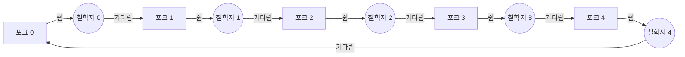


<div class="callout callout-summary" markdown="1">
<div class="callout-title callout-title--default" markdown="span">요약</div>

둥근 식탁에 철학자 다섯 명이 앉아 있고, 사람 사이마다 포크가 하나씩, 모두 다섯 개 있다. 스파게티를 먹으려면 양옆 포크 두 개가 다 필요하다. 모두가 동시에 왼쪽 포크를 집으면 아무도 오른쪽 포크를 못 집어 다 같이 굶는다. 공유 자원을 여럿이 나눠 쓸 때 교착상태와 기아를 동시에 피해야 하는 상황을 한 장면에 담은 문제이고, 해법은 네 조건 가운데 하나를 깨는 것이다.

</div>


## 예시로 보기

포크마다 세마포어(처음 값 1)를 두고, 철학자 $$i$$는 왼쪽 포크 $$i$$, 오른쪽 포크 $$(i+1) \bmod 5$$ 순서로 집는다[^s1].

```c
semaphore fork[5] = {1, 1, 1, 1, 1};
void philosopher(int i) {
    while (true) {
        think();
        semWait(fork[i]);              /* 왼쪽 */
        semWait(fork[(i + 1) % 5]);    /* 오른쪽 */
        eat();
        semSignal(fork[(i + 1) % 5]);
        semSignal(fork[i]);
    }
}
```

다섯 명이 동시에 첫 줄을 실행하면 포크 다섯 개가 모두 왼쪽 손에 들린다. 이제 모두 오른쪽 포크를 기다리는데, 그 포크는 오른쪽 사람의 왼손에 있다. 0 → 1 → 2 → 3 → 4 → 0으로 기다림이 원을 이룬다. [교착상태](/Hongs_Blog/studies/operating-systems/deadlock/)다.



원은 철학자, 네모는 포크다. 포크에서 철학자로 가는 화살표는 쥐고 있다는 뜻이고, 반대 방향은 기다린다는 뜻이다. 화살표가 한 바퀴 닫힌 원을 이루고 포크는 하나씩뿐이라 교착상태다[^s2].

## 정확히 말하면

| 해법 | 깨는 조건 | 방법 |
|---|---|---|
| 방에 넷만 | 순환 대기 | 세마포어 `room`을 4로 두고, 식탁에 앉기 전 `semWait(room)`, 일어날 때 `semSignal(room)`. 다섯 중 많아야 넷이 앉으므로 적어도 한 명은 포크 두 개를 얻는다 |
| 포크 번호 순서 | 순환 대기 | 양옆 포크 중 번호가 작은 것부터 집는다. 철학자 4는 포크 0을 먼저 집으므로 원이 끊긴다 |
| 모니터 | 점유와 대기 | 양옆 포크가 둘 다 비었을 때만 한꺼번에 집는다. 모니터 안에서 확인과 집기를 한 번에 하고, 못 집으면 조건 변수에서 기다린다 |

**방에 넷만 해법이 통하는 이유.** 교착상태가 되려면 앉은 사람 모두가 왼쪽 포크를 쥐고 오른쪽을 기다려야 한다. 앉은 사람은 넷이므로 쥔 포크도 넷이고, 빈자리 $$e$$의 왼쪽 포크 $$e$$는 아무도 쥐지 않았다. 그런데 포크 $$e$$는 바로 옆 철학자 $$(e - 1) \bmod 5$$의 오른쪽 포크다. 그 사람은 앉아 있으므로 포크 $$e$$를 얻어 먹고 내려놓는다. 모두가 기다리는 상황이 생길 수 없다.

<details markdown="1"><summary markdown="span">방에 넷만 해법 코드 (Stallings 그림 6.13)</summary>


```c
semaphore fork[5] = {1, 1, 1, 1, 1};
semaphore room = 4;
void philosopher(int i) {
    while (true) {
        think();
        semWait(room);
        semWait(fork[i]);
        semWait(fork[(i + 1) % 5]);
        eat();
        semSignal(fork[(i + 1) % 5]);
        semSignal(fork[i]);
        semSignal(room);
    }
}
```

</details>

<div class="callout callout-check" markdown="1">
<div class="callout-title" markdown="span">검증: 모두 왼쪽 포크를 쥐면 아무도 오른쪽을 못 얻음을 재현. "방에 넷만"과 "포크 번호 순서" 해법은 철학자 다섯이 300번씩 먹을 때까지 멈추지 않음 — [32_dining-philosophers_verify.py](/Hongs_Blog/studies/operating-systems/code/32_dining-philosophers_verify/)</div>

</div>


## 활용

- 데이터베이스 행 잠금, 여러 장치를 함께 써야 하는 작업처럼 "자원 둘 이상을 동시에 잡아야 하는" 모든 상황의 축소판이다.
- 포크 번호 순서 해법은 실무의 "잠금을 정해진 순서로 잡는다" 규칙과 같다 → [교착상태 예방](/Hongs_Blog/studies/operating-systems/deadlock-prevention/)

## 연결

- 선수: [교착상태](/Hongs_Blog/studies/operating-systems/deadlock/), [세마포어](/Hongs_Blog/studies/operating-systems/semaphore/)
- 모니터 해법의 바탕: [모니터](/Hongs_Blog/studies/operating-systems/monitor/)

## 확인 문제

<details markdown="1"><summary markdown="span"><b>C1</b> 세마포어 room을 4가 아니라 5로 두면 무엇이 달라지는가?</summary>


**답:** 다섯 명이 모두 앉을 수 있어 처음 코드와 같아진다. 모두 왼쪽 포크를 집는 순서에서 교착상태가 다시 생긴다.

</details>

<details markdown="1"><summary markdown="span"><b>C2</b> "포크 번호가 작은 것부터 집기"로 교착상태가 사라지는 이유를 철학자 4로 설명하라.</summary>


**답:** 철학자 0~3은 왼쪽 포크(번호가 작음)부터 집는다. 철학자 4의 양옆은 포크 4와 포크 0이므로, 오른쪽 포크 0을 먼저 집는다. 다섯이 동시에 첫 포크를 집으려 하면 철학자 0과 4가 포크 0을 두고 다투고, 진 쪽은 아무것도 쥐지 않은 채 기다린다. 그러면 포크 4가 비어 철학자 3이 두 개를 얻는다. 기다림이 원을 이루지 못한다.

</details>

<details markdown="1"><summary markdown="span"><b>C3</b> 철학자가 "왼쪽 포크를 집은 뒤 오른쪽이 없으면 왼쪽을 내려놓고 잠시 뒤 다시 시도"한다. 교착상태는 사라지는가? 대신 생길 수 있는 문제는?</summary>


**답:** 쥔 자원을 놓으므로 점유와 대기가 깨져 교착상태는 없다. 대신 다섯이 동시에 집고, 동시에 내려놓고, 다시 동시에 집는 일이 끝없이 되풀이될 수 있다. 아무도 멈춰 있지는 않지만 아무도 먹지 못한다(라이브락). 특정 철학자만 계속 실패하는 기아도 가능하다.

</details>

[^s1]: <span class="fn-tag" title="수업 자료에 없고 따로 보탠 내용">보충</span> 공개본 6장 슬라이드는 목차(p.2)에 이 문제를 적었지만 해당 슬라이드가 50쪽에서 끊겨 내용이 없다. 문서 전체를 Stallings, *Operating Systems: Internals and Design Principles* 6판, 6.6절(그림 6.12, 6.13, 6.14)로 채웠다. '방에 넷만'이 통하는 이유, 포크 번호 순서 해법, 라이브락은 교재 밖의 표준 설명이다.
[^s2]: <span class="fn-tag" title="수업 자료에 없고 따로 보탠 내용">보충</span> 다이어그램 1개는 원본에 없다. "예시로 보기"에서 다섯 명이 모두 왼쪽 포크를 쥔 순간을 자원 할당 그래프로 그렸다.

