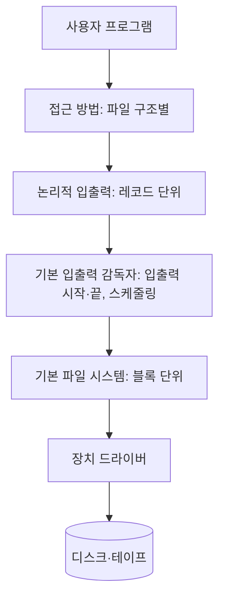



요약

파일은 컴퓨터가 꺼져도 남고, 여러 프로세스가 함께 쓸 수 있고, 안에 구조가 있는 이름 붙은 데이터 묶음이다. 파일 관리 시스템은 디스크의 블록과 섹터 같은 세부를 감추고 "보고서.txt를 열어 읽는다"처럼 이름과 단순한 명령으로 쓰게 해 준다. 덕분에 프로그래머는 파일 관리 소프트웨어를 따로 만들 필요가 없다. 대신 운영체제는 보호, 공유, 성능, 고장 복구를 모두 책임져야 한다.

## 예시로 보기

학생 명부 파일을 생각해 보자[^s1].

| 단위 | 명부에서 | 뜻 |
|---|---|---|
| 필드 | "홍길동" (이름 칸 하나) | 값 하나를 담는 가장 작은 데이터. 길이와 자료형이 있다 |
| 레코드 | 한 학생의 학번·이름·학과 | 서로 관련된 필드 묶음. 한 단위로 다룬다 |
| 파일 | 학생 명부 전체 | 비슷한 레코드의 모음. 이름이 있고 하나의 대상으로 다룬다. 접근 제어를 걸 수 있다 |
| 데이터베이스 | 명부 + 수강 신청 + 성적 | 관련된 데이터의 모음. 원소들 사이에 관계가 있고 파일 하나 이상으로 이루어진다 |

이 표의 정의는 슬라이드 6~8을 따른다[^1].

## 정확히 말하면

파일이 갖추면 좋은 성질은 오래 남음, 프로세스 사이 공유, 구조다[^2]. 파일 관리 시스템은 특권 응용으로 돌아가는 시스템 유틸리티 프로그램들이고, 2차 기억장치를 다룬다[^3]. 보통 파일에 만들기, 지우기, 열기, 닫기, 읽기, 쓰기 연산을 제공한다[^4].

**목표.**[^5] 사용자의 데이터 관리 요구를 채운다. 파일 안 데이터가 올바름을 보장한다. 성능을 최적화한다. 여러 저장 장치를 지원한다. 데이터 손실·파괴를 최소로 한다. 사용자 프로세스에 표준 입출력 인터페이스 루틴을 준다. 여러 사용자가 있으면 그들을 지원한다.

**범용 시스템의 요구.**[^6] 각 사용자는 파일을 만들고·지우고·읽고·쓰고·고칠 수 있다. 다른 사용자의 파일에 통제된 접근을 할 수 있다. 자기 파일에 어떤 접근을 허락할지 정할 수 있다. 자기 파일의 구조를 바꿀 수 있다. 파일 사이로 데이터를 옮길 수 있다. 백업하고 복구할 수 있다. 기호 이름으로 파일에 접근할 수 있다.

### 소프트웨어 구조

아래에서 위로 다섯 층이다[^7].

| 층 | 하는 일 |
|---|---|
| 장치 드라이버 | 가장 아래. 주변 장치와 직접 주고받는다. 입출력을 시작하고, 끝난 요청을 처리한다 |
| 기본 파일 시스템 (물리적 입출력) | 컴퓨터 바깥과의 주 인터페이스. 데이터 블록을 주고받고, 블록 배치와 주기억장치의 블록 버퍼링을 다룬다 |
| 기본 입출력 감독자 | 모든 파일 입출력의 시작과 끝을 맡는다. 장치 입출력, 스케줄링, 파일 상태에 관한 제어 구조를 다루고, 장치와의 입출력을 골라 스케줄링한다 |
| 논리적 입출력 | 사용자와 응용이 레코드에 접근하게 한다. 일반 레코드 입출력 기능과 파일 기본 정보를 관리한다 |
| 접근 방법 | 사용자에게 가장 가깝다. 서로 다른 파일 구조를 반영하고, 응용과 파일 시스템·장치 사이에 표준 인터페이스를 준다 |

사용자 쪽에서 보면 파일 이름과 레코드로 요청하고, 아래로 내려갈수록 블록, 그다음 장치 명령으로 바뀐다[^8].

## 활용

- 리눅스의 가상 파일 시스템(VFS)은 어떤 파일 시스템이든 공통 성질을 가진 객체로 보고 사용자 프로세스에 하나의 인터페이스를 준다. 프로세스가 VFS 방식으로 `read`를 부르면 VFS가 내부 호출로 바꾸고, 특정 파일 시스템의 매핑 함수로 넘긴다. 주요 객체는 슈퍼블록(마운트된 파일 시스템), 아이노드(파일 하나), 덴트리(디렉터리 항목 하나), 파일(프로세스가 연 파일)이다[^9].
- Windows의 NTFS는 복구 가능성, 보안, 큰 디스크·큰 파일, 여러 데이터 스트림, 저널링, 압축·암호화를 지원한다. 볼륨의 모든 것이 파일이고, 파일의 데이터 내용조차 속성 하나로 다룬다[^10].

## 연결

- 선수: [입출력 장치와 입출력 설계](/Hongs_Blog/studies/operating-systems/io-devices-design/) (같은 층 구조의 파일 시스템 쪽)
- 다음: [파일 조직](/Hongs_Blog/studies/operating-systems/file-organization/), [디렉터리와 파일 공유](/Hongs_Blog/studies/operating-systems/directories-file-sharing/), [파일 할당](/Hongs_Blog/studies/operating-systems/file-allocation/)

## 확인 문제

<b>C1</b> 다음은 필드, 레코드, 파일, 데이터베이스 중 무엇인가? ① 주문 한 건(주문 번호·고객·금액) ② "2026-10-08"(주문 날짜 칸) ③ 고객 파일과 주문 파일, 그리고 둘을 잇는 관계

**답:** ① 레코드 ② 필드 ③ 데이터베이스.

<b>C2</b> 파일 시스템 소프트웨어의 다섯 층을 아래에서 위로 쓰라.

**답:** 장치 드라이버 → 기본 파일 시스템(물리적 입출력) → 기본 입출력 감독자 → 논리적 입출력 → 접근 방법.

<b>C3</b> 논리적 입출력 층은 레코드를, 기본 파일 시스템은 블록을 다룬다. 이렇게 나누는 이유는?

**답:** 응용은 "고객 레코드 하나"처럼 의미 단위로 일하고 싶고, 디스크는 고정 크기 블록으로만 읽고 쓴다. 레코드와 블록 사이의 변환(블로킹)을 한 층에 모아 두면, 응용은 블록을 몰라도 되고 아래층은 레코드 구조를 몰라도 된다.

[^1]: 운영체제 12회 강의 자료 「Chapter12-new」, 슬라이드 6~8
[^2]: 같은 자료, 슬라이드 3
[^3]: 같은 자료, 슬라이드 4, 9
[^4]: 같은 자료, 슬라이드 5
[^5]: 같은 자료, 슬라이드 10
[^6]: 같은 자료, 슬라이드 11~12
[^7]: 같은 자료, 슬라이드 13~18 (그림 12.1)
[^8]: 같은 자료, 슬라이드 19 (그림 12.2)
[^9]: 같은 자료, 슬라이드 95~98
[^10]: 같은 자료, 슬라이드 100~104
[^s1]: 보충 학생 명부 예시, 층 그림, 확인 문제 C1·C3은 슬라이드에 없다.

