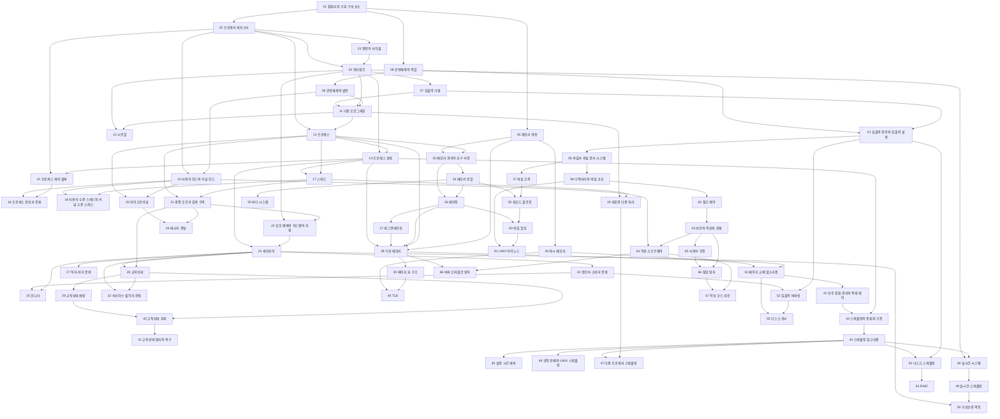


## 먼저 알아야 할 것
- 어셈블리어 (2-1학기) 1~2장의 x86 프로세서 구조가 1장과 겹친다. 아직 개념 문서는 없다.
- 교재: Stallings, *Operating Systems: Internals and Design Principles* 6판 슬라이드. 교수 자료에 없던 3·5·6·7장은 공개 강의자료로 채웠다(각 장 안내 참고).

## 1장 · 컴퓨터 시스템 개요

읽기 전에

1. 프린터가 한 줄 찍는 동안 프로세서는 무엇을 하고 있을까? 기다리지 않게 하려면 무엇이 필요할까? → [인터럽트](/Hongs_Blog/studies/operating-systems/interrupt/)
2. 캐시가 주기억장치보다 훨씬 작은데도 대부분의 읽기를 처리할 수 있는 까닭을 추측해 보라. → [캐시 메모리](/Hongs_Blog/studies/operating-systems/cache-memory/)

| 번호 | 개념 | 한 줄 | 개념 코드 | 연습 |
|---|---|---|---|---|
| 01 | [컴퓨터의 기본 구성 요소](/Hongs_Blog/studies/operating-systems/computer-basic-elements/) | 프로세서, 주기억장치, 입출력 모듈, 버스의 네 부분 | — | — |
| 02 | [프로세서 레지스터](/Hongs_Blog/studies/operating-systems/processor-registers/) | 프로세서 안의 빠른 칸. PC, IR, PSW, 조건 코드 | — | — |
| 03 | [명령어 사이클](/Hongs_Blog/studies/operating-systems/instruction-cycle/) | 명령어를 가져오고(인출) 실행하기를 되풀이 | [impl](/Hongs_Blog/studies/operating-systems/code/03_instruction-cycle_impl/) | — |
| 04 | [인터럽트](/Hongs_Blog/studies/operating-systems/interrupt/) | 장치가 끝났다고 알려 프로세서를 끊는 장치. 상태를 저장하고 되살린다 (강조)[^강조] | [verify](/Hongs_Blog/studies/operating-systems/code/04_interrupt_verify/) | — |
| 05 | [메모리 계층](/Hongs_Blog/studies/operating-systems/memory-hierarchy/) | 작고 빠른 메모리부터 크고 느린 메모리까지 층층이 | — | — |
| 06 | [캐시 메모리](/Hongs_Blog/studies/operating-systems/cache-memory/) | 지역성을 이용해 자주 쓰는 블록을 복사해 두는 작은 메모리 | [verify](/Hongs_Blog/studies/operating-systems/code/06_cache-memory_verify/) | — |
| 07 | [입출력 기법](/Hongs_Blog/studies/operating-systems/io-techniques/) | 프로그램 입출력, 인터럽트 구동, DMA | — | — |

자료: Chapter01-new.pptx
필기: 아직 없다.
떠올려 보기: 노트를 닫고 명령어 사이클 그림에 인터럽트 단계를 넣어 그린 뒤, 입출력 기법 세 가지와 연결해 본다.

## 2장 · 운영체제 개요

읽기 전에

1. 프로그램 하나가 시간의 97%를 입출력을 기다리며 보낸다면, 프로세서를 놀리지 않을 방법은? → [다중 프로그래밍](/Hongs_Blog/studies/operating-systems/multiprogramming/)
2. 사용자 프로그램이 운영체제의 메모리를 덮어쓰지 못하게 하려면 하드웨어에 무엇이 있어야 할까? → [사용자 모드와 커널 모드](/Hongs_Blog/studies/operating-systems/user-kernel-mode/)

| 번호 | 개념 | 한 줄 | 개념 코드 | 연습 |
|---|---|---|---|---|
| 08 | [운영체제의 역할](/Hongs_Blog/studies/operating-systems/os-role/) | 응용의 실행을 지휘하고 하드웨어를 대신 관리하는 프로그램 | — | — |
| 09 | [운영체제의 발전](/Hongs_Blog/studies/operating-systems/os-evolution/) | 직렬 처리 → 단순 배치 → 다중 프로그래밍 배치 → 시분할 | — | — |
| 10 | [사용자 모드와 커널 모드](/Hongs_Blog/studies/operating-systems/user-kernel-mode/) | 사용자 프로그램은 제한된 모드, 운영체제는 모든 권한 | — | — |
| 11 | [다중 프로그래밍](/Hongs_Blog/studies/operating-systems/multiprogramming/) | 입출력을 기다리는 동안 다른 프로그램을 실행 (강조)[^강조] | [verify](/Hongs_Blog/studies/operating-systems/code/11_multiprogramming_verify/) | [예제 사다리](/Hongs_Blog/studies/operating-systems/multiprogramming-ladder/) |
| 12 | [시분할](/Hongs_Blog/studies/operating-systems/time-sharing/) | 프로세서 시간을 잘게 나눠 여러 사용자에게 번갈아 | — | — |
| 13 | [프로세스](/Hongs_Blog/studies/operating-systems/process/) | 실행 중인 프로그램. 프로그램, 데이터, 실행 문맥 | — | — |

자료: Chapter02-new.pptx
필기: 아직 없다.
떠올려 보기: 노트를 닫고 운영체제 발전 네 단계를 쓰고, 단계마다 없앤 낭비와 새로 생긴 문제를 적어 본다.

## 3장 · 프로세스 설명과 제어

읽기 전에

1. 입출력이 끝난 프로세스는 곧바로 다시 실행될까? → [프로세스 상태](/Hongs_Blog/studies/operating-systems/process-states/)
2. 시스템 호출을 할 때마다 실행 중인 프로세스가 바뀔까? → [프로세스 생성과 전환](/Hongs_Blog/studies/operating-systems/process-creation-switching/)

| 번호 | 개념 | 한 줄 | 개념 코드 | 연습 |
|---|---|---|---|---|
| 14 | [프로세스 상태](/Hongs_Blog/studies/operating-systems/process-states/) | 실행·준비·대기와 일시 중단. 사건이 끝나면 준비로 간다 | [verify](/Hongs_Blog/studies/operating-systems/code/14_process-states_verify/) | — |
| 15 | [프로세스 제어 블록](/Hongs_Blog/studies/operating-systems/process-control-block/) | 프로세스마다 하나인 신상 카드. 식별·프로세서 상태·제어 정보 | — | — |
| 16 | [프로세스 생성과 전환](/Hongs_Blog/studies/operating-systems/process-creation-switching/) | 생성 순서, 종료 이유, 모드 전환과 프로세스 전환의 차이 | — | — |

> 이 장은 교수 자료가 없어 공개 자료를 원본으로 썼다: Stony Brook 대학 CSE306 공개 슬라이드(같은 교재, 옛 판).

자료: chap3 (Stony Brook).pdf
필기: 아직 없다.
떠올려 보기: 노트를 닫고 7상태 그림을 그린 뒤, 화살표마다 그 전이를 일으키는 사건을 적어 본다.

## 4장 · 스레드, SMP, 마이크로커널

읽기 전에

1. 같은 프로그램 안의 두 실행 흐름은 메모리를 함께 쓸까, 따로 쓸까? → [스레드](/Hongs_Blog/studies/operating-systems/thread/)
2. 커널이 스레드의 존재를 모르면, 한 스레드가 디스크를 기다릴 때 나머지는 어떻게 될까? → [사용자 수준 스레드와 커널 수준 스레드](/Hongs_Blog/studies/operating-systems/ult-klt/)

| 번호 | 개념 | 한 줄 | 개념 코드 | 연습 |
|---|---|---|---|---|
| 17 | [스레드](/Hongs_Blog/studies/operating-systems/thread/) | 프로세스의 자원을 함께 쓰는 실행 흐름 (강조)[^강조] | [verify](/Hongs_Blog/studies/operating-systems/code/17_thread_verify/) | — |
| 18 | [사용자 수준 스레드와 커널 수준 스레드](/Hongs_Blog/studies/operating-systems/ult-klt/) | 스레드를 라이브러리가 관리하나, 커널이 관리하나 | — | — |
| 19 | [대칭형 다중 처리](/Hongs_Blog/studies/operating-systems/smp/) | 같은 기능의 프로세서 여럿이 메모리를 함께 쓰는 구조 | — | — |
| 20 | [마이크로커널](/Hongs_Blog/studies/operating-systems/microkernel/) | 핵심만 커널에, 나머지 서비스는 사용자 모드 서버로 | — | — |

자료: Chapter04-new.pptx
필기: 아직 없다.
떠올려 보기: 노트를 닫고 프로세스와 스레드가 각각 무엇을 가지는지 표로 쓰고, ULT와 KLT의 차이를 그 표로 설명해 본다.

## 5장 · 병행성: 상호 배제와 동기화

읽기 전에

1. 두 스레드가 같은 변수에 동시에 1을 더하면 결과는 늘 2만큼 늘까? → [경쟁 조건과 임계 구역](/Hongs_Blog/studies/operating-systems/race-condition-critical-section/)
2. 자리가 없을 때 계속 확인하며 기다리지 않고 잠들게 하려면 무엇이 필요할까? → [세마포어](/Hongs_Blog/studies/operating-systems/semaphore/)

| 번호 | 개념 | 한 줄 | 개념 코드 | 연습 |
|---|---|---|---|---|
| 21 | [경쟁 조건과 임계 구역](/Hongs_Blog/studies/operating-systems/race-condition-critical-section/) | 결과가 실행 순서에 달린 상황과, 한 번에 하나만 들어가는 구간 | [verify](/Hongs_Blog/studies/operating-systems/code/21_race-condition_verify/) | — |
| 22 | [상호 배제의 하드웨어 지원](/Hongs_Blog/studies/operating-systems/hardware-mutual-exclusion/) | 인터럽트 금지, compare&swap, exchange. 바쁜 대기 | — | — |
| 23 | [세마포어](/Hongs_Blog/studies/operating-systems/semaphore/) | 남은 자리를 세는 정수와 대기 줄. semWait·semSignal | [impl](/Hongs_Blog/studies/operating-systems/code/23_semaphore_impl/) | — |
| 24 | [생산자-소비자 문제](/Hongs_Blog/studies/operating-systems/producer-consumer/) | 가득 차면 생산자가, 비면 소비자가 기다리는 버퍼 | [verify](/Hongs_Blog/studies/operating-systems/code/24_producer-consumer_verify/) | — |
| 25 | [모니터](/Hongs_Blog/studies/operating-systems/monitor/) | 공유 데이터와 함수를 한 방에. 조건 변수로 기다림 | — | — |
| 26 | [메시지 전달](/Hongs_Blog/studies/operating-systems/message-passing/) | send·receive로 데이터를 넘기며 동기화 | — | — |
| 27 | [독자-저자 문제](/Hongs_Blog/studies/operating-systems/readers-writers/) | 독자는 함께, 저자는 혼자. 누구를 우대하나 | [verify](/Hongs_Blog/studies/operating-systems/code/27_readers-writers_verify/) | — |

> 이 장은 교수 자료가 없어 공개 자료를 원본으로 썼다: 같은 시리즈(Bremer 6판)의 Google Slides 공개본.

자료: Chapter05-new (Google Slides).pdf
필기: 아직 없다.
떠올려 보기: 노트를 닫고 유한 버퍼 해법을 세마포어 세 개로 써 본 뒤, semWait 두 개의 순서를 바꾸면 무슨 일이 생기는지 적어 본다.

## 6장 · 병행성: 교착상태와 기아

읽기 전에

1. 네 갈래 교차로에서 네 차가 동시에 들어오면 왜 아무도 못 움직일까? → [교착상태](/Hongs_Blog/studies/operating-systems/deadlock/)
2. 요청을 들어줘도 괜찮은지 미리 알 수 있다면 무엇을 따져야 할까? → [교착상태 회피](/Hongs_Blog/studies/operating-systems/deadlock-avoidance/)

| 번호 | 개념 | 한 줄 | 개념 코드 | 연습 |
|---|---|---|---|---|
| 28 | [교착상태](/Hongs_Blog/studies/operating-systems/deadlock/) | 서로 상대의 자원을 기다리며 멈춤. 네 조건 | — | — |
| 29 | [교착상태 예방](/Hongs_Blog/studies/operating-systems/deadlock-prevention/) | 네 조건 중 하나를 설계로 원천 차단 | — | — |
| 30 | [교착상태 회피](/Hongs_Blog/studies/operating-systems/deadlock-avoidance/) | 요청마다 안전 상태인지 보고 허락. 은행원 알고리즘 | [impl](/Hongs_Blog/studies/operating-systems/code/30_bankers-algorithm_impl/) | [예제 사다리](/Hongs_Blog/studies/operating-systems/bankers-ladder/) |
| 31 | [교착상태 탐지와 복구](/Hongs_Blog/studies/operating-systems/deadlock-detection/) | 일단 허락하고 주기적으로 찾아서 푼다 | [impl](/Hongs_Blog/studies/operating-systems/code/31_deadlock-detection_impl/) | — |
| 32 | [식사하는 철학자 문제](/Hongs_Blog/studies/operating-systems/dining-philosophers/) | 포크 다섯 개, 철학자 다섯 명 | [verify](/Hongs_Blog/studies/operating-systems/code/32_dining-philosophers_verify/) | — |

> 이 장은 교수 자료가 없어 공개 자료를 원본으로 썼다: 같은 시리즈(Bremer 6판)의 Radboud 대학 공개본.

자료: Chapter06-new.pdf
필기: 아직 없다.
떠올려 보기: 노트를 닫고 교착상태 네 조건을 쓰고, 예방·회피·탐지가 각각 어떤 조건을 어떻게 다루는지 표로 적어 본다.

## 7장 · 메모리 관리

읽기 전에

1. 프로그램이 메모리의 어디에 실릴지 모르는데, 코드 속 주소는 어떻게 맞출까? → [메모리 관리의 요구 사항](/Hongs_Blog/studies/operating-systems/memory-management-requirements/)
2. 메모리를 크기가 제각각인 덩어리로 나누면 시간이 지나며 무슨 일이 생길까? → [메모리 분할](/Hongs_Blog/studies/operating-systems/memory-partitioning/)

| 번호 | 개념 | 한 줄 | 개념 코드 | 연습 |
|---|---|---|---|---|
| 33 | [메모리 관리의 요구 사항](/Hongs_Blog/studies/operating-systems/memory-management-requirements/) | 재배치, 보호, 공유, 논리·물리 구성 | — | — |
| 34 | [메모리 분할](/Hongs_Blog/studies/operating-systems/memory-partitioning/) | 고정·동적 분할, 단편화, 배치 알고리즘 | [verify](/Hongs_Blog/studies/operating-systems/code/34_partitioning_verify/) | — |
| 35 | [버디 시스템](/Hongs_Blog/studies/operating-systems/buddy-system/) | 2의 거듭제곱 크기로 쪼개고 합치는 할당 | [impl](/Hongs_Blog/studies/operating-systems/code/35_buddy-system_impl/) | — |
| 36 | [페이징](/Hongs_Blog/studies/operating-systems/paging/) | 같은 크기의 페이지와 프레임, 페이지 표로 주소 변환 | [impl](/Hongs_Blog/studies/operating-systems/code/36_paging_impl/) | [예제 사다리](/Hongs_Blog/studies/operating-systems/paging-ladder/) |
| 37 | [세그먼테이션](/Hongs_Blog/studies/operating-systems/segmentation/) | 길이가 다른 논리 단위로 나누는 방식 | — | — |

> 이 장은 교수 자료가 없어 공개 자료를 원본으로 썼다: Stony Brook 대학 CSE306 공개 슬라이드(같은 교재, 옛 판).

자료: chap7 (Stony Brook).pdf
필기: 아직 없다.
떠올려 보기: 노트를 닫고 고정 분할, 동적 분할, 페이징, 세그먼테이션을 단편화 종류로 비교하는 표를 써 본다.

## 8장 · 가상 메모리

읽기 전에

1. 프로그램 전체가 메모리에 없어도 실행할 수 있을까? 무엇이 있어야 할까? → [가상 메모리](/Hongs_Blog/studies/operating-systems/virtual-memory/)
2. 메모리가 꽉 찼을 때 어떤 페이지를 내보내야 가장 손해가 적을까? → [페이지 교체 알고리즘](/Hongs_Blog/studies/operating-systems/page-replacement/)

| 번호 | 개념 | 한 줄 | 개념 코드 | 연습 |
|---|---|---|---|---|
| 38 | [가상 메모리](/Hongs_Blog/studies/operating-systems/virtual-memory/) | 프로세스의 일부만 메모리에 두고 실행. 지역성, 스래싱, 페이지 크기 (강조)[^강조] | [verify](/Hongs_Blog/studies/operating-systems/code/38_virtual-memory_verify/) | — |
| 39 | [페이지 표 구조](/Hongs_Blog/studies/operating-systems/page-table-structure/) | P·M 비트, 다단계 페이지 표, 역 페이지 표 | [verify](/Hongs_Blog/studies/operating-systems/code/39_page-table_verify/) | — |
| 40 | [TLB](/Hongs_Blog/studies/operating-systems/tlb/) | 최근 페이지 표 항목을 담은 하드웨어 캐시 | [verify](/Hongs_Blog/studies/operating-systems/code/40_tlb_verify/) | — |
| 41 | [페이지 교체 알고리즘](/Hongs_Blog/studies/operating-systems/page-replacement/) | OPT, LRU, FIFO, CLOCK. 무엇을 내보낼까 (강조)[^강조] | [impl](/Hongs_Blog/studies/operating-systems/code/41_page-replacement_impl/) | [예제 사다리](/Hongs_Blog/studies/operating-systems/page-replacement-ladder/) |
| 42 | [상주 집합 관리와 적재 제어](/Hongs_Blog/studies/operating-systems/resident-set-load-control/) | 반입·배치·상주 집합·정리 정책과 다중 프로그래밍 수준 | — | — |

자료: Chapter08-new.pdf · Chapter08-new.pptx
필기: 아직 없다.
떠올려 보기: 노트를 닫고 가상 주소 하나가 TLB → 페이지 표 → (부재면) 디스크를 거쳐 실제 주소가 되는 과정을 그려 본다.

## 9장 · 단일 프로세서 스케줄링

읽기 전에

1. 짧은 작업을 먼저 처리하면 무엇이 좋아지고 누가 손해를 볼까? → [스케줄링 알고리즘](/Hongs_Blog/studies/operating-systems/scheduling-algorithms/)
2. 어떤 프로세스가 다음에 프로세서를 얼마나 쓸지 어떻게 짐작할까? → [실행 시간 예측](/Hongs_Blog/studies/operating-systems/burst-prediction/)

| 번호 | 개념 | 한 줄 | 개념 코드 | 연습 |
|---|---|---|---|---|
| 43 | [스케줄링의 종류와 기준](/Hongs_Blog/studies/operating-systems/scheduling-types-criteria/) | 장기·중기·단기 스케줄링과 평가 기준, 우선순위 | — | — |
| 44 | [스케줄링 알고리즘](/Hongs_Blog/studies/operating-systems/scheduling-algorithms/) | FCFS, RR, SPN, SRT, HRRN, 피드백 (강조)[^강조] | [impl](/Hongs_Blog/studies/operating-systems/code/44_scheduling_impl/) | [예제 사다리](/Hongs_Blog/studies/operating-systems/scheduling-ladder/) |
| 45 | [실행 시간 예측](/Hongs_Blog/studies/operating-systems/burst-prediction/) | 지난 실행 시간으로 다음 버스트를 지수 평균으로 짐작 | [verify](/Hongs_Blog/studies/operating-systems/code/45_burst-prediction_verify/) | — |
| 46 | [공정 분배와 UNIX 스케줄링](/Hongs_Blog/studies/operating-systems/fair-share-unix-scheduling/) | 사용량을 반씩 잊는 UNIX 우선순위와 그룹 단위 공정 분배 | [verify](/Hongs_Blog/studies/operating-systems/code/46_unix-fair-share_verify/) | — |

자료: Chapter09-new.pdf · Chapter09-new.pptx
필기: 아직 없다.
떠올려 보기: 노트를 닫고 다섯 프로세스 예(A~E)를 FCFS와 SRT로 간트 차트를 그려 평균 반환 시간을 비교해 본다.

## 10장 · 다중 프로세서와 실시간 스케줄링

읽기 전에

1. 프로세서가 넷일 때, 서로 결과를 주고받는 스레드 넷은 어떻게 배치해야 빠를까? → [다중 프로세서 스케줄링](/Hongs_Blog/studies/operating-systems/multiprocessor-scheduling/)
2. 중요한 작업에 높은 우선순위를 주면 마감을 가장 잘 지킬까? → [실시간 스케줄링](/Hongs_Blog/studies/operating-systems/real-time-scheduling/)

| 번호 | 개념 | 한 줄 | 개념 코드 | 연습 |
|---|---|---|---|---|
| 47 | [다중 프로세서 스케줄링](/Hongs_Blog/studies/operating-systems/multiprocessor-scheduling/) | 어느 프로세서에서 돌릴까. 부하 공유, 갱 스케줄링, 전용 배정 | — | — |
| 48 | [실시간 시스템](/Hongs_Blog/studies/operating-systems/real-time-systems/) | 늦으면 틀린 시스템. 경성·연성, 결정성과 응답성 | — | — |
| 49 | [실시간 스케줄링](/Hongs_Blog/studies/operating-systems/real-time-scheduling/) | 마감이 가장 이른 것 먼저(EDF)와 비율 단조(RMS) (강조)[^강조] | [impl](/Hongs_Blog/studies/operating-systems/code/49_real-time-scheduling_impl/) | [예제 사다리](/Hongs_Blog/studies/operating-systems/real-time-scheduling-ladder/) |
| 50 | [우선순위 역전](/Hongs_Blog/studies/operating-systems/priority-inversion/) | 높은 작업이 낮은 작업을 기다리는 함정과 우선순위 상속 | — | — |

자료: Chapter10-new.pdf · Chapter10-new.pptx
필기: 아직 없다.
떠올려 보기: 노트를 닫고 A(20, 10)·B(50, 25) 예를 A 우선, B 우선, EDF로 그려 각각 놓친 마감을 적어 본다.

## 11장 · 입출력 관리와 디스크 스케줄링

읽기 전에

1. 디스크 요청이 여러 개 쌓였을 때 어떤 순서로 처리해야 팔이 덜 움직일까? → [디스크 스케줄링](/Hongs_Blog/studies/operating-systems/disk-scheduling/)
2. 디스크 하나가 고장 나도 데이터를 잃지 않으려면 무엇을 더 저장해야 할까? → [RAID](/Hongs_Blog/studies/operating-systems/raid/)

| 번호 | 개념 | 한 줄 | 개념 코드 | 연습 |
|---|---|---|---|---|
| 51 | [입출력 장치와 입출력 설계](/Hongs_Blog/studies/operating-systems/io-devices-design/) | 장치 종류와 차이, 입출력 기능의 발전, 층 구조 | — | — |
| 52 | [입출력 버퍼링](/Hongs_Blog/studies/operating-systems/io-buffering/) | 단일·이중·순환 버퍼로 장치와 프로세스의 속도 차이를 흡수 | [verify](/Hongs_Blog/studies/operating-systems/code/52_io-buffering_verify/) | — |
| 53 | [디스크 스케줄링](/Hongs_Blog/studies/operating-systems/disk-scheduling/) | FIFO, SSTF, SCAN, C-SCAN. 팔 이동을 줄이는 순서 (강조)[^강조] | [impl](/Hongs_Blog/studies/operating-systems/code/53_disk-scheduling_impl/) | [예제 사다리](/Hongs_Blog/studies/operating-systems/disk-scheduling-ladder/) |
| 54 | [RAID](/Hongs_Blog/studies/operating-systems/raid/) | 디스크 여러 개를 하나처럼. 스트라이핑, 미러링, 패리티 | [verify](/Hongs_Blog/studies/operating-systems/code/54_raid_verify/) | — |
| 55 | [디스크 캐시](/Hongs_Blog/studies/operating-systems/disk-cache/) | 디스크 섹터를 메모리에. LRU, LFU, 빈도 기반 교체 | — | — |

자료: Chapter11-new.pdf · Chapter11-new.pptx
필기: 아직 없다.
떠올려 보기: 노트를 닫고 헤드 100, 요청 55 58 39 18 90 160 150 38 184를 SSTF와 SCAN으로 처리하는 순서를 써 본다.

## 12장 · 파일 관리

읽기 전에

1. 파일이 디스크 여러 곳에 흩어져 있으면 운영체제는 어떻게 블록들을 찾아갈까? → [파일 할당](/Hongs_Blog/studies/operating-systems/file-allocation/)
2. 작은 파일과 아주 큰 파일을 같은 구조로 다루려면 블록 주소를 어떻게 적어 둘까? → [UNIX 아이노드](/Hongs_Blog/studies/operating-systems/unix-inode/)

| 번호 | 개념 | 한 줄 | 개념 코드 | 연습 |
|---|---|---|---|---|
| 56 | [파일과 파일 관리 시스템](/Hongs_Blog/studies/operating-systems/file-management-system/) | 이름 붙은 데이터 묶음과, 그것을 다루는 운영체제 층 | — | — |
| 57 | [파일 조직](/Hongs_Blog/studies/operating-systems/file-organization/) | 더미, 순차, 색인 순차, 색인, 직접 파일 | — | — |
| 58 | [디렉터리와 파일 공유](/Hongs_Blog/studies/operating-systems/directories-file-sharing/) | 이름으로 파일을 찾는 표. 트리 구조와 공유 권한 | — | — |
| 59 | [레코드 블로킹](/Hongs_Blog/studies/operating-systems/record-blocking/) | 레코드를 블록에 담는 세 방법. 고정, 걸침, 안 걸침 | [verify](/Hongs_Blog/studies/operating-systems/code/59_record-blocking_verify/) | — |
| 60 | [파일 할당](/Hongs_Blog/studies/operating-systems/file-allocation/) | 디스크 블록을 파일에. 연속, 연결, 색인 할당 (강조)[^강조] | [impl](/Hongs_Blog/studies/operating-systems/code/60_file-allocation_impl/) | — |
| 61 | [UNIX 아이노드](/Hongs_Blog/studies/operating-systems/unix-inode/) | 직접·간접 포인터로 작은 파일도 큰 파일도 | [verify](/Hongs_Blog/studies/operating-systems/code/61_inode_verify/) | [예제 사다리](/Hongs_Blog/studies/operating-systems/file-allocation-inode-ladder/) |
| 62 | [접근 제어](/Hongs_Blog/studies/operating-systems/access-control/) | 누가 무엇에 어떤 일을. 접근 행렬, ACL, 권한 목록 | — | — |

자료: Chapter12-new.pdf · Chapter12-new.pptx
필기: 아직 없다.
떠올려 보기: 노트를 닫고 연속, 연결, 색인 할당을 단편화와 임의 접근 속도로 비교하는 표를 써 본다.

## 14장 · 컴퓨터 보안 위협

읽기 전에

1. 보안이 지켜야 할 것을 세 단어로 줄인다면 무엇일까? → [보안의 목표와 위협](/Hongs_Blog/studies/operating-systems/security-goals-threats/)
2. 바이러스와 웜은 퍼지는 방식이 어떻게 다를까? → [악성 소프트웨어](/Hongs_Blog/studies/operating-systems/malware/)

| 번호 | 개념 | 한 줄 | 개념 코드 | 연습 |
|---|---|---|---|---|
| 63 | [보안의 목표와 위협](/Hongs_Blog/studies/operating-systems/security-goals-threats/) | 기밀성, 무결성, 가용성과 이를 깨는 공격 | — | — |
| 64 | [악성 소프트웨어](/Hongs_Blog/studies/operating-systems/malware/) | 바이러스, 웜, 트로이 목마, 봇, 루트킷 | — | — |

자료: Chapter14-new.pdf · Chapter14-new.pptx
필기: 아직 없다.
떠올려 보기: 노트를 닫고 보안의 세 목표와 그것을 깨는 공격 종류를 짝지어 써 본다.

## 15장 · 컴퓨터 보안 기법

읽기 전에

1. 비밀번호 파일을 통째로 도둑맞아도 비밀번호가 바로 드러나지 않게 하려면? → [사용자 인증](/Hongs_Blog/studies/operating-systems/user-authentication/)
2. 함수 안의 배열을 넘치게 쓰면 왜 공격자의 코드가 실행될 수 있을까? → [버퍼 오버플로 방어](/Hongs_Blog/studies/operating-systems/buffer-overflow-defenses/)

| 번호 | 개념 | 한 줄 | 개념 코드 | 연습 |
|---|---|---|---|---|
| 65 | [사용자 인증](/Hongs_Blog/studies/operating-systems/user-authentication/) | 아는 것, 가진 것, 그 사람 자체. 솔트 친 해시 | [verify](/Hongs_Blog/studies/operating-systems/code/65_password-salt_verify/) | — |
| 66 | [침입 탐지](/Hongs_Blog/studies/operating-systems/intrusion-detection/) | 평소와 다른 행동, 알려진 수법을 찾아 경보 | — | — |
| 67 | [악성 코드 대응](/Hongs_Blog/studies/operating-systems/malware-countermeasures/) | 탐지·식별·제거, 에뮬레이터, 행동 차단 | — | — |
| 68 | [버퍼 오버플로 방어](/Hongs_Blog/studies/operating-systems/buffer-overflow-defenses/) | 넘친 입력이 돌아갈 주소를 덮는 공격을 막기 | — | — |

자료: Chapter15-new.pdf · Chapter15-new.pptx
필기: 아직 없다.
떠올려 보기: 노트를 닫고 인증, 접근 제어, 침입 탐지, 악성 코드 대응이 각각 어느 단계에서 막는지 순서대로 써 본다.

## 다른 과목과의 연결
- 아직 없다. 후보: 4-1학기 컴퓨터 통신의 패킷 스위칭(쉬는 시간에 남이 링크를 씀) ↔ 다중 프로그래밍(입출력 대기 동안 남이 프로세서를 씀).

## 흐름

[^강조]: 원본에서 여러 장에 반복해 나오거나 그림·예제가 여러 장인 개념. 인터럽트: 1장 슬라이드 24~38. 다중 프로그래밍: 1장 슬라이드 38, 2장 슬라이드 20~25, 53. 스레드: 2장 슬라이드 50, 4장 슬라이드 3~29. 가상 메모리: 2장 슬라이드 38~41, 8장 슬라이드 3~45. 페이지 교체: 8장 슬라이드 52~71. 스케줄링 알고리즘: 9장 슬라이드 23~51. 실시간 스케줄링: 10장 슬라이드 45~58. 디스크 스케줄링: 11장 슬라이드 42~55. 파일 할당: 12장 슬라이드 59~79.

