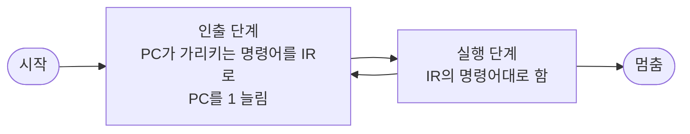



요약

프로세서는 요리책을 한 줄씩 읽고 그대로 하는 요리사와 같다. 다음 줄을 읽어 오고(인출), 읽은 대로 한다(실행). 이 두 걸음을 전원이 꺼지거나, 고칠 수 없는 오류가 나거나, "멈춰라" 명령어를 만날 때까지 되풀이한다. 단순해서 빠르지만, 요리사가 혼자 순서대로만 움직이기 때문에 느린 장치를 기다리는 동안에는 손을 놓게 된다.

## 예시로 보기

슬라이드의 가상 기계로 "940번지 값과 941번지 값을 더해 941번지에 넣는다"를 실행해 본다[^1].

- 명령어 하나는 16비트다. 앞 4비트가 할 일(연산 코드), 뒤 12비트가 주소다.
- 연산 코드는 세 개만 쓴다. `1` = 메모리 값을 AC로 읽기, `2` = AC 값을 메모리에 쓰기, `5` = 메모리 값을 AC에 더하기.
- AC(누산기)는 계산 중간값을 잠깐 담는 레지스터 하나다.
- 주소와 값은 모두 16진수로 적는다.

명령어는 300·301·302번지에 `1940`, `5941`, `2941`이 있다. 데이터는 940번지에 `0003`, 941번지에 `0002`가 있다. 실행하면 아래처럼 된다[^2].

| 단계 | 하는 일 | PC | IR | AC | 메모리 변화 |
|---|---|---|---|---|---|
| 1 인출 | 300번지의 `1940`을 IR에 싣고 PC를 1 늘린다 | 301 | 1940 | — | |
| 2 실행 | `1` = 읽기. 940번지 값 3을 AC에 | 301 | 1940 | 0003 | |
| 3 인출 | 301번지의 `5941`을 가져온다 | 302 | 5941 | 0003 | |
| 4 실행 | `5` = 더하기. AC + 941번지 값 = 3 + 2 | 302 | 5941 | 0005 | |
| 5 인출 | 302번지의 `2941`을 가져온다 | 303 | 2941 | 0005 | |
| 6 실행 | `2` = 쓰기. AC 값을 941번지에 | 303 | 2941 | 0005 | 941번지 ← 0005 |

검증: 위 표의 PC·IR·AC·메모리 값을 시뮬레이터로 재현 — [03_instruction-cycle_impl.py](/Hongs_Blog/studies/operating-systems/code/03_instruction-cycle_impl/)

## 정확히 말하면

명령어 하나를 처리하는 데 드는 일을 통틀어 명령어 사이클이라고 부른다. 인출 단계와 실행 단계로 나뉜다[^3].

- **인출.** PC가 가리키는 주소에서 명령어를 읽어 IR에 넣는다. 따로 지시가 없으면 PC를 1 늘려서, 다음 사이클에는 바로 다음 주소의 명령어를 가져온다[^4]. 이때 실제로는 MAR과 MBR을 거치지만 그림에서는 생략한다[^2].
- **실행.** 명령어는 네 종류 중 하나 또는 그 조합이다[^5].

| 종류 | 하는 일 |
|---|---|
| 프로세서–메모리 | 프로세서와 메모리 사이에서 데이터를 옮긴다 |
| 프로세서–입출력 | 입출력 모듈을 거쳐 바깥 장치와 데이터를 옮긴다 |
| 데이터 처리 | 산술·논리 연산을 한다 |
| 제어 | 실행 순서를 바꾼다. PC에 새 주소를 넣어 다른 곳의 명령어를 가져오게 한다[^s1] |

가상 기계의 연산 코드는 4비트라서 $$2^4 = 16$$가지 명령을 만들 수 있다. 주소는 12비트라서 $$2^{12} = 4096$$칸(4K 워드)을 바로 가리킬 수 있다[^1].

## 활용

- 이 사이클에 "인터럽트가 왔는지 확인하는 단계"를 하나 더 끼우면 [인터럽트](/Hongs_Blog/studies/operating-systems/interrupt/)가 된다. 운영체제가 끼어들 수 있는 근거가 이것이다.
- 제어 명령어가 PC를 바꾸는 방식은 2-1학기 어셈블리어의 점프·호출 명령어(JMP, CALL)와 같다[^s1].

## 연결

- 선수: [프로세서 레지스터](/Hongs_Blog/studies/operating-systems/processor-registers/)
- 다음: [인터럽트](/Hongs_Blog/studies/operating-systems/interrupt/)

## 확인 문제

<b>C1</b> 인출 단계에서 일어나는 일 두 가지를 레지스터 이름을 넣어 쓰라.

**답:** ① PC가 가리키는 주소의 명령어를 읽어 IR에 넣는다. ② PC를 1 늘려 다음 명령어를 가리키게 한다.

<b>C2</b> <code>1940</code>, <code>5941</code>, <code>2941</code> 세 명령어가 함께 하는 일을 쉬운 말 한 문장으로 쓰라.

**답:** 940번지 값을 941번지 값에 더해서 941번지에 저장한다. 즉 `M[941] = M[940] + M[941]`. 
**흔한 오답:** 명령어마다 따로 설명하는 것. 이 문제는 셋을 합친 효과를 묻는다.

<b>C3</b> 같은 세 명령어를 300번지부터 실행한다. 940번지에 <code>0006</code>, 941번지에 <code>000A</code>가 있다. 세 사이클이 끝난 뒤 PC, AC, 941번지 값은? (모두 16진수)

**답:** PC = `303`, AC = `0010`, 941번지 = `0010`. 
**이유:** 6 + A(=10) = 16이고, 16을 16진수로 쓰면 `10`이다. 
**흔한 오답:** `0016`. 10진수 합 16을 그대로 적은 것이다.

<b>C4</b> 프로세서는 왜 실행 단계가 아니라 인출 단계에서 PC를 늘리는가? 제어 명령어(점프)와 연결해 설명하라.

**답:** 인출 직후 PC를 늘려 두면 "다음 명령어는 바로 다음 주소"가 기본값이 된다. 실행 단계에서 제어 명령어가 PC에 새 주소를 넣으면 그 기본값을 덮어써서 순서가 바뀐다. 실행 단계에서 늘린다면 점프 명령어가 넣은 주소까지 1 늘어나 엉뚱한 곳으로 간다.

[^1]: 3-1학기/운영체제/1.수업자료/01.Chapter01-new.pptx, 슬라이드 21 (그림 1.3)과 발표자 노트
[^2]: 같은 자료, 슬라이드 22 (그림 1.4)와 발표자 노트
[^3]: 같은 자료, 슬라이드 17~18과 발표자 노트
[^4]: 같은 자료, 슬라이드 19
[^5]: 같은 자료, 슬라이드 20과 발표자 노트
[^s1]: 에이전트 보충. 확인 문제 C4와, 제어 명령어가 PC 값을 바꾸는 방식으로 순서를 바꾼다는 설명과 x86의 JMP·CALL 연결은 원본에 없다. 슬라이드 19의 "따로 지시가 없으면 PC를 1 늘린다"에서 이어지는 내용이다.

