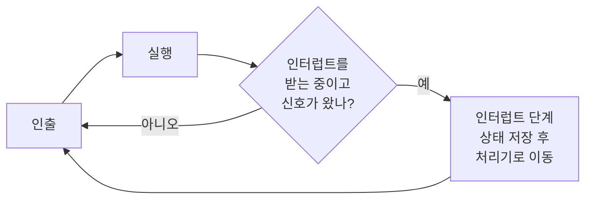
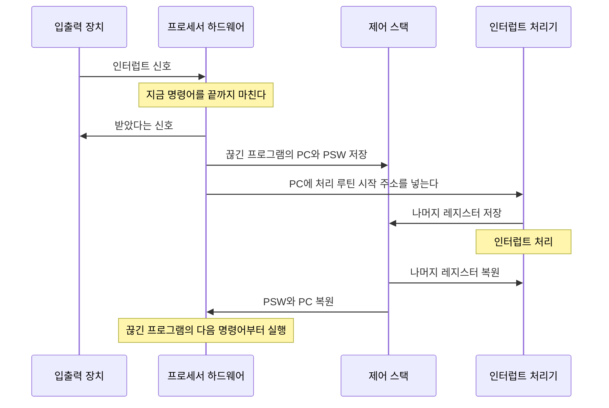



요약

인터럽트는 "다 됐어요" 하고 어깨를 두드리는 신호다. 요리사가 오븐 앞에 서서 빵이 다 구워지기를 지켜보는 대신, 다른 요리를 하다가 타이머가 울리면 그때 오븐으로 간다. 덕분에 느린 장치를 기다리는 동안 프로세서가 놀지 않는다. 대신 언제 끊길지 모르므로, 끊긴 프로그램의 상태를 빠짐없이 저장했다가 그대로 되살려야 한다.

## 예시로 보기

프로그램이 프린터로 글을 보낸다고 하자. 프린터는 프로세서보다 훨씬 느리다. 한 번 쓰고 나면 프린터가 따라올 때까지 명령어 사이클 수천~수백만 번 동안 기다려야 한다[^1].

| | 인터럽트가 없으면 | 인터럽트가 있으면 |
|---|---|---|
| WRITE 호출 뒤 | 입출력 프로그램이 프린터가 끝날 때까지 붙잡고 기다린다. 사용자 프로그램은 그동안 멈춘다 | 입출력 프로그램은 준비와 명령 내리기만 하고 곧바로 돌아온다 |
| 프린터가 일하는 동안 | 프로세서는 아무것도 못 한다 | 사용자 프로그램이 계속 실행된다 |
| 프린터가 끝나면 | 기다리던 입출력 프로그램이 마무리한다 | 프린터 쪽 입출력 모듈이 인터럽트 신호를 보낸다. 프로세서는 하던 일을 잠깐 멈추고 처리 루틴을 실행한 뒤 돌아온다 |

인터럽트는 사용자 프로그램의 아무 명령어 사이에서나 생길 수 있다[^2]. 그래도 사용자 프로그램에는 인터럽트를 위한 코드가 따로 필요 없다. 멈추고 다시 시작하는 일은 프로세서와 운영체제가 맡는다[^3].

입출력이 사용자 프로그램의 다음 WRITE보다 늦게 끝나는 경우가 더 흔하다. 그러면 사용자 프로그램은 두 번째 WRITE에서 다시 기다린다. 그래도 입출력과 계산이 겹치는 구간만큼은 이득이다[^4].

## 정확히 말하면

정의

인터럽트는 입출력 모듈, 메모리 같은 다른 부분이 프로세서의 평소 실행 순서를 끊는 장치다[^1]. 끊으면 프로세서는 지금 명령어를 마친 뒤, 지금 프로그램을 멈추고 인터럽트 처리기(interrupt handler)를 실행한다. 처리기가 끝나면 멈춘 자리부터 다시 실행한다[^5].

인터럽트가 생기는 원인은 네 가지다[^6].

| 종류 | 언제 생기나 |
|---|---|
| 프로그램 | 명령어를 실행한 결과로. 산술 넘침, 0으로 나누기, 잘못된 기계어 실행, 허락되지 않은 메모리 접근 |
| 타이머 | 프로세서 안 타이머가 울릴 때. 운영체제가 정해진 간격마다 일을 할 수 있게 한다 |
| 입출력 | 입출력 장치가 일을 끝냈거나 오류가 났을 때 |
| 하드웨어 고장 | 정전, 메모리 패리티 오류 같은 고장 |

명령어 사이클에는 **인터럽트 단계**가 하나 더 붙는다. 실행 단계가 끝날 때마다 인터럽트 신호가 와 있는지 확인한다[^5].

### 처리 순서

입출력 장치가 일을 마치면 다음 순서로 진행한다[^7]. 1~6은 하드웨어가, 7~9는 소프트웨어(처리기)가 한다.

1. 장치가 프로세서에 인터럽트 신호를 보낸다.
2. 프로세서는 지금 실행 중인 명령어를 끝까지 마친다.
3. 프로세서가 대기 중인 인터럽트를 확인하고, 보낸 장치에 "받았다"는 신호를 보낸다. 장치는 그제야 신호를 내린다.
4. 처리 루틴으로 옮겨 갈 준비를 한다.
5. PC에 처리 루틴의 시작 주소를 넣는다.
6. 이 시점까지 끊긴 프로그램의 PC와 PSW가 제어 스택에 저장되어 있다.
7. 처리기가 인터럽트를 처리한다. 먼저 나머지 레지스터를 저장한다.
8. 처리가 끝나면 저장해 둔 레지스터 값을 스택에서 꺼내 되돌린다.
9. 마지막으로 PSW와 PC를 되돌린다. 끊긴 프로그램이 다음 명령어부터 이어서 실행된다.

위에서 아래로 따라가면 1~6단계는 하드웨어가, 7~9단계는 처리기가 한다. 스택에는 PC·PSW가 먼저 들어가고 나머지 레지스터가 나중에 들어간다. 꺼낼 때는 그 반대 순서다[^s2].

예를 들어 N번지 명령어를 마친 직후에 끊기면, 레지스터 값 전부와 다음 명령어 주소 N + 1(합쳐서 M워드)을 제어 스택에 넣는다. 스택 포인터는 새 맨 위를 가리키고, PC는 처리 루틴의 시작을 가리킨다[^8].

왜 상태를 전부 저장해야 하나

함수 호출은 프로그램이 스스로 부르는 것이라서, 부르기 전에 무엇을 저장할지 프로그램이 정할 수 있다. 인터럽트는 프로그램이 부르지 않았고, 언제 올지도 모른다[^7]. 그래서 처리기가 쓸지도 모르는 레지스터를 모두 저장해야, 끊긴 프로그램은 끊긴 줄도 모르고 이어서 실행된다. 하나라도 빠뜨리면 처리기가 덮어쓴 값을 끊긴 프로그램이 그대로 이어받아 계산이 틀어진다[^s1].

### 인터럽트를 처리하는 중에 또 인터럽트가 오면

예를 들어 통신선으로 데이터를 받으면서 프린터로 출력하는 프로그램은 두 장치에서 번갈아 인터럽트를 받는다[^9]. 두 가지 방법이 있다.

| | 순차 처리 | 중첩 처리 |
|---|---|---|
| 방법 | 처리하는 동안 인터럽트를 막는다(disable). 새 신호는 무시되지 않고 대기하다가, 다시 받기 시작하면 처리된다 | 인터럽트마다 우선순위를 둔다. 더 높은 우선순위의 인터럽트만 지금 처리기를 끊을 수 있다 |
| 좋은 점 | 단순하다. 순서대로 하나씩 처리한다 | 급한 장치(데이터가 금방 덮어써지는 통신선 등)를 먼저 처리할 수 있다 |
| 나쁜 점 | 급한 요청도 앞 처리가 끝날 때까지 기다린다 | 저장·복원이 여러 겹으로 쌓여 복잡하다 |

슬라이드의 중첩 예: 프린터(우선순위 2), 디스크(4), 통신선(5)이 있다[^10].

| 시각 | 일어난 일 | 실행 중 |
|---|---|---|
| 0 | 사용자 프로그램 시작 | 사용자 |
| 10 | 프린터 인터럽트. 사용자 상태를 스택에 넣는다 | 프린터 처리 |
| 15 | 통신 인터럽트(5 > 2). 프린터 처리를 끊고 스택에 넣는다 | 통신 처리 |
| 20 | 디스크 인터럽트(4 < 5). 끊지 못하고 대기한다 | 통신 처리 |
| 25 | 통신 처리 끝. 프린터 처리로 돌아가려는 순간 대기 중인 디스크(4 > 2)가 먼저 들어온다 | 디스크 처리 |
| 35 | 디스크 처리 끝. 프린터 처리로 돌아간다 | 프린터 처리 |
| 40 | 프린터 처리 끝. 사용자 프로그램으로 돌아간다 | 사용자 |

검증: 위 중첩 표와, 같은 요청을 순차 처리했을 때의 표(프린터 10~20, 통신 20~30, 디스크 30~40)를 시뮬레이션으로 재현 — [04_interrupt_verify.py](/Hongs_Blog/studies/operating-systems/code/04_interrupt_verify/)

### 보장하는 것과 보장하지 않는 것

| 보장한다 | 보장하지 않는다 |
|---|---|
| 끊긴 프로그램은 저장된 PC와 레지스터로 정확히 같은 자리, 같은 상태에서 이어진다 | 끊긴 프로그램으로 바로 돌아간다는 것. 여러 프로그램이 있으면 처리기가 끝난 뒤 다른 프로그램이 실행될 수 있다[^11] |
| 명령어 하나는 중간에 끊기지 않는다. 지금 명령어를 마친 뒤에 확인한다 | 인터럽트가 즉시 처리된다는 것. 막혀 있거나 더 높은 우선순위가 처리 중이면 기다린다 |

## 스스로 설명해 보기

1. 처리 순서 2단계: 프로세서는 지금 명령어를 끝까지 마친 뒤 인터럽트를 받는다.
   

근거

   인터럽트 확인은 명령어 사이클의 실행 단계 뒤에 붙은 인터럽트 단계에서 한다. 명령어 중간에는 확인하는 자리가 없다.
   

2. 처리 순서 6단계: PC와 PSW를 저장한다.
   

근거

   PC가 없으면 어디서 이어야 할지 모른다. PSW가 없으면 조건 코드와 모드 비트가 처리기 것으로 바뀐 채 돌아간다. 둘 다 처리기로 넘어가는 순간 바뀌므로, 바뀌기 전에 하드웨어가 저장한다.
   

3. 시각 25에서 디스크가 프린터보다 먼저 실행된다.
   

근거

   통신 처리기가 끝나 스택에서 프린터 처리기를 꺼내려는 순간, 다시 인터럽트 단계에서 대기 중인 요청을 확인한다. 디스크(4)가 프린터(2)보다 높으므로 프린터 처리기는 명령어 하나도 실행하지 못한 채 다시 끊긴다.
   

- 인터럽트의 핵심 아이디어는?
  

답

  기다리는 쪽(프로세서)이 계속 확인하는 대신, 끝난 쪽(장치)이 알려 준다. 알리는 순간에 끼어들 수 있도록 상태를 저장하고 복원하는 장치를 하드웨어에 넣는다.
  

- 같은 생각을 쓰는 다른 곳은?
  

답

  운영체제가 타이머 인터럽트로 정해진 시간마다 프로세서를 되찾는 [시분할](/Hongs_Blog/studies/operating-systems/time-sharing/). 프로그래밍에서는 이벤트가 오면 불리는 콜백 함수가 같은 생각이다.
  

## 활용

- 운영체제가 프로세서를 되찾는 통로다. 사용자 프로그램이 프로세서를 쥐고 있어도 타이머 인터럽트가 오면 운영체제 코드가 실행된다. [시분할](/Hongs_Blog/studies/operating-systems/time-sharing/)이 이것으로 돌아간다.
- [입출력 기법](/Hongs_Blog/studies/operating-systems/io-techniques/) 가운데 인터럽트 구동 입출력과 DMA가 이것을 쓴다.
- 인터럽트로 기다림을 없애도, 프로그램이 하나뿐이면 결국 그 프로그램이 입출력을 기다리며 멈춘다. 그래서 프로그램 여러 개를 올려 두고 번갈아 실행하는 [다중 프로그래밍](/Hongs_Blog/studies/operating-systems/multiprogramming/)이 필요해진다[^11].

## 연결

- 선수: [명령어 사이클](/Hongs_Blog/studies/operating-systems/instruction-cycle/), [프로세서 레지스터](/Hongs_Blog/studies/operating-systems/processor-registers/)
- 저장할 상태 묶음이 나중에 프로세스의 실행 문맥이 된다: [프로세스](/Hongs_Blog/studies/operating-systems/process/)

## 자주 하는 오해

"인터럽트가 오면 프로세서는 하던 명령어를 그 자리에서 버리고 처리기로 간다"

틀렸다. 갑자기 끊는다는 이름 때문에 명령어 한가운데서 끊기는 것처럼 들린다. 실제로는 지금 명령어를 끝까지 마친 뒤 인터럽트 단계에서 확인한다(처리 순서 2단계). 확인하는 방법: 명령어 사이클 그림에서 인터럽트 확인은 실행 단계 뒤에만 있다.

"인터럽트 처리가 끝나면 항상 끊긴 프로그램으로 돌아간다"

틀렸다. 프로그램이 하나뿐인 그림만 보면 그렇게 보인다. 여러 프로그램이 메모리에 있으면, 처리기가 끝난 뒤 우선순위나 입출력 대기 여부에 따라 다른 프로그램이 실행될 수 있다[^11]. 끊긴 프로그램의 상태는 저장되어 있으므로 나중에 차례가 오면 그대로 이어진다.

## 확인 문제

<b>C1</b> 인터럽트의 네 가지 종류와 각각의 예를 하나씩 쓰라.

**답:** 프로그램(0으로 나누기, 허락되지 않은 메모리 접근), 타이머(정해진 간격마다 울림), 입출력(장치 작업 완료나 오류), 하드웨어 고장(정전, 메모리 패리티 오류).

<b>C2</b> 함수 호출과 달리 인터럽트는 레지스터를 전부 저장해야 하는 이유는?

**답:** 함수 호출은 프로그램이 정한 자리에서 일어나므로 무엇을 저장할지 미리 정할 수 있다. 인터럽트는 아무 명령어 사이에서나, 프로그램이 모르게 일어난다. 처리기가 어떤 레지스터를 쓸지 모르니 모두 저장해야 끊긴 프로그램이 같은 상태로 이어진다. 
**흔한 오답:** "인터럽트가 더 중요해서". 중요도가 아니라 예측할 수 없다는 점이 이유다.

<b>C3</b> 프린터 처리기가 실행 중일 때 통신 인터럽트가 왔다. 순차 처리와 중첩 처리에서 통신 처리는 각각 언제 시작되는가? 슬라이드 예의 시각을 쓰라.

**답:** 중첩 처리: 통신(5)이 프린터(2)보다 높으므로 도착한 시각 15에 바로 시작한다. 순차 처리: 인터럽트가 막혀 있으므로 프린터 처리가 끝나는 시각 20까지 기다린다.

<b>C4</b> 슬라이드 중첩 예에서 시각 22에 제어 스택에는 무엇이 쌓여 있는가? (아래부터)

**답:** 맨 아래 사용자 프로그램의 상태, 그 위에 프린터 처리기의 상태. 실행 중인 것은 통신 처리기다. 디스크 요청은 스택이 아니라 대기 상태로 있다. 
**흔한 오답:** 디스크 처리기를 스택에 넣는 것. 디스크는 아직 시작하지도 않았으므로 저장할 상태가 없다.

<b>C5</b> 중첩 처리, 사용자 프로그램이 t=0에 시작. 디스크(우선순위 4) t=5 도착 처리 8, 프린터(2) t=7 도착 처리 4, 통신(5) t=9 도착 처리 3. 사용자 프로그램으로 돌아오는 시각은? 구간별로 누가 실행되는지 쓰라.

**답:** 0–5 사용자, 5–9 디스크, 9–12 통신, 12–16 디스크, 16–20 프린터, 20부터 사용자. 돌아오는 시각은 20이다. 
**이유:** t=7의 프린터(2)는 디스크(4)를 끊지 못해 대기한다. t=9의 통신(5)은 디스크를 끊는다. 디스크는 남은 4를 12–16에 마친다.

[^1]: 운영체제 1회 강의 자료 「Chapter01-new」, 슬라이드 24와 발표자 노트
[^2]: 같은 자료, 슬라이드 27 (그림 1.5)과 발표자 노트
[^3]: 같은 자료, 슬라이드 28 발표자 노트
[^4]: 같은 자료, 슬라이드 30~31 (그림 1.8, 1.9)과 발표자 노트
[^5]: 같은 자료, 슬라이드 29 (그림 1.7)와 발표자 노트
[^6]: 같은 자료, 슬라이드 25 (표 1.1)
[^7]: 같은 자료, 슬라이드 32 (그림 1.10)와 발표자 노트
[^8]: 같은 자료, 슬라이드 33 (그림 1.11)과 발표자 노트
[^9]: 같은 자료, 슬라이드 34와 발표자 노트
[^10]: 같은 자료, 슬라이드 37 (그림 1.12)과 발표자 노트
[^11]: 같은 자료, 슬라이드 38
[^s1]: 보충 함수 호출과의 비교, 중첩 처리의 좋은 점으로 든 통신선 예, 콜백 함수와의 비교, 레지스터를 빠뜨렸을 때 생기는 일, "보장하지 않는 것" 표의 두 번째 줄은 원본의 "인터럽트는 프로그램이 부르는 루틴이 아니다"(슬라이드 32 노트)를 풀어 쓴 것이다. 확인 문제 C4·C5는 원본 예를 바꾼 문항이다.
[^s2]: 보충 다이어그램 1개는 원본에 없다. "처리 순서" 절의 1~9단계(슬라이드 32, 그림 1.10)를 순서도로 옮겨 그렸다.

