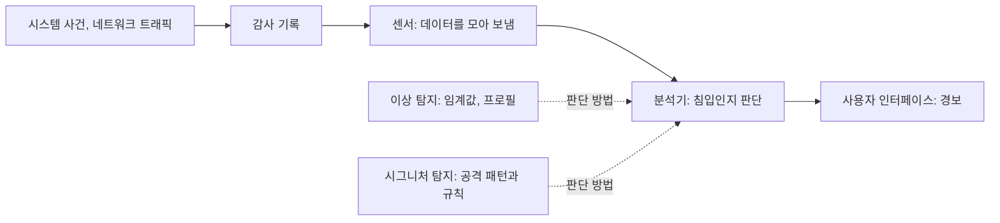



요약

침입 탐지는 문을 잠그는 것(인증, 접근 제어)이 뚫렸을 때를 대비해, 시스템에서 일어나는 일을 지켜보다가 침입으로 보이면 경보를 울리는 일이다. 건물의 방범 카메라처럼, 평소와 다른 행동을 알아채거나(이상 탐지) 알려진 범죄 수법과 같은 행동을 찾아낸다(시그니처 탐지). 일찍 찾으면 피해를 줄이고, 감시한다는 것 자체가 억제가 된다. 하지만 정상 사용자를 침입자로 잘못 잡거나(오탐), 침입을 놓치는 것(미탐) 사이에서 균형을 잡아야 한다.

## 예시로 보기

사용자 hong은 평소 평일 낮에만 로그인하고, 하루에 파일을 수십 개 읽는다. 어느 날 새벽 3시에 hong 계정으로 로그인해 한 시간에 파일 수천 개를 읽었다[^s1].

- **이상 탐지**는 hong의 평소 행동 프로필과 비교해 "평소와 너무 다르다"고 경보를 울린다. 처음 보는 공격도 잡을 수 있지만, hong이 정말 밤샘 작업을 했다면 오탐이다.
- **시그니처 탐지**는 알려진 공격 패턴(예: 비밀번호 파일을 읽은 뒤 권한 상승 명령 실행)과 맞는지 본다. 알려진 공격은 정확히 잡지만 새 수법은 놓친다.

## 정확히 말하면

정의

**보안 침입**은 침입자가 허락 없이 시스템에 접근하는 보안 사건이다. **침입 탐지**는 시스템 사건을 감시하고 분석해 침입을 찾아내고 경보를 주는 보안 서비스다[^1].

| 종류 | 감시 대상 |
|---|---|
| 호스트 기반 | 호스트 하나의 활동. 외부 침입과 내부 침입을 모두 찾을 수 있다. 네트워크 기반 IDS나 방화벽으로는 할 수 없는 일이다[^2] |
| 네트워크 기반 | 네트워크 트래픽과 장치를 중앙에서 감시한다 |

**구성 요소.**[^3] 센서(데이터를 모아 분석기로 보냄), 분석기(침입이 일어났는지 판단), 사용자 인터페이스.

**행동 프로필.** 침입자의 행동과 정당한 사용자의 행동은 겹치는 부분이 있다. 겹친 구간 때문에, 침입자를 잡으려고 기준을 낮추면 정상 사용자를 잘못 잡고(오탐), 기준을 높이면 침입자를 놓친다(미탐)(그림 15.8)[^4].

**호스트 기반 IDS의 탐지 방법**[^5]

| 방법 | 내용 |
|---|---|
| 이상 탐지 | 정당한 사용자의 행동 데이터를 시간에 걸쳐 모으고, 통계로 관찰된 행동이 정당한 것인지 판단한다. **임계값 탐지**(사용자와 무관하게 사건 횟수의 기준을 정함)와 **프로필 기반 탐지**(사용자마다 활동 프로필을 만들어 변화를 찾음)가 있다 |
| 시그니처 탐지 | 침입자가 쓰는 공격 패턴이나 규칙을 정의해 두고, 주어진 행동이 침입자의 것인지 판단한다 |

**감사 기록.** IDS의 입력이 되는 사용자 활동 기록이다[^6].

| 종류 | 내용 |
|---|---|
| 기본 감사 기록 | 거의 모든 다중 사용자 운영체제의 계정 관리 소프트웨어가 모으는 기록. 따로 모을 소프트웨어가 필요 없지만, 필요한 정보가 없거나 쓰기 불편한 형태일 수 있다 |
| 탐지 전용 감사 기록 | IDS에 필요한 정보만 담은 기록을 따로 만든다. 운영체제와 무관하게 만들 수 있지만, 기록 장치가 둘이라 부담이 든다 |

데이터는 왼쪽에서 오른쪽으로 흐른다. 분석기가 판단할 때 쓰는 방법이 두 갈래이고, 어느 쪽이든 결과는 사용자 인터페이스의 경보로 나온다[^s2].

## 활용

- 리눅스의 `auditd`는 시스템 호출과 파일 접근을 감사 기록으로 남기고, 호스트 기반 IDS(예: OSSEC, Wazuh)가 이를 분석한다[^s1].
- 봇넷을 막는 주된 방법도 IDS로 구축 단계에서 찾아내는 것이다 → [악성 코드 대응](/Hongs_Blog/studies/operating-systems/malware-countermeasures/)

## 연결

- 선수: [보안의 목표와 위협](/Hongs_Blog/studies/operating-systems/security-goals-threats/) (침입자의 세 부류), [사용자 인증](/Hongs_Blog/studies/operating-systems/user-authentication/)
- 오탐과 미탐의 맞바꿈은 확률과 통계의 1종·2종 오류와 같은 구조다[^s1].

## 확인 문제

<b>C1</b> 지금까지 한 번도 본 적 없는 새 공격 수법을 잡을 가능성이 있는 것은 이상 탐지와 시그니처 탐지 중 무엇인가? 이유는?

**답:** 이상 탐지. 공격 패턴을 미리 알 필요 없이, 정상 행동에서 벗어나는 것을 찾기 때문이다. 시그니처 탐지는 이미 정의한 패턴과 맞는 것만 찾는다.

<b>C2</b> 침입 탐지에서 오탐과 미탐을 둘 다 0으로 만들 수 없는 이유를 행동 프로필로 설명하라.

**답:** 침입자의 행동과 정당한 사용자의 행동 분포가 겹친다. 겹친 구간의 행동은 둘 중 누구의 것일 수도 있다. 기준을 어디에 두든 겹친 구간 일부가 반대편으로 잘못 분류되므로, 오탐을 줄이면 미탐이 늘고 미탐을 줄이면 오탐이 는다.

<b>C3</b> 내부 직원이 자기 컴퓨터에서 권한 밖 파일을 뒤진다. 네트워크 기반 IDS와 호스트 기반 IDS 중 무엇이 잡기 쉬운가?

**답:** 호스트 기반. 이 행동은 네트워크 트래픽에 드러나지 않고 그 호스트 안에서 일어난다. 호스트 기반 IDS는 그 호스트의 파일 접근과 시스템 호출을 직접 감시한다.

[^1]: 3-1학기/운영체제/1.수업자료/15.Chapter15-new.pptx, 슬라이드 27
[^2]: 같은 자료, 슬라이드 28과 슬라이드 30의 발표자 노트
[^3]: 같은 자료, 슬라이드 29
[^4]: 같은 자료, 슬라이드 30 (그림 15.8)
[^5]: 같은 자료, 슬라이드 31과 슬라이드 30의 발표자 노트
[^6]: 같은 자료, 슬라이드 32와 슬라이드 31의 발표자 노트
[^s1]: 에이전트 보충. hong 계정 예시, 오탐·미탐 용어와 1종·2종 오류 연결, 임계값·프로필 탐지의 풀이, 탐지 전용 감사 기록의 단점, auditd·OSSEC 예, 확인 문제는 Stallings 6판 15.3절과 일반 지식을 바탕으로 보탰다.
[^s2]: 에이전트 보충. 다이어그램 1개는 원본에 없다. 구성 요소(슬라이드 29), 탐지 방법 표(슬라이드 30~31), 감사 기록(슬라이드 31~32)을 한 흐름도로 이었다.

