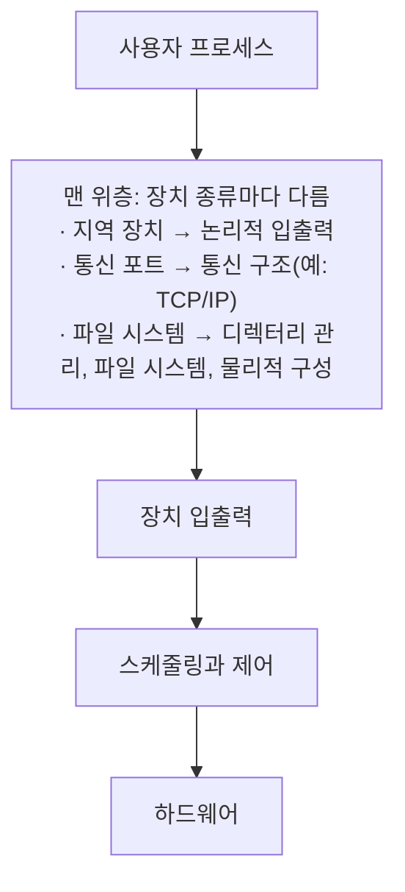


<div class="callout callout-summary" markdown="1">
<div class="callout-title callout-title--default" markdown="span">요약</div>

입출력은 운영체제에서 가장 다루기 어려운 부분이다. 키보드는 1초에 몇 글자를 보내고 디스크는 1초에 수억 바이트를 보내는 등 장치마다 속도, 다루는 법, 오류의 모양이 제각각이다. 운영체제는 층을 나눠 장치의 세부를 아래층에 숨기고, 위층에는 열기·읽기·쓰기 같은 똑같은 인터페이스를 보여 준다. 그래도 장치마다 차이가 너무 커서 완전히 똑같이 다루지는 못한다.

</div>


## 예시로 보기

장치는 누구와 이야기하느냐로 세 무리로 나뉜다[^1].

| 무리 | 상대 | 예 |
|---|---|---|
| 사람이 읽는 장치 | 사용자 | 프린터, 터미널, 화면, 키보드, 마우스 |
| 기계가 읽는 장치 | 전자 장비 | 디스크, USB 메모리, 센서, 컨트롤러, 구동기 |
| 통신 장치 | 멀리 있는 장치 | 디지털 회선 드라이버, 모뎀 |

이 장치들은 여섯 가지에서 다르다[^2].

| 차이 | 예 |
|---|---|
| 데이터 속도 | 키보드와 기가비트 이더넷 사이에 수백만 배 차이가 난다(그림 11.1) |
| 쓰임 | 파일을 담는 디스크는 파일 관리 소프트웨어가, 가상 메모리 페이지를 담는 디스크는 특수 하드웨어·소프트웨어가 필요하다. 관리자 터미널은 우선순위가 높을 수 있다 |
| 제어의 복잡도 | 프린터는 단순하고 디스크는 훨씬 복잡하다. 장치를 맡은 입출력 모듈이 복잡함을 일부 걸러 준다 |
| 전송 단위 | 바이트나 문자의 흐름(터미널), 또는 큰 블록(디스크) |
| 데이터 표현 | 문자 코드, 패리티 규칙 등이 장치마다 다르다 |
| 오류 | 오류를 알리는 방식, 결과, 대응 방법이 장치마다 크게 다르다 |

## 정확히 말하면

### 입출력 기능의 발전

| 단계 | 내용 |
|---|---|
| 1 | 프로세서가 주변 장치를 직접 제어한다 |
| 2 | 컨트롤러(입출력 모듈)가 생긴다. 프로세서는 인터럽트 없이 프로그램 입출력을 쓰지만, 장치의 세부는 몰라도 된다 |
| 3 | 입출력 모듈이 인터럽트를 쓴다. 프로세서가 입출력을 기다리며 시간을 쓰지 않아 효율이 오른다 |
| 4 | DMA. 데이터 블록이 프로세서를 거치지 않고 메모리로 옮겨진다. 프로세서는 시작과 끝에만 관여한다 |
| 5 | 입출력 모듈이 별도 프로세서가 된다. 프로세서는 입출력 프로세서에게 주기억장치에 있는 입출력 프로그램을 실행하라고 지시한다 |
| 6 | 입출력 모듈이 자기 지역 메모리를 가진다. 대화형 터미널 여러 대와의 통신을 맡는 데 흔히 쓴다 |

이 표는 슬라이드 16~18을 정리한 것이다[^3]. 단계 1~4는 [입출력 기법](/Hongs_Blog/studies/operating-systems/io-techniques/)에서 본 세 기법의 순서와 같다.

**DMA 배치.** DMA 모듈은 여러 방식으로 붙는다[^4]. 모든 모듈이 시스템 버스 하나를 함께 쓰면 단순하지만, 워드 하나 옮길 때마다 버스를 두 번 쓴다. DMA와 입출력 모듈 사이에 직접 길을 두면 버스 사이클이 크게 준다. 입출력 전용 버스를 두면 DMA 모듈의 입출력 인터페이스 수가 준다.

```
(가) 모든 모듈이 시스템 버스 하나를 함께 씀
 프로세서     DMA      입출력 모듈    메모리
     |         |            |            |
 ====+=========+============+============+==== 시스템 버스

(나) DMA와 입출력 모듈 사이에 직접 길
 프로세서     DMA ------ 입출력 모듈  메모리
     |         |                         |
 ====+=========+=========================+==== 시스템 버스

(다) 입출력 전용 버스
 프로세서     DMA                     메모리
     |         |                         |
 ====+=========+=========================+==== 시스템 버스
               |
          =====+========+===========+=== 입출력 버스
                        |           |
                   입출력 모듈 입출력 모듈
```

(가)에서는 DMA가 입출력 모듈에서 워드를 받을 때와 메모리에 쓸 때 모두 시스템 버스를 지난다. (나)와 (다)에서는 입출력 모듈 쪽 길이 시스템 버스 밖으로 빠져서 시스템 버스는 메모리 쪽 한 번만 쓴다[^s1].

### 설계 목표

| 목표 | 내용 |
|---|---|
| 효율 | 입출력 장치는 주기억장치보다 아주 느리다. 다중 프로그래밍으로 일부 프로세스가 입출력을 기다리는 동안 다른 프로세스를 실행한다. 그래도 입출력이 프로세서를 따라가지 못해 준비된 프로세스를 들이려고 스와핑을 하는데, 스와핑 자체가 입출력이다[^5] |
| 일반성 | 단순하고 오류가 적도록 모든 장치를 같은 방식으로 다루고 싶다. 장치 세부는 아래층 루틴에 숨긴다. 완전히 일반화하기는 어렵지만 층을 나눈 모듈 설계로 상당 부분 할 수 있다[^6] |

### 층 구조

각 층은 바로 아래층에 더 원시적인 일을 맡기고 바로 위층에 서비스를 준다. 한 층을 바꿔도 다른 층은 바뀌지 않아야 한다[^7]. 장치 종류에 따라 맨 위층이 다르다[^8].



| 층 | 하는 일 |
|---|---|
| 논리적 입출력 | 장치를 논리적 자원으로 다룬다. 프로세스는 장치 식별자와 열기·닫기·읽기·쓰기 같은 단순한 명령만 쓴다 |
| 장치 입출력 | 요청을 입출력 명령어, 채널 명령, 컨트롤러 지시의 순서로 바꾼다. 버퍼링으로 이용률을 높이기도 한다 |
| 스케줄링과 제어 | 입출력 연산의 큐 관리와 스케줄링, 인터럽트 처리, 상태 수집을 실제로 한다. 장치와 직접 주고받는 층이다 |
| 디렉터리 관리 (파일 시스템) | 기호로 된 파일 이름을 파일을 가리키는 식별자로 바꾼다 |
| 파일 시스템 | 파일의 논리적 구조와 열기·닫기·읽기·쓰기 같은 연산, 접근 권한을 다룬다 |
| 물리적 구성 | 파일과 레코드를 2차 기억장치의 물리 주소로 바꾼다 |

이 표는 슬라이드 27~29와 발표자 노트를 정리한 것이다[^8].

## 활용

- UNIX와 리눅스에서는 장치마다 특수 파일(`/dev/sda` 같은)이 있다. 장치에 읽고 쓰는 것은 그 특수 파일에 읽고 쓰는 것과 같아, 사용자와 프로세스에게 깔끔하고 통일된 인터페이스를 준다[^9]. 리눅스는 블록 장치, 문자 장치, 네트워크 장치를 구별한다[^10].
- Windows는 입출력 관리자가 모든 입출력을 맡고, 모든 종류의 드라이버가 부를 수 있는 같은 인터페이스를 준다. 성능을 위해 가능하면 비동기 입출력을 쓴다[^11].

## 연결

- 선수: [입출력 기법](/Hongs_Blog/studies/operating-systems/io-techniques/), [운영체제의 역할](/Hongs_Blog/studies/operating-systems/os-role/) (입출력 장치 접근 서비스)
- 다음: [입출력 버퍼링](/Hongs_Blog/studies/operating-systems/io-buffering/), [디스크 스케줄링](/Hongs_Blog/studies/operating-systems/disk-scheduling/)
- 층 구조는 2장 운영체제 설계 계층과 같은 생각이다 → [마이크로커널](/Hongs_Blog/studies/operating-systems/microkernel/)

## 확인 문제

<details markdown="1"><summary markdown="span"><b>C1</b> 입출력 장치의 세 무리와 장치끼리 다른 여섯 가지 중 넷을 쓰라.</summary>


**답:** 무리: 사람이 읽는 장치, 기계가 읽는 장치, 통신 장치. 차이: 데이터 속도, 쓰임, 제어의 복잡도, 전송 단위, 데이터 표현, 오류 조건 중 넷.

</details>

<details markdown="1"><summary markdown="span"><b>C2</b> 입출력을 층으로 나누는 이유는? 프린터를 새 모델로 바꿀 때 어느 층만 바뀌어야 하는가?</summary>


**답:** 한 층을 바꿔도 다른 층이 바뀌지 않게 하려는 것이다. 새 프린터는 장치와 직접 주고받는 아래층(장치 입출력, 스케줄링과 제어, 즉 드라이버 쪽)만 바뀌고, 응용이 쓰는 논리적 입출력(열기·쓰기)은 그대로여야 한다.

</details>

<details markdown="1"><summary markdown="span"><b>C3</b> 입출력 기능 발전의 4단계(DMA)와 5단계(입출력 프로세서)는 프로세서가 맡기는 일의 크기가 어떻게 다른가?</summary>


**답:** DMA에는 블록 하나의 전송(읽기·쓰기, 주소, 시작 위치, 워드 수)을 맡긴다. 입출력 프로세서에는 주기억장치에 있는 입출력 **프로그램** 전체를 맡겨, 여러 전송과 판단을 프로세서 개입 없이 처리하게 한다.

</details>

[^1]: 운영체제 11회 강의 자료 「Chapter11-new」, 슬라이드 3~6
[^2]: 같은 자료, 슬라이드 7~13 (그림 11.1)
[^3]: 같은 자료, 슬라이드 16~18
[^4]: 같은 자료, 슬라이드 19~22 (그림 11.2, 11.3)
[^5]: 같은 자료, 슬라이드 24
[^6]: 같은 자료, 슬라이드 25
[^7]: 같은 자료, 슬라이드 26
[^8]: 같은 자료, 슬라이드 27~29 (그림 11.4)와 발표자 노트
[^9]: 같은 자료, 슬라이드 73과 슬라이드 71의 발표자 노트
[^10]: 같은 자료, 슬라이드 80
[^11]: 같은 자료, 슬라이드 86~88
[^s1]: <span class="fn-tag" title="수업 자료에 없고 따로 보탠 내용">보충</span> 다이어그램 1개는 원본에 없다. "DMA 배치" 문단(슬라이드 19~22, 그림 11.2, 11.3)의 세 방식을 ASCII로 그렸다.

