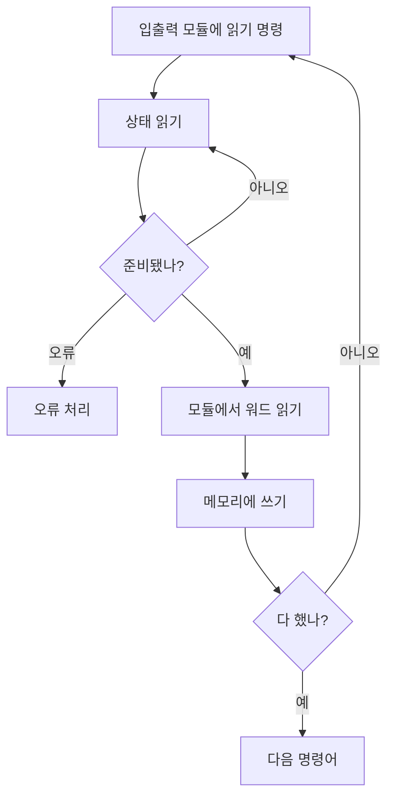



요약

프로세서가 입출력 장치와 데이터를 주고받는 방법은 세 가지다. 택배를 기다리는 일에 비유하면, 현관에 서서 계속 내다보기(프로그램 입출력), 초인종이 울리면 나가 한 상자씩 받기(인터럽트 구동 입출력), 관리인에게 "다 받아서 방에 넣어 주세요"라고 맡기고 끝나면 연락받기(DMA)다. 뒤로 갈수록 프로세서가 다른 일을 할 시간이 늘어난다. 대신 장치 쪽에 하드웨어가 더 필요하다.

## 예시로 보기

디스크에서 1,000워드를 읽어 주기억장치에 넣는다고 하자. 세 방식에서 프로세서가 하는 일을 세어 보면 차이가 보인다[^s1].

| | 프로그램 입출력 | 인터럽트 구동 입출력 | DMA |
|---|---|---|---|
| 기다리는 동안 | 상태를 계속 확인하며 붙잡혀 있다 | 다른 일을 한다 | 다른 일을 한다 |
| 프로세서가 끼어드는 횟수 | 워드마다 확인하고 옮긴다 | 워드마다 인터럽트를 받아 옮긴다(1,000번) | 시작할 때 명령 1번, 끝날 때 인터럽트 1번 |
| 데이터가 지나는 길 | 장치 → 프로세서 → 메모리 | 장치 → 프로세서 → 메모리 | 장치 → 메모리 (프로세서를 거치지 않음) |

택배 비유는 기다리는 방식의 차이만 보여 준다. 실제로는 "한 상자"가 워드 하나이고, 인터럽트 구동 방식에서도 프로세서가 그 워드를 직접 옮긴다는 점이 다르다.

## 정확히 말하면

프로세서는 입출력 관련 명령어를 만나면 해당 입출력 모듈에 명령을 내린다. 그다음이 세 가지로 갈린다[^1].

**프로그램 입출력(programmed I/O).** 입출력 모듈은 요청받은 일을 하고 상태 레지스터의 비트를 바꾸지만, 프로세서에게 알리지는 않는다. 인터럽트를 쓰지 않으므로 프로세서가 상태를 주기적으로 확인해서 끝났는지 알아낸다[^2]. 이때 쓰는 명령어는 세 종류다[^3].

| 종류 | 하는 일 |
|---|---|
| 제어 | 장치를 켜고 할 일을 알려 준다. 예: 테이프를 되감아라 |
| 상태 | 입출력 모듈과 장치의 상태를 확인한다 |
| 전송 | 프로세서 레지스터와 장치 사이에서 데이터를 읽고 쓴다 |

한 워드를 읽을 때마다 "준비됐나?"를 묻는 반복을 돈다. 그동안 프로세서는 쓸데없이 바쁘다[^4].

**인터럽트 구동 입출력(interrupt-driven I/O).** 프로세서는 명령을 내리고 다른 일을 하러 간다. 입출력 모듈이 데이터를 주고받을 준비가 되면 인터럽트로 알린다. 프로세서는 그때 데이터를 옮기고 하던 일로 돌아간다[^5]. 쓸데없는 기다림은 없앴지만, 모든 워드가 여전히 프로세서를 거쳐야 하므로 프로세서 시간을 많이 쓴다[^6].

**직접 메모리 접근(DMA).** 많은 양을 옮길 때 쓴다. 시스템 버스에 붙은 별도 모듈(DMA 모듈)이 맡는다. 입출력 모듈 안에 들어 있을 수도 있다. 프로세서는 DMA 모듈에 네 가지를 알려 준다[^7].

1. 읽기인지 쓰기인지
2. 관련된 입출력 장치의 주소
3. 읽거나 쓸 메모리의 시작 위치
4. 읽거나 쓸 워드 수

그다음 DMA 모듈이 블록 전체를 한 워드씩, 프로세서를 거치지 않고 메모리와 직접 주고받는다. 다 끝나면 인터럽트를 한 번 보낸다. 프로세서는 시작과 끝에만 관여한다[^8].

## 활용

- 디스크나 네트워크처럼 한 번에 많은 데이터를 옮기는 장치는 DMA를 쓴다. 키보드처럼 드문드문 몇 바이트씩 오는 장치에는 인터럽트 구동 방식으로도 충분하다[^s1].
- DMA는 프로세서와 캐시를 거치지 않고 메모리를 바꾸거나 읽는다. 그래서 [캐시 메모리](/Hongs_Blog/studies/operating-systems/cache-memory/)의 쓰기 정책과 부딪힐 수 있다.
- 입출력 동안 프로세서가 다른 일을 할 수 있어야 [다중 프로그래밍](/Hongs_Blog/studies/operating-systems/multiprogramming/)이 의미가 있다.

## 연결

- 선수: [인터럽트](/Hongs_Blog/studies/operating-systems/interrupt/)
- 11장 "입출력 관리와 디스크 스케줄링"에서 다시 자세히 다룬다.

## 확인 문제

<b>C1</b> 세 입출력 기법을 "기다리는 동안 프로세서가 무엇을 하는가"와 "데이터가 프로세서를 거치는가"로 구별하라.

**답:** 프로그램 입출력: 상태를 계속 확인하며 붙잡혀 있다. 데이터는 프로세서를 거친다. 인터럽트 구동: 다른 일을 한다. 데이터는 프로세서를 거친다. DMA: 다른 일을 한다. 데이터는 프로세서를 거치지 않는다. 
**흔한 오답:** "인터럽트 구동 방식이면 데이터가 장치에서 메모리로 바로 간다". 그것은 DMA다.

<b>C2</b> 프로세서가 DMA 모듈에 블록 전송을 맡길 때 알려 주는 네 가지는?

**답:** 읽기·쓰기 구분, 입출력 장치의 주소, 메모리의 시작 위치, 옮길 워드 수.

<b>C3</b> 인터럽트 구동 입출력이 프로그램 입출력보다 낫는데도 큰 데이터에는 DMA가 필요한 이유는?

**답:** 인터럽트 구동 방식은 기다림은 없앴지만, 워드 하나하나를 프로세서가 직접 옮기고 그때마다 인터럽트를 처리한다. 데이터가 크면 이 처리에 프로세서 시간이 많이 든다. DMA는 옮기는 일 자체를 맡겨서 프로세서는 시작과 끝에만 관여한다.

[^1]: 3-1학기/운영체제/1.수업자료/01.Chapter01-new.pptx, 슬라이드 56
[^2]: 같은 자료, 슬라이드 57과 슬라이드 55의 발표자 노트
[^3]: 같은 자료, 슬라이드 58과 슬라이드 56의 발표자 노트
[^4]: 같은 자료, 슬라이드 59 (그림 1.19a)와 슬라이드 57의 발표자 노트
[^5]: 같은 자료, 슬라이드 60
[^6]: 같은 자료, 슬라이드 61과 슬라이드 59의 발표자 노트
[^7]: 같은 자료, 슬라이드 62와 슬라이드 60의 발표자 노트
[^8]: 같은 자료, 슬라이드 63 (그림 1.19c)과 슬라이드 61의 발표자 노트
[^s1]: 에이전트 보충. 1,000워드 비교표, 택배 비유, 장치별 쓰임새(디스크·네트워크는 DMA, 키보드는 인터럽트)는 원본에 없다. 쓰임새는 원본의 "많은 양을 옮길 때 DMA"(슬라이드 62)를 장치에 대어 본 것이다.

