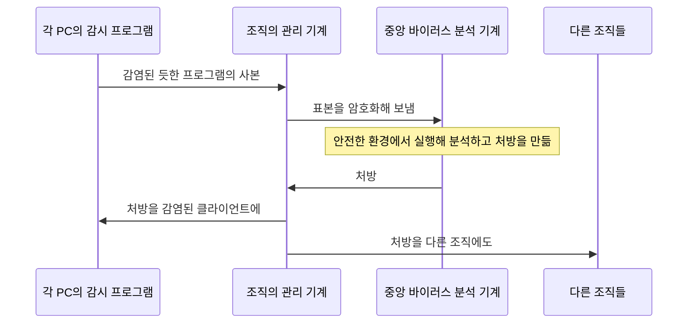



요약

악성 코드를 아예 들이지 않는 것이 가장 좋지만 대부분 불가능하다. 그래서 들어온 것을 찾고(탐지), 무엇인지 알아내고(식별), 없앤다(제거). 모양을 바꾸는 바이러스는 가짜 컴퓨터 안에서 잠깐 실행시켜 정체를 드러내게 하고, 처음 보는 악성 코드는 하는 짓(행동)을 보고 막는다. 공격자도 계속 바뀌므로, 새 변종에 얼마나 빨리 대응하느냐가 관건이다.

## 예시로 보기

다형성 바이러스는 감염할 때마다 암호화 키를 바꿔 겉모양이 매번 다르다. 고정 문자열로는 찾을 수 없다. 하지만 실행되려면 어차피 자기를 풀어야(복호화) 한다. 그래서 백신은 파일을 진짜 프로세서가 아닌 소프트웨어 가짜 프로세서(에뮬레이터)에서 잠깐 실행시키고, 바이러스가 스스로 풀려 본모습이 나타나면 그때 시그니처로 찾는다. 이것이 일반 복호화다[^1].

## 정확히 말하면

이상적인 방법은 예방, 곧 바이러스를 시스템에 들이지 않는 것이다. 많은 경우 불가능하므로 다음으로 좋은 방법은 탐지, 식별, 제거다[^2].

**일반 복호화(GD).** 복잡한 다형성 바이러스도 빠른 검사 속도를 유지하며 찾는다. 세 요소로 이루어진다[^1].

| 요소 | 하는 일 |
|---|---|
| CPU 에뮬레이터 | 소프트웨어로 만든 가상 컴퓨터. 실행 파일의 명령어를 진짜 프로세서 대신 해석한다. 바이러스가 실제 시스템에 해를 끼치지 못한다 |
| 바이러스 시그니처 스캐너 | 대상 코드에서 알려진 바이러스 시그니처를 찾는다 |
| 에뮬레이션 제어 모듈 | 대상 코드의 실행을 조절한다(언제 멈추고 검사할지) |

**디지털 면역 시스템.** IBM이 개발하고 Symantec이 다듬은 종합 대응이다. 새 바이러스가 들어오자마자 대응하는 빠른 응답이 목표다[^3]. 흐름은 다음과 같다[^4].

1. 각 PC의 감시 프로그램이 행동, 수상한 프로그램 변경, 계열 시그니처로 바이러스를 짐작하고, 감염된 듯한 프로그램의 사본을 조직의 관리 기계로 보낸다.
2. 관리 기계가 표본을 암호화해 중앙 바이러스 분석 기계로 보낸다.
3. 분석 기계는 감염 프로그램을 안전하게 실행하는 환경을 만들어 분석하고 처방(탐지·제거 방법)을 만든다.
4. 처방이 관리 기계를 거쳐 감염된 클라이언트와 다른 조직들에 퍼진다.

표본은 오른쪽 중앙 분석 기계로 가고, 처방은 관리 기계를 거쳐 돌아온다. 분석은 중앙에서 한 번만 하고, 그 결과를 표본을 보내지 않은 조직까지 함께 받는다[^s2].

**행동 차단 소프트웨어.** 운영체제와 결합해 프로그램의 행동을 실시간으로 감시하고 악의적인 행동을 막는다[^5]. 감시하는 행동의 예: 파일 열기·보기·지우기·고치기 시도, 디스크 포맷 같은 위험한 연산, 실행 파일·매크로 변경, 중요한 시스템 설정 변경. 관리자가 정한 정책에 따라 무해한 행동은 두고 수상한 행동은 끼어들어 막는다. 막힌 코드는 운영체제 자원과 응용에 대한 접근을 제한한 샌드박스에 가두고 경보를 보낸다[^6].

**웜 대응.**[^7] 시그니처 기반 웜 스캔 필터, 필터 기반 웜 봉쇄, 페이로드 분류 기반 봉쇄, 임계 무작위 행보(TRW) 스캔 탐지, 속도 제한, 속도 정지.

**봇넷과 루트킷 대응.** IDS와 백신 기법이 봇에도 쓸모 있다. 주목표는 봇넷을 구축 단계에서 찾아 무력화하는 것이다. 루트킷은 설계부터 찾기 어렵게 만들어져, 특히 커널 수준 루트킷은 네트워크·컴퓨터 수준의 여러 보안 도구를 함께 써야 한다[^8].

## 활용

- 현대 백신은 시그니처 검사, 에뮬레이션(샌드박스 실행), 행동 차단, 클라우드 평판 조회를 함께 쓴다. 디지털 면역 시스템의 "중앙에서 분석해 모두에게 퍼뜨리기"는 지금의 클라우드 기반 백신 업데이트와 같은 구조다[^s1].
- 커널 수준 루트킷은 감염된 운영체제 안에서는 믿을 수 있는 답을 얻기 어려워, 다른 매체로 부팅해 디스크를 검사하기도 한다[^s1].

## 연결

- 선수: [악성 소프트웨어](/Hongs_Blog/studies/operating-systems/malware/), [침입 탐지](/Hongs_Blog/studies/operating-systems/intrusion-detection/)
- 코드 취약점 자체를 막기: [버퍼 오버플로 방어](/Hongs_Blog/studies/operating-systems/buffer-overflow-defenses/)

## 확인 문제

<b>C1</b> 일반 복호화가 다형성 바이러스를 찾을 수 있는 이유는? 왜 에뮬레이터에서 실행하는가?

**답:** 다형성 바이러스는 겉모양(암호문)이 매번 다르지만, 실행되려면 스스로 복호화해 본모습을 드러내야 한다. 에뮬레이터에서 실행하면 그 순간을 지켜보며 시그니처로 찾을 수 있고, 가짜 컴퓨터 안이라 실제 시스템은 해를 입지 않는다.

<b>C2</b> 처음 등장한 악성 코드(시그니처가 아직 없음)를 막는 데 시그니처 검사와 행동 차단 중 무엇이 유리한가?

**답:** 행동 차단. 무엇인지 몰라도 디스크 포맷, 실행 파일 변경 같은 위험한 행동을 하려는 순간 막는다. 시그니처 검사는 이미 알려진 패턴만 찾는다.

<b>C3</b> 예방이 불가능할 때 백신이 하는 세 단계는?

**답:** 탐지(감염되었는지 찾기), 식별(어떤 바이러스인지 알아내기), 제거(흔적을 지우고 원래 상태로 되돌리기).

[^1]: 운영체제 15회 강의 자료 「Chapter15-new」, 슬라이드 35와 슬라이드 34의 발표자 노트
[^2]: 같은 자료, 슬라이드 34
[^3]: 같은 자료, 슬라이드 36과 슬라이드 35의 발표자 노트
[^4]: 같은 자료, 슬라이드 37 (그림 15.9)과 슬라이드 36의 발표자 노트
[^5]: 같은 자료, 슬라이드 38
[^6]: 같은 자료, 슬라이드 39 (그림 15.10)와 슬라이드 38의 발표자 노트
[^7]: 같은 자료, 슬라이드 40
[^8]: 같은 자료, 슬라이드 41과 슬라이드 40의 발표자 노트
[^s1]: 보충 현대 백신과 클라우드 업데이트 연결, 다른 매체로 부팅하는 루트킷 검사, 확인 문제는 슬라이드에 없다.
[^s2]: 보충 다이어그램 1개는 원본에 없다. "디지털 면역 시스템"의 1~4단계(슬라이드 36~37, 그림 15.9)를 순서도로 옮겼다.

