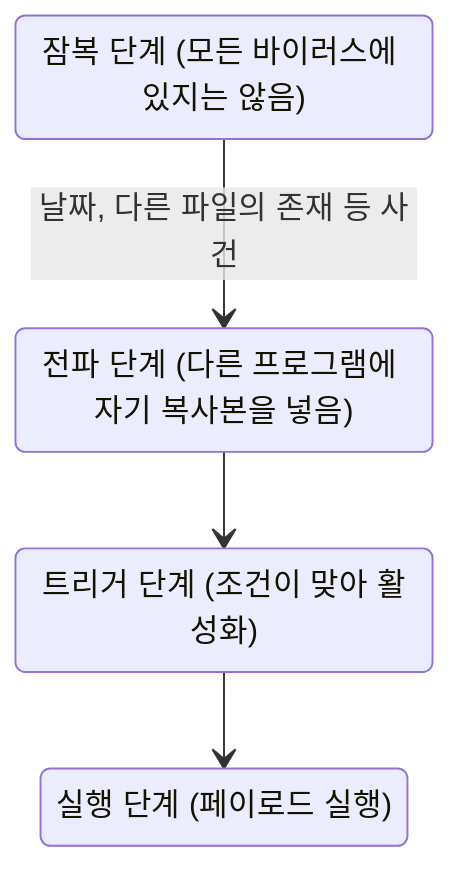



요약

악성 소프트웨어는 피해를 주거나 남의 컴퓨터 자원을 쓰려고 만든 프로그램이다. 두 질문으로 갈래가 나뉜다. 혼자 서 있는가, 다른 프로그램에 기생하는가? 스스로 퍼지는가, 사람이 옮겨 줘야 하는가? 바이러스는 다른 프로그램에 붙어 퍼지고, 웜은 혼자 네트워크를 타고 퍼지고, 트로이 목마는 쓸모 있는 척 사용자가 직접 실행하게 만든다. 커널까지 들어간 루트킷은 운영체제의 눈마저 속여 찾기가 아주 어렵다.

## 예시로 보기

| 이름 | 비유 | 핵심 |
|---|---|---|
| 백도어 | 집 뒤에 몰래 낸 비밀 문 | 정상 인증을 거치지 않고 들어오는 비밀 입구 |
| 논리 폭탄 | 시한폭탄 | 조건(특정 날짜, 특정 사용자)이 맞으면 터진다 |
| 트로이 목마 | 선물 상자 속 병사 | 쓸모 있어 보이는 프로그램 안에 숨은 해로운 코드 |
| 바이러스 | 숙주에 붙는 병균 | 다른 프로그램을 고쳐 자기 복사본을 넣는다 |
| 웜 | 스스로 기어다니는 벌레 | 네트워크를 타고 스스로 복제해 퍼진다 |
| 봇 | 원격 조종 로봇 | 몰래 남의 컴퓨터를 장악하고 명령을 기다린다 |
| 루트킷 | 투명 망토를 쓴 침입자 | 관리자 권한을 유지하며 자기 존재를 숨긴다 |

비유는 핵심 동작만 보인다[^s1]. 실제 악성 코드는 여러 성질을 섞는다(예: Nimda는 웜, 바이러스, 모바일 코드의 성질을 모두 가진다)[^1].

## 정확히 말하면

정의

**악성 소프트웨어**는 해를 끼치거나 대상 컴퓨터의 자원을 써 버리도록 설계된 소프트웨어를 통틀어 부르는 말이다. 일부는 다른 소프트웨어 안에 들어 있고(기생형), 일부는 스스로 복제하며, 일부는 퍼지는 데 다른 수단이 필요하다[^2].

| 종류 | 내용 |
|---|---|
| 백도어 (트랩도어) | 프로그램의 비밀 진입점. 디버깅하는 프로그래머에게 쓸모 있지만, 악의적인 프로그래머가 무단 접근에 쓴다[^3] |
| 논리 폭탄 | 정상 프로그램 안에 심어, 특정 파일이 있거나 없을 때, 특정 요일, 특정 사용자가 실행할 때 "터진다". 데이터·파일을 바꾸거나 지우거나 기계를 멈춘다. 바이러스·웜보다 오래된 위협이다[^4] |
| 트로이 목마 | 쓸모 있거나 쓸모 있어 보이는 프로그램에 숨은 코드가, 실행되면 원치 않는 일을 한다. 권한 없는 사용자가 직접 못 하는 일을 간접적으로 하게 한다. 예: 실행한 사용자의 파일 권한을 모두에게 열기[^5] |
| 모바일 코드 | 원격 시스템에서 보내져, 사용자가 명시적으로 지시하지 않았는데 로컬에서 실행되는 프로그램(스크립트, 매크로). 흔한 예가 크로스 사이트 스크립팅(XSS)이다[^6] |
| 다중 위협 | 여러 방식으로 감염하는 다중 감염 바이러스, 여러 공격 방법을 섞는 혼합 공격[^1] |

### 바이러스

다른 소프트웨어를 고쳐 "감염"시키는 소프트웨어다. 세 부분이 있다[^7].

| 부분 | 하는 일 |
|---|---|
| 감염 메커니즘 | 퍼지는 방법 |
| 트리거 | 언제 페이로드를 실행할지 정하는 사건이나 조건 |
| 페이로드 | 감염 말고 바이러스가 하는 일(피해) |

바이러스는 일생 동안 네 단계를 거친다[^8].

**구조.** 바이러스는 실행 파일의 앞이나 뒤에 붙거나 안에 박힌다. 감염된 프로그램이 실행되면 바이러스 코드가 먼저 실행된 뒤 원래 프로그램 코드를 실행한다. 그래서 사용자는 이상을 눈치채기 어렵다[^9]. 압축 바이러스는 감염된 파일을 압축해 원래 파일과 길이가 같게 만들어, 길이로 감염을 알아채지 못하게 한다[^10].

**분류**[^11]

| 기준 | 종류 |
|---|---|
| 대상 | 부트 섹터 감염(부트 레코드를 감염해 시스템이 켜질 때 퍼짐), 파일 감염(실행 파일), 매크로 바이러스 |
| 숨는 방법 | 암호화 바이러스(무작위 키로 나머지를 암호화), 은폐 바이러스(백신에게서 숨음), 다형성 바이러스(감염할 때마다 모양이 바뀜), 변성 바이러스(감염할 때마다 모양이 바뀌고 자기를 완전히 다시 씀) |

**매크로 바이러스.** 1990년대 중반에 가장 흔했다. 플랫폼에 상관없이 퍼진다(MS Word 문서 등). 실행 코드가 아니라 문서를 감염하고, 쉽게 퍼지며, 파일 시스템의 접근 제어로는 막기 어렵다[^12]. **이메일 바이러스**는 첨부 파일을 열면 주소록을 읽어 연락처에 자기 복사본을 보낸다[^13].

### 웜

스스로를 복제하고 네트워크 연결을 이용해 시스템에서 시스템으로 퍼진다. 이메일 바이러스도 스스로 복제하지만 보통 사람이 열어야 실행되므로 웜이 아니라 바이러스로 분류한다[^14]. 웜은 이메일로 자기를 보내거나, 원격 실행 기능이나 네트워크 서비스의 결함으로 다른 시스템에서 자기를 실행하거나, 원격 로그인 후 명령으로 자기를 복사해 퍼진다[^15]. 전파는 처음에 천천히, 그다음 폭발적으로 늘고, 감염할 호스트가 줄면 느려지는 S자 모양이다[^16].

### 봇과 루트킷

**봇**(좀비, 드론)은 인터넷에 연결된 남의 컴퓨터를 몰래 장악해, 만든 사람을 추적하기 어려운 공격을 하게 하는 프로그램이다. 봇의 모음이 봇넷이다[^17].

**루트킷**은 시스템에 대한 관리자(root) 권한을 유지하려고 설치하는 프로그램 묶음이다. 자기 존재를 숨기고, 공격자가 시스템을 완전히 통제한다[^18].

| 분류 | 내용 |
|---|---|
| 지속형 / 메모리 기반 | 재부팅해도 남는가, 메모리에만 있어 재부팅하면 사라지는가 |
| 사용자 모드 / 커널 모드 | 사용자 수준 프로그램을 바꾸는가, 커널 안에서 도는가 |

루트킷은 웜이나 봇과 달리 취약점에 직접 기대지 않는다. 사용자가 실행한 트로이 목마(흔히 불법 복제 소프트웨어에 붙어 있음)가 설치하거나, 이미 root를 얻은 해커가 손으로 설치한다[^19].

커널 수준 루트킷은 시스템 호출을 노린다. 사용자 프로그램은 시스템 호출로만 커널과 주고받으므로, 여기를 바꾸면 무엇이든 숨길 수 있다. 방법은 셋이다[^20].

1. 시스템 호출 표의 주소를 루트킷의 대체 함수로 바꾼다.
2. 표는 그대로 두고, 표가 가리키는 정상 루틴 자체를 악성 코드로 덮어쓴다.
3. 시스템 호출 표에 대한 참조를 커널 메모리의 새 표로 돌린다.

knark 루트킷은 첫째 방법으로 시스템 호출 표를 고친다[^21].

## 스스로 설명해 보기

1. 이메일 바이러스는 스스로 복제하는데도 웜이 아니다.
   

근거

   웜은 사람의 개입 없이 네트워크를 타고 스스로 실행된다. 이메일 바이러스는 받은 사람이 첨부 파일을 열어야 실행되므로 바이러스로 분류한다.
   

2. 감염된 프로그램은 바이러스를 먼저 실행한 뒤 원래 코드를 실행한다.
   

근거

   원래 기능이 그대로 동작해야 사용자가 감염을 눈치채지 못하고 계속 실행해 바이러스가 퍼질 기회가 생긴다.
   

3. 커널 모드 루트킷은 찾기가 아주 어렵다.
   

근거

   백신과 관리 도구도 결국 시스템 호출로 파일 목록과 프로세스 목록을 얻는다. 시스템 호출을 루트킷이 쥐고 있으면, 도구가 받는 답 자체가 루트킷이 꾸며 낸 것이다.
   

- 핵심 아이디어는?
  

답

  악성 코드는 "어떻게 실행되나(기생/독립)", "어떻게 퍼지나(사람/스스로)", "무엇을 하나(페이로드)", "어떻게 숨나"의 조합이다. 새 악성 코드도 이 네 질문으로 분류할 수 있다.
  

- 같은 생각을 쓰는 다른 곳은?
  

답

  생물학의 병원체 분류(숙주 필요 여부, 전염 경로). 웜의 S자 전파는 감염병 확산 모형(SIR)과 같은 모양이다.
  

## 활용

- 대응 방법: [악성 코드 대응](/Hongs_Blog/studies/operating-systems/malware-countermeasures/), [침입 탐지](/Hongs_Blog/studies/operating-systems/intrusion-detection/)
- 루트킷이 커널을 노리는 이유는 [커널 모드](/Hongs_Blog/studies/operating-systems/user-kernel-mode/)가 모든 메모리와 명령어를 쓸 수 있기 때문이다.

## 연결

- 선수: [보안의 목표와 위협](/Hongs_Blog/studies/operating-systems/security-goals-threats/), [사용자 모드와 커널 모드](/Hongs_Blog/studies/operating-systems/user-kernel-mode/)

## 자주 하는 오해

"바이러스와 웜은 같은 말이다"

틀렸다. 둘 다 스스로 복제해 퍼져서 일상에서는 섞어 부른다. 바이러스는 다른 프로그램(숙주)에 붙어 그 프로그램이 실행될 때 퍼진다. 웜은 숙주 없이 독립된 프로그램으로 네트워크를 타고 스스로 다른 시스템에서 실행된다. 이메일 바이러스처럼 경계에 있는 것은 사람의 개입이 필요한지로 가른다.

"트로이 목마는 스스로 퍼진다"

틀렸다. 이름이 유명한 바이러스처럼 들리지만, 트로이 목마는 복제 기능이 없다. 쓸모 있어 보이는 겉모습으로 사용자가 **직접** 설치·실행하게 만드는 것이 핵심이다. 그래서 루트킷을 심는 통로로 자주 쓰인다.

## 확인 문제

<b>C1</b> 다음은 무엇인가? ① 무료 게임을 설치했더니 몰래 내 파일을 외부로 보낸다 ② 퇴사한 직원의 이름이 급여 목록에서 사라지면 회사 데이터를 지우게 심어 둔 코드 ③ 사람이 아무것도 하지 않았는데 네트워크의 취약한 서버들로 스스로 번진다

**답:** ① 트로이 목마 ② 논리 폭탄 ③ 웜.

<b>C2</b> 바이러스의 세 부분과 일생의 네 단계를 쓰라.

**답:** 부분: 감염 메커니즘, 트리거, 페이로드. 단계: 잠복, 전파, 트리거, 실행.

<b>C3</b> 다형성 바이러스와 변성 바이러스는 어떻게 다른가? 백신이 고정된 문자열(시그니처)로 찾기 어려운 이유는?

**답:** 둘 다 감염할 때마다 모양이 바뀐다. 다형성은 주로 암호화 키를 바꿔 겉모양만 바꾸고, 변성은 자기 코드 전체를 다시 써서 동작 방식까지 바꿀 수 있다. 감염본마다 바이트 배열이 달라 하나의 고정 문자열이 모든 감염본에 나타나지 않는다.

<b>C4</b> 커널 수준 루트킷이 시스템 호출 표를 고치면, 파일 목록을 보여 주는 <code>ls</code> 명령에서 자기 파일을 숨길 수 있는 이유는?

**답:** `ls`는 디렉터리를 읽는 시스템 호출로 파일 목록을 얻는다. 루트킷이 그 시스템 호출을 자기 함수로 바꾸면, 진짜 목록에서 자기 파일만 빼고 돌려준다. `ls` 자체는 정상이지만 받은 답이 거짓이다.

[^1]: 3-1학기/운영체제/1.수업자료/14.Chapter14-new.pptx, 슬라이드 26
[^2]: 같은 자료, 슬라이드 21
[^3]: 같은 자료, 슬라이드 22
[^4]: 같은 자료, 슬라이드 23과 슬라이드 22의 발표자 노트
[^5]: 같은 자료, 슬라이드 24와 슬라이드 23의 발표자 노트
[^6]: 같은 자료, 슬라이드 25와 슬라이드 24의 발표자 노트
[^7]: 같은 자료, 슬라이드 28
[^8]: 같은 자료, 슬라이드 29와 슬라이드 28의 발표자 노트
[^9]: 같은 자료, 슬라이드 30~31 (그림 14.2)과 슬라이드 29의 발표자 노트
[^10]: 같은 자료, 슬라이드 32 (그림 14.3)
[^11]: 같은 자료, 슬라이드 33~35
[^12]: 같은 자료, 슬라이드 36과 슬라이드 35의 발표자 노트
[^13]: 같은 자료, 슬라이드 37
[^14]: 같은 자료, 슬라이드 38
[^15]: 같은 자료, 슬라이드 39와 슬라이드 38의 발표자 노트
[^16]: 같은 자료, 슬라이드 40 (그림 14.4)과 슬라이드 39의 발표자 노트
[^17]: 같은 자료, 슬라이드 41
[^18]: 같은 자료, 슬라이드 43
[^19]: 같은 자료, 슬라이드 44~45와 슬라이드 44의 발표자 노트
[^20]: 같은 자료, 슬라이드 46~47과 슬라이드 46의 발표자 노트
[^21]: 같은 자료, 슬라이드 48 (그림 14.5)과 슬라이드 47의 발표자 노트
[^s1]: 에이전트 보충. 비유 표, 부트 섹터 감염·압축 바이러스의 목적 풀이, 스스로 설명해 보기의 근거와 SIR 연결, 확인 문제는 슬라이드에 없다. 바이러스 분류의 설명은 Stallings 6판 14.4절을 따랐다.

