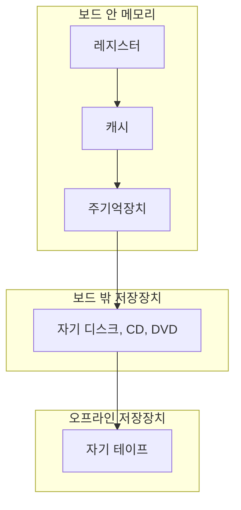



요약

빠른 메모리는 비싸고, 싸고 큰 메모리는 느리다. 그래서 한 종류로 다 만들지 않고, 작고 빠른 것부터 크고 느린 것까지 층층이 쌓는다. 자주 쓰는 것은 위층에, 가끔 쓰는 것은 아래층에 둔다. 이 방식은 아래층으로 갈수록 프로세서가 덜 찾아갈 때만 효과가 있다.

## 예시로 보기

책상, 책장, 도서관을 떠올리면 된다[^s1]. 지금 읽는 책은 책상 위에 둔다. 손만 뻗으면 되지만 몇 권밖에 못 둔다. 이번 학기 책은 방 책장에 둔다. 몇 걸음 걸어야 하지만 수십 권이 들어간다. 나머지는 도서관에 있다. 오가는 데 한참 걸리지만 거의 모든 책이 있다. 이 방식이 편한 까닭은 하루 대부분을 책상 위 책만 보며 보내기 때문이다.

비유가 어긋나는 곳도 있다. 실제 메모리 계층에서는 아래층 내용의 일부를 위층에 **복사**해 두는 경우가 많다. 책처럼 한 권이 한 곳에만 있는 것이 아니다.

## 정확히 말하면

메모리를 고를 때는 세 가지를 맞바꾼다. 용량, 접근 시간, 비트당 가격이다. 기술에 따라 다음이 늘 맞다[^1].

- 접근이 빠를수록 비트당 가격이 비싸다.
- 용량이 클수록 비트당 가격이 싸다.
- 용량이 클수록 접근이 느리다.

계층을 위에서 아래로 내려가면 네 가지가 함께 바뀐다[^2].

| 아래로 갈수록 | |
|---|---|
| 비트당 가격 | 싸진다 |
| 용량 | 커진다 |
| 접근 시간 | 길어진다 |
| 프로세서가 찾아가는 횟수 | 줄어든다 |

마지막 줄이 이 구성이 통하는 열쇠다[^2]. 아래층을 찾아가는 일이 드물어야, 평균적으로 위층의 속도와 아래층의 용량을 함께 누린다.

**2차 기억장치.** 주기억장치 아래층의 외부 기억장치다. 전원이 꺼져도 내용이 남는다(비휘발성). 보조 기억장치라고도 부른다. 프로그램 파일과 데이터 파일을 담는다. 프로그래머에게는 바이트 단위가 아니라 파일과 레코드 단위로 보인다[^3].

## 활용

- "아래층을 드물게 찾는다"가 맞는 이유는 프로그램이 방금 쓴 곳과 그 근처를 다시 쓰는 경향(지역성)이 있기 때문이다. 이것을 이용하는 것이 [캐시 메모리](/Hongs_Blog/studies/operating-systems/cache-memory/)다.
- 주기억장치와 디스크 사이에서 같은 생각을 쓰는 것이 [가상 메모리](/Hongs_Blog/studies/operating-systems/virtual-memory/)다.

## 연결

- 선수: [컴퓨터의 기본 구성 요소](/Hongs_Blog/studies/operating-systems/computer-basic-elements/)
- 맨 위층: [프로세서 레지스터](/Hongs_Blog/studies/operating-systems/processor-registers/)

## 확인 문제

<b>C1</b> 메모리 계층을 아래로 내려갈 때 바뀌는 네 가지를 방향과 함께 쓰라.

**답:** 비트당 가격은 싸지고, 용량은 커지고, 접근 시간은 길어지고, 프로세서가 찾아가는 횟수는 줄어든다.

<b>C2</b> 네 가지 중 "찾아가는 횟수가 줄어든다"가 빠지면 계층 구조가 왜 쓸모없어지는가?

**답:** 프로세서가 아래층을 자주 찾으면 평균 접근 시간이 아래층 속도에 가까워진다. 비싼 위층을 둔 보람이 없고, 결국 느린 메모리 하나만 쓰는 것과 비슷해진다.

[^1]: 운영체제 1회 강의 자료 「Chapter01-new」, 슬라이드 40과 발표자 노트
[^2]: 같은 자료, 슬라이드 41 (그림 1.14)과 발표자 노트
[^3]: 같은 자료, 슬라이드 42와 발표자 노트
[^s1]: 보충 책상·책장·도서관 비유와 그 한계는 원본에 없다. 계층 그림은 원본 그림 1.14의 층을 옮긴 것이다.

