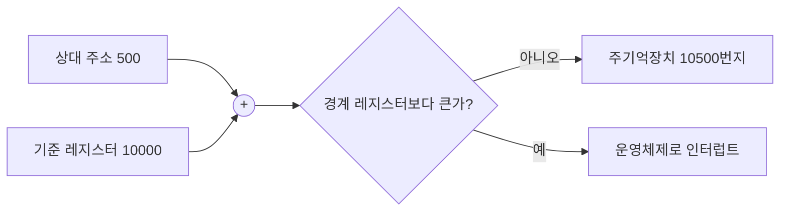



요약

메모리 관리는 주기억장치를 여러 프로세스에게 나눠 주는 일이다. 될 수 있는 대로 많은 프로세스를 넣으면서도 성능을 지켜야 한다. 그러려면 다섯 가지를 해내야 한다. 프로그램이 어디에 실려도 돌게 하기(재배치), 남의 메모리를 못 건드리게 하기(보호), 필요하면 함께 쓰게 하기(공유), 모듈 단위로 다루기(논리적 구성), 메모리와 디스크 사이를 오가게 하기(물리적 구성)다. 재배치와 보호는 실행 중에 주소를 바꾸고 검사해야 해서 하드웨어의 도움이 필요하다.

## 예시로 보기

프로그램을 컴파일하면 코드 안에 `jmp 500`처럼 주소가 들어간다. 그런데 프로그래머는 이 프로그램이 메모리의 어디에 실릴지 모른다. 오늘은 10,000번지부터 실릴 수도 있고, 실행 중에 디스크로 쫓겨났다가 20,000번지에 다시 실릴 수도 있다[^1]. 그때마다 코드 속 500을 실제 주소로 바꿔야 한다.

하드웨어가 실행 중에 바꿔 준다. 프로세스가 실릴 때 **기준 레지스터**에 시작 주소를, **경계 레지스터**에 끝 주소를 넣어 둔다[^2]. 프로세스가 상대 주소 500을 내면 다음 순서로 처리한다[^3].

1. 기준 레지스터 값을 더한다: 10,000 + 500 = 10,500.
2. 결과를 경계 레지스터와 비교한다.
3. 경계를 넘으면 운영체제에 인터럽트를 보낸다. 넘지 않으면 10,500번지에 접근한다.

## 정확히 말하면

### 다섯 가지 요구 사항

| 요구 | 내용 |
|---|---|
| 재배치 | 프로그래머는 프로그램이 메모리 어디에 실릴지 모른다. 실행 중에 디스크로 나갔다가 다른 곳에 실릴 수도 있다. 그래서 코드 속 메모리 참조를 실제 물리 주소로 바꿔야 한다[^1] |
| 보호 | 허락 없이 다른 프로세스의 메모리를 참조하면 안 된다. 주소는 실행 중에 계산되기도 하므로 프로그램을 미리 검사할 수 없다. 그래서 실행 중에 하드웨어가 검사한다[^4] |
| 공유 | 여러 프로세스가 같은 메모리 영역을 쓰게 한다. 예: 다중 사용자 시스템에서 사용자마다 유닉스 셸 복사본을 따로 만들지 않고 하나를 함께 쓴다[^5] |
| 논리적 구성 | 프로그램은 모듈로 짜인다. 모듈마다 보호 정도(읽기 전용, 실행 전용)를 다르게 주고, 모듈 단위로 공유한다[^6] |
| 물리적 구성 | 프로그램과 데이터에 쓸 메모리가 모자랄 수 있다. 2차 기억장치는 싸고 크고 영구적이므로 프로그램 일부를 거기에 두었다가 필요할 때 가져온다[^7] |

재배치와 보호는 서로 기대어 있다. 실행 중에 주소를 바꾸는 하드웨어가 있으면 같은 자리에서 범위 검사도 할 수 있다[^s1].

### 세 가지 주소

| 주소 | 뜻 |
|---|---|
| 논리 주소 | 데이터가 지금 메모리 어디에 있는지와 상관없는 참조. 실제로 쓰려면 물리 주소로 바꿔야 한다 |
| 상대 주소 | 어떤 기준점(보통 프로그램의 시작)에서 얼마나 떨어졌는지로 나타낸 주소. 논리 주소의 한 종류다 |
| 물리 주소 | 주기억장치 안의 실제 위치(절대 주소) |

이 표는 슬라이드 p.25를 옮긴 것이다[^8]. 프로세스가 실릴 때, 그리고 실행 중에 스와핑이나 압축(compaction)으로 옮겨질 때 실제 위치가 바뀐다[^9]. 그래서 변환은 실행 시간에 해야 한다.

### 오버레이

메모리가 프로그램 전체를 담기에 모자라던 시절의 방법이다. 프로그램을 주 부분과 여러 오버레이 조각으로 나누고, 조각들이 같은 메모리 영역을 번갈아 쓴다. 나누고 싣는 일을 **프로그래머**가 직접 해야 했다[^10]. 이 부담을 운영체제가 대신 지는 것이 [가상 메모리](/Hongs_Blog/studies/operating-systems/virtual-memory/)다.

## 활용

- 기준·경계 레지스터는 2장 그림 2.8의 "기준(base)과 한계(limit)" 레지스터와 같은 장치다 → [프로세스](/Hongs_Blog/studies/operating-systems/process/)
- 프로세스를 바꿀 때 운영체제가 이 레지스터 값을 새 프로세스 것으로 바꾼다 → [프로세스 생성과 전환](/Hongs_Blog/studies/operating-systems/process-creation-switching/)의 6단계
- 공유 라이브러리(리눅스의 `.so`, 윈도우의 `.dll`)는 여러 프로세스가 같은 코드를 메모리에 한 벌만 두고 함께 쓰는 공유의 예다[^s1].

## 연결

- 선수: [프로세스](/Hongs_Blog/studies/operating-systems/process/), [메모리 계층](/Hongs_Blog/studies/operating-systems/memory-hierarchy/)
- 요구를 채우는 방법들: [메모리 분할](/Hongs_Blog/studies/operating-systems/memory-partitioning/), [페이징](/Hongs_Blog/studies/operating-systems/paging/), [세그먼테이션](/Hongs_Blog/studies/operating-systems/segmentation/)

## 확인 문제

<b>C1</b> 메모리 관리의 다섯 가지 요구 사항을 쓰라.

**답:** 재배치, 보호, 공유, 논리적 구성, 물리적 구성.

<b>C2</b> 보호를 컴파일할 때 프로그램을 검사해서 해결할 수 없고 실행 중에 하드웨어가 해야 하는 이유는?

**답:** 주소가 실행 중에 계산되기 때문이다. 예를 들어 배열 인덱스나 포인터 연산의 결과는 입력에 따라 달라진다. 또 재배치 때문에 프로그램이 실제로 어디에 실릴지도 실행 전에는 모른다.

<b>C3</b> 기준 레지스터 = 30,000, 경계 레지스터 = 34,000이다. 프로세스가 상대 주소 2,500과 4,200을 낸다. 각각 어떻게 되는가?

**답:** 2,500 → 32,500. 경계 34,000 이하이므로 접근한다. 4,200 → 34,200. 경계를 넘으므로 운영체제에 인터럽트가 가고 접근이 막힌다.

[^1]: 운영체제 7회 강의 자료 「chap7 (Stony Brook)」, p.3
[^2]: 같은 자료, p.27
[^3]: 같은 자료, p.26, 28 (그림 7.8)
[^4]: 같은 자료, p.4
[^5]: 같은 자료, p.5
[^6]: 같은 자료, p.6
[^7]: 같은 자료, p.7
[^8]: 같은 자료, p.25
[^9]: 같은 자료, p.24
[^10]: 같은 자료, p.8
[^s1]: 보충 이 장은 교수 자료가 없어 Stony Brook 대학 CSE306의 공개 슬라이드(Stallings 교재 기반)를 원본으로 썼다. 주소 500·10,000 예, 재배치와 보호를 한 하드웨어로 하는 이유, 공유 라이브러리 예, 확인 문제 C3은 슬라이드에 없다. 내용은 Stallings 6판 7.1절을 따랐다.

