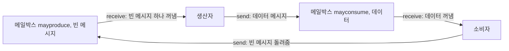


<div class="callout callout-summary" markdown="1">
<div class="callout-title callout-title--default" markdown="span">요약</div>

메시지 전달은 프로세스들이 메모리를 함께 쓰지 않고, 편지를 주고받듯 send와 receive로 데이터를 넘기는 방법이다. 데이터를 넘기는 일(통신)과 순서를 맞추는 일(동기화)을 한 번에 한다. 메모리를 공유하지 않으므로 다른 컴퓨터 사이에서도 그대로 쓸 수 있다. 대신 데이터를 복사해 보내야 해서 공유 메모리보다 느릴 수 있고, 보내는 쪽과 받는 쪽이 언제 기다릴지 정해야 한다.

</div>


## 예시로 보기

우체통(메일박스) 하나에 열쇠 메시지 한 통을 넣어 두면 상호 배제가 된다[^1].

```c
const int n = /* 프로세스 수 */;
void P(int i) {
    message msg;
    while (true) {
        receive(box, msg);    /* 열쇠를 꺼냄. 없으면 기다림 */
        /* 임계 구역 */;
        send(box, msg);       /* 열쇠를 돌려놓음 */
        /* 나머지 */;
    }
}
void main() {
    create_mailbox(box);
    send(box, null);          /* 처음에 열쇠 한 통만 넣음 */
    parbegin(P(1), P(2), ..., P(n));
}
```

여기서 send는 막히지 않고, receive는 메시지가 없으면 막힌다. 여러 프로세스가 동시에 receive하면 메시지는 하나에게만 간다. 메시지가 없으면 모두 막혔다가, 한 통이 오면 하나만 깨어난다[^1].

## 정확히 말하면

프로세스가 서로 얽히려면 두 가지가 필요하다. 동기화와 통신이다. 메시지 전달은 통신을 맡고, 공유 메모리 시스템과 분산 시스템 모두에서 쓸 수 있다[^2]. 보통 두 연산으로 제공한다[^3].

- `send(destination, message)`
- `receive(source, message)`

### 언제 기다리나

받는 쪽은 보내는 쪽이 보내기 전에는 받을 수 없다. send와 receive를 부른 뒤 프로세스가 막히는지에 따라 조합이 나뉜다[^4].

| 조합 | 동작 | 쓰임 |
|---|---|---|
| 블로킹 send, 블로킹 receive | 메시지가 전달될 때까지 양쪽 다 기다린다. **랑데부**라고 부른다 | 두 프로세스를 단단히 맞물려 동기화 |
| 논블로킹 send, 블로킹 receive | 보내는 쪽은 바로 계속한다. 받는 쪽은 메시지가 올 때까지 기다린다 | 가장 쓸모 있는 조합. 서버가 요청을 기다리는 경우 |
| 논블로킹 send, 논블로킹 receive | 아무도 기다리지 않는다 | |

### 누구에게 보내나

| 방식 | 내용 |
|---|---|
| 직접 주소 지정 | send에 받는 프로세스의 ID를 적는다. receive는 보낼 프로세스를 미리 정하거나, 받은 뒤 source 인자로 누가 보냈는지 알려 준다[^5] |
| 간접 주소 지정 | 메시지를 공유 큐인 **메일박스**에 보낸다. 받는 쪽은 메일박스에서 꺼낸다. 보내는 쪽과 받는 쪽이 서로를 몰라도 된다[^6] |

간접 방식의 관계는 넷이다[^7].

| 관계 | 예 |
|---|---|
| 일대일 | 두 프로세스 사이의 전용 통신로 |
| 다대일 | 클라이언트 여럿과 서버 하나. 이때 메일박스를 **포트**라고 부른다 |
| 일대다 | 한 프로세스가 여러 프로세스에게 방송 |
| 다대다 | 여러 서버가 여러 클라이언트를 함께 처리 |

**메시지 형식.** 머리와 몸통으로 나뉜다. 머리에는 보내는 쪽·받는 쪽 ID, 길이, 종류, 제어 정보(포인터, 순서 번호, 우선순위)가 있고, 몸통에는 실제 내용이 있다[^8].

**생산자-소비자.** 메일박스 두 개를 쓴다. `mayconsume`에는 생산자가 만든 데이터가 메시지로 들어간다. `mayproduce`에는 처음에 버퍼 크기만큼 빈 메시지를 넣어 둔다. 생산자는 `mayproduce`에서 빈 메시지를 하나 꺼내야 생산할 수 있고, 소비자는 소비하면서 빈 메시지를 `mayproduce`에 돌려준다. 빈 메시지 수가 버퍼의 빈 칸 수 역할을 한다[^9].



메시지가 두 메일박스 사이를 한 바퀴 돈다. 생산자나 소비자가 손에 든 메시지까지 세면, 빈 메시지와 데이터 메시지를 합친 수는 늘 처음 넣은 버퍼 크기 그대로다[^s2].

## 활용

- [마이크로커널](/Hongs_Blog/studies/operating-systems/microkernel/)의 서버들은 메시지 전달로 통신한다.
- 유닉스의 메시지 큐, 소켓, Go 언어의 채널이 메시지 전달이다. 버퍼 없는 Go 채널은 랑데부(블로킹 send, 블로킹 receive)다[^s1].
- 분산 시스템에서는 공유 메모리가 없으므로 메시지 전달이 기본이다[^2].

## 연결

- 선수: [경쟁 조건과 임계 구역](/Hongs_Blog/studies/operating-systems/race-condition-critical-section/), [마이크로커널](/Hongs_Blog/studies/operating-systems/microkernel/) (메시지의 머리·몸통)
- 같은 문제를 공유 메모리로 푼 것: [생산자-소비자 문제](/Hongs_Blog/studies/operating-systems/producer-consumer/), [모니터](/Hongs_Blog/studies/operating-systems/monitor/)

## 확인 문제

<details markdown="1"><summary markdown="span"><b>C1</b> 웹 서버가 요청을 기다리다가, 요청이 오면 처리하고 응답을 보낸 뒤 바로 다음 요청을 기다린다. 서버의 send와 receive는 각각 블로킹인가 논블로킹인가? 왜?</summary>


**답:** receive는 블로킹(요청이 올 때까지 할 일이 없음), send는 논블로킹(응답을 보내고 클라이언트가 받을 때까지 기다릴 필요 없이 다음 요청을 처리). 슬라이드가 가장 쓸모 있다고 한 조합이다.

</details>

<details markdown="1"><summary markdown="span"><b>C2</b> 메일박스에 처음 넣는 메시지를 한 통이 아니라 두 통으로 하면 상호 배제 해법은 어떻게 되는가?</summary>


**답:** 두 프로세스가 각각 한 통씩 꺼내 동시에 임계 구역에 들어갈 수 있다. 상호 배제가 깨진다. 초기값 2인 세마포어와 같다.

</details>

<details markdown="1"><summary markdown="span"><b>C3</b> 메시지 전달 생산자-소비자 해법의 두 메일박스를 유한 버퍼 세마포어 해법의 세마포어에 대응시켜라.</summary>


**답:** `mayproduce`의 빈 메시지 수 ↔ 빈 칸 수 세마포어 `e`. `mayconsume`의 데이터 메시지 수 ↔ 찬 칸 수 세마포어 `n`. 상호 배제 세마포어 `s`에 해당하는 것은 따로 없다. 메일박스 연산 자체가 원자적이기 때문이다.

</details>

[^1]: 운영체제 5회 강의 자료 「Chapter05-new (Google Slides)」, p.67 (그림 5.20)과 발표자 노트
[^2]: 같은 자료, p.57
[^3]: 같은 자료, p.58
[^4]: 같은 자료, p.59~61
[^5]: 같은 자료, p.63
[^6]: 같은 자료, p.64
[^7]: 같은 자료, p.65 (그림 5.18)와 발표자 노트
[^8]: 같은 자료, p.66 (그림 5.19)과 발표자 노트
[^9]: 같은 자료, p.68 (그림 5.21)과 발표자 노트
[^s1]: <span class="fn-tag" title="수업 자료에 없고 따로 보탠 내용">보충</span> 이 장은 교수 자료가 없어 지금 자료와 같은 시리즈(Stallings 6판, Dave Bremer 작성)의 공개 슬라이드를 원본으로 썼다. 상호 배제 코드는 슬라이드 이미지라 Stallings 6판 그림 5.20을 따랐다. 유닉스·Go 연결과 확인 문제는 슬라이드에 없다.
[^s2]: <span class="fn-tag" title="수업 자료에 없고 따로 보탠 내용">보충</span> 다이어그램 1개는 원본에 없다. "생산자-소비자" 문단(p.68, 그림 5.21)을 흐름도로 그렸다.

