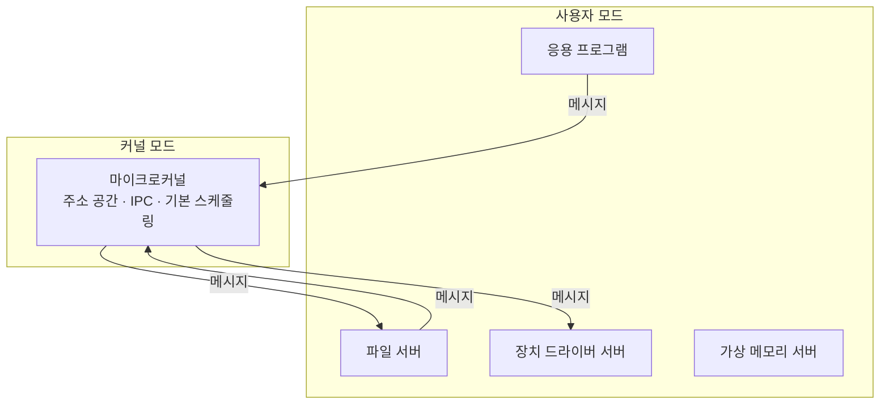



요약

마이크로커널은 커널에 꼭 필요한 기능만 남기고, 파일 시스템이나 장치 드라이버 같은 나머지 서비스는 사용자 모드의 보통 프로세스(서버)로 빼낸 구조다. 본사에는 최소 인원만 두고 나머지 부서를 외부 협력사로 돌린 회사와 같다. 한 서버가 고장 나도 커널은 버티고, 서비스를 바꾸거나 더하기 쉽다. 대신 서비스끼리 메시지를 주고받아야 해서 한 덩어리 커널보다 느려질 수 있다.

## 예시로 보기

프로그램이 파일 하나를 읽는다고 하자[^s1].

- **모놀리식 커널.** 프로그램이 시스템 호출을 하면 커널 안의 파일 시스템 코드가 커널 안의 디스크 드라이버 함수를 바로 부른다. 모두 같은 주소 공간에서 돌므로 빠르다. 하지만 드라이버에 버그가 있으면 커널 전체가 멈출 수 있다.
- **마이크로커널.** 프로그램은 "이 파일을 읽어 달라"는 메시지를 파일 서버 프로세스에 보낸다. 파일 서버는 디스크 드라이버 서버에 메시지를 보낸다. 커널은 메시지를 전달하기만 한다. 드라이버 서버가 죽어도 그 서버만 다시 띄우면 된다. 대신 메시지가 오갈 때마다 커널을 거친다.

## 정확히 말하면

### 커널 구조 세 가지

| 구조 | 생김새 | 문제 |
|---|---|---|
| 모놀리식 | 1950년대 중후반의 운영체제는 구조를 거의 신경 쓰지 않았다. 사실상 어떤 함수든 다른 어떤 함수든 부를 수 있었다. 스케줄링, 파일 시스템, 네트워킹, 장치 드라이버, 메모리 관리가 모두 커널 안에 있고, 보통 하나의 프로세스로서 같은 주소 공간을 쓴다[^1][^2] | 운영체제가 커지자 관리할 수 없게 되었다 |
| 계층형 | 기능을 층으로 나누고, 이웃한 층끼리만 주고받는다. 대부분의 층이 커널 모드에서 돈다[^2] | 한 층을 크게 바꾸면 이웃 층에 추적하기 어려운 영향이 퍼진다. 이웃 층끼리 주고받는 일이 많아 보안을 넣기 어렵다 |
| 마이크로커널 | 꼭 필요한 핵심 기능만 커널에 둔다. 나머지 서비스는 사용자 모드에서 도는 프로세스(서버)가 맡고, 마이크로커널은 이들을 다른 응용과 똑같이 다룬다[^1][^2] | 아래 "맞바꾸는 것" 참고 |

마이크로커널에 남는 핵심 기능은 주소 공간, 프로세스 간 통신(IPC), 기본 스케줄링이다[^1]. 커널 밖으로 나간 서비스는 장치 드라이버, 파일 시스템, 가상 메모리 관리자, 창 시스템, 보안 서비스 등이다. 마이크로커널은 이들 사이의 메시지 교환소로 일한다. 메시지가 올바른지 확인하고, 구성 요소 사이에 전달하고, 하드웨어 접근을 허락한다. 허락되지 않은 메시지 교환은 막는다[^2].

마이크로커널은 다른 기능을 모듈처럼 덧붙일 수 있는 작은 운영체제 핵이다. 얼마나 작아야 마이크로커널이라 부를 수 있는지, 예를 들어 드라이버도 사용자 공간에 있어야 하는지는 정해진 답이 없다[^3].

### 마이크로커널이 하는 일

**저수준 메모리 관리.** 커널은 가상 페이지 하나하나를 실제 메모리 칸(페이지 프레임)에 대응시키는 일만 한다. 프로세스끼리 주소 공간을 보호하는 일, 페이지 교체 같은 나머지 메모리 관리는 커널 밖에서 할 수 있다[^4].

**프로세스 간 통신.** 마이크로커널 운영체제에서 프로세스나 스레드끼리는 메시지로 통신한다. 메시지는 두 부분이다[^5].

| 부분 | 내용 |
|---|---|
| 머리(header) | 보내는 프로세스와 받는 프로세스 |
| 몸통(body) | 데이터 자체, 데이터 블록을 가리키는 포인터, 또는 프로세스에 대한 제어 정보 |

**입출력과 인터럽트.** 하드웨어 인터럽트를 메시지로 다룰 수 있다. 입출력 포트를 주소 공간에 넣을 수도 있다. 특정 사용자 수준 프로세스를 그 인터럽트에 배정하고, 커널은 그 대응만 관리한다[^6].

### 맞바꾸는 것

| 좋은 점[^7] | 내용 |
|---|---|
| 같은 인터페이스 | 모든 서비스를 메시지로 요청하므로, 프로세스는 커널 서비스와 사용자 수준 서비스를 구별할 필요가 없다 |
| 확장성 | 새 기능을 넣을 때 해당 서버만 고치거나 더한다. 새 커널을 만들 필요가 없다 |
| 유연성 | 기능을 빼서 더 작고 효율적인 구성을 만들 수 있다 |
| 이식성 | 프로세서에 따라 달라지는 코드가 대부분 마이크로커널에 모여 있어, 새 프로세서로 옮길 때 고칠 곳이 적다 |
| 신뢰성 | 작은 커널은 철저히 시험할 수 있다 |
| 분산 시스템 지원 | 메시지를 보낼 때 받는 쪽이 같은 컴퓨터에 있는지 몰라도 된다 |
| 객체 지향 운영체제 지원 | 객체 지향 설계와 잘 맞는다 |

단점: 서비스를 쓸 때마다 커널을 거쳐 메시지를 주고받으므로, 같은 일을 커널 안 함수 호출로 하는 모놀리식 커널보다 느릴 수 있다[^s2].

## 활용

- Mach가 마이크로커널을 널리 알렸고, Mac OS X의 핵심이 되었다[^8].
- Windows는 운영체제 서비스, 보호된 하위 시스템, 응용을 모두 클라이언트–서버 모델로 짠다. 서버 프로세스와 클라이언트는 원격 프로시저 호출(RPC)로 통신한다[^9].
- **Linux**는 모놀리식이지만 커널을 모듈 묶음으로 짰다. 모듈은 실행 중에 커널에 붙였다 떼었다 할 수 있는 목적 파일이다(동적 링크). 모듈은 층을 이뤄 위 모듈이 아래 모듈을 라이브러리처럼 쓴다(쌓을 수 있는 모듈). 이렇게 마이크로커널의 장점 일부를 얻는다[^10].

## 연결

- 선수: [사용자 모드와 커널 모드](/Hongs_Blog/studies/operating-systems/user-kernel-mode/), [프로세스](/Hongs_Blog/studies/operating-systems/process/)
- 2장의 다른 구조 접근(다중 스레딩, SMP, 분산 운영체제, 객체 지향 설계)과 함께 나온다[^1]: [스레드](/Hongs_Blog/studies/operating-systems/thread/), [대칭형 다중 처리](/Hongs_Blog/studies/operating-systems/smp/)

## 확인 문제

<b>C1</b> 마이크로커널에 남기는 핵심 기능 세 가지를 쓰라.

**답:** 주소 공간 관리, 프로세스 간 통신(IPC), 기본 스케줄링.

<b>C2</b> 마이크로커널에서 장치 드라이버 버그가 시스템 전체를 덜 망가뜨리는 이유를 모드와 주소 공간으로 설명하라.

**답:** 드라이버가 커널 모드가 아니라 사용자 모드의 별도 프로세스로 돈다. 자기 주소 공간 밖의 메모리, 특히 커널 메모리를 건드릴 수 없다. 그래서 버그가 나도 그 서버만 죽고, 커널과 다른 서버는 계속 돈다. 모놀리식 커널에서는 드라이버가 커널 주소 공간에서 커널 모드로 돌기 때문에 잘못된 쓰기 하나가 커널 전체를 망가뜨릴 수 있다.

<b>C3</b> "Linux는 모듈을 실행 중에 붙였다 뗄 수 있으니 마이크로커널이다." 맞는가?

**답:** 틀리다. Linux의 모듈은 커널 주소 공간에 링크되어 커널 모드에서 돈다. 구조는 모놀리식이다. 모듈 방식으로 마이크로커널의 장점(유연성, 필요할 때만 적재) 일부를 얻을 뿐, 서비스가 사용자 모드 서버로 분리되지는 않는다.

[^1]: 3-1학기/운영체제/1.수업자료/02.Chapter02-new.pptx, 슬라이드 48~49와 슬라이드 47·48의 발표자 노트
[^2]: 3-1학기/운영체제/1.수업자료/04.Chapter04-new.pptx, 슬라이드 40 (그림 4.10)과 슬라이드 34의 발표자 노트
[^3]: 같은 자료, 슬라이드 39
[^4]: 같은 자료, 슬라이드 41과 슬라이드 35의 발표자 노트
[^5]: 같은 자료, 슬라이드 42와 슬라이드 36의 발표자 노트
[^6]: 같은 자료, 슬라이드 43과 슬라이드 37의 발표자 노트
[^7]: 같은 자료, 슬라이드 44와 슬라이드 38의 발표자 노트
[^8]: 같은 자료, 슬라이드 33의 발표자 노트
[^9]: 3-1학기/운영체제/1.수업자료/02.Chapter02-new.pptx, 슬라이드 59와 슬라이드 58의 발표자 노트
[^10]: 같은 자료, 슬라이드 66~67과 슬라이드 65의 발표자 노트
[^s1]: 에이전트 보충. 파일 읽기 예시와 그림은 원본에 없다. 원본 그림 4.10(계층형 커널과 마이크로커널)을 파일 읽기 한 번에 대어 본 것이다.
[^s2]: 에이전트 보충. 성능 단점은 슬라이드에 없다. Stallings 6판 4.3절의 "마이크로커널의 잠재적 단점은 성능"을 옮겼다.

