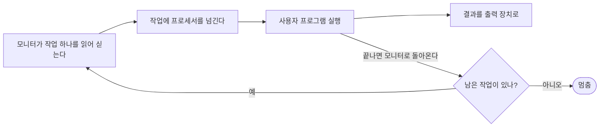



요약

운영체제는 "비싼 프로세서를 어떻게 하면 놀리지 않을까"라는 고민을 풀면서 네 단계로 자랐다. 사람이 직접 기계를 다루던 직렬 처리, 작업을 묶어 프로그램(모니터)이 차례로 돌리는 단순 배치, 여러 작업을 메모리에 올려 번갈아 돌리는 다중 프로그래밍 배치, 여러 사람이 터미널로 동시에 쓰는 시분할이다. 단계마다 앞 단계의 낭비 하나를 없앴고, 대신 새 문제(보호, 다툼 해결)를 떠안았다.

## 예시로 보기

1950년대 초 대학 계산실에 컴퓨터가 한 대 있다고 하자[^1].

- 연구자는 종이 예약표에 "오후 2시~3시"를 적는다. 45분 만에 끝나면 남은 15분은 기계가 논다. 반대로 시간이 모자라면 끝내지 못하고 비켜야 한다.
- 예약 시간이 오면 컴파일러를 테이프에서 싣고, 프로그램 카드를 넣고, 컴파일하고, 결과를 싣는 준비를 직접 한다. 중간에 하나라도 틀리면 처음부터 다시 한다.

예약 낭비를 **스케줄링 문제**, 준비에 드는 시간을 **준비 시간(setup time) 문제**라고 부른다. 기계가 매우 비쌌기 때문에 이 낭비를 그냥 둘 수 없었다[^2].

## 네 단계

| 단계 | 어떻게 돌리나 | 앞 단계에서 없앤 낭비 | 새로 생긴 문제 |
|---|---|---|---|
| 직렬 처리 | 운영체제 없이 사람이 콘솔(표시등, 토글 스위치, 입력 장치, 프린터)로 직접 | — | 스케줄링, 준비 시간[^1] |
| 단순 배치 | 사용자는 카드·테이프를 운영자에게 맡긴다. 운영자가 작업을 묶어(batch) 넣으면 모니터가 하나씩 차례로 실행한다 | 사람이 작업 사이에 끼어 생기던 빈 시간과 준비 시간[^2] | 사용자 프로그램이 모니터를 망가뜨리거나 프로세서를 독차지할 수 있다 → [모드와 하드웨어 보호](/Hongs_Blog/studies/operating-systems/user-kernel-mode/) |
| 다중 프로그래밍 배치 | 여러 작업을 메모리에 올려 두고, 한 작업이 입출력을 기다리면 다른 작업을 실행한다 | 입출력을 기다리는 동안 프로세서가 노는 시간 → [다중 프로그래밍](/Hongs_Blog/studies/operating-systems/multiprogramming/) | 사용자가 실행 중에 컴퓨터와 대화할 수 없다 |
| 시분할 | 여러 사용자가 터미널로 동시에 접속하고, 프로세서 시간을 잘게 나눠 번갈아 준다 | 대화가 필요한 작업의 긴 응답 시간 → [시분할](/Hongs_Blog/studies/operating-systems/time-sharing/) | 작업끼리 메모리 보호, 파일 보호, 자원 다툼[^3] |

### 단순 배치 시스템과 모니터

**모니터**는 일의 순서를 정하는 소프트웨어다. 사용자는 더 이상 프로세서를 직접 만지지 않는다[^2].

1. 모니터가 입력 장치에서 작업 하나를 읽어 사용자 프로그램 영역에 싣는다.
2. 그 작업에 프로세서를 넘긴다.
3. 작업이 끝나면 모니터로 돌아오도록 프로그램이 짜여 있다. 모니터는 곧바로 다음 작업을 읽는다.
4. 결과는 프린터 같은 출력 장치로 나간다.

프로세서는 모니터와 사용자 프로그램 사이를 오간다. 작업이 끝날 때마다 모니터가 다시 프로세서를 잡고 곧바로 다음 작업을 싣는다[^s2].

모니터 가운데 늘 주기억장치에 있어야 하는 부분을 **상주 모니터**(resident monitor)라고 부른다. 나머지(유틸리티, 공용 함수)는 필요한 작업이 시작될 때 불러온다[^4].

작업마다 모니터에게 줄 지시가 함께 들어간다. 예를 들어 어떤 컴파일러로 번역할지, 어떤 데이터를 쓸지를 적는다. 이 지시를 적는 원시적인 언어를 **작업 제어 언어**(JCL)라고 부른다[^5].

모니터는 그냥 프로그램이다. 프로세서가 메모리 여기저기서 명령어를 가져올 수 있다는 점을 이용해, 프로세서를 넘겨주고 되찾는다[^6].

## 활용

- 단순 배치에서 모니터와 사용자 프로그램이 한 메모리에 함께 있게 되자, 사용자 프로그램이 모니터를 덮어쓰지 못하게 막아야 했다. 이것이 [사용자 모드와 커널 모드](/Hongs_Blog/studies/operating-systems/user-kernel-mode/)가 생긴 이유다.
- 지금의 일괄 작업(밤마다 도는 백업, 대용량 데이터 처리)은 단순 배치의 생각을 그대로 쓴다. 사람이 지켜보지 않아도 되는 작업을 모아서 돌린다[^s1].

## 연결

- 선수: [운영체제의 역할](/Hongs_Blog/studies/operating-systems/os-role/)
- 다음 두 단계: [다중 프로그래밍](/Hongs_Blog/studies/operating-systems/multiprogramming/), [시분할](/Hongs_Blog/studies/operating-systems/time-sharing/)

## 확인 문제

<b>C1</b> 운영체제 발전의 네 단계를 순서대로 쓰라.

**답:** 직렬 처리 → 단순 배치 → 다중 프로그래밍 배치 → 시분할.

<b>C2</b> 단순 배치 시스템이 직렬 처리의 두 문제(스케줄링, 준비 시간)를 각각 어떻게 줄였는가?

**답:** 스케줄링: 사람이 시간 단위로 예약하지 않고, 모니터가 앞 작업이 끝나자마자 다음 작업을 실행하므로 빈 시간이 없다. 준비 시간: 작업마다 사람이 손으로 준비하지 않고, 작업에 붙은 JCL 지시대로 모니터가 컴파일러를 부르고 데이터를 연결한다.

<b>C3</b> 단순 배치에도 모니터가 있어 작업 사이 빈 시간이 없는데, 왜 다중 프로그래밍 배치가 또 필요했는가?

**답:** 단순 배치는 작업 **사이**의 빈 시간을 없앴다. 하지만 작업 **안에서** 입출력을 기다리는 동안에는 메모리에 작업이 하나뿐이라 여전히 프로세서가 논다. 다중 프로그래밍은 여러 작업을 올려 두고 그 대기 시간에 다른 작업을 실행한다. 
**흔한 오답:** "모니터가 느려서". 모니터의 속도가 아니라 입출력 대기가 문제다.

[^1]: 3-1학기/운영체제/1.수업자료/02.Chapter02-new.pptx, 슬라이드 14와 슬라이드 13의 발표자 노트
[^2]: 같은 자료, 슬라이드 15와 슬라이드 14의 발표자 노트
[^3]: 같은 자료, 슬라이드 30과 슬라이드 29의 발표자 노트
[^4]: 같은 자료, 슬라이드 16 (그림 2.3)과 슬라이드 15의 발표자 노트
[^5]: 같은 자료, 슬라이드 17과 슬라이드 16의 발표자 노트
[^6]: 같은 자료, 슬라이드 17의 발표자 노트
[^s1]: 에이전트 보충. 계산실 장면은 원본 노트의 예약표·준비 과정 설명을 이야기로 옮긴 것이다. 오늘날 일괄 작업과의 연결은 원본에 없다.
[^s2]: 에이전트 보충. 다이어그램 1개는 원본에 없다. "단순 배치 시스템과 모니터"의 1~4단계(슬라이드 14~15)를 흐름도로 옮겨 그렸다. "남은 작업이 있나?" 갈림길은 "곧바로 다음 작업을 읽는다"를 반복으로 나타낸 것이다.

