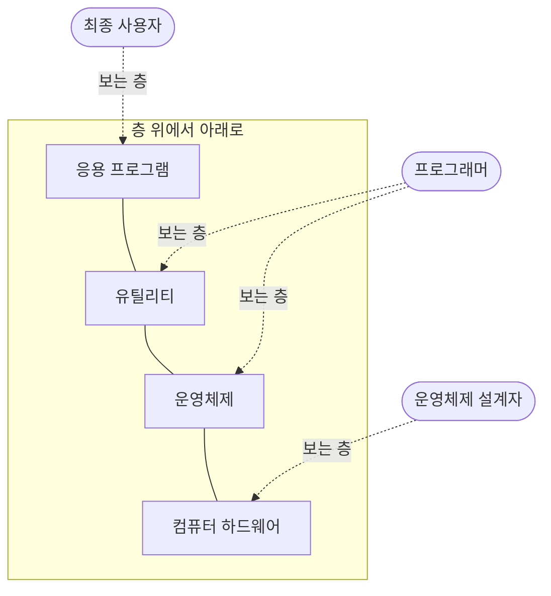



요약

운영체제는 응용 프로그램의 실행을 지휘하고, 응용 프로그램과 하드웨어 사이에서 통역하는 프로그램이다. 식당으로 치면 손님(사용자)과 주방 설비(하드웨어) 사이의 지배인이다. 손님은 메뉴만 고르면 되고, 화구를 누구에게 언제 줄지는 지배인이 정한다. 목표는 세 가지다. 쓰기 편하게, 자원을 효율적으로, 서비스를 멈추지 않고 새 기능을 넣을 수 있게.

## 예시로 보기

파이썬에서 `open("a.txt").read()` 한 줄을 쓰면 파일 내용이 나온다. 그 아래에서는 디스크의 어느 위치에 파일이 있는지 찾고, 디스크 컨트롤러에 맞는 명령을 보내고, 데이터를 주기억장치 어딘가에 받아 놓는 일이 일어난다. 이 일을 프로그래머 대신 해 주는 것이 운영체제다[^s1].

하드웨어 위에 소프트웨어가 층층이 있다고 보면 운영체제의 자리가 보인다[^1].

사람마다 들여다보는 층이 다르다. 최종 사용자는 응용 프로그램만 본다. 응용 프로그램을 기계어로 하드웨어를 직접 다루며 짜면 감당하기 어려울 만큼 복잡하다. 운영체제는 하드웨어의 세부를 가리고 편한 인터페이스를 준다[^1].

## 정확히 말하면

**세 가지 목표**[^2]

| 목표 | 뜻 |
|---|---|
| 편리성 | 컴퓨터를 쓰기 편하게 한다 |
| 효율성 | 시스템 자원을 효율적으로 쓰게 한다 |
| 발전 가능성 | 서비스를 방해하지 않고 새 기능을 개발·시험·도입할 수 있게 만든다 |

**제공하는 서비스**[^3]

| 서비스 | 내용 |
|---|---|
| 프로그램 개발 | 편집기, 디버거 같은 도구. 엄밀히는 운영체제의 핵심은 아니지만 함께 제공된다 |
| 프로그램 실행 | 명령어와 데이터를 주기억장치에 싣고, 입출력 장치와 파일을 준비하는 일 |
| 입출력 장치 접근 | 장치마다 다른 명령을 가리고, 읽기·쓰기 같은 같은 인터페이스를 준다 |
| 파일 접근 제어 | 장치와 저장 형식을 가리고 같은 인터페이스를 준다. 여러 사용자가 있으면 파일을 보호한다 |
| 시스템 접근 | 시스템 전체와 자원에 누가 접근할 수 있는지 통제한다 |
| 오류 감지와 대응 | 하드웨어 오류(메모리 오류, 장치 고장)와 소프트웨어 오류(0으로 나누기, 금지된 메모리 접근)에 대응한다. 프로그램을 끝내거나, 다시 시도하거나, 오류를 알린다 |
| 계정 관리(accounting) | 자원 사용 통계를 모으고 응답 시간 같은 성능을 살핀다 |

**자원 관리자로서의 운영체제.** 컴퓨터는 데이터를 옮기고, 저장하고, 처리하는 자원의 묶음이다. 운영체제가 이 자원을 관리한다[^4]. 그런데 운영체제도 프로세서가 실행하는 보통 프로그램이다. 그래서 운영체제는 프로세서를 자주 내주고, 다시 되찾으려면 프로세서에 기대야 한다[^5]. 운영체제 가운데 가장 자주 쓰는 부분은 늘 주기억장치에 있는데, 이 부분을 **커널**(kernel, 핵)이라고 부른다[^6].

**발전.** 운영체제는 세 가지 이유로 계속 바뀐다. 새 하드웨어(예: 페이징 하드웨어가 생기자 UNIX와 Mac OS가 그것을 쓰도록 바뀌었다), 새 서비스, 오류 수정이다[^7].

## 활용

- 운영체제가 "프로세서를 내주고 되찾는다"는 말이 어떻게 가능한지는 [인터럽트](/Hongs_Blog/studies/operating-systems/interrupt/)와 [사용자 모드와 커널 모드](/Hongs_Blog/studies/operating-systems/user-kernel-mode/)에 있다.
- 커널에 무엇까지 넣을지에 대한 답이 [마이크로커널](/Hongs_Blog/studies/operating-systems/microkernel/)과 모놀리식 커널로 갈린다.
- 운영체제가 맡는 다섯 큰 분야(프로세스, 메모리 관리, 정보 보호와 보안, 스케줄링과 자원 관리, 시스템 구조)가 이 과목의 뒤쪽 장들이다[^8].

## 연결

- 선수: [컴퓨터의 기본 구성 요소](/Hongs_Blog/studies/operating-systems/computer-basic-elements/)
- 다음: [운영체제의 발전](/Hongs_Blog/studies/operating-systems/os-evolution/)

## 확인 문제

<b>C1</b> 운영체제의 세 가지 목표를 쓰라.

**답:** 편리성, 효율성, 발전 가능성(서비스를 방해하지 않고 새 기능을 넣을 수 있음). 
**흔한 오답:** "보안"을 세 목표에 넣는 것. 보안은 운영체제가 다루는 큰 분야지만 슬라이드의 세 목표에는 없다.

<b>C2</b> 운영체제가 "프로세서를 내주고 되찾아야 한다"는 말은 운영체제의 어떤 성질에서 나오는가?

**답:** 운영체제도 프로세서가 실행하는 보통 프로그램이라는 성질. 프로세서는 한 번에 한 프로그램의 명령어만 실행하므로, 사용자 프로그램이 실행되는 동안 운영체제는 실행되지 않는다. 그래서 인터럽트 같은 하드웨어 장치로 프로세서를 되찾아야 한다.

[^1]: 운영체제 2회 강의 자료 「Chapter02-new」, 슬라이드 4 (그림 2.1)와 발표자 노트
[^2]: 같은 자료, 슬라이드 3과 발표자 노트
[^3]: 같은 자료, 슬라이드 5~7과 발표자 노트
[^4]: 같은 자료, 슬라이드 8
[^5]: 같은 자료, 슬라이드 9와 슬라이드 8의 발표자 노트
[^6]: 같은 자료, 슬라이드 10 (그림 2.2)과 슬라이드 9의 발표자 노트
[^7]: 같은 자료, 슬라이드 11과 슬라이드 10의 발표자 노트
[^8]: 같은 자료, 슬라이드 32
[^s1]: 보충 파이썬 `open` 예시는 원본에 없다. 슬라이드 5~6의 "입출력 장치 접근"과 "파일 접근 제어" 서비스를 한 줄의 코드에 대어 본 것이다.

