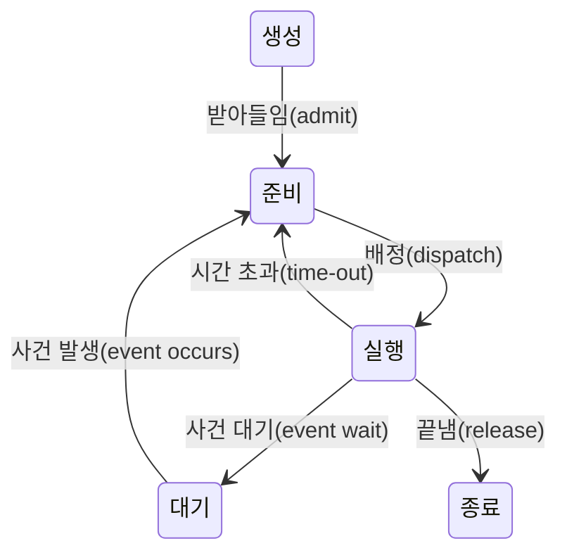
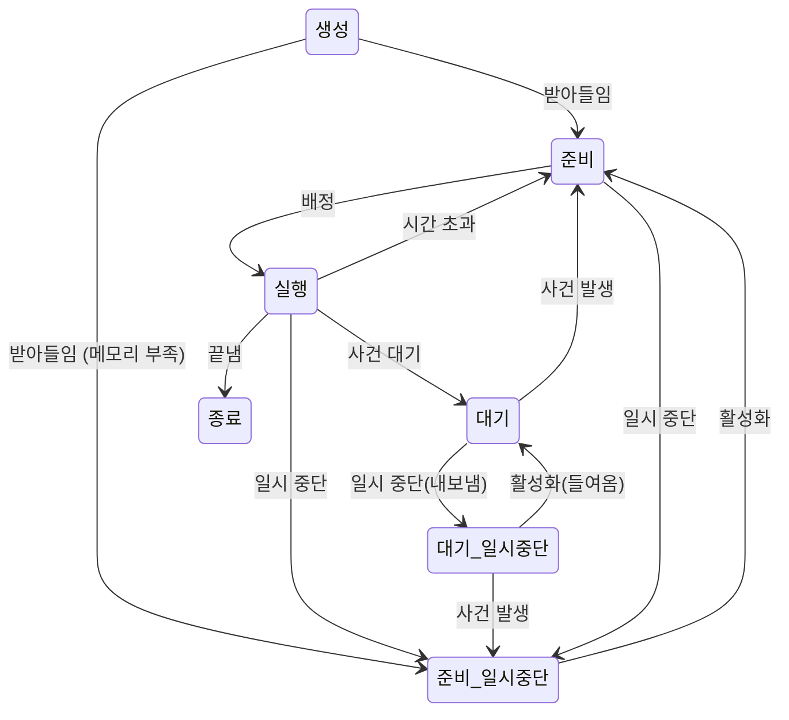



요약

메모리에 있는 프로세스는 늘 셋 중 하나다. 프로세서를 쓰는 중(실행), 프로세서만 주면 바로 할 수 있는데 차례를 기다리는 중(준비), 입출력 같은 일이 끝나기를 기다리는 중(대기). 병원 대기실로 치면 진료 중, 이름 불리기를 기다리는 중, 검사 결과를 기다리는 중이다. 이렇게 나눠 두면 운영체제가 다음 차례를 고를 때 "준비" 줄에서만 고르면 된다. 대신 기다리는 프로세스가 메모리를 차지해서 메모리가 모자라면, 일부를 디스크로 내보내는 일시 중단 상태가 더 필요해진다.

## 예시로 보기

프로세스를 "실행 중"과 "실행 중 아님" 둘로만 나눈다고 하자(2상태 모델)[^1]. 실행 중 아닌 프로세스는 한 줄로 서 있고, **디스패처**(프로세서를 한 프로세스에서 다른 프로세스로 넘겨주는 프로그램)가 맨 앞을 실행시킨다[^2].

문제가 있다. 줄 맨 앞의 프로세스가 프린터 출력이 끝나기를 기다리는 중이라면, 프로세서를 줘도 할 일이 없다. 디스패처는 줄을 처음부터 뒤져 "지금 실행할 수 있는" 프로세스를 찾아야 한다. 그래서 "실행 중 아님"을 둘로 나눈다. 프로세서만 주면 되는 **준비**와 사건을 기다리는 **대기**다[^3].

## 정확히 말하면

### 5상태 모델

| 상태 | 뜻 |
|---|---|
| 생성 (New) | 막 만들어져서 운영체제가 아직 실행할 수 있는 무리에 넣지 않은 프로세스 |
| 준비 (Ready) | 기회가 주어지면 바로 실행할 수 있다 |
| 실행 (Running) | 지금 프로세서에서 실행 중 |
| 대기 (Blocked) | 입출력 완료 같은 사건이 일어나기 전에는 실행할 수 없다 |
| 종료 (Exit) | 끝나서 실행 무리에서 빠졌다. 정보를 정리하기 전까지 잠깐 남아 있다 |

전이는 이 여섯뿐이다[^4]. 대기에서 실행으로 바로 가는 화살표는 없다. 기다리던 사건이 일어나도 일단 준비 줄에 서서 차례를 기다린다.

**큐.** 운영체제는 준비 큐와 대기 큐를 둔다. 대기 큐를 하나만 두면, 사건이 일어날 때마다 그 사건을 기다리던 프로세스를 큐 전체에서 찾아야 한다. 그래서 사건마다 대기 큐를 따로 둔다(예: 디스크 대기 큐, 키보드 대기 큐). 사건이 일어나면 그 큐의 프로세스를 모두 준비 큐로 옮긴다[^5].

### 일시 중단 상태

프로세서는 입출력보다 훨씬 빠르다. 그래서 메모리에 있는 프로세스가 **모두** 입출력을 기다리는 일이 생긴다. 이때 프로세서는 논다. 메모리를 늘리면 해결되지만 비싸고, 프로그램도 커진다. 대신 기다리는 프로세스 일부를 디스크로 내보내(스와핑) 메모리를 비우고, 새 프로세스나 일시 중단된 프로세스를 들여온다[^6]. 그러면 상태가 둘 더 생긴다[^6].

| 상태 | 뜻 |
|---|---|
| 대기/일시 중단 (Blocked/Suspend) | 디스크로 나가 있고, 사건도 기다리는 중 |
| 준비/일시 중단 (Ready/Suspend) | 디스크로 나가 있지만, 메모리로 들여오기만 하면 실행할 수 있다 |

이 그림은 슬라이드 그림 3.9b를 옮긴 것이다[^7]. 일시 중단된 프로세스는 바로 실행될 수 없다. 먼저 활성화되어 메모리로 돌아와야 한다.

검증: 전이 표로 카드 C3의 사건 순서를 따라가면 생성 → … → 종료가 나오고, 대기 → 실행 같은 없는 전이는 거절된다 — [14_process-states_verify.py](/Hongs_Blog/studies/operating-systems/code/14_process-states_verify/)

## 스스로 설명해 보기

1. 준비와 대기를 나눈다.
   

근거

   디스패처가 다음 실행할 프로세스를 고를 때 사건을 기다리는 프로세스를 걸러 내야 한다. 처음부터 두 줄로 나눠 두면 준비 줄 맨 앞을 바로 고를 수 있다.
   

2. 사건이 일어나면 대기 → 준비로 간다. 실행으로 가지 않는다.
   

근거

   그 순간 프로세서는 다른 프로세스가 쓰고 있다. 사건이 일어났다고 실행 중인 프로세스를 무조건 밀어내지는 않는다. 차례는 스케줄러가 정한다.
   

3. 일시 중단 상태가 필요하다.
   

근거

   메모리에 있는 프로세스가 모두 대기면 준비 줄이 비어 프로세서가 논다. 대기 중인 프로세스를 디스크로 내보내 메모리를 비워야 준비된 프로세스를 들일 수 있다.
   

- 핵심 아이디어는?
  

답

  "무엇을 기다리는가"(프로세서인가, 사건인가)와 "어디에 있는가"(메모리인가, 디스크인가)라는 두 기준으로 상태를 나눈다. 준비·대기 × 메모리·디스크가 네 칸이다.
  

- 같은 생각을 쓰는 다른 곳은?
  

답

  [스레드](/Hongs_Blog/studies/operating-systems/thread/)도 실행·준비·대기 상태를 가진다. 다만 일시 중단은 주소 공간을 내보내는 일이므로 스레드가 아니라 프로세스 단위로 일어난다.
  

## 활용

- UNIX는 이 모델을 더 잘게 나눈다. 사용자 모드 실행과 커널 모드 실행을 따로 두고, 끝났지만 부모가 아직 정리하지 않은 좀비(Zombie) 상태가 있다[^8].
- 리눅스에서 `ps` 명령의 STAT 칸이 상태를 보여 준다. R은 실행 중이거나 실행 가능, S는 사건을 기다리며 잠듦, Z는 좀비다[^s1].

## 연결

- 선수: [프로세스](/Hongs_Blog/studies/operating-systems/process/), [인터럽트](/Hongs_Blog/studies/operating-systems/interrupt/) (시간 초과는 타이머 인터럽트로 일어난다)
- 상태를 적어 두는 곳: [프로세스 제어 블록](/Hongs_Blog/studies/operating-systems/process-control-block/)
- 상태가 바뀔 때 운영체제가 하는 일: [프로세스 생성과 전환](/Hongs_Blog/studies/operating-systems/process-creation-switching/)

## 자주 하는 오해

"기다리던 입출력이 끝나면 프로세스는 곧바로 다시 실행된다"

틀렸다. 사건이 끝났으니 바로 이어 가는 것이 자연스러워 보인다. 하지만 사건 발생은 대기 → **준비** 전이다. 그 순간 프로세서는 다른 프로세스가 쓰고 있으므로, 스케줄러가 고를 때까지 준비 큐에서 기다린다. 확인하는 방법: 5상태 그림에 대기 → 실행 화살표가 없다.

"일시 중단은 대기와 같은 말이다"

틀렸다. 대기는 **사건**을 기다리는 것이고, 일시 중단은 **디스크로 내보내진** 것이다. 둘은 독립이다. 그래서 준비/일시 중단이 있다. 사건은 이미 일어나 실행할 준비가 됐지만 아직 디스크에 있는 프로세스다.

## 확인 문제

<b>C1</b> 5상태 모델의 다섯 상태와 여섯 전이를 쓰라.

**답:** 상태: 생성, 준비, 실행, 대기, 종료. 전이: 생성→준비(받아들임), 준비→실행(배정), 실행→준비(시간 초과), 실행→대기(사건 대기), 대기→준비(사건 발생), 실행→종료(끝냄).

<b>C2</b> 2상태 모델(실행 / 실행 중 아님)에 한 줄 큐만 두면 디스패처가 곤란한 이유는?

**답:** 실행 중 아닌 프로세스 가운데 입출력을 기다리는 것이 섞여 있어서, 큐에 가장 오래 있던 프로세스를 골라도 실행할 수 없을 수 있다. 디스패처가 큐를 뒤져 실행 가능한 것을 찾아야 한다.

<b>C3</b> 7상태 모델에서 한 프로세스에 다음 사건이 차례로 일어난다: 받아들임, 배정, 디스크 읽기 요청(사건 대기), 메모리가 모자라 내보냄, 디스크 읽기 완료, 다시 들여옴, 배정, 끝냄. 거치는 상태를 순서대로 쓰라.

**답:** 생성 → 준비 → 실행 → 대기 → 대기/일시 중단 → 준비/일시 중단 → 준비 → 실행 → 종료. 
**흔한 오답:** 디스크 읽기가 끝날 때 대기로 돌아가는 것. 디스크에 나가 있는 채로 사건이 일어나면 준비/일시 중단으로 간다.

<b>C4</b> "대기 → 실행" 전이를 허용하면 어떤 문제가 생기는지 상황 하나로 보여라.

**답:** 프로세스 A가 실행 중일 때 B가 기다리던 입출력이 끝났다. 대기 → 실행을 허용하면, 프로세서가 하나뿐이므로 A를 강제로 밀어내야 한다. 그러면 입출력이 끝날 때마다 실행 중인 프로세스가 끊겨 스케줄러가 정한 순서와 공평성이 깨진다. 그래서 B는 준비로 가고, 다음 차례는 스케줄러가 정한다.

[^1]: 3-1학기/운영체제/1.수업자료/03.chap3 (Stony Brook).pdf, p.5
[^2]: 같은 자료, p.4
[^3]: 같은 자료, p.10
[^4]: 같은 자료, p.11~12
[^5]: 같은 자료, p.13~14
[^6]: 같은 자료, p.15
[^7]: 같은 자료, p.16
[^8]: 같은 자료, p.35
[^s1]: 에이전트 보충. 이 장은 교수 자료가 없어 Stony Brook 대학 CSE306의 공개 슬라이드(Stallings 교재 기반)를 원본으로 썼다. 병원 비유, 각 상태의 뜻 풀이, 큐를 사건마다 두는 이유, `ps` 연결, 확인 문제 C3·C4는 슬라이드에 없다. 상태 뜻은 Stallings, *Operating Systems: Internals and Design Principles* 6판, 3.2절을 따랐다.

