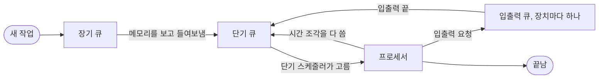


<div class="callout callout-summary" markdown="1">
<div class="callout-title callout-title--default" markdown="span">요약</div>

프로세스는 실행 중인 프로그램이다. 프로그램이 요리책이라면 프로세스는 그 요리책으로 지금 요리하는 중인 상태다. 몇 쪽까지 했는지, 어떤 재료를 썰어 두었는지까지 포함한다. 운영체제는 이 "어디까지 했나" 기록(실행 문맥)을 따로 챙겨 두기 때문에, 여러 프로그램을 번갈아 돌려도 각자 멈춘 자리에서 이어 갈 수 있다. 다만 여러 프로세스가 자원을 함께 쓰면 순서와 다툼을 잘 관리해야 한다.

</div>


## 예시로 보기

같은 프로그램으로 프로세스를 여러 개 만들 수 있다. 크롬 창을 두 개 띄우면 같은 프로그램 파일에서 실행 중인 것이 두 개 생긴다. 각자 다른 페이지를 열고, 다른 위치까지 스크롤한다. 프로그램 코드는 같아도 데이터와 "지금 어디까지 왔나"가 다르다[^s1].

슬라이드 그림 2.8에서는 프로세스 A와 B가 주기억장치에 함께 있다[^1].

```
주기억장치                         프로세서 레지스터
┌──────────────┐                 ┌───────────────┐
│ 프로세스 목록  │ ← i, j 칸        │ 프로세스 번호: j │ → 지금 B가 실행 중
├──────────────┤                 │ PC            │ → B의 코드 안
│ A: 문맥       │                 │ 기준(base): b  │ → B 영역의 시작
│    데이터     │                 │ 한계(limit): h │ → B 영역의 크기
│    프로그램    │                 └───────────────┘
├──────────────┤
│ B: 문맥       │ ← b부터
│    데이터     │   h만큼
│    프로그램    │
└──────────────┘
```

- 운영체제는 **프로세스 목록**에 프로세스마다 한 칸을 두고, 그 프로세스의 메모리 위치를 적는다. 실행 문맥 일부나 전부를 함께 적기도 한다.
- 프로세스 번호 레지스터는 지금 프로세서를 쓰는 프로세스가 목록의 몇 번째인지 가리킨다.
- **기준 레지스터**와 **한계 레지스터**는 그 프로세스가 차지한 메모리 구역의 시작과 크기다. 모든 주소를 기준값에서부터 세고, 한계를 넘으면 막는다. 그래서 프로세스끼리 서로의 메모리를 건드리지 못한다.

그림에서 B가 실행 중이고, A는 앞서 실행되다 끊겼다. A가 끊긴 순간의 레지스터 값은 A의 문맥에 저장되어 있다. 나중에 운영체제가 B의 문맥을 저장하고 A의 문맥을 되살리면, PC가 A의 코드를 가리키는 순간 A가 이어서 실행된다. 이것을 **프로세스 전환**(process switch)이라고 부른다[^1].

## 정확히 말하면

프로세스라는 말은 1960년대 Multics 설계자들이 처음 썼다. 작업(job)보다 넓은 말이다[^2]. 슬라이드는 네 가지 정의를 든다[^3].

- 실행 중인 프로그램
- 컴퓨터에서 돌고 있는 프로그램의 한 사례(instance)
- 프로세서에 배정되어 실행될 수 있는 단위
- 하나의 순차적인 실행 흐름, 현재 상태, 그에 딸린 시스템 자원으로 이루어진 활동 단위

**구성 요소**[^4]

| 요소 | 내용 |
|---|---|
| 실행 가능한 프로그램 | 코드 |
| 프로그램이 쓰는 데이터 | 변수, 작업 공간, 버퍼 |
| 실행 문맥 (프로세스 상태) | 운영체제가 프로세스를 관리하는 데 필요한 모든 정보. 레지스터 값(PC, 데이터 레지스터 등)과 운영체제가 쓰는 정보(우선순위, 어떤 입출력을 기다리는지) |

실행 문맥은 프로세스 자신과 분리해서 둔다. 운영체제만 알아야 하고 프로세스는 볼 수 없는 정보가 들어 있기 때문이다[^4].

### 왜 프로세스라는 틀이 필요했나

다중 프로그래밍, 시분할, 실시간 거래 처리를 만들면서 시스템 소프트웨어에 미묘한 오류가 쏟아졌다. 드물게 특정 순서로 일이 벌어질 때만 나타나서 재현하기도 어려웠다. 원인은 크게 네 가지였다[^5].

| 원인 | 무슨 일이 생기나 |
|---|---|
| 잘못된 동기화 | 다른 곳의 사건을 기다리는 루틴에 신호가 사라지거나 두 번 온다. 예: 입출력 읽기를 시작한 프로그램이 데이터가 버퍼에 들어오기 전에 진행한다 |
| 상호 배제 실패 | 두 사용자가 같은 파일을 동시에 고쳐서 내용이 깨진다. 한 번에 한 루틴만 고치게 막는 장치가 필요하다 |
| 비결정적 동작 | 메모리를 함께 쓰는 프로그램들이 번갈아 실행되며 서로의 값을 덮어쓴다. 결과가 입력이 아니라 실행 순서에 따라 달라진다 |
| 교착상태 | 두 프로그램이 서로 상대가 가진 자원을 기다리며 둘 다 멈춘다. 예: 디스크→테이프 복사에 장치 두 개가 필요한데 각자 하나씩 쥐고 있다 |

프로세스는 실행 흐름, 상태, 자원을 한 묶음으로 다뤄서 이런 문제를 체계적으로 관리하는 틀이다[^s2].

### 운영체제가 프로세스를 줄 세우는 방법

운영체제는 자원을 기다리는 프로세스들을 큐(대기 줄)로 관리한다[^6].

| 큐 | 들어 있는 프로세스 | 누가 고르나 |
|---|---|---|
| 단기 큐 | 메모리에 있고 프로세서만 주면 바로 실행할 수 있는 것들 | 단기 스케줄러(디스패처). 차례로 시간을 주거나(라운드 로빈), 우선순위 순으로 고른다 |
| 장기 큐 | 아직 시스템에 들어오지 못한 새 작업들 | 운영체제가 메모리를 너무 많이 내주지 않게 조절하며 단기 큐로 옮긴다 |
| 입출력 큐 | 특정 입출력 장치를 기다리는 것들. 장치마다 하나 | 장치가 비면 운영체제가 누구에게 줄지 정한다 |



프로세서로 들어가는 길은 단기 큐 하나뿐이다. 입출력을 기다리던 프로세스도 일이 끝나면 단기 큐로 돌아가 다시 차례를 기다린다[^s3].

인터럽트나 서비스 요청을 처리하고 나면 단기 스케줄러가 불려 다음에 실행할 프로세스를 고른다. 이렇게 고를 때는 세 가지를 따진다. 비슷한 작업에 비슷한 몫을 주는 공평성, 요구가 다른 작업을 다르게 대하는 차등 응답성, 처리량·응답 시간·사용자 수를 챙기는 효율성이다. 이 셋은 서로 부딪힌다[^7].

## 활용

- 프로세스 전환은 [인터럽트](/Hongs_Blog/studies/operating-systems/interrupt/) 처리 때 레지스터를 저장하고 복원하는 것과 같은 일을, 프로그램 단위로 하는 것이다.
- 기준·한계 레지스터의 생각을 일반화한 것이 [가상 메모리](/Hongs_Blog/studies/operating-systems/virtual-memory/)다.
- 4장은 프로세스가 가진 두 성격(자원을 가짐, 실행 흐름)을 떼어 내 실행 흐름만 따로 [스레드](/Hongs_Blog/studies/operating-systems/thread/)로 부른다.
- 3장(프로세스의 상태와 제어 블록)은 이 강의 자료에 없다. 실행·준비·대기 세 상태는 [스레드](/Hongs_Blog/studies/operating-systems/thread/) 문서에 짧게 넣었다.

## 연결

- 선수: [다중 프로그래밍](/Hongs_Blog/studies/operating-systems/multiprogramming/), [프로세서 레지스터](/Hongs_Blog/studies/operating-systems/processor-registers/)
- 다음: [스레드](/Hongs_Blog/studies/operating-systems/thread/)
- 상호 배제와 교착상태는 5~6장(병행성)의 주제다.

## 확인 문제

<details markdown="1"><summary markdown="span"><b>C1</b> 프로세스의 세 구성 요소를 쓰고, 그중 운영체제가 프로세스를 관리하는 데 꼭 필요한 것은 무엇인지 쓰라.</summary>


**답:** 실행 가능한 프로그램, 프로그램이 쓰는 데이터, 실행 문맥(프로세스 상태). 관리에 꼭 필요한 것은 실행 문맥이다. 레지스터 값과 우선순위, 기다리는 입출력 같은 정보가 들어 있다.

</details>

<details markdown="1"><summary markdown="span"><b>C2</b> 그림 2.8에서 B가 실행 중이다. 운영체제가 A로 전환할 때 하는 일을 순서대로 쓰라. 전환 뒤 프로세스 번호 레지스터와 기준·한계 레지스터는 무엇을 가리키는가?</summary>


**답:** ① B의 레지스터 값을 B의 문맥에 저장한다. ② A의 문맥에서 레지스터 값을 꺼내 되돌린다. ③ PC에 A의 코드 안 주소가 들어가면 A가 이어서 실행된다. 전환 뒤 프로세스 번호 레지스터는 목록의 A 칸(i)을, 기준·한계 레지스터는 A 영역의 시작과 크기를 가리킨다.

</details>

<details markdown="1"><summary markdown="span"><b>C3</b> 다음 각 상황은 네 가지 오류 원인 중 무엇인가? ① 두 사람이 동시에 같은 은행 계좌에서 돈을 빼서 잔액이 틀어졌다. ② 프로그램 A는 프린터를 쥐고 스캐너를, B는 스캐너를 쥐고 프린터를 기다린다. ③ 같은 입력인데 실행할 때마다 결과가 다르다.</summary>


**답:** ① 상호 배제 실패. ② 교착상태. ③ 비결정적 동작.<br>
**흔한 오답:** ③을 교착상태로 보는 것. 교착상태는 멈추는 것이고, ③은 끝나긴 하는데 결과가 달라지는 것이다.

</details>

[^1]: 3-1학기/운영체제/1.수업자료/02.Chapter02-new.pptx, 슬라이드 36 (그림 2.8)과 슬라이드 35의 발표자 노트
[^2]: 같은 자료, 슬라이드 32의 발표자 노트
[^3]: 같은 자료, 슬라이드 33
[^4]: 같은 자료, 슬라이드 35와 슬라이드 34의 발표자 노트
[^5]: 같은 자료, 슬라이드 34와 슬라이드 33의 발표자 노트
[^6]: 같은 자료, 슬라이드 44 (그림 2.11)와 슬라이드 43의 발표자 노트
[^7]: 같은 자료, 슬라이드 43과 슬라이드 42의 발표자 노트
[^s1]: 에이전트 보충. 크롬 창 예시와 ASCII 그림은 원본에 없다. 그림은 원본 그림 2.8의 요소를 옮긴 것이다.
[^s2]: 에이전트 보충. 네 가지 오류 원인과 프로세스 개념을 잇는 문장은 원본 순서(오류 원인 → 프로세스 구성 요소)를 해석한 것이다. 확인 문제 C3의 상황은 원본에 없다.
[^s3]: 에이전트 보충. 다이어그램 1개는 원본에 없다. "운영체제가 프로세스를 줄 세우는 방법"의 큐 표(슬라이드 43~44, 그림 2.11)를 흐름도로 옮겼다. "시간 조각을 다 씀" 화살표는 표의 라운드 로빈 설명을 나타낸 것이다.

