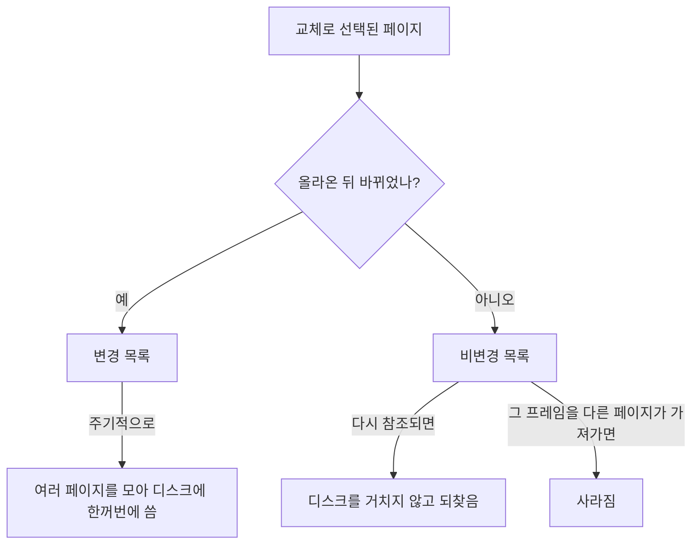


<div class="callout callout-summary" markdown="1">
<div class="callout-title callout-title--default" markdown="span">요약</div>

가상 메모리를 운영하는 운영체제는 교체 말고도 여러 결정을 한다. 페이지를 언제 가져올지, 프로세스마다 프레임을 몇 개 줄지, 내보낼 페이지를 그 프로세스 안에서만 고를지 전체에서 고를지, 바뀐 페이지를 언제 디스크에 쓸지, 메모리에 프로세스를 몇 개 올릴지다. 목표는 하나, 페이지 부재를 줄이는 것이다. 하지만 어느 결정에도 늘 최선인 답은 없고, 특히 프로세스를 너무 많이 올리면 시스템 전체가 스래싱에 빠진다.

</div>


## 예시로 보기

메모리에 프로세스를 하나씩 더 올린다고 하자. 처음에는 프로세서 사용률이 오른다. 한 프로세스가 기다릴 때 다른 프로세스가 일하기 때문이다([다중 프로그래밍](/Hongs_Blog/studies/operating-systems/multiprogramming/)). 그런데 어느 지점을 넘으면 사용률이 뚝 떨어진다. 프로세스마다 받는 프레임이 너무 적어져, 모두가 페이지 부재를 내며 디스크를 기다리기 때문이다. 이것이 스래싱이다[^1].

```
프로세서 사용률
   ▲        ___
   │      /     \
   │    /        \
   │  /           \___
   │/                   ‾‾‾‾
   └────────────────────────▶ 메모리에 올린 프로세스 수
              ↑ 최고점을 넘으면 스래싱
```

이 그림은 슬라이드 그림 8.21의 모양을 옮긴 것이다.

## 정확히 말하면

메모리 관리를 설계할 때 정할 것은 셋이다. 가상 메모리를 쓸지, 페이징·세그먼테이션 중 무엇을 쓸지, 각 부분에 어떤 알고리즘을 쓸지다[^2]. 운영체제 정책의 핵심 목표는 페이지 부재를 줄이는 것이고, 정답인 정책은 없다[^3].

| 정책 | 정하는 것 | 선택지 |
|---|---|---|
| 반입 | 페이지를 언제 주기억장치로 가져올까 | **요구 페이징**: 그 페이지의 주소를 참조할 때만 가져온다. 프로세스가 막 시작할 때 부재가 많다. **선행 페이징**: 필요한 것보다 더 가져온다. 디스크에서 붙어 있는 페이지를 한꺼번에 가져오는 편이 효율적이기 때문이다. 스와핑과 헷갈리지 말 것[^4] |
| 배치 | 실제 메모리의 어디에 둘까 | 세그먼테이션에서 중요하다(최적 적합, 최초 적합 등). 페이징에서는 하드웨어가 주소를 바꾸므로 어느 프레임이든 상관없다[^5] |
| 교체 | 무엇을 내보낼까 | [페이지 교체 알고리즘](/Hongs_Blog/studies/operating-systems/page-replacement/) |
| 상주 집합 | 프로세스마다 프레임을 몇 개, 교체 범위는 | 아래 |
| 정리 | 바뀐 페이지를 언제 디스크에 쓸까 | 아래 |
| 적재 제어 | 메모리에 프로세스를 몇 개 둘까 | 아래 |

### 상주 집합 관리

프로세스마다 몇 페이지를 올릴지 정한다. 프레임을 적게 주면 더 많은 프로세스를 메모리에 둘 수 있지만 각자 부재가 늘어난다. 어느 크기를 넘으면 더 줘도 부재율이 거의 줄지 않는다[^6].

| | 지역 교체 (부재를 낸 프로세스의 페이지 중에서) | 전역 교체 (잠기지 않은 모든 페이지 중에서) |
|---|---|---|
| 고정 할당 (프레임 수 고정) | 할당량을 미리 정한다. 너무 적으면 부재가 많고, 너무 많으면 메모리에 올릴 프로그램이 적어 프로세서가 놀거나 스와핑이 늘어난다 | 불가능하다. 남의 페이지를 빼앗으면 할당량이 바뀐다 |
| 가변 할당 (프레임 수가 바뀜) | 새 프로세스에게 응용 종류·요청 등에 따라 프레임을 준다. 부재가 나면 자기 페이지 중에서 고르고, 때때로 할당량을 다시 평가한다 | 구현이 가장 쉽고 많은 운영체제가 쓴다. 빈 프레임 목록에서 부재 난 프로세스에게 준다. 빈 프레임이 없으면 다른 프로세스의 페이지를 빼앗는데, 누구 것을 빼앗을지가 어렵다 |

이 표는 슬라이드 표 8.5와 슬라이드 74~77을 합친 것이다[^7]. Windows는 가변 할당, 지역 교체를 쓴다. 프로세스마다 작업 집합을 두고, 주기억장치 여유에 따라 크기를 조절한다[^8].

### 정리 정책

| 방식 | 내용 |
|---|---|
| 요구 정리 | 교체로 선택되었을 때만 디스크에 쓴다 |
| 사전 정리 | 여러 페이지를 모아서 미리 쓴다 |

가장 좋은 방법은 페이지 버퍼링과 함께 쓰는 것이다. 내보낸 페이지를 변경·비변경 두 목록에 넣고, 변경 목록은 주기적으로 모아서 쓴다. 비변경 목록의 페이지는 다시 참조되면 되찾고, 그 프레임을 다른 페이지가 가져가면 사라진다[^9].



내보낸 페이지는 곧바로 디스크로 가지 않는다. 바뀐 페이지는 목록에 모였다가 한꺼번에 쓰이고, 바뀌지 않은 페이지는 프레임을 빼앗기기 전까지 되찾을 기회가 있다[^s2].

### 적재 제어

메모리에 상주할 프로세스 수, 곧 **다중 프로그래밍 수준**을 정한다. 너무 적으면 모든 프로세스가 동시에 막히는 일이 잦아 스와핑에 시간을 많이 쓴다. 너무 많으면 스래싱이 생긴다[^10].

수준을 낮춰야 하면 프로세스를 하나 이상 일시 중단(디스크로 내보냄)한다. 누구를 고를지 기준은 여섯이다[^11].

| 대상 | 이유 |
|---|---|
| 우선순위가 가장 낮은 프로세스 | 스케줄링 정책과 맞는다 |
| 페이지 부재를 낸 프로세스 | 작업에 필요한 페이지가 메모리에 없어 어차피 막힌다 |
| 가장 최근에 활성화된 프로세스 | 필요한 페이지가 메모리에 있을 가능성이 가장 작다 |
| 상주 집합이 가장 작은 프로세스 | 나중에 다시 올리는 비용이 가장 적다 |
| 가장 큰 프로세스 | 빈 프레임을 가장 많이 얻는다 |
| 남은 실행 시간이 가장 긴 프로세스 | 짧은 작업부터 끝내게 한다 |

## 활용

- SVR4 UNIX는 빈 프레임이 임계값 아래로 떨어지면 커널이 여러 프레임을 한꺼번에 빼앗아 빈 목록을 채운다[^12]. 커널 자신의 작은 버퍼에는 페이징 대신 [버디 시스템](/Hongs_Blog/studies/operating-systems/buddy-system/)의 변형인 게으른 버디(lazy buddy)를 쓴다. 블록을 합치는 일을 꼭 필요해 보일 때까지 미뤄, 쓸데없이 쪼개고 합치는 일을 줄인다[^13].
- 스래싱이 의심되면(디스크가 계속 돌고 프로그램이 거의 진행하지 않음) 실행 중인 프로그램 수를 줄이는 것이 메모리 증설 전에 할 수 있는 대처다[^s1].

## 연결

- 선수: [페이지 교체 알고리즘](/Hongs_Blog/studies/operating-systems/page-replacement/)
- 일시 중단 상태: [프로세스 상태](/Hongs_Blog/studies/operating-systems/process-states/)
- 다중 프로그래밍의 이득과 그 한계: [다중 프로그래밍](/Hongs_Blog/studies/operating-systems/multiprogramming/)

## 확인 문제

<details markdown="1"><summary markdown="span"><b>C1</b> 고정 할당과 전역 교체를 함께 쓸 수 없는 이유는?</summary>


**답:** 전역 교체는 다른 프로세스의 페이지를 내보내고 그 프레임을 부재 낸 프로세스에게 준다. 그러면 두 프로세스의 프레임 수가 바뀌어 "프레임 수 고정"이 깨진다.

</details>

<details markdown="1"><summary markdown="span"><b>C2</b> 그림 8.21에서 다중 프로그래밍 수준을 높일 때 프로세서 사용률이 처음엔 오르다가 어느 지점부터 떨어지는 이유를 각각 쓰라.</summary>


**답:** 오를 때: 프로세스가 많을수록 한 프로세스가 기다리는 동안 다른 프로세스가 실행될 가능성이 커진다. 떨어질 때: 프로세스마다 받는 프레임이 작업에 필요한 만큼보다 적어져 페이지 부재가 폭증한다. 대부분의 프로세스가 디스크를 기다리느라 프로세서가 논다(스래싱).

</details>

<details markdown="1"><summary markdown="span"><b>C3</b> 요구 페이징과 선행 페이징을 비교하라. 프로그램이 막 시작할 때 둘의 차이는?</summary>


**답:** 요구 페이징은 참조된 페이지만 가져와 쓸데없는 페이지를 들이지 않지만, 시작할 때 페이지마다 부재가 나서 부재가 많다. 선행 페이징은 디스크에서 이어 붙은 페이지를 함께 가져와 시작 때의 부재를 줄이지만, 끝내 쓰지 않을 페이지까지 들여올 수 있다.

</details>

[^1]: 3-1학기/운영체제/1.수업자료/08.Chapter08-new.pptx, 슬라이드 81~82 (그림 8.21)
[^2]: 같은 자료, 슬라이드 47
[^3]: 같은 자료, 슬라이드 48 (표 8.4)
[^4]: 같은 자료, 슬라이드 49~50
[^5]: 같은 자료, 슬라이드 51
[^6]: 같은 자료, 슬라이드 72
[^7]: 같은 자료, 슬라이드 73~78 (표 8.5)
[^8]: 같은 자료, 슬라이드 110
[^9]: 같은 자료, 슬라이드 79~80
[^10]: 같은 자료, 슬라이드 81
[^11]: 같은 자료, 슬라이드 83~85
[^12]: 같은 자료, 슬라이드 93
[^13]: 같은 자료, 슬라이드 96~99
[^s1]: 에이전트 보충. 스래싱 대처 이야기와 확인 문제는 슬라이드에 없다. 그림 8.21은 ASCII로 모양만 옮겼다.
[^s2]: 에이전트 보충. 다이어그램 1개는 원본에 없다. "정리 정책" 아래 문단(슬라이드 79~80)을 흐름도로 옮겼다.

