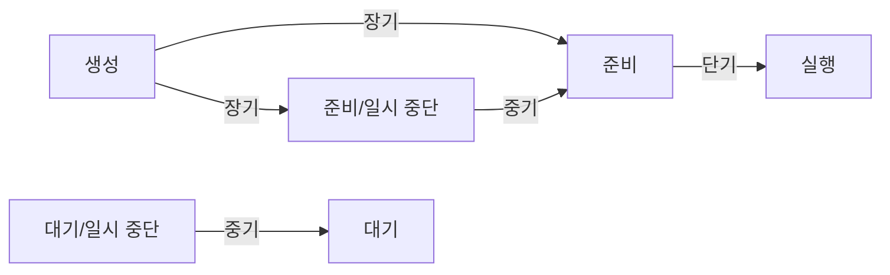



요약

프로세서 스케줄링은 시간이 흐르는 동안 어느 프로세스에게 프로세서를 줄지 정하는 일이다. 결정의 주기에 따라 세 층이 있다. 새 작업을 시스템에 들일지(장기), 디스크로 내보낸 프로세스를 메모리로 다시 들일지(중기), 지금 준비된 프로세스 중 누구를 다음에 실행할지(단기)다. 좋은 스케줄링의 기준은 응답 시간, 처리량, 프로세서 효율, 공평성처럼 여럿인데, 이들은 서로 부딪힌다.

## 예시로 보기

병원에 비유하면 이렇다[^s1].

| 층 | 병원에서 | 결정 주기 |
|---|---|---|
| 장기 | 오늘 접수를 몇 명까지 받을까 | 가끔 (작업이 들어올 때) |
| 중기 | 대기실이 꽉 차서 밖에서 기다리게 한 환자를 언제 다시 들일까 | 때때로 |
| 단기 | 지금 진료실에 다음으로 누구를 부를까 | 아주 자주 (진료가 끝날 때마다) |

## 정확히 말하면

스케줄링의 목표는 응답 시간, 처리량, 프로세서 효율 같은 시스템 목표를 맞추도록 프로세스를 시간에 따라 프로세서에 배정하는 것이다[^1]. 스케줄링은 다음을 해야 한다[^2].

- 프로세스들 사이에 시간을 공평하게 나눈다.
- 기아를 막는다.
- 프로세서를 효율적으로 쓴다.
- 스케줄링 자체의 부담이 작아야 한다.
- 필요하면 우선순위를 둔다(예: 실시간 마감 시간).

### 세 층의 스케줄링

[7상태 모델](/Hongs_Blog/studies/operating-systems/process-states/)의 전이에 각 스케줄러가 붙는다[^3].

| 스케줄러 | 맡는 전이 | 내용 |
|---|---|---|
| 장기 | 생성 → 준비(또는 준비/일시 중단) | 어떤 프로그램을 시스템에 들여 처리할지 정한다. 선착순이나 우선순위·입출력 요구·예상 실행 시간 같은 기준으로 고른다. 다중 프로그래밍 수준을 조절한다. 프로세스가 많을수록 각자 실행되는 시간 비율은 줄어든다[^4] |
| 중기 | 준비/일시 중단 → 준비, 대기/일시 중단 → 대기 | 스와핑의 일부다. 다시 들일지는 다중 프로그래밍 수준을 관리할 필요로 정한다. 가상 메모리가 없으면 내보낸 프로세스의 메모리 요구도 따진다[^5] |
| 단기 | 준비 → 실행 | 디스패처라고도 부른다. 가장 자주 실행되며 다음에 실행할 프로세스를 정한다. 시계 인터럽트, 입출력 인터럽트, 운영체제 호출, 시그널(예: 세마포어)처럼 지금 프로세스를 막거나 선점할 기회가 되는 사건마다 불린다[^6] |

### 단기 스케줄링의 기준

정책을 평가하려면 기준이 필요하다[^7]. 두 축으로 나눈다[^8].

| | 성능 관련 (재기 쉬움) | 성능과 무관 (재기 어려움) |
|---|---|---|
| 사용자 중심 | 반환 시간(제출부터 끝날 때까지), 응답 시간(요청부터 첫 출력까지), 마감 시간 지키기 | 예측 가능성(같은 작업이 언제 돌려도 비슷한 시간에 끝남) |
| 시스템 중심 | 처리량(단위 시간당 끝낸 프로세스 수), 프로세서 사용률 | 공평성, 우선순위 지키기, 자원 균형 |

이 표는 슬라이드 표 9.2(그림)를 정리한 것이다[^9]. 기준들은 서로 부딪힌다. 예를 들어 응답 시간을 줄이려고 프로세스를 자주 바꾸면 전환 부담이 늘어 처리량이 준다[^s1].

### 우선순위

많은 시스템은 프로세스마다 우선순위를 주고, 스케줄러는 늘 높은 우선순위를 먼저 고른다. 우선순위마다 준비 큐를 따로 둔다(RQ0이 가장 높음)[^10]. UNIX를 비롯한 많은 시스템에서는 **값이 클수록 우선순위가 낮다**. Windows는 반대다[^10].

문제는 기아다. 높은 우선순위 프로세스가 끊임없이 들어오면 낮은 우선순위 프로세스는 영원히 차례가 오지 않는다. 해결책은 프로세스가 기다린 시간(나이)이나 실행 기록에 따라 우선순위를 바꾸는 것이다(에이징)[^11].

## 활용

- 9장의 알고리즘은 모두 단기 스케줄러의 선택 규칙이다 → [스케줄링 알고리즘](/Hongs_Blog/studies/operating-systems/scheduling-algorithms/)
- 중기 스케줄링이 하는 일시 중단은 8장의 적재 제어와 같은 일이다 → [상주 집합 관리와 적재 제어](/Hongs_Blog/studies/operating-systems/resident-set-load-control/)

## 연결

- 선수: [프로세스 상태](/Hongs_Blog/studies/operating-systems/process-states/), [상주 집합 관리와 적재 제어](/Hongs_Blog/studies/operating-systems/resident-set-load-control/)
- 2장에서 본 큐 그림(단기·장기·입출력 큐): [프로세스](/Hongs_Blog/studies/operating-systems/process/)

## 확인 문제

<b>C1</b> 장기, 중기, 단기 스케줄러가 각각 정하는 것을 한 줄씩 쓰라. 어느 것이 가장 자주 실행되는가?

**답:** 장기: 새 작업을 시스템에 들일지. 중기: 디스크로 나간 프로세스를 메모리로 다시 들일지. 단기: 준비 상태 프로세스 중 누구를 다음에 실행할지. 가장 자주 실행되는 것은 단기다.

<b>C2</b> 다음은 반환 시간, 응답 시간, 처리량 중 무엇인가? ① 한 시간에 끝낸 배치 작업 수 ② 키를 누른 뒤 화면에 글자가 뜨기까지 ③ 작업을 제출한 뒤 결과가 다 나오기까지

**답:** ① 처리량 ② 응답 시간 ③ 반환 시간. 
**흔한 오답:** ②를 반환 시간으로 보는 것. 응답 시간은 첫 출력까지, 반환 시간은 끝날 때까지다.

<b>C3</b> 엄격한 우선순위 스케줄링에서 기아가 생기는 이유와, 에이징이 그것을 막는 원리는?

**답:** 스케줄러가 늘 높은 우선순위를 먼저 고르므로, 높은 우선순위 프로세스가 계속 들어오면 낮은 쪽은 영원히 선택되지 않는다. 에이징은 오래 기다릴수록 우선순위를 올려서, 언젠가는 기다린 프로세스가 새로 온 프로세스보다 높아지게 한다.

[^1]: 3-1학기/운영체제/1.수업자료/09.Chapter09-new.pptx, 슬라이드 3~4
[^2]: 같은 자료, 슬라이드 5
[^3]: 같은 자료, 슬라이드 6~9 (표 9.1, 그림 9.1~9.3)
[^4]: 같은 자료, 슬라이드 11
[^5]: 같은 자료, 슬라이드 12와 슬라이드 11의 발표자 노트
[^6]: 같은 자료, 슬라이드 13과 슬라이드 12의 발표자 노트
[^7]: 같은 자료, 슬라이드 15
[^8]: 같은 자료, 슬라이드 16~17
[^9]: 같은 자료, 슬라이드 18~19 (표 9.2)
[^10]: 같은 자료, 슬라이드 20~21 (그림 9.4)과 슬라이드 20의 발표자 노트
[^11]: 같은 자료, 슬라이드 22
[^s1]: 에이전트 보충. 병원 비유, 상태 전이 그림, 기준끼리 부딪히는 예, 확인 문제 C2는 슬라이드에 없다. 표 9.2의 칸 배치는 Stallings 6판 9.2절을 따랐다.

