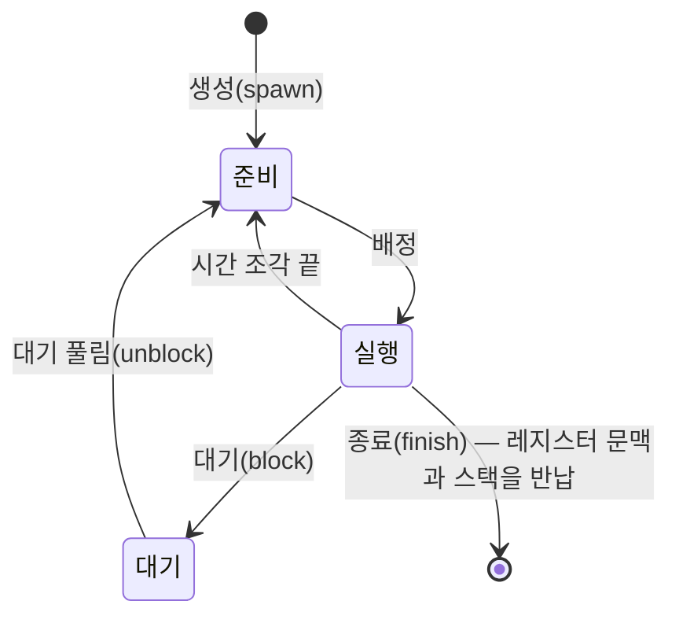


<div class="callout callout-summary" markdown="1">
<div class="callout-title callout-title--default" markdown="span">요약</div>

프로세스가 집이라면 스레드는 그 집에 사는 사람이다. 집(메모리, 열린 파일 같은 자원)은 함께 쓰고, 사람마다 자기 할 일과 지금 어디까지 했는지는 따로 있다. 그래서 한 프로그램 안에서 여러 일을 동시에 진행할 수 있고, 새 집을 짓는(프로세스를 만드는) 것보다 사람 하나 늘리는 것이 훨씬 싸다. 대신 한 사람이 냉장고를 비우면 다른 사람도 그 결과를 보므로, 함께 쓰는 데이터를 조심해서 다뤄야 한다.

</div>


## 예시로 보기

워드 프로세서를 생각해 보자[^1].

- 한 스레드는 사용자가 치는 글자를 받는다.
- 다른 스레드는 1분마다 메모리의 내용을 디스크에 저장한다. 정전에 대비한 것이다.
- 이 저장 스레드는 운영체제와 직접 시간을 맞춘다. 그래서 주 프로그램에 "지금 저장할 시간인가?"를 확인하는 코드를 넣지 않아도 된다.

두 스레드는 같은 문서 데이터를 본다. 글자 받는 스레드가 고친 내용을 저장 스레드가 바로 디스크에 쓴다. 프로세스 둘로 나눴다면 문서 데이터를 서로 주고받는 장치가 따로 필요했을 것이다.

다른 예로, 서로 다른 서버 두 곳에 원격 요청(RPC)을 보내고 두 답을 합치는 프로그램이 있다. 스레드 하나로 짜면 첫 서버의 답을 받은 뒤에야 둘째 요청을 보낸다. 서버마다 스레드를 하나씩 두면 두 답을 **함께** 기다리므로 크게 빨라진다. 프로세서가 하나여도 그렇다. 요청을 보내고 답을 처리하는 일은 차례로 하지만, 기다리는 시간은 겹치기 때문이다[^2].

<div class="callout callout-check" markdown="1">
<div class="callout-title" markdown="span">검증: 0.3초씩 걸리는 요청 두 개 — 스레드 하나 약 0.6초, 서버마다 스레드 약 0.3초. 스레드는 프로세스의 메모리를 함께 보고, 자식 프로세스의 변경은 부모에게 보이지 않음 — [17_thread_verify.py](/Hongs_Blog/studies/operating-systems/code/17_thread_verify/)</div>

</div>


## 정확히 말하면

프로세스에는 성격이 두 가지 있다. 운영체제는 이 둘을 따로 다룰 수 있다[^3].

| 성격 | 뜻 | 따로 떼면 부르는 이름 |
|---|---|---|
| 자원 소유 | 프로세스 이미지를 담는 가상 주소 공간, 그리고 메모리·입출력 장치·파일 같은 자원을 가진다 | 프로세스(태스크) |
| 스케줄링·실행 | 다른 프로세스와 번갈아 실행될 수 있는 실행 경로를 따라간다 | 스레드(경량 프로세스) |

<div class="callout callout-definition" markdown="1">
<div class="callout-title callout-title--default" markdown="span">정의</div>

**스레드**는 운영체제가 실행을 배정하는(디스패치하는) 단위다. **프로세스**는 자원을 소유하는 단위이자 보호의 단위다[^4]. **다중 스레딩**(multithreading)은 운영체제가 한 프로세스 안에서 동시에 진행되는 여러 실행 경로를 지원하는 능력이다[^5].

</div>


한 프로세스 안의 스레드는 각자 다음을 가진다[^6].

- 실행 상태(실행, 준비 등)
- 실행 중이 아닐 때 저장해 둔 스레드 문맥. 그래서 스레드를 "프로세스 안에서 독립적으로 움직이는 프로그램 카운터"로 볼 수도 있다[^7]
- 실행 스택
- 지역 변수를 담는 스레드별 정적 저장 공간
- 그리고 프로세스의 메모리와 자원에 대한 접근. 이것은 같은 프로세스의 모든 스레드가 **함께** 쓴다

```
단일 스레드 프로세스              다중 스레드 프로세스
┌──────────────────┐            ┌──────────────────────────────────────┐
│ 프로세스 제어 블록  │            │ 프로세스 제어 블록   스레드1  스레드2  스레드3 │
│ 사용자 주소 공간   │            │ 사용자 주소 공간     제어블록 제어블록 제어블록 │
│ 사용자 스택       │            │   (함께 씀)         사용자   사용자   사용자  │
│ 커널 스택         │            │                    스택     스택     스택   │
└──────────────────┘            │                    커널     커널     커널   │
                                │                    스택     스택     스택   │
                                └──────────────────────────────────────┘
```

다중 스레드 환경에서도 프로세스 제어 블록과 사용자 주소 공간은 프로세스에 하나다. 스레드마다 따로 생기는 것은 스택과 스레드 제어 블록(레지스터 값, 우선순위, 스레드 상태)이다. 그래서 한 스레드가 메모리의 데이터를 바꾸면 다른 스레드가 그 데이터를 읽을 때 바뀐 값을 본다. 한 스레드가 파일을 읽기용으로 열면 같은 프로세스의 다른 스레드도 그 파일을 읽을 수 있다[^7].

### 스레드를 쓰면 좋은 점

여러 관련된 실행 단위로 프로그램을 짤 때, 프로세스 여러 개보다 스레드 여러 개가 훨씬 효율적이다[^8].

| 좋은 점 | 이유 |
|---|---|
| 만들기가 빠르다 | 새 주소 공간과 자원을 마련하지 않는다 |
| 끝내기가 빠르다 | 돌려줄 자원이 적다 |
| 전환이 빠르다 | 같은 프로세스 안의 두 스레드 사이 전환은 프로세스 전환보다 빠르다 |
| 통신에 커널이 필요 없다 | 같은 메모리를 보므로 커널을 부르지 않고 데이터를 주고받는다 |

한 사용자의 컴퓨터에서 쓰는 예는 네 가지다. 앞뒤 일 나누기(스프레드시트에서 한 스레드는 화면, 다른 스레드는 수식 계산), 비동기 처리(위의 자동 저장), 실행 속도(한 스레드가 다음 데이터를 읽는 동안 다른 스레드가 지금 데이터를 계산), 모듈화된 구조다[^1].

### 프로세스 단위로 일어나는 일

모든 스레드가 같은 주소 공간을 쓰므로, 어떤 일은 프로세스 전체에 한꺼번에 일어난다[^9].

- 프로세스를 일시 중단하면(주소 공간을 주기억장치 밖으로 내보내면) 그 프로세스의 모든 스레드가 함께 멈춘다.
- 프로세스가 끝나면 그 안의 모든 스레드가 끝난다.

### 스레드의 상태

스레드는 [프로세스 상태](/Hongs_Blog/studies/operating-systems/process-states/)처럼 실행·준비·대기 상태를 가진다. 일시 중단은 주소 공간을 내보내는 일이라 스레드에는 없고 프로세스 단위로만 일어난다[^9]. 상태를 바꾸는 일은 네 가지다[^10].



중요한 문제: 한 스레드가 대기 상태가 되면 같은 프로세스의 다른 스레드도 함께 멈추는가? 함께 멈춘다면 스레드의 장점이 많이 사라진다[^10]. 답은 스레드를 누가 관리하느냐에 달렸다 → [사용자 수준 스레드와 커널 수준 스레드](/Hongs_Blog/studies/operating-systems/ult-klt/).

### 프로세스와 스레드의 조합

| | 프로세스 하나 | 프로세스 여러 개 |
|---|---|---|
| 프로세스당 스레드 하나 | MS-DOS | 일부 UNIX |
| 프로세스당 스레드 여러 개 | 자바 실행 환경(JRE) | Windows, Solaris, 현대 UNIX 대부분 |

이 장의 주된 관심은 오른쪽 아래, 여러 프로세스가 각자 여러 스레드를 가지는 경우다[^11].

## 스스로 설명해 보기

1. 스레드 사이 통신에는 커널이 필요 없다.
   <details class="inline-fold" markdown="1"><summary markdown="span">근거</summary>
   같은 프로세스의 스레드는 같은 주소 공간을 쓴다. 한 스레드가 메모리에 쓴 값을 다른 스레드가 그냥 읽으면 된다. 프로세스끼리는 주소 공간이 격리되어 있으므로 커널이 중간에서 옮겨 줘야 한다.
   </details>
2. 프로세스를 일시 중단하면 모든 스레드가 멈춘다.
   <details class="inline-fold" markdown="1"><summary markdown="span">근거</summary>
   일시 중단은 주소 공간을 주기억장치 밖으로 내보내는 일이다. 모든 스레드의 코드와 데이터가 그 주소 공간에 있으므로 어느 스레드도 실행을 이어 갈 수 없다.
   </details>
3. RPC 예에서 프로세서가 하나여도 스레드로 나누면 빨라진다.
   <details class="inline-fold" markdown="1"><summary markdown="span">근거</summary>
   빨라지는 부분은 계산이 아니라 기다림이다. 두 요청을 먼저 다 보내 두면 두 서버가 동시에 일하고, 프로그램은 두 답을 한꺼번에 기다린다. 기다림 두 번이 한 번 길이로 겹친다.
   </details>
- 핵심 아이디어는?
  <details class="inline-fold" markdown="1"><summary markdown="span">답</summary>
  "자원을 가진다"와 "실행된다"를 떼어 놓는다. 자원은 프로세스가 한 번만 마련하고, 실행 흐름은 그 위에 여러 개 싸게 만든다.
  </details>
- 같은 생각을 쓰는 다른 곳은?
  <details class="inline-fold" markdown="1"><summary markdown="span">답</summary>
  [다중 프로그래밍](/Hongs_Blog/studies/operating-systems/multiprogramming/)이 프로그램 사이에서 하던 "기다리는 동안 다른 일 하기"를 한 프로그램 안으로 가져온 것이다. 웹 서버가 요청마다 스레드를 하나씩 붙이는 것도 같은 생각이다.
  </details>

## 활용

- 웹 브라우저, 워드 프로세서, 게임처럼 화면 반응과 무거운 작업을 함께 해야 하는 프로그램은 대부분 여러 스레드를 쓴다. Adobe PageMaker는 사건 처리, 화면 다시 그리기, 서비스의 세 스레드를 늘 띄워 두었다[^12].
- 프로세서가 여럿이면 같은 프로세스의 스레드들이 정말 동시에 실행될 수 있다 → [대칭형 다중 처리](/Hongs_Blog/studies/operating-systems/smp/)
- 흔한 실수: 여러 스레드가 같은 변수를 동시에 고치면 값이 틀어진다. 스레드끼리 동기화가 필요하다[^10]. 5장(상호 배제)의 주제다.

## 연결

- 선수: [프로세스](/Hongs_Blog/studies/operating-systems/process/)
- 다음: [사용자 수준 스레드와 커널 수준 스레드](/Hongs_Blog/studies/operating-systems/ult-klt/)

## 자주 하는 오해

<div class="callout callout-misconception" markdown="1">
<div class="callout-title" markdown="span">"스레드마다 자기 메모리가 따로 있다"</div>

틀렸다. 스레드마다 스택과 레지스터 문맥이 따로 있어서 메모리도 따로인 것처럼 보인다. 하지만 주소 공간, 전역 데이터, 열린 파일은 같은 프로세스의 모든 스레드가 함께 쓴다. 확인하는 방법: 한 스레드에서 전역 변수를 바꾸고 다른 스레드에서 읽으면 바뀐 값이 보인다(검증 코드 1번). 프로세스를 새로 만들어 바꾸면 부모에게는 보이지 않는다(검증 코드 2번).

</div>


<div class="callout callout-misconception" markdown="1">
<div class="callout-title" markdown="span">"프로세서가 하나면 스레드를 여러 개 써도 빨라지지 않는다"</div>

틀렸다. 계산만 하는 프로그램이라면 맞다. 하지만 기다리는 일(입출력, 네트워크 응답)이 있으면 한 스레드가 기다리는 동안 다른 스레드가 일하거나, 여러 기다림을 겹칠 수 있다. 슬라이드의 RPC 예가 프로세서 하나에서 빨라지는 경우다[^2].

</div>


## 확인 문제

<details markdown="1"><summary markdown="span"><b>C1</b> 프로세스의 두 가지 성격을 쓰고, 다중 스레드 환경에서 각각을 무엇이라고 부르는지 쓰라.</summary>


**답:** 자원 소유 → 프로세스(태스크). 스케줄링·실행 → 스레드(경량 프로세스).

</details>

<details markdown="1"><summary markdown="span"><b>C2</b> 다음 중 스레드마다 따로 있는 것과 프로세스의 스레드들이 함께 쓰는 것을 나눠라: 실행 스택, 열린 파일, 전역 변수, 프로그램 카운터 값, 주소 공간, 실행 상태.</summary>


**답:** 따로: 실행 스택, 프로그램 카운터 값(스레드 문맥), 실행 상태. 함께: 열린 파일, 전역 변수, 주소 공간.<br>
**흔한 오답:** 전역 변수를 "따로"에 넣는 것. 지역 변수는 각자의 스택에 있지만 전역 변수는 공유 주소 공간에 있다.

</details>

<details markdown="1"><summary markdown="span"><b>C3</b> 같은 일을 프로세스 여러 개로 나누는 것보다 스레드 여러 개로 나누는 것이 빠른 이유 네 가지를 쓰라.</summary>


**답:** 만들기, 끝내기, 전환이 모두 빠르다. 새 주소 공간과 자원을 마련하거나 돌려줄 필요가 없기 때문이다. 그리고 같은 메모리를 보므로 커널을 거치지 않고 통신한다.

</details>

<details markdown="1"><summary markdown="span"><b>C4</b> 웹 서버가 요청 하나를 처리하는 데 디스크 읽기 40 ms, 계산 2 ms가 든다. 요청 5개가 동시에 왔다. 스레드 하나로 차례로 처리하면 몇 ms 걸리는가? 요청마다 스레드를 하나씩 두고 디스크 읽기가 서로 겹칠 수 있다면 대략 몇 ms인가? (프로세서 하나, 디스크는 동시 요청을 처리할 수 있다고 가정)</summary>


**답:** 스레드 하나: $$5 \times (40 + 2) = 210$$ ms. 요청마다 스레드: 다섯 읽기가 겹쳐 40 ms, 계산 5개는 프로세서 하나에서 차례로 $$5 \times 2 = 10$$ ms. 대략 50 ms.<br>
**이유:** 겹치는 것은 기다림(디스크)이고, 계산은 프로세서가 하나라 겹치지 않는다.[^s1]

</details>

[^1]: 3-1학기/운영체제/1.수업자료/04.Chapter04-new.pptx, 슬라이드 13과 슬라이드 12의 발표자 노트
[^2]: 같은 자료, 슬라이드 17~19 (그림 4.3)와 슬라이드 16~17의 발표자 노트
[^3]: 같은 자료, 슬라이드 3
[^4]: 같은 자료, 슬라이드 4와 슬라이드 8의 발표자 노트
[^5]: 같은 자료, 슬라이드 5와 발표자 노트
[^6]: 같은 자료, 슬라이드 9와 발표자 노트
[^7]: 같은 자료, 슬라이드 10, 슬라이드 11 (그림 4.2)과 슬라이드 10의 발표자 노트
[^8]: 같은 자료, 슬라이드 12와 슬라이드 11의 발표자 노트
[^9]: 같은 자료, 슬라이드 14와 슬라이드 13의 발표자 노트
[^10]: 같은 자료, 슬라이드 15~16과 슬라이드 15의 발표자 노트
[^11]: 같은 자료, 슬라이드 6~7과 발표자 노트
[^12]: 같은 자료, 슬라이드 21 (그림 4.5)과 슬라이드 19의 발표자 노트
[^s1]: 에이전트 보충. 웹 서버 예와 확인 문제 C4는 원본 범위 밖의 변형 문제다.

