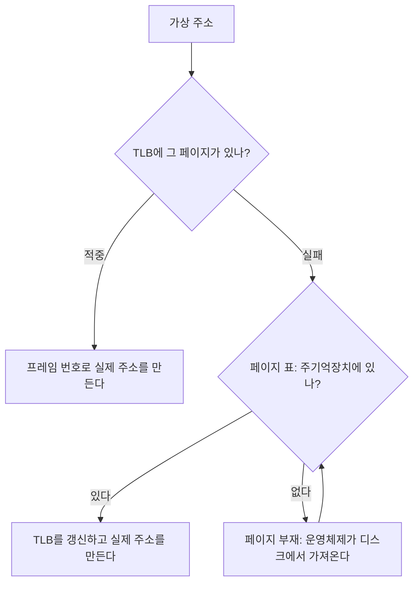



요약

가상 메모리에서는 메모리를 한 번 쓰려 해도 먼저 페이지 표를 읽어야 해서 메모리 접근이 두 배가 된다. TLB는 최근에 쓴 페이지 표 항목 몇 개를 복사해 둔 작고 빠른 하드웨어 캐시다. 자주 가는 집 주소를 수첩에 적어 두고 매번 주소록 책을 펼치지 않는 것과 같다. 지역성 덕분에 대부분은 수첩에서 바로 찾는다. 하지만 수첩이 작아서 못 찾으면 결국 책을 펼쳐야 하고, 프로세스를 바꾸면 수첩 내용이 쓸모없어진다.

## 예시로 보기

메모리 접근이 100 ns, TLB 검사가 20 ns라고 하자[^s1].

| 경우 | 걸리는 시간 |
|---|---|
| TLB가 없으면 | 페이지 표 100 + 데이터 100 = 200 ns |
| TLB 적중 | TLB 20 + 데이터 100 = 120 ns |
| TLB 실패 | TLB 20 + 페이지 표 100 + 데이터 100 = 220 ns |

적중률이 98%면 평균은 $$0.98 \times 120 + 0.02 \times 220 = 122$$ ns다. TLB 없이 200 ns였던 것이 거의 데이터 접근 한 번 수준으로 줄어든다.

검증: 122 ns, 카드 C2의 140 ns — [40_tlb_verify.py](/Hongs_Blog/studies/operating-systems/code/40_tlb_verify/)

## 정확히 말하면

가상 메모리 참조 하나는 실제 메모리 접근을 두 번 일으킬 수 있다. 페이지 표 항목을 가져올 때 한 번, 데이터를 가져올 때 한 번이다. 이를 해결하려고 페이지 표 항목을 위한 고속 캐시를 둔다. 이것이 **TLB**이고, 가장 최근에 쓴 페이지 표 항목을 담는다[^1].

**동작**[^2]

1. 프로세서가 가상 주소의 페이지 번호로 TLB를 찾는다.
2. 있으면(TLB 적중) 프레임 번호를 꺼내 실제 주소를 만든다.
3. 없으면(TLB 실패) 페이지 번호로 프로세스의 페이지 표를 찾는다.
4. 페이지 표에서 그 페이지가 주기억장치에 있는지 본다. 없으면 페이지 부재를 낸다.
5. 찾은 항목으로 TLB를 갱신한다.

**연관 사상.** TLB에는 페이지 표 항목의 일부만 있으므로, 페이지 번호로 TLB의 칸을 바로 찾아갈(색인) 수 없다. 그래서 TLB의 각 칸에는 페이지 번호와 페이지 표 항목 전체를 함께 넣고, 하드웨어가 여러 칸을 **동시에** 비교해 일치하는 것을 찾는다[^3]. 페이지 표는 페이지 번호로 바로 찾는 직접 사상이고, TLB는 내용으로 찾는 연관 사상이다.

**캐시와 함께.** 실제 주소를 얻은 뒤에는 그 주소로 메모리 [캐시](/Hongs_Blog/studies/operating-systems/cache-memory/)를 찾는다. 캐시에 있으면 주기억장치까지 가지 않는다. TLB는 주소 변환을, 캐시는 데이터 접근을 빠르게 한다[^4].

**유효 접근 시간.** TLB 적중률을 $$h$$, TLB 검사 시간을 $$t$$, 메모리 접근 시간을 $$m$$이라 하자(한 단계 페이지 표, 페이지 부재 없음). 적중하면 TLB를 보고 메모리를 한 번, 실패하면 TLB를 보고 메모리를 두 번 읽는다.

$$\text{평균 접근 시간} = h\,(t + m) + (1 - h)\,(t + 2m)$$

$$t = 20$$, $$m = 100$$ ns로 그린 직선이다. 적중률이 1%포인트 오를 때마다 평균이 1 ns씩 준다. 적중률이 20%보다 낮으면 TLB를 먼저 찾아보는 20 ns가 손해가 되어, TLB가 없을 때보다 오히려 느리다[^s2].

## 활용

- 프로세스를 바꾸면 TLB의 항목은 앞 프로세스의 것이라 쓸 수 없다. 그래서 TLB를 비우거나, 항목에 프로세스 표시를 붙인다. 프로세스 전환이 비싼 이유 중 하나다[^s1].
- [스레드](/Hongs_Blog/studies/operating-systems/thread/) 전환은 같은 주소 공간이라 TLB를 그대로 쓸 수 있다[^s1].

## 연결

- 선수: [페이지 표 구조](/Hongs_Blog/studies/operating-systems/page-table-structure/), [캐시 메모리](/Hongs_Blog/studies/operating-systems/cache-memory/) (같은 지역성)

## 확인 문제

<b>C1</b> TLB는 페이지 번호로 칸을 바로 찾지 않고 모든 칸을 동시에 비교한다. 왜인가?

**답:** TLB에는 페이지 표 항목의 일부만, 그때그때 다른 페이지의 것이 들어 있다. 페이지 번호 k가 몇 번째 칸에 있는지 정해져 있지 않으므로 색인으로 찾을 수 없다. 칸마다 페이지 번호를 함께 저장하고 내용으로 비교해 찾는다.

<b>C2</b> 메모리 접근 100 ns, TLB 검사 20 ns, TLB 적중률 80%일 때 평균 접근 시간은? (한 단계 페이지 표, 페이지 부재 없음)

**답:** $$0.8 \times 120 + 0.2 \times 220 = 96 + 44 = 140$$ ns. 
**흔한 오답:** 실패할 때 TLB 검사 시간을 빼먹는 것. 실패해도 TLB는 먼저 찾아봤다.

<b>C3</b> TLB 실패와 페이지 부재는 어떻게 다른가? 어느 쪽이 훨씬 비싼가?

**답:** TLB 실패는 항목이 TLB에 없을 뿐, 페이지 표에서 찾으면 된다(메모리 접근 한 번 더). 페이지 부재는 페이지 자체가 주기억장치에 없어 디스크에서 가져와야 한다. 디스크 접근은 밀리초 단위라 페이지 부재가 수만 배 비싸다.

[^1]: 운영체제 8회 강의 자료 「Chapter08-new」, 슬라이드 24
[^2]: 같은 자료, 슬라이드 25~28 (그림 8.7, 8.8)
[^3]: 같은 자료, 슬라이드 29~30 (그림 8.9)
[^4]: 같은 자료, 슬라이드 31 (그림 8.10)
[^s1]: 보충 시간 예와 유효 접근 시간 식, 프로세스·스레드 전환과 TLB, 확인 문제 C2·C3은 슬라이드에 없다. Stallings 6판 8.1절과 일반 교재의 유효 접근 시간 계산을 따랐다.
[^s2]: 보충 그림 1장은 원본에 없다. [40_tlb_plot.py](/Hongs_Blog/studies/operating-systems/code/40_tlb_plot/)로 그렸고, 적중률 98%에서 122 ns, 0%에서 220 ns, 100%에서 120 ns, 20%에서 TLB 없을 때와 같은 200 ns를 같은 코드로 확인했다.

