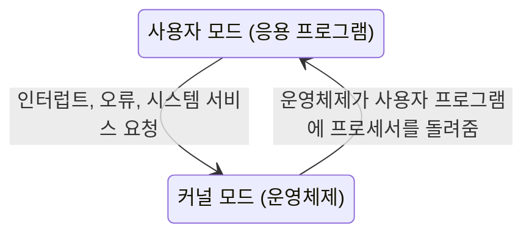



요약

프로세서는 두 가지 모드로 돈다. 사용자 프로그램은 제한된 사용자 모드로, 운영체제는 모든 것을 할 수 있는 커널 모드로 실행된다. 은행 창구와 금고실에 비유할 수 있다. 손님은 창구에서 요청만 하고, 금고는 직원만 연다. 덕분에 한 프로그램의 실수나 악의가 운영체제와 다른 프로그램을 망가뜨리지 못한다. 대신 모드를 오갈 때마다 시간이 든다.

## 예시로 보기

단순 배치 시스템에서는 모니터(초기 운영체제)와 사용자 프로그램이 같은 메모리에 함께 있다. 사용자 프로그램에 버그가 있어 모니터가 있는 주소에 값을 써 버리면 다음 작업을 실행할 프로그램이 사라진다. 사용자 프로그램이 무한 반복에 빠지면 모니터는 영영 프로세서를 되찾지 못한다. 사용자 프로그램이 입출력 장치를 직접 다루면 다음 작업의 작업 제어 지시까지 실수로 읽어 버릴 수 있다[^1].

이 세 가지를 막으려고 하드웨어에 넣은 기능이 아래 네 가지다. 그리고 그중 두 가지(메모리 보호, 특권 명령어)를 묶는 장치가 실행 모드다[^2].

## 정확히 말하면

**하드웨어에 필요한 기능**[^1]

| 기능 | 막는 것 |
|---|---|
| 메모리 보호 | 사용자 프로그램이 모니터의 메모리 영역을 바꾸지 못한다. 시도하면 하드웨어가 오류를 감지하고 모니터로 넘긴다. 모니터는 그 작업을 끝내고 다음 작업을 싣는다 |
| 타이머 | 한 작업이 시스템을 독차지하지 못한다. 작업이 시작될 때 타이머를 맞추고, 다 되면 사용자 프로그램을 멈추고 모니터로 돌아간다 |
| 특권 명령어 | 일부 기계어 명령어(예: 입출력 명령어)는 모니터만 실행할 수 있다. 사용자 프로그램이 실행하려 하면 오류로 모니터에 넘어간다 |
| 인터럽트 | 모니터가 프로세서를 넘겼다가 되찾을 수 있게 한다. 초기 모델에는 없었다 |

**두 모드**[^2]

| | 사용자 모드 | 커널 모드 |
|---|---|---|
| 누가 | 사용자 프로그램 | 모니터(운영체제). 시스템 모드라고도 부른다 |
| 메모리 | 보호된 영역에는 접근할 수 없다 | 모든 메모리에 접근할 수 있다 |
| 명령어 | 특권 명령어를 실행할 수 없다 | 특권 명령어를 실행할 수 있다 |

지금 어느 모드인지는 프로세서의 [PSW](/Hongs_Blog/studies/operating-systems/processor-registers/) 안의 비트 하나가 나타낸다[^3].

사용자 프로그램이 스스로 커널 모드로 바꿀 수 있다면 보호가 의미 없다. 그래서 사용자 모드에서 커널 모드로 가는 길은 인터럽트나 오류, 운영체제에 서비스를 요청하는 정해진 입구뿐이고, 그 순간 실행되는 코드는 사용자 코드가 아니라 운영체제 코드다[^s1].

## 활용

- 4장에서 커널 수준 스레드의 단점으로 "같은 프로세스 안에서 스레드를 바꿀 때도 커널로 모드 전환이 필요하다"가 나온다. 모드를 오가는 비용이 그 이유다 → [사용자 수준 스레드와 커널 수준 스레드](/Hongs_Blog/studies/operating-systems/ult-klt/)
- 마이크로커널은 커널 모드에서 도는 코드를 최소로 줄이고 나머지를 사용자 모드 서버로 뺀다 → [마이크로커널](/Hongs_Blog/studies/operating-systems/microkernel/)
- Windows는 실행부(Executive), 커널, 장치 드라이버, 하드웨어 추상화 계층을 커널 모드에서, 나머지를 사용자 모드에서 실행한다[^4].

## 연결

- 선수: [운영체제의 발전](/Hongs_Blog/studies/operating-systems/os-evolution/), [프로세서 레지스터](/Hongs_Blog/studies/operating-systems/processor-registers/)
- 커널 모드로 들어가는 통로: [인터럽트](/Hongs_Blog/studies/operating-systems/interrupt/)

## 확인 문제

<b>C1</b> 단순 배치 시스템에 필요한 하드웨어 기능 네 가지를 쓰라.

**답:** 메모리 보호, 타이머, 특권 명령어, 인터럽트.

<b>C2</b> 타이머가 없으면 메모리 보호와 특권 명령어가 있어도 막지 못하는 문제는?

**답:** 한 작업이 프로세서를 독차지하는 문제. 무한 반복에 빠진 프로그램은 금지된 메모리나 명령어를 건드리지 않으므로 오류가 나지 않는다. 그러면 모니터로 돌아갈 계기가 없다. 타이머가 울려야 강제로 모니터로 돌아온다.

<b>C3</b> "모드 비트를 바꾸는 명령어"가 특권 명령어가 아니라면 어떤 일이 생기는지 구체적인 순서로 보여라.

**답:** ① 사용자 프로그램이 그 명령어로 커널 모드로 바꾼다. ② 이제 특권 명령어와 모든 메모리를 쓸 수 있으므로 운영체제 영역을 덮어쓰거나 다른 사용자의 데이터를 읽는다. 보호 장치 전체가 한 명령어로 무력화된다. 그래서 모드를 바꾸는 일은 커널 모드에서만, 또는 인터럽트처럼 운영체제 코드로 넘어가는 길로만 가능해야 한다.

[^1]: 운영체제 2회 강의 자료 「Chapter02-new」, 슬라이드 18과 슬라이드 17의 발표자 노트
[^2]: 같은 자료, 슬라이드 19와 슬라이드 18의 발표자 노트
[^3]: 운영체제 1회 강의 자료 「Chapter01-new」, 슬라이드 14 발표자 노트
[^4]: 운영체제 2회 강의 자료 「Chapter02-new」, 슬라이드 58 (그림 2.13)과 슬라이드 57의 발표자 노트
[^s1]: 보충 모드 전환 그림, 사용자 모드에서 커널 모드로 가는 길이 정해진 입구뿐이라는 설명, 확인 문제 C3은 원본에 없다. 원본의 "특권 명령어는 모니터만 실행한다"와 "인터럽트로 모니터가 프로세서를 되찾는다"를 합친 것이다.

