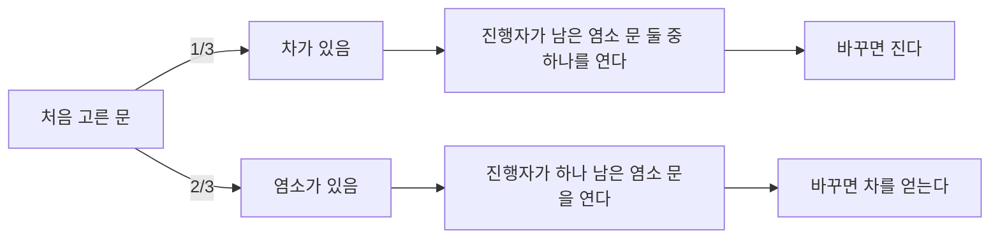



요약

"이미 이런 일이 일어났다"는 정보를 받으면, 가능한 세계가 그 정보와 맞는 결과들로 줄어든다. 줄어든 세계 안에서 관심 사건이 차지하는 몫이 조건부 확률이다. 이것으로 복잡한 확률을 "먼저 이것, 그다음 저것"의 단계로 쪼개 곱하거나, 경우를 나눠 더해 계산할 수 있다. 가장 흔한 함정은 방향을 바꾸는 것이다. "병이 있을 때 양성일 확률"과 "양성일 때 병이 있을 확률"은 전혀 다른 값이다.

## 예시로 보기

주사위 두 개를 던져 합이 8일 확률은 36개 중 5개라 $$\frac{5}{36} \approx 0.14$$다. 그런데 "첫 주사위가 3"이라는 것을 이미 안다면, 가능한 결과는 $$(3, 1), \dots, (3, 6)$$의 6개로 줄어든다. 그중 합이 8인 것은 $$(3, 5)$$ 하나라 확률은 $$\frac16 \approx 0.17$$로 오히려 커진다. 첫 주사위가 1이라면 합 8은 불가능해서 0이 된다.

| 알고 있는 정보 $$B$$ | 남은 결과 수 | 그중 합 8 | $$P(\text{합 8} \mid B)$$ |
|---|---|---|---|
| 없음 | 36 | 5 | $$\frac{5}{36}$$ |
| 첫 주사위 3 | 6 | 1 | $$\frac16$$ |
| 첫 주사위 1 | 6 | 0 | 0 |

표의 "남은 결과"가 아래 정의의 $$B$$, "그중 합 8"이 $$A \cap B$$다.

## 정의

정의

$$P(B) > 0$$인 사건 $$B$$에 대해, $$B$$가 주어졌을 때 $$A$$의 **조건부 확률**은

$$P(A \mid B) = \frac{P(A \cap B)}{P(B)}$$

이다. $$P(B) = 0$$이면 정의하지 않는다[^1].

**설계 이유.** 조건을 받으면 $$B$$ 밖의 결과는 버린다. 남은 $$B$$ 안의 결과들의 확률 비율은 그대로 두고, 합이 1이 되도록 전체를 $$P(B)$$로 나눈다. 그래서 $$P(B \mid B) = 1$$이고, $$B$$가 주어진 세계에서 $$P(\cdot \mid B)$$는 [확률의 공리](/Hongs_Blog/studies/probability-statistics/probability-axioms/)를 모두 만족하는 새 확률이다. 빈도로 읽으면 "실험을 많이 반복했을 때, $$B$$가 일어난 시행들 가운데 $$A$$도 일어난 비율"이다.

**동치인 다른 꼴.** 정의를 곱셈으로 바꾸면 계산 도구가 된다.

- *곱셈 법칙:* $$P(A \cap B) = P(B)\,P(A \mid B) = P(A)\,P(B \mid A)$$.
- *연쇄 법칙:* $$P(A_1 \cap A_2 \cap \cdots \cap A_n) = P(A_1)\,P(A_2 \mid A_1)\cdots P(A_n \mid A_1 \cap \cdots \cap A_{n-1})$$.
- *전확률 공식:* $$B_1, \dots, B_n$$이 $$\Omega$$의 분할이고 $$P(B_i) > 0$$이면 $$P(A) = \sum_i P(A \mid B_i)\,P(B_i)$$($$\sum$$은 차례로 모두 더한다는 기호).

**해당하는 예와 해당하지 않는 예.**

| 해당함 | 해당하지 않음 |
|---|---|
| 짝수가 나왔을 때 6일 확률 $$\frac13$$ | $$P(A \cap B)$$: "짝수이고 6"일 확률 $$\frac16$$. 줄어든 세계로 나누지 않았다 |
| 첫 장이 에이스일 때 둘째 장도 에이스일 확률 $$\frac{3}{51}$$ | $$P(B \mid A)$$를 $$P(A \mid B)$$ 대신 쓰는 것. 조건과 대상이 뒤바뀌었다 |
| 경보가 울렸을 때 실제 장애일 확률 | $$P(B) = 0$$인 사건을 조건으로 하는 것(정의되지 않는다) |

전확률 공식의 증명

1. *쪼개기:* $$B_i$$들이 분할이므로 $$A = (A \cap B_1) \cup \cdots \cup (A \cap B_n)$$이고, 조각들은 서로 배반이다.
2. *더하기:* 공리 3으로 $$P(A) = \sum_i P(A \cap B_i)$$.
3. *곱셈 법칙:* 각 항을 $$P(A \cap B_i) = P(A \mid B_i)\,P(B_i)$$로 바꾼다. ∎

### 스스로 설명해 보기

1. 증명 1단계에서 조각들이 서로 배반인 이유는?

$$B_i$$들이 서로 배반이라 $$A \cap B_i$$와 $$A \cap B_j$$($$i \ne j$$)의 공통 부분은 $$B_i \cap B_j = \emptyset$$ 안에 있다.

2. $$B_i$$들이 $$\Omega$$ 전체를 덮지 않으면 공식의 어디가 틀리는가?

1단계의 등식이 깨진다. $$A$$ 중 어느 $$B_i$$에도 속하지 않는 부분이 빠져 $$\sum_i P(A \cap B_i) < P(A)$$가 될 수 있다.

3. 전확률 공식의 핵심 아이디어는?

직접 구하기 어려운 확률을, 원인별로 경우를 나눠 "그 원인일 확률 × 그 원인에서 $$A$$가 날 확률"의 가중평균으로 구한다.

4. 같은 아이디어를 쓰는 다른 상황은?

알고리즘의 평균 실행 시간을 입력 종류별로 나눠 가중평균하는 것, [베이즈 정리](/Hongs_Blog/studies/probability-statistics/bayes-theorem/)의 분모를 구하는 것.

## 예제

**몬티 홀 문제.** 문 세 개 중 하나 뒤에 자동차가 있다. 참가자가 문 하나를 고르면, 답을 아는 진행자가 나머지 둘 중 **염소가 있는 문**을 하나 연다(둘 다 염소면 무작위). 남은 문으로 바꾸는 편이 나은가?

1. *경우 나누기:* 처음 고른 문에 차가 있을 확률은 $$\frac13$$, 없을 확률은 $$\frac23$$이다.
2. *경우마다 바꾼 결과:* 처음 문에 차가 있으면 바꾸면 진다. 처음 문에 차가 없으면, 진행자가 남은 염소 문을 열었으므로 남은 문이 반드시 차다.
3. *전확률 공식:* $$P(\text{바꿔서 이김}) = 0 \cdot \frac13 + 1 \cdot \frac23 = \frac23$$.
4. *핵심:* 진행자는 무작위로 여는 것이 아니라 "차가 없는 문"을 고른다. 이 정보가 남은 문의 확률을 바꾼다[^1].

맨 왼쪽 갈림길의 확률 1/3과 2/3은 진행자가 문을 연 뒤에도 그대로다. 바꿔서 이기는 길은 아래쪽 줄기 하나뿐이다.[^s1]

검증: 예시 표의 세 조건부 확률, 모의실험 10만 회의 상대도수, 조건부 확률이 공리를 만족함, 에이스 두 장 $$\frac{1}{221}$$(순서쌍 2,652개 전수), 전확률 0.032, 몬티 홀 $$\frac23$$(9가지 경우 전수와 모의실험 6만 회) — [03_conditional-probability_verify.py](/Hongs_Blog/studies/probability-statistics/code/03_conditional-probability_verify/)

## 활용

- **순차적 계산.** 비복원 추출, 여러 단계의 통신 성공 확률, 게임 트리처럼 단계마다 확률이 바뀌는 상황은 연쇄 법칙으로 곱한다.
- **추천과 분류.** "이 상품을 산 사람이 저 상품도 살 확률"은 조건부 확률이다. 스팸 필터는 "이 단어가 있을 때 스팸일 확률"을 [베이즈 정리](/Hongs_Blog/studies/probability-statistics/bayes-theorem/)로 구한다.
- **흔한 실수.** 조건과 대상을 뒤바꾸는 것, 조건을 받은 뒤에도 원래 표본공간 크기로 나누는 것.
- 알고리즘에서: 게임 스테이지의 실패율은 "그 스테이지에 도달한 사람 가운데 거기서 멈춘 사람의 비율"이라 조건부 확률이고, 전체 인원이 아니라 도달한 사람 수로 나눈다. 도달한 사람이 없으면 조건의 확률이 0이라 값이 정의되지 않아서, 문제가 0으로 따로 정한다([실패율](/Hongs_Blog/studies/algorithms/pg42889/)).

## 연결

- 선수: [확률의 공리와 계산](/Hongs_Blog/studies/probability-statistics/probability-axioms/)
- 이어지는 개념: [독립](/Hongs_Blog/studies/probability-statistics/independence/)(조건이 확률을 바꾸지 않을 때), [베이즈 정리](/Hongs_Blog/studies/probability-statistics/bayes-theorem/)(조건의 방향 뒤집기)

## 자주 하는 오해

"조건을 알려 주면 가능성이 줄어드니 확률도 작아진다"

틀렸다. 표본공간이 줄어드는 것은 맞아서 그럴듯해 보인다. 하지만 분모도 함께 줄어든다. 예시에서 "첫 주사위 3"을 알면 합 8의 확률은 $$\frac{5}{36}$$에서 $$\frac16$$으로 커지고, "첫 주사위 1"을 알면 0으로 준다. 조건은 확률을 어느 쪽으로든 움직인다. 줄어든 세계의 크기로 다시 나눠서 확인한다.

"$$P(A \mid B)$$와 $$P(B \mid A)$$는 비슷한 값이다"

틀렸다. 둘 다 $$A$$와 $$B$$가 함께 일어날 확률을 쓰니 비슷해 보인다. 하지만 나누는 수가 $$P(B)$$와 $$P(A)$$로 다르다. 프로 농구 선수일 때 키가 190 cm 이상일 확률은 높지만, 키가 190 cm 이상일 때 프로 농구 선수일 확률은 매우 낮다. 둘 사이를 오가는 것이 [베이즈 정리](/Hongs_Blog/studies/probability-statistics/bayes-theorem/)다.

## 확인 문제

**C1** 52장 카드에서 두 장을 차례로 뽑을 때(되돌려 놓지 않음) 둘 다 에이스일 확률은?

**답:** 곱셈 법칙으로 $$\frac{4}{52} \cdot \frac{3}{51} = \frac{1}{221} \approx 0.0045$$. 둘째 확률은 "첫 장이 에이스"라는 조건 아래의 확률이다.

**C2** 조건부 확률의 정의에서 $$P(B)$$로 나누는 이유를 설명하라.

**답:** 조건을 받으면 $$B$$ 밖의 결과는 가능성에서 빠지고, $$B$$ 안의 결과들만 남는다. 남은 결과들의 확률 합이 $$P(B)$$라 그대로는 1이 안 된다. 비율은 유지하면서 합을 1로 맞추려고 $$P(B)$$로 나눈다.

**C3** 공장 A가 제품의 60%를 불량률 2%로, 공장 B가 40%를 불량률 5%로 만든다. 무작위로 고른 제품이 불량일 확률은?

**답:** 전확률 공식으로 $$0.02 \times 0.6 + 0.05 \times 0.4 = 0.012 + 0.020 = 0.032$$.

**C4** 몬티 홀 문제에서 바꾸면 이길 확률이 $$\frac12$$가 아니라 $$\frac23$$인 이유를 설명하라.

**답:** 처음 고른 문이 차일 확률은 $$\frac13$$이고, 진행자가 문을 열어도 이 값은 변하지 않는다(진행자는 어떤 경우든 염소 문을 열 수 있기 때문이다). 나머지 $$\frac23$$은 두 문에 퍼져 있다가, 진행자가 염소 문을 치워 남은 한 문에 모인다. "남은 문 두 개니 반반"은 진행자가 답을 알고 고른다는 정보를 버린 계산이다.

[^1]: Blitzstein, Hwang, *Introduction to Probability* 2판, 2.2절 "Definition and intuition", 2.3절 "Bayes' rule and the law of total probability", 2.4절 "Conditional probabilities are probabilities", 2.7절 "Conditioning as a problem-solving tool"(몬티 홀), 2.8절 "Pitfalls and paradoxes".
[^s1]: 보충 다이어그램 1개는 원본에 없다. 이 문서 예제(몬티 홀 문제)의 1~3단계를 확률 나무로 옮겼다. 근거는 Blitzstein·Hwang 2판 2.7절이다.

