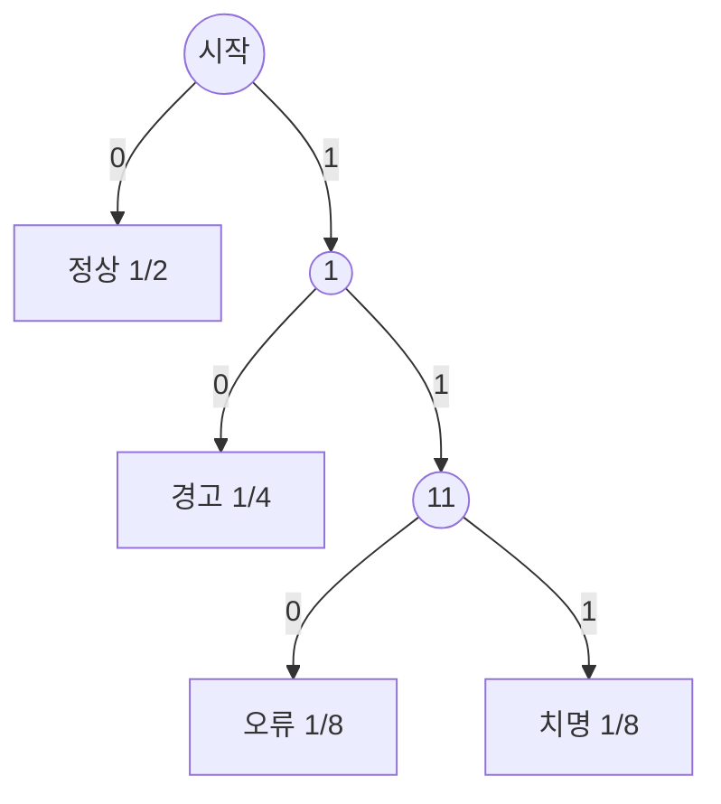



요약

결과를 알게 되었을 때 평균적으로 얼마나 놀라는지를 재는 수이고, 그 결과를 전하는 데 평균적으로 꼭 필요한 비트 수와 같다. 공정한 동전 하나는 1비트, 거의 늘 앞면이 나오는 동전은 1비트보다 훨씬 적다. 확률이 고르게 퍼질수록 크고 한쪽에 몰릴수록 작아서, 데이터를 얼마나 압축할 수 있는지의 한계가 된다. 다만 결과가 얼마나 "의미 있는가"나 "중요한가"와는 상관이 없다. 순전히 예측하기 어려운 정도다.

## 예시로 보기

서버 로그의 상태가 정상 $$\frac12$$, 경고 $$\frac14$$, 오류 $$\frac18$$, 치명 $$\frac18$$의 확률로 나온다. 상태를 비트로 전송하려 한다.

| 상태 | 확률 | 놀라움 $$-\log_2 p$$ | 부호 |
|---|---|---|---|
| 정상 | $$\frac12$$ | 1비트 | `0` |
| 경고 | $$\frac14$$ | 2비트 | `10` |
| 오류 | $$\frac18$$ | 3비트 | `110` |
| 치명 | $$\frac18$$ | 3비트 | `111` |

자주 나오는 것에 짧은 부호를 주면 평균 길이가 $$\frac12 \cdot 1 + \frac14 \cdot 2 + \frac18 \cdot 3 + \frac18 \cdot 3 = 1.75$$비트다. 상태 넷에 고정 길이 2비트를 쓰는 것보다 짧고, 어떤 부호로도 이보다 짧게 할 수 없다. 1.75가 아래 정의의 엔트로피 $$H$$이고, 놀라움 열의 가중평균이다.

시작점에서 비트를 따라 내려가 끝에 닿으면 상태 하나가 나온다. 내려간 깊이가 부호 길이라서, 확률이 큰 상태일수록 시작점에 가깝다. 상태가 모두 가지 끝에만 있으니 어느 부호도 다른 부호의 앞부분이 되지 않는다.[^s3]

## 정의

정의

값 $$x$$를 확률 $$p(x)$$로 가지는 이산 확률변수 $$X$$의 **엔트로피**는

$$H(X) = -\sum_x p(x)\log_2 p(x) = \mathbb{E}\left[-\log_2 p(X)\right]$$

이다(단위는 비트, $$0\log_2 0 = 0$$으로 둔다). $$-\log_2 p(x)$$를 결과 $$x$$의 **놀라움**(정보량)이라 한다[^1].

**성질.**
1. $$0 \le H(X) \le \log_2 n$$($$n$$은 가능한 값의 수). 0은 한 값만 나올 때, 최댓값은 균등분포일 때다.
2. $$X$$, $$Y$$가 독립이면 $$H(X, Y) = H(X) + H(Y)$$.
3. 확률 $$p$$인 사건 하나의 **이진 엔트로피** $$h(p) = -p\log_2 p - (1 - p)\log_2(1 - p)$$는 $$p = \frac12$$에서 1, $$p = 0.9$$에서 약 0.469다.

반반($$p = 0.5$$)일 때 1비트로 가장 크고, 한쪽으로 몰릴수록 0으로 내려간다. $$p = 0.9$$인 동전은 던질 때마다 평균 0.469비트의 정보만 준다[^s2].

**설계 이유.** 놀라움을 $$-\log_2 p$$로 잡는 이유는 세 가지다. 확실한 일($$p = 1$$)은 놀랍지 않아 0이다. 드문 일일수록 크다. 독립인 두 사건이 함께 일어날 때의 놀라움은 각각의 합이어야 하는데, $$-\log_2(pq) = -\log_2 p - \log_2 q$$를 만족하는 함수가 로그다. 밑 2는 단위를 비트로 맞춘다.

**동치인 다른 정의(부호 길이).** 엔트로피는 "기호 하나를 접두어 부호로 보낼 때 평균 길이의 최솟값"과 거의 같다.

원천 부호화 정리(접두어 부호)

어떤 접두어 부호(한 부호가 다른 부호의 앞부분이 아닌 부호)의 평균 길이 $$L$$도 $$L \ge H(X)$$다. 허프만 부호는 $$H(X) \le L < H(X) + 1$$을 달성한다. 기호 $$k$$개를 묶어 부호화하면 기호당 평균 길이를 $$H(X) + \frac1k$$ 미만으로 줄일 수 있다 [증명 생략: Cover·Thomas 5장][^2].

$$H \le \log_2 n$$의 증명

1. *기댓값으로 쓰기:* $$H = \mathbb{E}\left[\log_2\frac{1}{p(X)}\right]$$.
2. *옌센 부등식:* $$\log_2$$는 오목하므로 $$\mathbb{E}[\log_2 Y] \le \log_2\mathbb{E}[Y]$$([볼록 함수](/Hongs_Blog/studies/calculus/convexity/)의 옌센 부등식을 뒤집은 꼴).
3. *대입:* $$Y = \frac{1}{p(X)}$$면 $$\mathbb{E}[Y] = \sum_x p(x)\frac{1}{p(x)} = n$$.
4. *결론:* $$H \le \log_2 n$$. 등호는 $$\frac{1}{p(X)}$$가 늘 같은 값, 곧 균등분포일 때다. ∎

### 스스로 설명해 보기

1. 증명 3단계에서 $$\mathbb{E}[Y] = n$$이 되는 이유는?

확률이 양수인 값들에 대해 $$p(x) \cdot \frac{1}{p(x)} = 1$$을 더하므로, 가능한 값의 수만큼 1이 더해진다.

2. 같은 결론을 다른 방법으로 얻을 수 있는가?

[라그랑주 승수법](/Hongs_Blog/studies/calculus/lagrange-multipliers/)으로 $$\sum p_i = 1$$ 아래 $$H$$를 최대화하면 $$-\ln p_i - 1 = \lambda$$가 모든 $$i$$에서 같아 $$p_i$$가 모두 같다. 옌센 증명은 최댓값이 $$\log_2 n$$이라는 것까지 한 번에 준다.

3. 엔트로피의 핵심 아이디어는?

불확실성을 "예·아니오 질문을 평균 몇 번 해야 결과를 알아내는가"로 잰다. 확률 $$\frac12$$인 결과는 질문 한 번, $$\frac18$$인 결과는 세 번이 필요하고, 그 평균이 엔트로피다.

## 예제

**치우친 동전의 압축.** 앞면 확률 0.9인 동전의 결과를 비트로 저장한다.

1. *엔트로피:* $$h(0.9) \approx 0.469$$비트. 결과 하나에 평균 0.47비트면 충분하다는 뜻이다.
2. *한 개씩 부호화:* 결과가 둘뿐이라 허프만도 한 개에 1비트를 써야 한다.
3. *묶어서 부호화:* 결과를 2개, 4개, 8개씩 묶어 허프만 부호를 만들면 결과 하나당 평균 길이가 0.645, 0.493, 0.476비트로 줄어든다.
4. *결론:* 묶음이 커질수록 엔트로피 0.469에 다가간다. 원천 부호화 정리가 말하는 한계다.

검증: 예시의 1.75비트와 부호의 평균 길이·접두어 성질, 무작위 분포 300개에서 $$0 \le H \le \log_2 n$$, 균등분포에서 최대, 독립 쌍의 합, $$h(0.9)$$, 허프만의 $$H \le L < H + 1$$과 크래프트 부등식(무작위 300개), 묶음 부호화 1 → 0.645 → 0.493 → 0.476, 카드의 값 — [37_entropy_verify.py](/Hongs_Blog/studies/probability-statistics/code/37_entropy_verify/). 허프만 구현 — [37_entropy_impl.py](/Hongs_Blog/studies/probability-statistics/code/37_entropy_impl/)

## 활용

- **압축.** 무손실 압축은 엔트로피보다 짧게 할 수 없다. 허프만 부호는 DEFLATE(zip, gzip, PNG)의 한 단계다[^s1].
- **결정 트리.** 질문 하나로 라벨의 엔트로피가 얼마나 줄어드는지(정보 이득)를 기준으로 분할할 특징을 고른다.
- **암호와 난수.** 비밀번호나 키의 강도를 엔트로피 비트로 말한다. 균등하게 고른 64비트 키는 64비트 엔트로피, 사람이 고른 비밀번호는 길이에 비해 훨씬 적다.
- 알고리즘에서: 허프만 부호는 확률이 가장 작은 두 묶음을 [힙](/Hongs_Blog/studies/algorithms/heap/)으로 꺼내 합치는 일을 되풀이하는 [그리디](/Hongs_Blog/studies/algorithms/greedy/)이고, 이 부호가 접두어 부호 중 평균 길이가 가장 짧다는 것도 그리디의 바꿔치기(교환 논증)로 보인다. 접두어 부호는 0과 1로 갈라지는 [트라이](/Hongs_Blog/studies/algorithms/trie/)에서 끝 표시가 모두 잎에만 있는 모양이라, 부호 길이는 그 잎의 깊이이고 해독은 뿌리부터 비트를 따라 내려가다 잎에서 기호를 내는 일이다. 가능한 답 $$n$$가지가 똑같이 그럴듯하면 예·아니오 질문으로 찾는 데 평균 $$\log_2 n$$번 이상 물어야 하고, [이분 탐색](/Hongs_Blog/studies/algorithms/binary-search/)은 많아야 $$\lceil \log_2 n \rceil$$($$\lceil\ \rceil$$는 소수점 아래를 올린 정수)번이라 이 한계와 1번 미만 차이다.

## 연결

- 선수: [기댓값](/Hongs_Blog/studies/probability-statistics/expectation/)(놀라움의 평균), [로그](/Hongs_Blog/studies/college-math/logarithm/)
- 같은 결론: [라그랑주 승수법](/Hongs_Blog/studies/calculus/lagrange-multipliers/)의 최대 엔트로피
- 이어지는 개념: [교차 엔트로피와 KL 발산](/Hongs_Blog/studies/probability-statistics/cross-entropy-kl/)

## 자주 하는 오해

"엔트로피가 높은 데이터일수록 유익한 정보가 많다"

틀렸다. "정보량"이라는 이름 때문에 가치 있는 내용이 많다는 뜻으로 읽기 쉽다. 하지만 엔트로피는 예측하기 어려운 정도일 뿐이다. 균등한 무작위 잡음이 엔트로피가 가장 높고, 의미 있는 글은 반복과 규칙이 있어 엔트로피가 낮다(그래서 잘 압축된다). 엔트로피는 "전하는 데 드는 비트 수"이지 내용의 쓸모가 아니다.

## 확인 문제

**C1** 확률이 $$\frac12, \frac14, \frac18, \frac18$$인 네 기호의 엔트로피를 구하라.

**답:** $$\frac12 \cdot 1 + \frac14 \cdot 2 + \frac18 \cdot 3 + \frac18 \cdot 3 = 1.75$$비트.

**C2** 놀라움을 확률의 역수가 아니라 확률의 로그(에 음수를 붙인 것)로 정의하는 이유는?

**답:** 독립인 두 사건이 함께 일어날 때의 놀라움이 각 놀라움의 합이 되도록 하기 위해서다. 확률은 곱해지므로 곱을 합으로 바꾸는 로그가 필요하다. 역수로 두면 놀라움이 곱해져 "정보를 모은다"는 직관과 맞지 않는다.

**C3** 앞면 확률 0.9인 동전 하나의 결과의 엔트로피는?

**답:** $$-0.9\log_2 0.9 - 0.1\log_2 0.1 \approx 0.137 + 0.332 = 0.469$$비트.

**C4** 네 기호의 확률이 (가) $$(0.25, 0.25, 0.25, 0.25)$$ (나) $$(0.7, 0.1, 0.1, 0.1)$$일 때 엔트로피가 큰 쪽은? 값은?

**답:** (가)가 2비트로 최대(균등분포). (나)는 약 1.357비트. 한 기호가 자주 나와 예측하기 쉽다.

[^1]: Cover, Thomas, *Elements of Information Theory* 2판, 2장 "Entropy, Relative Entropy, and Mutual Information"(정의, 성질, 옌센 부등식을 이용한 상한).
[^2]: Cover, Thomas, *Elements of Information Theory* 2판, 5장 "Data Compression"(크래프트 부등식, 최적 부호의 한계 $$H \le L < H + 1$$, 허프만 부호).
[^s1]: 에이전트 보충. DEFLATE가 LZ77과 허프만 부호를 함께 쓴다는 것은 RFC 1951에 정의되어 있다. 묶음 부호화 수치와 허프만의 한계는 37_entropy_verify.py로 확인했다.
[^s2]: 에이전트 보충. 그림 한 장은 원본에 없다. [37_entropy_plot.py](/Hongs_Blog/studies/probability-statistics/code/37_entropy_plot/)로 그렸고, 그림에 쓴 값($$h(0.5) = 1$$, $$h(0.9) = 0.469$$, $$h(0) = h(1) = 0$$)을 같은 코드로 확인했다.
[^s3]: 에이전트 보충. 다이어그램 1개는 원본에 없다. 이 문서 예시 표의 부호 네 개를 부호 나무로 그렸다. 부호 길이 = 깊이라는 설명은 활용 절(트라이)에 있다.

