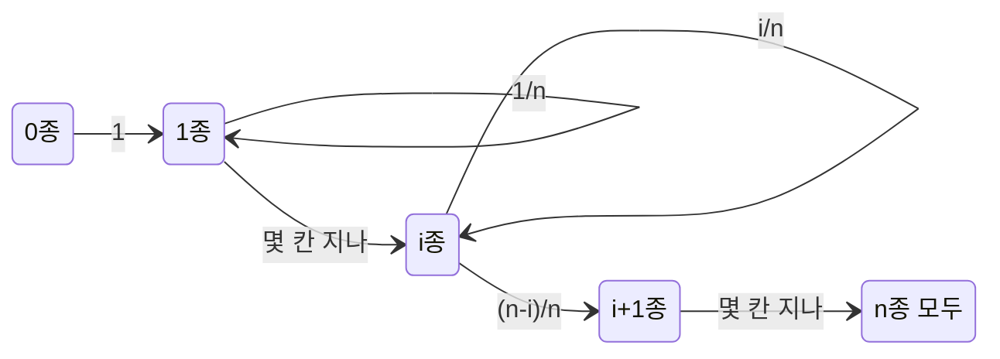



요약

성공할 때까지 몇 번 시도해야 하는지의 분포다. 평균 횟수는 성공 확률의 역수라, 주사위로 6이 나올 때까지는 평균 6번이 걸린다. 가장 특이한 성질은 무기억성이다. 이미 여러 번 실패했어도 앞으로 더 기다릴 횟수의 분포는 처음과 똑같아서, "이제 나올 때가 됐다"는 느낌은 틀렸다. 책마다 "첫 성공까지의 시도 수"로 셀지 "첫 성공 전의 실패 수"로 셀지가 달라 평균이 1씩 차이 난다.

## 예시로 보기

주사위를 6이 나올 때까지 던진다. $$k$$번째에 처음 6이 나오려면 앞의 $$k - 1$$번은 6이 아니고 $$k$$번째가 6이어야 한다.

| 필요한 횟수 $$k$$ | 1 | 2 | 3 | $$k$$ |
|---|---|---|---|---|
| 확률 | $$\frac16$$ | $$\frac56 \cdot \frac16$$ | $$\left(\frac56\right)^2\frac16$$ | $$\left(\frac56\right)^{k-1}\frac16$$ |

확률이 공비 $$\frac56$$로 줄어드는 [등비수열](/Hongs_Blog/studies/college-math/geometric-series/)이라 "기하"분포다. 여섯 번 넘게 걸릴 확률은 처음 여섯 번이 모두 실패할 확률 $$\left(\frac56\right)^6 \approx 0.335$$라, 평균 6번이라도 세 번에 한 번은 그보다 오래 걸린다.

막대 높이가 한 칸마다 $$\frac56$$배로 줄어든다. 평균(점선)은 6번이지만, 주황 막대를 모두 더한 0.335만큼은 6번보다 오래 걸린다[^s2].

## 정의

정의

서로 독립이고 성공 확률이 $$p$$($$0 < p \le 1$$)인 시행을 성공할 때까지 할 때, 필요한 시행 횟수 $$X$$는 **기하분포**를 따른다.

$$P(X = k) = (1 - p)^{k-1}p\quad(k = 1, 2, \dots),\qquad \mathbb{E}[X] = \frac1p,\qquad \operatorname{Var}[X] = \frac{1 - p}{p^2}.$$

**두 가지 규약.** 첫 성공 **전의 실패 수** $$Y = X - 1$$로 정의하는 책도 있다. Blitzstein·Hwang은 이쪽을 기하분포라 부르고, 시행 수는 "첫 성공 분포"라 따로 부른다[^1].

| 무엇을 세나 | 값의 범위 | 평균 | 쓰는 곳 |
|---|---|---|---|
| 첫 성공까지의 시행 수 $$X$$ | $$1, 2, \dots$$ | $$\frac1p$$ | 이 문서, CLRS, SciPy `geom` |
| 첫 성공 전의 실패 수 $$Y$$ | $$0, 1, \dots$$ | $$\frac{1 - p}{p}$$ | Blitzstein·Hwang |

분산은 두 규약에서 같다(1을 빼도 흩어짐은 그대로다). 공식을 가져오기 전에 어느 쪽인지 확인한다[^s1].

무기억성

모든 $$m, n \ge 0$$에 대해 $$P(X > m + n \mid X > m) = P(X > n)$$. 이 성질을 가진 양의 정수 값 분포는 기하분포뿐이다.

무기억성과 평균의 유도

1. *꼬리 확률:* $$X > n$$은 처음 $$n$$번이 모두 실패라는 뜻이라 $$P(X > n) = (1 - p)^n$$.
2. *무기억성:* $$\{X > m + n\} \subseteq \{X > m\}$$이므로 $$P(X > m + n \mid X > m) = \frac{(1-p)^{m+n}}{(1-p)^m} = (1 - p)^n$$.
3. *평균:* 첫 시행이 성공(확률 $$p$$)이면 1번으로 끝난다. 실패하면 1번을 쓰고, 무기억성 때문에 처음부터 다시 시작한 것과 같다. 그래서 $$\mathbb{E}[X] = 1 + (1 - p)\mathbb{E}[X]$$, 풀면 $$\mathbb{E}[X] = \frac1p$$. ∎

"기하분포뿐"이라는 역은 $$q(n) = P(X > n)$$이 $$q(m + n) = q(m)q(n)$$을 만족해 $$q(n) = q(1)^n$$일 수밖에 없다는 데서 나온다 [증명 스케치].

## 예제

**쿠폰 수집.** 과자마다 $$n$$종류 스티커 중 하나가 똑같은 확률로 들어 있다. 모든 종류를 모으려면 평균 몇 개를 사야 하는가?

1. *단계로 나누기:* 이미 $$i$$종류를 가졌을 때 새 종류가 나올 확률은 $$\frac{n - i}{n}$$. 그때까지 사는 개수 $$T_i$$는 기하분포라 평균 $$\frac{n}{n - i}$$.
2. *선형성:* 전체 개수는 $$T_0 + T_1 + \cdots + T_{n-1}$$이라 [기댓값의 선형성](/Hongs_Blog/studies/probability-statistics/expectation/)으로 $$\sum_{i=0}^{n-1}\frac{n}{n - i} = n\left(1 + \frac12 + \cdots + \frac1n\right)$$($$\sum$$은 차례로 모두 더한다는 기호).
3. *값:* $$n = 10$$이면 약 29.3개. 종류 수의 세 배 가까이 사야 한다. 마지막 몇 종류가 오래 걸리기 때문이다($$T_9$$만 평균 10개).

$$i$$종을 가진 동안은 과자 하나마다 확률 $$\frac{n-i}{n}$$로 다음 칸에 가고, 아니면 제자리 고리를 돈다. 한 칸을 넘는 데 드는 개수 $$T_i$$가 기하분포인 이유다. 오른쪽으로 갈수록 제자리 고리의 확률이 커져 오래 머문다.[^s3]

검증: PMF의 합·평균·분산과 두 규약(네 가지 $$p$$), 무기억성(분수로 정확히, 모의실험 10만 회), 주사위의 값, 쿠폰 수집 29.29(모의실험 2만 회), 재전송 평균, 균일 해싱의 탐사 수(모의실험) — [11_geometric-distribution_verify.py](/Hongs_Blog/studies/probability-statistics/code/11_geometric-distribution_verify/)

## 활용

- **재전송.** 전송마다 독립으로 성공 확률이 0.8이면 성공까지 평균 $$\frac{1}{0.8} = 1.25$$번 보낸다.
- **개방 주소 해싱.** 칸의 비율 $$\alpha$$가 차 있는 테이블에서 빈칸을 찾는 탐사는, 탐사마다 빈칸일 확률이 적어도 $$1 - \alpha$$라 기하분포로 위를 막는다. 균일 해싱 가정에서 실패한 탐색의 기대 탐사 수는 $$\frac{1}{1 - \alpha}$$ 이하다. 반쯤 차면 2번, 90% 차면 10번이라, 테이블이 차 갈수록 급격히 느려진다[^2].
- **무작위 알고리즘의 반복.** 한 번 성공 확률이 $$p$$인 무작위 시도를 성공할 때까지 되풀이하는 라스베이거스 알고리즘은 평균 $$\frac1p$$번 돈다.
- 알고리즘에서: [딕셔너리와 집합](/Hongs_Blog/studies/algorithms/hash-dict-set/)의 해시 테이블이 다 차기 전에 미리 칸 수를 늘리는 것은 개방 주소 해싱의 이 탐사 수 때문이다. [그리디](/Hongs_Blog/studies/algorithms/greedy/)의 기준을 무작위 입력으로 완전탐색과 비교할 때, 입력을 서로 독립으로 만들고 반례의 비율이 $$p$$면 첫 반례까지 평균 $$\frac1p$$번을 돌려야 한다.

## 연결

- 선수: [분산과 표준편차](/Hongs_Blog/studies/probability-statistics/variance/), [등비급수](/Hongs_Blog/studies/college-math/geometric-series/)(확률의 합과 평균)
- 비교: [이항·기하·포아송 비교](/Hongs_Blog/studies/probability-statistics/discrete-distributions-compared/)
- 연속판: [지수분포](/Hongs_Blog/studies/probability-statistics/uniform-exponential/)도 무기억성을 가진다

## 자주 하는 오해

"여러 번 연속 실패했으니 이번에는 성공할 확률이 높다"

틀렸다(도박사의 오류). 평균적으로 6번에 한 번 나오니, 오래 안 나왔으면 "밀린 몫"이 곧 나올 것 같다. 하지만 시행들이 독립이면 동전과 주사위는 지난 결과를 기억하지 않는다. 무기억성으로, 10번 실패한 뒤에도 앞으로 필요한 횟수의 분포는 처음과 똑같이 평균 6번이다. 확률이 바뀐다면 그것은 시행이 독립이 아니라는 뜻이다(예: 비복원 추출).

## 확인 문제

**C1** 주사위로 6이 나올 때까지 던지는 횟수의 평균과, 6번 넘게 걸릴 확률은?

**답:** 평균 $$\frac{1}{1/6} = 6$$번. 6번 넘게 걸리려면 처음 6번이 모두 실패여야 해서 $$\left(\frac56\right)^6 \approx 0.335$$.

**C2** 이미 5번 실패한 뒤 앞으로 필요한 횟수의 평균이 여전히 $$\frac1p$$인 이유를 무기억성으로 설명하라.

**답:** $$P(X > 5 + n \mid X > 5) = (1 - p)^n = P(X > n)$$이라, 5번 실패했다는 조건 아래 "추가로 필요한 횟수"는 처음의 $$X$$와 분포가 같다. 분포가 같으니 평균도 $$\frac1p$$다.

**C3** 성공 확률 0.2인 시도에서 "첫 성공 전의 실패 수"와 "첫 성공까지의 시도 수"의 평균을 각각 구하라.

**답:** 시도 수는 $$\frac{1}{0.2} = 5$$, 실패 수는 그보다 1 적은 $$\frac{0.8}{0.2} = 4$$. 분산은 둘 다 $$\frac{0.8}{0.04} = 20$$.

[^1]: Blitzstein, Hwang, *Introduction to Probability* 2판, 4.3절 "Geometric and Negative Binomial"(실패 수 규약의 기하분포, 첫 성공 분포, 쿠폰 수집 문제).
[^2]: Cormen, Leiserson, Rivest, Stein, *Introduction to Algorithms* 3판, 11.4절 "Open addressing"(정리 11.6, 실패한 탐색의 기대 탐사 수 $$\frac{1}{1 - \alpha}$$ 이하).
[^s1]: 보충 SciPy의 `scipy.stats.geom`은 PMF를 $$(1-p)^{k-1}p$$($$k \ge 1$$)로 정의해 시행 수 규약을 쓴다(SciPy 문서). 두 규약의 평균과 분산은 11_geometric-distribution_verify.py로 확인했다.
[^s2]: 보충 그림 한 장은 원본에 없다. [11_geometric-distribution_plot.py](/Hongs_Blog/studies/probability-statistics/code/11_geometric-distribution_plot/)로 그렸고, 그림에 쓴 값(평균 6, $$\left(\frac56\right)^6 = 0.335$$)을 같은 코드로 확인했다.
[^s3]: 보충 다이어그램 1개는 원본에 없다. 이 문서 예제(쿠폰 수집)의 1단계를 상태 전이 그림으로 옮겼다.

