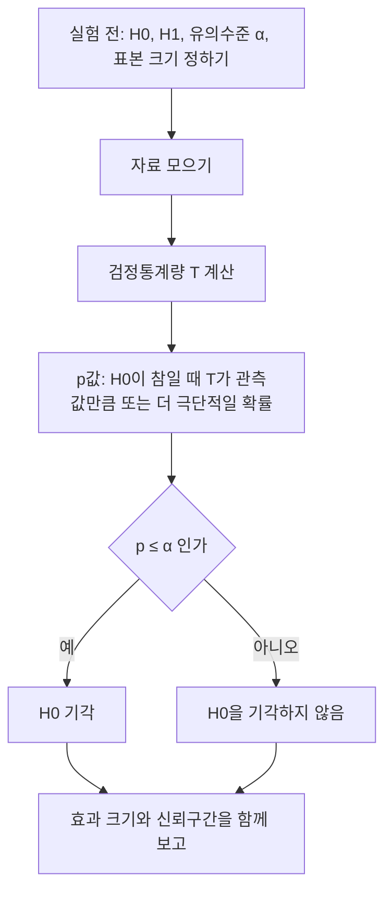



요약

"차이가 없다"는 기본 가설을 세우고, 그 가설이 맞는데도 지금만큼(또는 더) 극단적인 결과가 우연히 나올 확률을 계산한다. 이 확률(p값)이 아주 작으면 "우연으로 보기 어렵다"며 기본 가설을 버린다. 새 기능이 전환율을 올렸는지, 새 버전이 느려졌는지를 판정하는 A/B 테스트의 도구다. 하지만 p값은 가설이 참일 확률이 아니고, 효과가 얼마나 큰지도 말해 주지 않으며, 검정을 여러 번 하면 아무 효과가 없어도 우연히 "유의한" 결과가 나온다.

## 예시로 보기

기존 페이지(A)와 새 페이지(B)를 1,000명씩에게 보여 줬더니 A는 100명(10%), B는 130명(13%)이 가입했다. 3%p 차이는 진짜일까, 우연일까?

- 차이가 없다면 두 그룹은 같은 비율(합쳐서 $$\frac{230}{2000} = 11.5\%$$)을 따른다.
- 그 가정 아래 두 비율의 차이는 평균 0, 표준오차 약 0.0143으로 흔들린다.
- 관측한 차이 0.03은 표준오차의 약 2.1배이고, 이 정도 이상(양쪽 방향) 벌어질 확률은 약 3.5%다.

3.5%는 흔하지 않으니 "차이가 없다"를 버린다(유의수준 5% 기준). "차이가 없다"가 아래 정의의 귀무가설 $$H_0$$, 2.1이 검정통계량, 3.5%가 p값이다.

회색 곡선은 차이가 없을 때 두 가입률의 차이가 흔들리는 분포다. 관측한 0.03보다 바깥쪽(양쪽) 넓이를 더한 것이 p값 0.035다. 0.03이 파란 기각 경계보다 바깥이라 5% 수준에서 기각한다[^s2].

## 정의

**적용 조건.** 비교하려는 두 상황과, 차이가 없을 때 검정통계량이 어떻게 흔들리는지(귀무분포)를 계산하거나 모의실험할 수 있을 때.

**알아보는 신호.** "유의미한 차이인가", "우연으로 설명되는가", "성능이 나빠졌다고 할 수 있는가".

정의

**귀무가설** $$H_0$$(기본 입장, 보통 "효과 없음")과 **대립가설** $$H_1$$을 세운다. 자료에서 계산한 **검정통계량** $$T$$에 대해, **p값**은 $$H_0$$이 참일 때 $$T$$가 관측값만큼 또는 더 극단적으로 나올 확률이다. p값이 미리 정한 **유의수준** $$\alpha$$(흔히 0.05) 이하면 $$H_0$$을 기각한다[^1].

맨 위 칸은 결과를 보기 전에 정해 둔다. 어느 갈래로 끝나든 마지막 칸에서 효과 크기와 신뢰구간을 함께 적는다.[^s3]

| | $$H_0$$ 참 | $$H_0$$ 거짓 |
|---|---|---|
| 기각함 | 제1종 오류(확률 $$\alpha$$ 이하로 통제) | 맞음(확률 = **검정력**) |
| 기각 안 함 | 맞음 | 제2종 오류 |

**두 비율의 z검정.** 그룹마다 $$n$$명, 성공 $$a$$, $$b$$명이면 합동 비율 $$\hat p = \frac{a + b}{2n}$$, 표준오차 $$\sqrt{\hat p(1 - \hat p)\frac2n}$$, $$z = \frac{(b - a)/n}{\text{표준오차}}$$, 양측 p값 $$2(1 - \Phi(\vert z\vert ))$$다. 정규 근사는 [중심극한정리](/Hongs_Blog/studies/probability-statistics/clt/)에서 나온다.

**신뢰구간과의 관계.** 차이의 95% [신뢰구간](/Hongs_Blog/studies/probability-statistics/confidence-intervals/)이 0을 포함하지 않는 것과, 유의수준 5% 양측 검정이 기각하는 것은 (같은 표준오차를 쓰면) 같은 판정이다.

$$H_0$$이 참이면 p값은 균등분포다(연속인 검정통계량)

1. *정의:* 한쪽 검정에서 $$p = 1 - F_0(T)$$($$F_0$$은 $$H_0$$ 아래 $$T$$의 CDF).
2. *확률 적분 변환:* $$F_0$$이 연속이면 $$F_0(T)$$는 $$\mathrm{Unif}(0, 1)$$을 따른다([균등분포의 보편성](/Hongs_Blog/studies/probability-statistics/uniform-exponential/)의 역방향).
3. *결론:* $$p = 1 - F_0(T)$$도 균등분포라 $$P(p \le \alpha) = \alpha$$. "p ≤ 0.05면 기각"하면 제1종 오류가 정확히 5%다. ∎

### 스스로 설명해 보기

1. 증명 3단계에서 "제1종 오류 = α"가 나오는 이유는?

제1종 오류는 $$H_0$$이 참인데 기각하는 것, 곧 $$H_0$$ 아래에서 $$p \le \alpha$$인 사건이다. $$p$$가 균등분포라 그 확률이 $$\alpha$$다.

2. 이 성질이 다중 검정의 위험을 어떻게 설명하는가?

효과가 전혀 없는 검정 20개를 독립으로 하면 각각의 p값이 균등분포라, 적어도 하나가 0.05 아래로 떨어질 확률은 $$1 - 0.95^{20} \approx 0.64$$다.

3. 가설검정의 핵심 아이디어는?

귀류법의 확률판이다. "효과가 없다"고 가정하고 관측 결과가 그 가정 아래 얼마나 드문지 계산해, 너무 드물면 가정을 의심한다. 다만 귀류법과 달리 "드물다"는 모순이 아니라서 틀릴 확률($$\alpha$$)이 남는다.

## 예제

**대표 문제 1: A/B 테스트(예시의 계산).**

1. *가설:* $$H_0$$: 두 전환율이 같다. $$H_1$$: 다르다(양측).
2. *통계량:* $$\hat p = 0.115$$, 표준오차 $$\sqrt{0.115 \times 0.885 \times \frac{2}{1000}} \approx 0.01427$$, $$z = \frac{0.03}{0.01427} \approx 2.10$$.
3. *p값:* $$2(1 - \Phi(2.10)) \approx 0.035$$. 두 그룹의 표를 무작위로 섞어 다시 나누는 순열 검정(모의실험 4,000회)으로도 비슷한 값이 나온다.
4. *결론과 한계:* 5% 수준에서 기각. 하지만 차이의 크기는 신뢰구간 $$0.03 \pm 1.96 \times 0.0143$$, 곧 약 0.2%p에서 5.8%p로 불확실성이 크다.

**대표 문제 2: 검정력과 표본 크기.** 참 전환율이 정말 10%와 13%라면, 1,000명씩으로는 5% 수준에서 차이를 잡아낼 확률(검정력)이 약 56%에 불과하다. 2,000명씩이면 80%를 넘는다. 실험 전에 원하는 검정력으로 표본 크기를 정해야, 효과가 있는데도 "유의하지 않음"으로 놓치는 일을 줄인다.

초록 곡선은 참 차이가 0.03일 때 관측한 차이의 분포다. 파란 기각 경계 오른쪽의 넓이가 검정력 0.56이고, 왼쪽 보라 부분에서는 효과가 있어도 놓친다. 표본을 늘리면 두 곡선이 좁아져 겹치는 부분이 준다[^s2].

검증: A/B의 합동 비율·표준오차·z·p값과 순열 검정, $$H_0$$ 아래 p < 0.05 비율 약 5%(A/A 테스트 3,000회), 다중 검정 0.64(식과 모의실험), 검정력 1,000명 약 0.56과 2,000명에서의 증가, 예제 사다리의 값 — [32_hypothesis-testing_verify.py](/Hongs_Blog/studies/probability-statistics/code/32_hypothesis-testing_verify/)

## 활용

- **A/B 테스트.** 기능 출시 판단, 추천 알고리즘 비교. 실험 전에 지표·유의수준·표본 크기를 정해 두고, 결과를 보며 도중에 멈추지 않는다(멈춘 시점을 고르면 제1종 오류가 커진다).
- **성능 회귀 검사.** 새 빌드의 지연 시간이 기준보다 유의하게 커졌는지 CI에서 판정한다.
- **다중 검정 보정.** 지표 $$m$$개를 한꺼번에 보면 각 검정을 $$\frac{\alpha}{m}$$ 수준으로 하는 본페로니 보정 같은 방법을 쓴다.
- 연습: [가설검정 예제 사다리](/Hongs_Blog/studies/probability-statistics/hypothesis-testing-ladder/)

## 연결

- 선수: [신뢰구간](/Hongs_Blog/studies/probability-statistics/confidence-intervals/)
- 근거: [중심극한정리](/Hongs_Blog/studies/probability-statistics/clt/)(정규 근사), [베이즈 정리](/Hongs_Blog/studies/probability-statistics/bayes-theorem/)(p값과 "가설이 참일 확률"의 차이)

## 자주 하는 오해

"p = 0.03이면 귀무가설이 참일 확률이 3%다"

틀렸다. p값이 작을수록 "효과가 있다"는 확신이 커지는 느낌이라 이렇게 읽기 쉽다. 하지만 p값은 $$P(\text{이만큼 극단적인 자료} \mid H_0)$$이고, 알고 싶은 $$P(H_0 \mid \text{자료})$$와는 방향이 반대다. 둘을 오가려면 사전확률이 필요하다([베이즈 정리](/Hongs_Blog/studies/probability-statistics/bayes-theorem/)). 미국통계학회도 p값은 가설이 참일 확률이 아니고, 효과의 크기나 중요성을 재지 않는다고 밝혔다[^2]. 효과 크기와 신뢰구간을 함께 보고한다.

## 과목별 관점

**데이터 과학 (3-2학기).** 두 분류 모델 A, B를 같은 $$k$$겹 교차검증으로 평가해, 정확도 차이가 우연인지 가린다(짝지은 t-검정)[^d1]. 겹 $$i$$의 차이 $$d_i = \operatorname{Acc}(A_i) - \operatorname{Acc}(B_i)$$로 가설을 세운다. $$H_0: \mu_d = 0$$(평균적으로 같다), $$H_1: \mu_d \ne 0$$이다.

$$t = \frac{\bar d}{s_d / \sqrt k}, \qquad \bar d = \frac1k\sum_{i=1}^{k} d_i, \qquad s_d = \sqrt{\frac1k\sum_{i=1}^{k}(d_i - \bar d)^2}$$

분자 $$\bar d$$는 A가 B보다 평균 얼마나 나은지(양수면 A가 낫다)다. 분모는 그 차이가 겹마다 얼마나 흔들리는지다. $$t$$가 크면 차이가 우연이 아니라고 본다. p값은 $$H_0$$ 아래에서 지금만큼 또는 더 극단적인 차이가 나올 확률이고, 0.05보다 작으면 유의하다[^d1].

슬라이드는 $$s_d$$를 $$k$$로 나눈다. 보통의 표본표준편차는 $$k - 1$$로 나누고, $$t$$를 자유도 $$k - 1$$인 t 분포와 비교한다[^sd1]. 예: 5겹의 차이가 0.02, 0.03, 0.01, 0.03, 0.03이면 $$\bar d = 0.024$$, $$t$$는 $$k$$로 나누면 6.71, $$k - 1$$로 나누면 6.00이다. 자유도 4의 양측 0.05 임계값 2.776보다 커서 A가 유의하게 낫다.

## 확인 문제

**C1** 양측 검정의 검정통계량이 $$z = 2.1$$이다. p값은? 유의수준 5%에서 결론은?

**답:** $$2(1 - \Phi(2.1)) \approx 0.036$$. 0.05보다 작아 귀무가설을 기각한다.

**C2** p값이 "귀무가설이 참일 확률"이 아닌 이유를 조건부 확률로 설명하라.

**답:** p값은 귀무가설이 참이라고 **가정한 상태에서** 이만큼 극단적인 자료가 나올 확률 $$P(\text{자료} \mid H_0)$$다. 귀무가설이 참일 확률은 $$P(H_0 \mid \text{자료})$$로 조건의 방향이 반대이고, 이것은 사전확률 없이는 계산할 수 없다.

**C3** 효과가 전혀 없는 지표 20개를 각각 유의수준 5%로 독립 검정하면, 적어도 하나가 "유의"하게 나올 확률은? 본페로니 보정을 하면 각 검정의 기준은?

**답:** $$1 - 0.95^{20} \approx 0.64$$. 본페로니는 각 검정을 $$\frac{0.05}{20} = 0.0025$$ 수준으로 해 전체 오류를 5% 이하로 묶는다.

**C4** (가) 새 기능이 효과가 없는데 효과가 있다고 결론 내림 (나) 새 기능이 실제로 효과가 있는데 "유의하지 않음"으로 끝남. 각각 어떤 오류이고 무엇으로 줄이는가?

**답:** (가) 제1종 오류. 유의수준 $$\alpha$$를 낮추거나 다중 검정을 보정해 줄인다. (나) 제2종 오류. 표본 크기를 늘려 검정력을 높여 줄인다. 같은 표본에서 한쪽을 줄이면 다른 쪽이 커진다.

**C5** 5겹 교차검증에서 모델 A와 B의 정확도 차이가 0.02, 0.03, 0.01, 0.03, 0.03이다. 짝지은 t-검정의 $$t$$($$s_d$$는 $$k - 1$$로 나눔)를 구하고, 유의수준 0.05(자유도 4, 임계값 2.776)에서 판단하라.

**답:** $$\bar d = 0.024$$, 편차 제곱합 0.00032, $$s_d = \sqrt{0.00032/4} \approx 0.00894$$, $$t = \frac{0.024}{0.00894/\sqrt5} \approx 6.00 > 2.776$$. 귀무가설을 버리고 A가 낫다고 판단한다[^sd1].

[^1]: Wasserman, *All of Statistics*, "Hypothesis Testing and p-values" 장(귀무·대립가설, 유의수준, 검정력, p값, 순열 검정, 다중 검정과 본페로니).
[^2]: Wasserstein, Lazar, "The ASA Statement on p-Values: Context, Process, and Purpose", *The American Statistician* 70(2), 2016.
[^d1]: 데이터 과학 6회 강의 자료 「6-2_ensemble」, p.6 (6-1 복습: T-Test와 P-value)
[^sd1]: 보충 $$k - 1$$로 나누는 표준 방법, 5겹 예와 카드 C5는 원본에 없다. 슬라이드처럼 $$k$$로 나누는 식은 Han, Kamber, Pei, *Data Mining* 3판 8.5.5절의 식이다. 32_hypothesis-testing_verify.py로 계산했다.
[^s2]: 보충 그림 두 장은 원본에 없다. [32_hypothesis-testing_plot.py](/Hongs_Blog/studies/probability-statistics/code/32_hypothesis-testing_plot/)로 그렸고, 그림에 쓴 값(표준오차 0.01427, $$z = 2.10$$, p값 0.035, 1,000명씩의 검정력 0.56, 2,000명씩 0.8 초과)을 같은 코드로 확인했다.
[^s3]: 보충 다이어그램 1개는 원본에 없다. 이 문서 정의, 대표 문제 2(검정력과 표본 크기), 활용 절(실험 전에 정해 두기), 자주 하는 오해(효과 크기와 신뢰구간 보고)를 한 흐름으로 그렸다.

