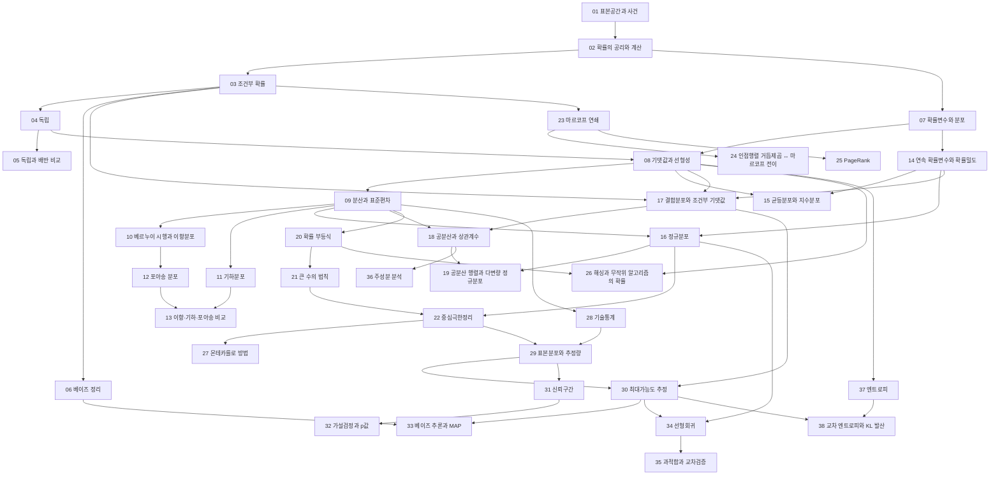


> 교재: Blitzstein·Hwang *Introduction to Probability* (Harvard Stat 110)

## 먼저 알아야 할 것
- [함수](/Hongs_Blog/studies/college-math/function/) (대학수학) → 확률변수와 분포
- [로그](/Hongs_Blog/studies/college-math/logarithm/) (대학수학) → 엔트로피
- [집합](/Hongs_Blog/studies/discrete-math/sets/) (이산수학) → 표본공간과 사건
- [순열과 조합](/Hongs_Blog/studies/discrete-math/permutations-combinations/) (이산수학) → 확률의 공리와 계산
- [이항정리](/Hongs_Blog/studies/discrete-math/binomial-theorem/) (이산수학) → 베르누이 시행과 이항분포
- [비둘기집 원리](/Hongs_Blog/studies/discrete-math/pigeonhole/) (이산수학) → 해싱과 무작위 알고리즘의 확률
- [그래프의 기초](/Hongs_Blog/studies/discrete-math/graph-basics/) (이산수학) → 인접행렬 거듭제곱 ↔ 마르코프 전이
- [수열의 극한과 e](/Hongs_Blog/studies/calculus/sequence-limits/) (미분적분학) → 포아송 분포, 큰 수의 법칙
- [도함수의 활용과 최적화](/Hongs_Blog/studies/calculus/curve-analysis/) (미분적분학) → 최대가능도 추정
- [이상적분](/Hongs_Blog/studies/calculus/improper-integrals/) (미분적분학) → 연속 확률변수와 확률밀도
- [중적분과 변수변환](/Hongs_Blog/studies/calculus/multiple-integrals/) (미분적분학) → 정규분포
- [내적과 노름](/Hongs_Blog/studies/linear-algebra/dot-product/) (선형대수학) → 공분산과 상관계수
- [행렬 곱셈과 전치](/Hongs_Blog/studies/linear-algebra/matrix-multiplication/) (선형대수학) → 인접행렬 거듭제곱 ↔ 마르코프 전이
- [최소제곱법](/Hongs_Blog/studies/linear-algebra/least-squares/) (선형대수학) → 선형회귀
- [고윳값과 고유벡터](/Hongs_Blog/studies/linear-algebra/eigenvalues/) (선형대수학) → 마르코프 연쇄
- [대각화와 행렬 거듭제곱](/Hongs_Blog/studies/linear-algebra/diagonalization/) (선형대수학) → PageRank
- [양의 정부호 행렬과 이차형식](/Hongs_Blog/studies/linear-algebra/positive-definite/) (선형대수학) → 공분산 행렬과 다변량 정규분포
- [특잇값 분해](/Hongs_Blog/studies/linear-algebra/svd/) (선형대수학) → 주성분 분석

## 1단원 · 확률의 기초

읽기 전에

1. 23명이 모이면 생일이 같은 두 사람이 있을 확률은 절반보다 클까, 작을까? → [확률의 공리와 계산](/Hongs_Blog/studies/probability-statistics/probability-axioms/)
2. 몬티 홀 문제에서 문을 바꾸면 이길 확률은 1/2일까? → [조건부 확률](/Hongs_Blog/studies/probability-statistics/conditional-probability/)
3. 99% 정확한 검사에서 양성이 나오면 병이 있을 확률은 99%일까? → [베이즈 정리](/Hongs_Blog/studies/probability-statistics/bayes-theorem/)

| 번호 | 개념 | 한 줄 | 개념 코드 | 연습 |
|---|---|---|---|---|
| 01 | [표본공간과 사건](/Hongs_Blog/studies/probability-statistics/sample-space/) | 일어날 수 있는 모든 결과의 집합과 그 부분집합 | [검증](/Hongs_Blog/studies/probability-statistics/code/01_sample-space_verify/) | — |
| 02 | [확률의 공리와 계산](/Hongs_Blog/studies/probability-statistics/probability-axioms/) | 0~1, 전체 1, 겹치지 않으면 더한다. 균등이면 세기 | [그림1](/Hongs_Blog/assets/notes/probability-statistics/02_probability-axioms_fig1.svg) · [그림 코드](/Hongs_Blog/studies/probability-statistics/code/02_probability-axioms_plot/) · [검증](/Hongs_Blog/studies/probability-statistics/code/02_probability-axioms_verify/) | — |
| 03 | [조건부 확률](/Hongs_Blog/studies/probability-statistics/conditional-probability/) | 정보가 주어지면 표본공간이 줄어든다. 곱셈 법칙, 전확률 (무거움) | [검증](/Hongs_Blog/studies/probability-statistics/code/03_conditional-probability_verify/) | — |
| 04 | [독립](/Hongs_Blog/studies/probability-statistics/independence/) | 한 사건이 다른 사건의 확률을 바꾸지 않는다 | [검증](/Hongs_Blog/studies/probability-statistics/code/04_independence_verify/) | — |
| 05 | [독립과 배반 비교](/Hongs_Blog/studies/probability-statistics/independent-vs-disjoint/) | 가르는 질문: 같이 일어날 수 없는가, 서로 정보를 주지 않는가 | [검증](/Hongs_Blog/studies/probability-statistics/code/05_independent-vs-disjoint_verify/) | — |
| 06 | [베이즈 정리](/Hongs_Blog/studies/probability-statistics/bayes-theorem/) | 결과에서 원인의 확률을 거꾸로 구한다. 기저율을 잊으면 크게 틀린다 (무거움) | [그림1](/Hongs_Blog/assets/notes/probability-statistics/06_bayes-theorem_fig1.svg) · [그림 코드](/Hongs_Blog/studies/probability-statistics/code/06_bayes-theorem_plot/) · [검증](/Hongs_Blog/studies/probability-statistics/code/06_bayes-theorem_verify/) | [베이즈 정리 예제 사다리](/Hongs_Blog/studies/probability-statistics/bayes-ladder/) |

떠올려 보기: 노트를 닫고 확률의 세 공리, 조건부 확률의 정의와 곱셈 법칙·전확률 공식, 독립의 정의, 베이즈 정리를 차례로 쓰고, 각 식이 앞의 어느 식에서 나오는지 화살표로 잇는다.

## 2단원 · 이산 확률변수

읽기 전에

1. 모자를 무작위로 돌려받을 때 자기 모자를 받는 사람 수의 평균은 사람 수에 따라 어떻게 바뀔까? → [기댓값과 선형성](/Hongs_Blog/studies/probability-statistics/expectation/)
2. 주사위로 6이 나올 때까지 10번 실패했다면, 이제 6이 나올 확률이 높아졌을까? → [기하분포](/Hongs_Blog/studies/probability-statistics/geometric-distribution/)
3. 1초에 평균 3개 오는 요청을 1% 미만으로만 넘치게 받으려면 1초에 몇 개를 처리해야 할까? → [포아송 분포](/Hongs_Blog/studies/probability-statistics/poisson/)

| 번호 | 개념 | 한 줄 | 개념 코드 | 연습 |
|---|---|---|---|---|
| 07 | [확률변수와 분포](/Hongs_Blog/studies/probability-statistics/random-variables/) | 결과에 수를 붙이는 함수. PMF, CDF, 지시 확률변수 | [그림1](/Hongs_Blog/assets/notes/probability-statistics/07_random-variables_fig1.svg) · [그림 코드](/Hongs_Blog/studies/probability-statistics/code/07_random-variables_plot/) · [검증](/Hongs_Blog/studies/probability-statistics/code/07_random-variables_verify/) | — |
| 08 | [기댓값과 선형성](/Hongs_Blog/studies/probability-statistics/expectation/) | 독립이 아니어도 합의 기댓값 = 기댓값의 합 (무거움) | [검증](/Hongs_Blog/studies/probability-statistics/code/08_expectation_verify/) | [기댓값 선형성 예제 사다리](/Hongs_Blog/studies/probability-statistics/expectation-ladder/) |
| 09 | [분산과 표준편차](/Hongs_Blog/studies/probability-statistics/variance/) | 평균에서 얼마나 흩어지나. 독립합의 분산은 더해진다 | [검증](/Hongs_Blog/studies/probability-statistics/code/09_variance_verify/) | — |
| 10 | [베르누이 시행과 이항분포](/Hongs_Blog/studies/probability-statistics/binomial/) | n번 독립 시행 중 성공 횟수 | [그림1](/Hongs_Blog/assets/notes/probability-statistics/10_binomial_fig1.svg) · [그림2](/Hongs_Blog/assets/notes/probability-statistics/10_binomial_fig2.svg) · [그림 코드](/Hongs_Blog/studies/probability-statistics/code/10_binomial_plot/) · [검증](/Hongs_Blog/studies/probability-statistics/code/10_binomial_verify/) | — |
| 11 | [기하분포](/Hongs_Blog/studies/probability-statistics/geometric-distribution/) | 첫 성공까지의 시도 횟수. 무기억성 | [그림1](/Hongs_Blog/assets/notes/probability-statistics/11_geometric-distribution_fig1.svg) · [그림 코드](/Hongs_Blog/studies/probability-statistics/code/11_geometric-distribution_plot/) · [검증](/Hongs_Blog/studies/probability-statistics/code/11_geometric-distribution_verify/) | — |
| 12 | [포아송 분포](/Hongs_Blog/studies/probability-statistics/poisson/) | 드문 사건이 일정 시간에 몇 번 일어나나. 이항의 극한 | [그림1](/Hongs_Blog/assets/notes/probability-statistics/12_poisson_fig1.svg) · [그림2](/Hongs_Blog/assets/notes/probability-statistics/12_poisson_fig2.svg) · [그림 코드](/Hongs_Blog/studies/probability-statistics/code/12_poisson_plot/) · [검증](/Hongs_Blog/studies/probability-statistics/code/12_poisson_verify/) | — |
| 13 | [이항·기하·포아송 비교](/Hongs_Blog/studies/probability-statistics/discrete-distributions-compared/) | 가르는 질문: 무엇을 세는가 | [검증](/Hongs_Blog/studies/probability-statistics/code/13_discrete-distributions-compared_verify/) | — |

떠올려 보기: 기댓값의 정의와 선형성, 분산의 계산 공식과 독립합의 분산, 이항·기하·포아송의 PMF·평균·분산을 표로 써 보고, 이항에서 포아송이 나오는 극한을 한 줄로 설명한다.

## 3단원 · 연속 확률변수

읽기 전에

1. 확률밀도가 2라면 그 값이 나올 확률이 2라는 뜻일까? → [연속 확률변수와 확률밀도](/Hongs_Blog/studies/probability-statistics/continuous-rv/)
2. 요청이 1초에 평균 3개 올 때, 다음 요청까지 1초 넘게 기다릴 확률은 얼마일까? → [균등분포와 지수분포](/Hongs_Blog/studies/probability-statistics/uniform-exponential/)
3. 평균에서 표준편차 3개 넘게 벗어나는 일은 어떤 자료에서든 드물까? → [정규분포](/Hongs_Blog/studies/probability-statistics/normal-distribution/)

| 번호 | 개념 | 한 줄 | 개념 코드 | 연습 |
|---|---|---|---|---|
| 14 | [연속 확률변수와 확률밀도](/Hongs_Blog/studies/probability-statistics/continuous-rv/) | 한 점의 확률은 0이고 넓이가 확률 | [그림1](/Hongs_Blog/assets/notes/probability-statistics/14_continuous-rv_fig1.svg) · [그림 코드](/Hongs_Blog/studies/probability-statistics/code/14_continuous-rv_plot/) · [검증](/Hongs_Blog/studies/probability-statistics/code/14_continuous-rv_verify/) | — |
| 15 | [균등분포와 지수분포](/Hongs_Blog/studies/probability-statistics/uniform-exponential/) | 어디든 같은 확률 / 기다림의 무기억 분포 | [그림1](/Hongs_Blog/assets/notes/probability-statistics/15_uniform-exponential_fig1.svg) · [그림 코드](/Hongs_Blog/studies/probability-statistics/code/15_uniform-exponential_plot/) · [검증](/Hongs_Blog/studies/probability-statistics/code/15_uniform-exponential_verify/) | — |
| 16 | [정규분포](/Hongs_Blog/studies/probability-statistics/normal-distribution/) | 종 모양. 평균과 표준편차로 정해지고 68-95-99.7 (무거움) | [그림1](/Hongs_Blog/assets/notes/probability-statistics/16_normal-distribution_fig1.svg) · [그림2](/Hongs_Blog/assets/notes/probability-statistics/16_normal-distribution_fig2.svg) · [그림 코드](/Hongs_Blog/studies/probability-statistics/code/16_normal-distribution_plot/) · [검증](/Hongs_Blog/studies/probability-statistics/code/16_normal-distribution_verify/) | — |

떠올려 보기: PDF와 CDF의 관계, 균등·지수·정규분포의 밀도·평균·분산을 표로 쓰고, 무기억성과 표준화가 각각 어떤 계산을 쉽게 하는지 한 줄씩 붙인다.

## 4단원 · 여러 확률변수

읽기 전에

1. 두 변수 각각의 분포를 알면 둘이 함께 어떻게 나오는지도 알 수 있을까? → [결합분포와 조건부 기댓값](/Hongs_Blog/studies/probability-statistics/joint-distributions/)
2. 공분산이 0이면 두 변수는 서로 아무 관계가 없을까? → [공분산과 상관계수](/Hongs_Blog/studies/probability-statistics/covariance/)
3. 상관된 2차원 정규 난수는 독립 난수로 어떻게 만들까? → [공분산 행렬과 다변량 정규분포](/Hongs_Blog/studies/probability-statistics/multivariate-normal/)

| 번호 | 개념 | 한 줄 | 개념 코드 | 연습 |
|---|---|---|---|---|
| 17 | [결합분포와 조건부 기댓값](/Hongs_Blog/studies/probability-statistics/joint-distributions/) | 두 확률변수를 함께 본다. 주변화와 조건부 (무거움) | [검증](/Hongs_Blog/studies/probability-statistics/code/17_joint-distributions_verify/) | — |
| 18 | [공분산과 상관계수](/Hongs_Blog/studies/probability-statistics/covariance/) | 함께 움직이는 정도. 상관은 인과가 아니다 | [그림1](/Hongs_Blog/assets/notes/probability-statistics/18_covariance_fig1.svg) · [그림 코드](/Hongs_Blog/studies/probability-statistics/code/18_covariance_plot/) · [검증](/Hongs_Blog/studies/probability-statistics/code/18_covariance_verify/) | — |
| 19 | [공분산 행렬과 다변량 정규분포](/Hongs_Blog/studies/probability-statistics/multivariate-normal/) | 여러 변수의 퍼짐을 행렬 하나로. 등고선은 타원 | [그림1](/Hongs_Blog/assets/notes/probability-statistics/19_multivariate-normal_fig1.svg) · [그림 코드](/Hongs_Blog/studies/probability-statistics/code/19_multivariate-normal_plot/) · [검증](/Hongs_Blog/studies/probability-statistics/code/19_multivariate-normal_verify/) | — |

떠올려 보기: 주변분포·조건부 분포·아담의 법칙·이브의 법칙, 공분산과 상관계수의 정의와 합의 분산, 공분산 행렬의 성질과 AΣAᵀ를 쓰고, 상관계수가 코사인인 이유를 한 문단으로 설명한다.

## 5단원 · 극한 정리

읽기 전에

1. 평균만 알 때 '평균의 10배 이상'이 나올 확률은 얼마 이하라고 말할 수 있을까? → [확률 부등식](/Hongs_Blog/studies/probability-statistics/tail-bounds/)
2. 동전을 많이 던지면 앞면과 뒷면의 개수 차이는 줄어들까? → [큰 수의 법칙](/Hongs_Blog/studies/probability-statistics/lln/)
3. 주사위 100개의 합은 어떤 모양의 분포를 따를까? → [중심극한정리](/Hongs_Blog/studies/probability-statistics/clt/)

| 번호 | 개념 | 한 줄 | 개념 코드 | 연습 |
|---|---|---|---|---|
| 20 | [확률 부등식](/Hongs_Blog/studies/probability-statistics/tail-bounds/) | 평균·분산만으로 꼬리 확률의 상한: 마르코프, 체비쇼프, 체르노프 (무거움) | [그림1](/Hongs_Blog/assets/notes/probability-statistics/20_tail-bounds_fig1.svg) · [그림 코드](/Hongs_Blog/studies/probability-statistics/code/20_tail-bounds_plot/) · [검증](/Hongs_Blog/studies/probability-statistics/code/20_tail-bounds_verify/) | — |
| 21 | [큰 수의 법칙](/Hongs_Blog/studies/probability-statistics/lln/) | 표본평균은 기댓값으로 모인다 | [그림1](/Hongs_Blog/assets/notes/probability-statistics/21_lln_fig1.svg) · [그림 코드](/Hongs_Blog/studies/probability-statistics/code/21_lln_plot/) · [검증](/Hongs_Blog/studies/probability-statistics/code/21_lln_verify/) | — |
| 22 | [중심극한정리](/Hongs_Blog/studies/probability-statistics/clt/) | 독립인 것들의 합은 정규분포에 가까워진다 (무거움) | [그림1](/Hongs_Blog/assets/notes/probability-statistics/22_clt_fig1.svg) · [그림2](/Hongs_Blog/assets/notes/probability-statistics/22_clt_fig2.svg) · [그림 코드](/Hongs_Blog/studies/probability-statistics/code/22_clt_plot/) · [검증](/Hongs_Blog/studies/probability-statistics/code/22_clt_verify/) | — |

떠올려 보기: 마르코프·체비쇼프·체르노프를 가정과 함께 쓰고, 체비쇼프로 큰 수의 법칙을 증명하고, 중심극한정리를 표준화 식으로 쓴 뒤 세 결과가 '평균의 오차'에 대해 각각 무엇을 말하는지 비교한다.

## 6단원 · 확률 과정과 컴퓨팅

읽기 전에

1. 오늘 비가 왔다면 한 달 뒤 날씨 확률은 오늘 날씨에 얼마나 달려 있을까? → [마르코프 연쇄](/Hongs_Blog/studies/probability-statistics/markov-chains/)
2. 아무도 가리키지 않는 웹 페이지의 PageRank는 0일까? → [PageRank](/Hongs_Blog/studies/probability-statistics/pagerank/)
3. 무작위 퀵정렬은 이미 정렬된 입력에서도 빠를까? → [해싱과 무작위 알고리즘의 확률](/Hongs_Blog/studies/probability-statistics/randomized-analysis/)

| 번호 | 개념 | 한 줄 | 개념 코드 | 연습 |
|---|---|---|---|---|
| 23 | [마르코프 연쇄](/Hongs_Blog/studies/probability-statistics/markov-chains/) | 다음 상태가 현재에만 달린 과정. 전이행렬과 정상분포 | [그림1](/Hongs_Blog/assets/notes/probability-statistics/23_markov-chains_fig1.svg) · [그림 코드](/Hongs_Blog/studies/probability-statistics/code/23_markov-chains_plot/) · [검증](/Hongs_Blog/studies/probability-statistics/code/23_markov-chains_verify/) | — |
| 24 | [인접행렬 거듭제곱 ↔ 마르코프 전이](/Hongs_Blog/studies/probability-statistics/walks-markov-bridge/) | (A^k)_ij는 보행 수, (P^k)_ij는 k단계 확률 | [검증](/Hongs_Blog/studies/probability-statistics/code/24_walks-markov-bridge_verify/) | — |
| 25 | [PageRank](/Hongs_Blog/studies/probability-statistics/pagerank/) | 무작위 서퍼의 정상분포 = 고유벡터. 거듭제곱법 | [그림1](/Hongs_Blog/assets/notes/probability-statistics/25_pagerank_fig1.svg) · [구현](/Hongs_Blog/studies/probability-statistics/code/25_pagerank_impl/) · [그림 코드](/Hongs_Blog/studies/probability-statistics/code/25_pagerank_plot/) · [검증](/Hongs_Blog/studies/probability-statistics/code/25_pagerank_verify/) | — |
| 26 | [해싱과 무작위 알고리즘의 확률](/Hongs_Blog/studies/probability-statistics/randomized-analysis/) | 생일 문제, 해시 충돌, 무작위 퀵정렬의 기대 비교 횟수 | [그림1](/Hongs_Blog/assets/notes/probability-statistics/26_randomized-analysis_fig1.svg) · [그림 코드](/Hongs_Blog/studies/probability-statistics/code/26_randomized-analysis_plot/) · [검증](/Hongs_Blog/studies/probability-statistics/code/26_randomized-analysis_verify/) | — |
| 27 | [몬테카를로 방법](/Hongs_Blog/studies/probability-statistics/monte-carlo/) | 무작위 표본으로 적분·확률을 어림. 오차는 1/√n | [그림1](/Hongs_Blog/assets/notes/probability-statistics/27_monte-carlo_fig1.svg) · [그림 코드](/Hongs_Blog/studies/probability-statistics/code/27_monte-carlo_plot/) · [검증](/Hongs_Blog/studies/probability-statistics/code/27_monte-carlo_verify/) | — |

떠올려 보기: 전이행렬과 정상분포의 식, 수렴을 보장하는 조건과 깨지는 두 경우, PageRank의 갱신 식과 순간이동이 필요한 이유, 퀵정렬 쌍의 비교 확률, 몬테카를로 오차 1/√n을 쓰고, 행렬 거듭제곱이 보행 수와 전이 확률을 동시에 세는 이유를 한 문단으로 설명한다.

## 7단원 · 통계적 추론

읽기 전에

1. 응답 시간의 평균과 중앙값 중 무엇이 '보통 요청'을 더 잘 말해 줄까? → [기술통계](/Hongs_Blog/studies/probability-statistics/descriptive-statistics/)
2. 동전 세 번이 모두 앞면이면 앞면 확률은 1이라고 추정해야 할까? → [최대가능도 추정](/Hongs_Blog/studies/probability-statistics/mle/)
3. p = 0.03이면 '효과가 없다'는 가설이 참일 확률이 3%라는 뜻일까? → [가설검정과 p값](/Hongs_Blog/studies/probability-statistics/hypothesis-testing/)

| 번호 | 개념 | 한 줄 | 개념 코드 | 연습 |
|---|---|---|---|---|
| 28 | [기술통계](/Hongs_Blog/studies/probability-statistics/descriptive-statistics/) | 평균·중앙값·분위수·분산, 히스토그램 | [그림1](/Hongs_Blog/assets/notes/probability-statistics/28_descriptive-statistics_fig1.svg) · [그림 코드](/Hongs_Blog/studies/probability-statistics/code/28_descriptive-statistics_plot/) · [검증](/Hongs_Blog/studies/probability-statistics/code/28_descriptive-statistics_verify/) | — |
| 29 | [표본분포와 추정량](/Hongs_Blog/studies/probability-statistics/estimators/) | 표본에서 계산한 값도 확률변수다. 불편성, n − 1, MSE | [그림1](/Hongs_Blog/assets/notes/probability-statistics/29_estimators_fig1.svg) · [그림 코드](/Hongs_Blog/studies/probability-statistics/code/29_estimators_plot/) · [검증](/Hongs_Blog/studies/probability-statistics/code/29_estimators_verify/) | — |
| 30 | [최대가능도 추정](/Hongs_Blog/studies/probability-statistics/mle/) | 관측을 가장 그럴듯하게 만드는 모수. 로그를 취해 미분 (무거움) | [그림1](/Hongs_Blog/assets/notes/probability-statistics/30_mle_fig1.svg) · [그림 코드](/Hongs_Blog/studies/probability-statistics/code/30_mle_plot/) · [검증](/Hongs_Blog/studies/probability-statistics/code/30_mle_verify/) | [최대가능도 예제 사다리](/Hongs_Blog/studies/probability-statistics/mle-ladder/) |
| 31 | [신뢰구간](/Hongs_Blog/studies/probability-statistics/confidence-intervals/) | 추정의 불확실성을 폭으로 나타낸다. '95%'의 뜻에 주의 | [그림1](/Hongs_Blog/assets/notes/probability-statistics/31_confidence-intervals_fig1.svg) · [그림 코드](/Hongs_Blog/studies/probability-statistics/code/31_confidence-intervals_plot/) · [검증](/Hongs_Blog/studies/probability-statistics/code/31_confidence-intervals_verify/) | — |
| 32 | [가설검정과 p값](/Hongs_Blog/studies/probability-statistics/hypothesis-testing/) | 우연만으로 이만한 차이가 나올 확률. 가설이 참일 확률이 아니다 (무거움) | [그림1](/Hongs_Blog/assets/notes/probability-statistics/32_hypothesis-testing_fig1.svg) · [그림2](/Hongs_Blog/assets/notes/probability-statistics/32_hypothesis-testing_fig2.svg) · [그림 코드](/Hongs_Blog/studies/probability-statistics/code/32_hypothesis-testing_plot/) · [검증](/Hongs_Blog/studies/probability-statistics/code/32_hypothesis-testing_verify/) | [가설검정 예제 사다리](/Hongs_Blog/studies/probability-statistics/hypothesis-testing-ladder/) |
| 33 | [베이즈 추론과 MAP](/Hongs_Blog/studies/probability-statistics/bayesian-inference/) | 사전 믿음 × 가능도 → 사후 믿음. MAP = 정규화된 MLE | [그림1](/Hongs_Blog/assets/notes/probability-statistics/33_bayesian-inference_fig1.svg) · [그림 코드](/Hongs_Blog/studies/probability-statistics/code/33_bayesian-inference_plot/) · [검증](/Hongs_Blog/studies/probability-statistics/code/33_bayesian-inference_verify/) | — |

떠올려 보기: 추정량의 편향·분산·MSE, 최대가능도의 네 단계 절차, 95% 신뢰구간의 올바른 해석, p값의 정의와 두 가지 오류, 사후분포 ∝ 가능도 × 사전분포를 쓰고, MLE와 MAP와 신뢰구간·신용구간의 차이를 표로 정리한다.

## 8단원 · 데이터 모델

읽기 전에

1. 오차 제곱합을 최소로 하는 직선은 왜 '가장 그럴듯한' 직선이기도 할까? → [선형회귀](/Hongs_Blog/studies/probability-statistics/linear-regression/)
2. 훈련 데이터에서 오차가 0인 모델이 가장 좋은 모델일까? → [과적합과 교차검증](/Hongs_Blog/studies/probability-statistics/overfitting-cv/)
3. 변수 100개짜리 데이터를 2차원 그림으로 보려면 어떤 두 축을 골라야 할까? → [주성분 분석](/Hongs_Blog/studies/probability-statistics/pca/)

| 번호 | 개념 | 한 줄 | 개념 코드 | 연습 |
|---|---|---|---|---|
| 34 | [선형회귀](/Hongs_Blog/studies/probability-statistics/linear-regression/) | 가우스 잡음의 최대가능도 = 최소제곱 | [그림1](/Hongs_Blog/assets/notes/probability-statistics/34_linear-regression_fig1.svg) · [그림2](/Hongs_Blog/assets/notes/probability-statistics/34_linear-regression_fig2.svg) · [그림 코드](/Hongs_Blog/studies/probability-statistics/code/34_linear-regression_plot/) · [검증](/Hongs_Blog/studies/probability-statistics/code/34_linear-regression_verify/) | — |
| 35 | [과적합과 교차검증](/Hongs_Blog/studies/probability-statistics/overfitting-cv/) | 훈련 데이터를 외우면 새 데이터에서 틀린다. 나눠서 검증 | [그림1](/Hongs_Blog/assets/notes/probability-statistics/35_overfitting-cv_fig1.svg) · [그림 코드](/Hongs_Blog/studies/probability-statistics/code/35_overfitting-cv_plot/) · [검증](/Hongs_Blog/studies/probability-statistics/code/35_overfitting-cv_verify/) | — |
| 36 | [주성분 분석](/Hongs_Blog/studies/probability-statistics/pca/) | 데이터가 가장 퍼진 방향으로 좌표를 다시 잡아 차원을 줄인다 (무거움) | [그림1](/Hongs_Blog/assets/notes/probability-statistics/36_pca_fig1.svg) · [그림 코드](/Hongs_Blog/studies/probability-statistics/code/36_pca_plot/) · [검증](/Hongs_Blog/studies/probability-statistics/code/36_pca_verify/) | [주성분 분석 예제 사다리](/Hongs_Blog/studies/probability-statistics/pca-ladder/) |

떠올려 보기: 선형회귀 모델과 MLE = 최소제곱의 이유, 훈련·검증·시험 집합의 역할과 k겹 교차검증 절차, PCA의 네 단계와 첫 주성분이 최대 분산 방향인 이유를 쓴다.

## 9단원 · 정보이론

읽기 전에

1. 공정한 동전과 90% 앞면 동전 중 결과를 저장하는 데 비트가 더 많이 드는 쪽은? → [엔트로피](/Hongs_Blog/studies/probability-statistics/entropy/)
2. 분류 모델이 교차 엔트로피를 줄이는 것은 무엇을 최대화하는 것과 같을까? → [교차 엔트로피와 KL 발산](/Hongs_Blog/studies/probability-statistics/cross-entropy-kl/)

| 번호 | 개념 | 한 줄 | 개념 코드 | 연습 |
|---|---|---|---|---|
| 37 | [엔트로피](/Hongs_Blog/studies/probability-statistics/entropy/) | 평균 놀라움 = 평균적으로 필요한 비트 수 (무거움) | [그림1](/Hongs_Blog/assets/notes/probability-statistics/37_entropy_fig1.svg) · [구현](/Hongs_Blog/studies/probability-statistics/code/37_entropy_impl/) · [그림 코드](/Hongs_Blog/studies/probability-statistics/code/37_entropy_plot/) · [검증](/Hongs_Blog/studies/probability-statistics/code/37_entropy_verify/) | — |
| 38 | [교차 엔트로피와 KL 발산](/Hongs_Blog/studies/probability-statistics/cross-entropy-kl/) | 잘못된 분포로 부호화할 때 드는 추가 비트 | [그림1](/Hongs_Blog/assets/notes/probability-statistics/38_cross-entropy-kl_fig1.svg) · [그림 코드](/Hongs_Blog/studies/probability-statistics/code/38_cross-entropy-kl_plot/) · [검증](/Hongs_Blog/studies/probability-statistics/code/38_cross-entropy-kl_verify/) | — |

떠올려 보기: 엔트로피의 정의와 범위, 원천 부호화 정리, 교차 엔트로피 = 엔트로피 + KL, 기브스 부등식을 쓰고, 교차 엔트로피 손실이 최대가능도와 같은 이유를 한 문단으로 설명한다.

## 다른 과목과의 연결
- [인접행렬 거듭제곱 ↔ 마르코프 전이](/Hongs_Blog/studies/probability-statistics/walks-markov-bridge/) (확률과 통계): (A^k)_ij는 보행 수, (P^k)_ij는 k단계 확률
- [베르누이 시행과 이항분포](/Hongs_Blog/studies/probability-statistics/binomial/) ↔ [통계적 다중화](/Hongs_Blog/studies/computer-communication/statistical-multiplexing/) (4-1학기 컴퓨터 통신): 동시 사용자 수 X ~ Binomial(n, p)
- [정규분포](/Hongs_Blog/studies/probability-statistics/normal-distribution/) ↔ [통계적 일탈 기준 ↔ 정규분포](/Hongs_Blog/studies/abnormal-psychology/statistical-deviation--normal-distribution/) (4-1학기 이상 심리학): 이상행동의 통계적 절단점은 꼬리 확률, 평균 − 2σ면 약 2.3%
- [독립](/Hongs_Blog/studies/probability-statistics/independence/) ↔ [도박사의 오류 ↔ 독립](/Hongs_Blog/studies/abnormal-psychology/gamblers-fallacy--independence/) (4-1학기 이상 심리학): 도박사의 오류는 독립 시행에 기억이 있다고 믿는 착각

## 흐름
점선 테두리는 아직 작성하지 않은 개념이다.

## 시험 대비
- 아직 없다.

