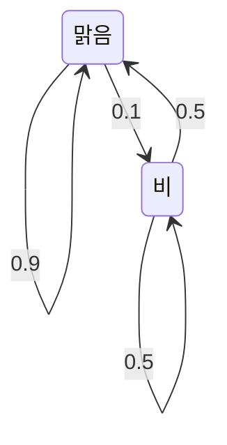
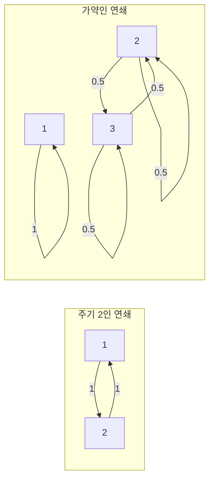



요약

다음 상태가 지금 상태에만 달려 있고, 여기까지 어떤 길로 왔는지는 상관없는 무작위 과정이다. 상태끼리 옮겨 갈 확률을 표(전이행렬)로 모으면, 여러 단계 뒤의 분포는 그 행렬을 거듭 곱해 구한다. 오래 돌리면 출발점과 상관없이 일정한 비율(정상분포)로 가라앉는 경우가 많아, 웹 순위나 대기열의 장기 상태를 계산할 수 있다. 하지만 상태들이 서로 못 오가게 나뉘어 있거나 일정한 주기로만 도는 연쇄는 이렇게 가라앉지 않는다.

## 예시로 보기

맑은 날 다음 날은 90% 맑고, 비 온 날 다음 날은 반반이다.

오늘 비가 왔다면 날씨의 분포는 이렇게 바뀐다.

| 날 | 0 | 1 | 2 | 3 | 오래 뒤 |
|---|---|---|---|---|---|
| 맑음 | 0 | 0.5 | 0.7 | 0.78 | $$\frac56 \approx 0.833$$ |
| 비 | 1 | 0.5 | 0.3 | 0.22 | $$\frac16 \approx 0.167$$ |

오늘 맑았어도 결국 같은 $$\left(\frac56, \frac16\right)$$로 간다. 그림의 화살표 확률이 아래 정의의 전이행렬 $$P$$, 마지막 열이 정상분포 $$\boldsymbol\pi$$다.

왼쪽은 비 온 날과 맑은 날에서 각각 출발해, 맑을 확률을 날마다 계산한 것이다. 두 선 모두 일주일 안에 $$\frac56$$에 붙는다. 오른쪽은 $$\frac56$$과의 차이를 로그 눈금으로 그린 것이다. 매일 정확히 0.4배가 되어 직선으로 내려간다[^s1].

## 정의

정의

유한한 상태 집합 $$S = \{1, \dots, n\}$$ 위의 확률변수열 $$X_0, X_1, \dots$$가 **마르코프 연쇄**라는 것은 모든 시각 $$t$$와 상태에 대해

$$P(X_{t+1} = j \mid X_t = i, X_{t-1}, \dots, X_0) = P(X_{t+1} = j \mid X_t = i) = P_{ij}$$

라는 뜻이다(마르코프 성질). $$P = (P_{ij})$$를 **전이행렬**이라 하고, 각 행의 합은 1이다[^1].

- **$$k$$단계 전이:** 분포를 행벡터 $$\boldsymbol\pi_t$$로 쓰면 $$\boldsymbol\pi_{t+1} = \boldsymbol\pi_t P$$, 그래서 $$\boldsymbol\pi_t = \boldsymbol\pi_0 P^t$$이다. $$(P^k)_{ij}$$는 $$i$$에서 출발해 $$k$$단계 뒤 $$j$$에 있을 확률이다.
- **정상분포:** $$\boldsymbol\pi P = \boldsymbol\pi$$, $$\pi_i \ge 0$$, $$\sum_i\pi_i = 1$$($$\sum$$은 차례로 모두 더한다는 기호)인 $$\boldsymbol\pi$$. $$P^\top$$의 고윳값 1에 대한 [고유벡터](/Hongs_Blog/studies/linear-algebra/eigenvalues/)다(왼쪽 고유벡터).
- **기약:** 어느 상태에서든 어느 상태로든 몇 단계 안에 갈 수 있다. **비주기:** 한 상태로 돌아오는 단계 수들의 최대공약수가 1이다.

| 보장한다(유한·기약·비주기일 때) | 보장하지 않는다 |
|---|---|
| 정상분포가 하나뿐이다 | 기약이 아니면 정상분포가 여럿일 수 있다 |
| 어디서 출발하든 $$\boldsymbol\pi_0 P^t \to \boldsymbol\pi$$ | 주기적이면 정상분포는 하나여도 분포가 수렴하지 않고 진동한다 |
| 긴 시간 동안 상태 $$i$$에 머무는 비율 → $$\pi_i$$, $$i$$로 돌아오는 평균 시간 $$= \frac{1}{\pi_i}$$ | 얼마나 빨리 수렴하는지(두 번째로 큰 고윳값의 크기에 달림) |

[증명 생략: Blitzstein·Hwang 11.3절][^1]

**실패 시나리오.**
- *주기:* 두 상태가 매번 서로 바뀌는 $$P = \begin{pmatrix}0 & 1\\ 1 & 0\end{pmatrix}$$에서 한쪽에서 출발하면 분포가 $$(0, 1), (1, 0), (0, 1), \dots$$로 번갈아 수렴하지 않는다. 정상분포 $$\left(\frac12, \frac12\right)$$는 있지만 도달하지 않는다.
- *가약:* 상태 1은 자기 자리에 갇혀 있고 상태 2, 3은 서로만 오가면, $$(1, 0, 0)$$도 $$\left(0, \frac12, \frac12\right)$$도 그 섞음도 모두 정상분포다. 장기 분포가 출발점에 따라 달라진다.

왼쪽은 화살표를 따라가면 늘 두 걸음 만에 제자리로 돌아온다. 오른쪽은 상태 1과 나머지 둘 사이에 화살표가 없어서, 출발한 쪽에 영영 머문다.[^s2]

## 예제

**정상분포와 수렴 속도 구하기.** 날씨 연쇄에서

1. *방정식:* $$\boldsymbol\pi P = \boldsymbol\pi$$의 첫 성분은 $$0.9\pi_1 + 0.5\pi_2 = \pi_1$$, 곧 $$0.1\pi_1 = 0.5\pi_2$$.
2. *정규화:* $$\pi_1 = 5\pi_2$$와 $$\pi_1 + \pi_2 = 1$$에서 $$\boldsymbol\pi = \left(\frac56, \frac16\right)$$.
3. *해석:* 장기적으로 6일에 하루 비가 온다. 비 온 날 다음 비가 다시 올 때까지 평균 $$\frac{1}{1/6} = 6$$일이다.
4. *속도:* $$P$$의 고윳값은 1과 0.4다. 정상분포에서 벗어난 정도가 매일 0.4배로 준다([대각화](/Hongs_Blog/studies/linear-algebra/diagonalization/)로 $$P^t$$를 쓰면 0.4의 거듭제곱 항만 남기 때문이다).

검증: 예시 표의 분포(분수로 정확히)와 정상분포, 오차가 매일 정확히 $$\frac25$$배, 무작위 양의 전이행렬 100개에서 시작점과 무관한 수렴, 30만 일 모의실험의 비 비율과 평균 귀환 6일, 주기·가약 연쇄의 실패, 카드의 값 — [23_markov-chains_verify.py](/Hongs_Blog/studies/probability-statistics/code/23_markov-chains_verify/)

## 활용

- **검색 순위.** 링크를 따라 무작위로 돌아다니는 사람의 정상분포가 [PageRank](/Hongs_Blog/studies/probability-statistics/pagerank/)다.
- **텍스트 예측.** 앞 단어 몇 개만 보고 다음 단어의 확률을 정하는 n-그램 모델은 마르코프 연쇄다.
- **표본 추출(MCMC).** 원하는 분포를 정상분포로 갖는 연쇄를 만들어 오래 돌리면, 직접 뽑기 어려운 분포에서 표본을 얻는다(Blitzstein·Hwang 12장).
- **대기열과 신뢰성.** 대기 중인 요청 수, 시스템의 정상·장애 상태를 연쇄로 두고 정상분포로 장기 가용성을 계산한다.
- 알고리즘에서: 기약인지는 전이행렬에서 확률이 0보다 큰 칸을 간선으로 본 방향 그래프에서 확인한다. 한 상태에서 [DFS](/Hongs_Blog/studies/algorithms/dfs/)를 간선 방향대로 한 번, 간선을 모두 뒤집어 한 번 돌려 둘 다 모든 상태에 닿으면 기약이다.

## 연결

- 선수: [조건부 확률](/Hongs_Blog/studies/probability-statistics/conditional-probability/), [고윳값과 고유벡터](/Hongs_Blog/studies/linear-algebra/eigenvalues/)
- 브리지: [인접행렬 거듭제곱 ↔ 마르코프 전이](/Hongs_Blog/studies/probability-statistics/walks-markov-bridge/)
- 이어지는 개념: [PageRank](/Hongs_Blog/studies/probability-statistics/pagerank/)

## 확인 문제

**C1** 전이행렬 $$\begin{pmatrix}0.9 & 0.1\\ 0.5 & 0.5\end{pmatrix}$$의 정상분포를 구하라.

**답:** $$0.1\pi_1 = 0.5\pi_2$$와 $$\pi_1 + \pi_2 = 1$$에서 $$\left(\frac56, \frac16\right)$$.

**C2** 같은 연쇄에서 오늘 비가 오면 이틀 뒤 맑을 확률은?

**답:** $$(P^2)_{\text{비},\text{맑음}} = 0.5 \times 0.9 + 0.5 \times 0.5 = 0.7$$. 내일 맑음 → 모레 맑음, 내일 비 → 모레 맑음의 두 길을 더한다.

**C3** 정상분포가 전이행렬의 고윳값 1에 대한 (왼쪽) 고유벡터인 이유는?

**답:** 정상분포는 한 단계 옮겨도 그대로인 분포, 곧 $$\boldsymbol\pi P = \boldsymbol\pi$$다. 이것은 $$\boldsymbol\pi$$가 $$P$$를 오른쪽에 곱해도 1배가 된다는 식이라, 전치하면 $$P^\top\boldsymbol\pi^\top = 1 \cdot \boldsymbol\pi^\top$$이다. 행의 합이 1이라 $$P\mathbf{1} = \mathbf{1}$$이므로 고윳값 1은 늘 있다.

[^1]: Blitzstein, Hwang, *Introduction to Probability* 2판, 11.1절 "Markov property and transition matrix", 11.2절 "Classification of states"(기약, 주기), 11.3절 "Stationary distribution"(존재·유일성·수렴, 평균 귀환 시간 $$\frac{1}{\pi_i}$$).
[^s1]: 보충 그림 한 장은 원본에 없다. [23_markov-chains_plot.py](/Hongs_Blog/studies/probability-statistics/code/23_markov-chains_plot/)로 그렸고, 그림에 쓴 값(예시 표의 0.5·0.7·0.78, 정상분포 $$\left(\frac56, \frac16\right)$$, 차이의 비 0.4, 고윳값 1과 0.4)을 같은 코드로 확인했다.
[^s2]: 보충 다이어그램 1개는 원본에 없다. 이 문서의 실패 시나리오 두 가지를 그렸다. 가약 연쇄의 전이 확률 0.5는 [23_markov-chains_verify.py](/Hongs_Blog/studies/probability-statistics/code/23_markov-chains_verify/) 주장 3의 행렬에서 가져왔다.

