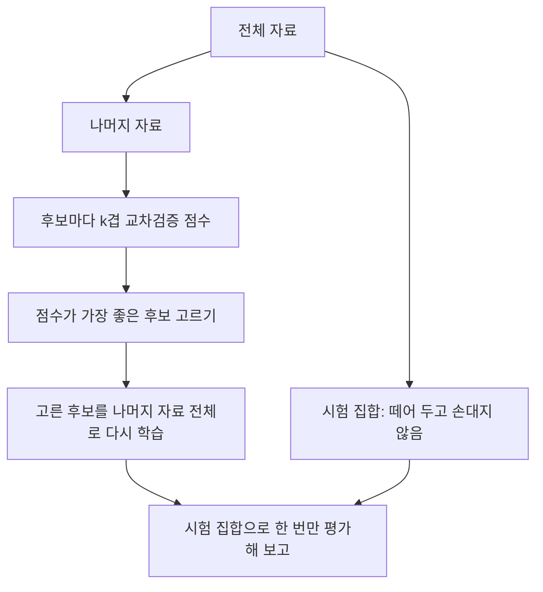


<div class="callout callout-summary" markdown="1">
<div class="callout-title callout-title--default" markdown="span">요약</div>

모델이 훈련 데이터의 우연한 잡음까지 외우면 훈련 데이터에서는 거의 완벽해 보이지만 새 데이터에서는 크게 틀린다. 시험 범위의 문제와 답을 통째로 외운 학생이 처음 보는 문제에서 무너지는 것과 같다. 데이터를 나눠 일부로 학습하고 나머지로 평가하면(교차검증) 새 데이터에서의 성능을 정직하게 어림할 수 있다. 다만 검증 결과를 보며 모델을 여러 번 고르면 검증 데이터에도 과적합되므로, 마지막 평가용 데이터는 끝까지 손대지 않고 남겨 둔다.

</div>


## 예시로 보기

곡선 $$\sin 2\pi x$$에 잡음(표준편차 0.3)을 더한 점 10개에 다항식을 맞춘다. 차수를 올리며 훈련 점에서의 오차와 새 점 2,000개에서의 오차(평균제곱오차)를 비교한다.

| 차수 | 0 | 1 | 3 | 5 | 7 | 9 |
|---|---|---|---|---|---|---|
| 훈련 오차 | 0.488 | 0.195 | 0.029 | 0.022 | 0.011 | 0 |
| 시험 오차 | 0.704 | 0.289 | **0.129** | 0.134 | 0.148 | 0.544 |

훈련 오차는 차수를 올릴수록 계속 줄어 9차에서는 10개 점을 정확히 지난다(0). 시험 오차는 3차에서 가장 작고 9차에서 네 배로 커진다. 3차보다 낮으면 곡선을 따라가지 못하고(과소적합), 높으면 잡음을 따라간다(과적합). 차수가 아래의 모델 복잡도다.


왼쪽 회색 점선이 참 곡선 $$\sin 2\pi x$$, 회색 점이 훈련 점 10개다. 1차는 곡선을 따라가지 못하고, 9차는 점을 모두 지나려고 점 사이에서 크게 출렁인다. 오른쪽에서 3차 이후 훈련 오차는 계속 줄지만 시험 오차는 더 줄지 않는다[^s1].

## 정의

**적용 조건.** 여러 모델이나 설정(차수, 정칙화 세기, 특징 수) 중 하나를 골라야 하고, 목표가 새 데이터에서의 성능일 때.

**알아보는 신호.** 훈련 오차는 매우 작은데 새 데이터에서 성능이 나쁘다. 모델의 모수가 데이터 수에 비해 많다.

**$$k$$겹 교차검증.**

```
CROSS-VALIDATE(data, k, 모델 후보들)
  data를 k개 조각으로 나눈다
  for 각 후보 모델
      for j = 1 to k
          j번째 조각을 빼고 학습, j번째 조각으로 오차 측정
      후보의 점수 ← k개 오차의 평균
  return 점수가 가장 좋은 후보
```

모든 자료가 한 번씩 검증에 쓰여 자료가 적을 때도 평가가 안정적이다. $$k$$는 흔히 5나 10이다[^1].

**세 집합.** 훈련 집합(모델 학습) · 검증 집합 또는 교차검증(모델 고르기) · 시험 집합(최종 성능 보고, 한 번만). 고르는 데 쓴 점수는 고른 만큼 낙관적으로 치우친다.



시험 집합은 맨 처음 갈라져 나와 맨 마지막 칸에서만 다시 만난다. 그 사이의 고르기는 모두 나머지 자료 안에서 한다.[^s2]

**편향-분산 절충.** 새 점에서의 기대 제곱 오차 = (편향)² + 분산 + 줄일 수 없는 잡음 분산이다([편향-분산 분해](/Hongs_Blog/studies/probability-statistics/estimators/)). 모델이 단순하면 편향이, 복잡하면 분산이 커진다. 예시에서 시험 오차는 잡음 분산 $$0.3^2 = 0.09$$ 아래로는 내려가지 않는다[^2].

## 예제

**교차검증으로 차수 고르기.** 예시의 점 10개로 5겹 교차검증을 한다.

1. *나누기:* 점을 2개씩 5조각으로 나눈다.
2. *차수마다 점수:* 차수 $$d$$마다 한 조각을 빼고 8개로 맞춘 뒤 뺀 2개에서 오차를 재고, 5번의 평균을 낸다.
3. *고르기:* 교차검증 오차가 가장 작은 차수는 3이다. 새 점 2,000개로 잰 시험 오차가 가장 작은 차수와 같다.
4. *마무리:* 고른 3차 모델을 10개 전부로 다시 맞춘다. 성능을 보고하려면 이 과정에 쓰지 않은 새 자료로 잰다.

<div class="callout callout-check" markdown="1">
<div class="callout-title" markdown="span">검증: 예시 표(차수 0~9의 훈련·시험 오차, 분수 산술로 정확히 맞춤), 훈련 오차가 차수와 함께 줄고 9차에서 0, 5겹 교차검증이 3차를 고름, 시험 오차가 잡음 분산 0.09 아래로 내려가지 않음 — [35_overfitting-cv_verify.py](/Hongs_Blog/studies/probability-statistics/code/35_overfitting-cv_verify/)</div>

</div>


## 활용

- **하이퍼파라미터 선택.** 정칙화 세기 $$\lambda$$([릿지](/Hongs_Blog/studies/probability-statistics/bayesian-inference/)), 결정 트리 깊이, 학습 횟수를 교차검증으로 정한다.
- **조기 종료.** 신경망을 학습하며 검증 오차가 다시 오르기 시작하면 멈춘다.
- **흔한 실수.** 전처리(표준화, 특징 선택)를 전체 자료로 한 뒤 나누는 것. 검증 조각의 정보가 학습에 새어 들어가 점수가 부풀려진다. 시간 순서가 있는 자료를 무작위로 섞어 나누는 것도, 미래로 과거를 예측하는 셈이라 점수가 부풀려진다.

## 연결

- 선수: [선형회귀](/Hongs_Blog/studies/probability-statistics/linear-regression/)(다항 회귀가 예시의 모델)
- 이론: [편향-분산 분해](/Hongs_Blog/studies/probability-statistics/estimators/)
- 해결책: 정칙화 = [MAP](/Hongs_Blog/studies/probability-statistics/bayesian-inference/)

## 과목별 관점

**데이터 과학 (3-2학기).** 모델 평가의 목표는 훈련 자료가 아니라 처음 보는 자료에서의 "진짜" 성능을 재고, 그것으로 모델을 고르는 것이다[^d1]. 평가 방법 세 가지를 비교한다[^d2].

| | 홀드아웃 | k겹 교차검증 | 부트스트랩 |
|---|---|---|---|
| 나누는 법 | 한 번 나눔(예: 70% 훈련, 30% 시험) | $$k$$번 나눔 | 복원 추출 |
| 훈련 자료 크기 | 전체보다 작다 | 거의 전체 | 원래와 같은 크기 |
| 시험 자료 | 고정된 시험 집합 | 돌아가며 한 겹 | 한 번도 안 뽑힌 자료(OOB) |
| 추정의 믿음직함 | 낮다 | 높다 | 높다 |
| 계산 비용 | 낮다 | 중간 | 중간~높음 |

부트스트랩에서 자료 $$n$$개를 복원으로 $$n$$번 뽑으면, 어떤 자료가 한 번도 안 뽑힐 확률은 $$(1 - \frac1n)^n$$이다. $$n$$이 크면 $$\frac1e \approx 0.368$$로 다가가, 약 36.8%가 시험용(OOB)으로 남는다[^sd1].

**편향과 분산의 모습.** 슬라이드는 모델의 편향을 "모델이 현실을 얼마나 강하게 단순화하는가", 분산을 "훈련 자료에 얼마나 민감한가"로 설명한다[^d3]. 편향이 크면 단순하고 예측이 안정적이지만 체계적으로 틀려 과소적합하기 쉽다. 분산이 크면 복잡하고 결정 경계가 유연하지만 자료가 조금만 바뀌어도 예측이 크게 흔들려 과적합하기 쉽다. 오차는 편향² + 분산 + 줄일 수 없는 잡음으로 나뉘고[^d4], 이 분해가 [앙상블 학습](/Hongs_Blog/studies/data-science/ensemble-learning/)의 출발점이다.

## 확인 문제

<details class="callout callout-question" markdown="1">
<summary class="callout-title" markdown="span">**C1** 다항식의 차수를 올리면 훈련 오차가 절대 커지지 않는 이유는?</summary>

**답:** 높은 차수의 다항식 집합은 낮은 차수의 다항식을 모두 포함한다(높은 차수 계수를 0으로 두면 된다). 최소제곱은 집합 안에서 가장 좋은 것을 고르므로, 후보가 늘면 훈련 오차는 같거나 작아질 뿐이다. 그래서 훈련 오차로는 차수를 고를 수 없다.

</details>


<details class="callout callout-question" markdown="1">
<summary class="callout-title" markdown="span">**C2** 자료 100개로 정칙화 세기 후보 3개 중 하나를 5겹 교차검증으로 고르는 절차를 쓰라. 모델은 몇 번 학습하는가?</summary>

**답:** 자료를 20개씩 5조각으로 나눈다. 후보마다, 조각 하나를 빼고 80개로 학습해 빠진 20개에서 오차를 재는 것을 5번 하고 평균 낸다. 평균 오차가 가장 작은 후보를 고르고 100개 전부로 다시 학습한다. 학습 횟수는 $$3 \times 5 + 1 = 16$$번.

</details>


<details class="callout callout-question" markdown="1">
<summary class="callout-title" markdown="span">**C3** 검증 집합과 시험 집합은 무엇이 다른가? 시험 집합으로 모델을 고르면 무엇이 잘못되는가?</summary>

**답:** 검증 집합(또는 교차검증)은 여러 후보 중 고르는 데 쓰고, 시험 집합은 고른 모델의 성능을 마지막에 한 번 재는 데 쓴다. 시험 집합으로 고르면 그 집합에서 운 좋게 잘 나온 모델이 뽑히므로, 보고한 성능이 실제보다 좋게 치우친다.

</details>


<details class="callout callout-question" markdown="1">
<summary class="callout-title" markdown="span">**C4** 자료 100개로 부트스트랩 표본을 하나 만들면, 평균 몇 개의 자료가 한 번도 뽑히지 않는가? 자료가 매우 많으면 그 비율은?</summary>

**답:** $$100 \times (1 - \frac{1}{100})^{100} \approx 36.6$$개. 자료가 많아지면 비율은 $$\frac1e \approx 36.8\%$$로 다가간다. 이 자료들(OOB)을 시험에 쓴다[^sd1].

</details>


[^1]: James, Witten, Hastie, Tibshirani, *An Introduction to Statistical Learning*, "Resampling Methods" 장(검증 집합 방법, $$k$$겹 교차검증).
[^2]: Hastie, Tibshirani, Friedman, *The Elements of Statistical Learning* 2판, "Model Assessment and Selection" 장(편향-분산 분해, 교차검증의 올바른 사용과 잘못된 사용).
[^d1]: 3-2학기/데이터 과학/1.수업자료/06.6-2_ensemble.pdf, p.3 (6-1 복습: 모델 평가와 선택)
[^d2]: 같은 자료, p.5 (복습: 평가 방법 비교표)
[^d3]: 같은 자료, p.9
[^d4]: 같은 자료, p.10
[^sd1]: 에이전트 보충. OOB 비율 $$(1 - 1/n)^n \to 1/e$$와 카드 C4는 원본에 없다. 35_overfitting-cv_verify.py로 계산했다.
[^s1]: 에이전트 보충. 그림 한 장은 원본에 없다. [35_overfitting-cv_plot.py](/Hongs_Blog/studies/probability-statistics/code/35_overfitting-cv_plot/)로 그렸고, 그림에 쓴 값(예시 표의 훈련·시험 오차(검증 코드와 같은 자료), 시험 오차 최소 차수 3, 모든 시험 오차 > 0.09)을 같은 코드로 확인했다.
[^s2]: 에이전트 보충. 다이어그램 1개는 원본에 없다. 이 문서의 k겹 교차검증 의사코드, 세 집합 절, 예제 4단계(고른 모델을 다시 맞추고 새 자료로 보고)를 한 흐름으로 그렸다.

