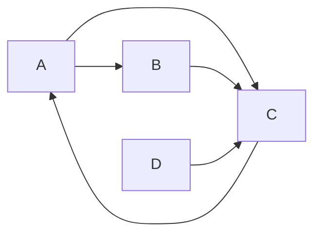


<div class="callout callout-summary" markdown="1">
<div class="callout-title callout-title--default" markdown="span">요약</div>

웹 페이지의 중요도를, 링크를 무작위로 따라 끝없이 돌아다니는 사람이 각 페이지에 머무는 시간의 비율로 정한다. "중요한 페이지가 많이 가리키는 페이지가 중요하다"는 돌고 도는 정의가 마르코프 연쇄의 정상분포 하나로 깔끔하게 풀리고, 링크 표를 수십 번 곱하는 것만으로 계산된다. 순수하게 링크만 따라가면 나가는 링크가 없는 페이지에서 멈추거나 서로만 가리키는 구역에 갇혀 답이 하나로 정해지지 않는다. 그래서 가끔 아무 페이지로나 순간이동하는 확률(보통 15%)을 섞는다.

</div>


## 예시로 보기

페이지 네 개 A, B, C, D가 A→B, A→C, B→C, C→A, D→C로 링크한다. 서퍼는 85% 확률로 지금 페이지의 링크 중 하나를 고르게 따라가고, 15% 확률로 네 페이지 중 아무 데로나 순간이동한다. 처음에는 네 페이지에 $$\frac14$$씩 있다고 두고 한 걸음씩 갱신한다.



C로 들어오는 화살표가 셋으로 가장 많고, D로 들어오는 화살표는 없다. 15% 순간이동은 모든 페이지 쌍 사이에 생기므로 그림에서 뺐다[^s2].

| 반복 | A | B | C | D |
|---|---|---|---|---|
| 0 | 0.2500 | 0.2500 | 0.2500 | 0.2500 |
| 1 | 0.2500 | 0.1437 | 0.5687 | 0.0375 |
| 2 | 0.5209 | 0.1437 | 0.2978 | 0.0375 |
| 3 | 0.2906 | 0.2589 | 0.4130 | 0.0375 |
| 수렴 | 0.3725 | 0.1958 | 0.3941 | 0.0375 |

C는 세 페이지가 가리켜 높고, A는 C 하나만 가리키지만 그 C가 중요해서 C와 비슷하게 높다. 아무도 가리키지 않는 D는 순간이동 몫 $$\frac{0.15}{4} = 0.0375$$만 받는다. 표의 한 줄이 아래 의사코드의 한 반복이고, 0.85가 감쇠 계수 $$d$$다.

## 정의

**입력:** 페이지 $$n$$개와 링크 목록(페이지 $$i$$가 가리키는 페이지들 $$\text{out}(i)$$), 감쇠 계수 $$0 < d < 1$$, 허용오차 $$\varepsilon$$. **출력:** 합이 1인 점수 벡터 $$\mathbf{r}$$.

```
PAGERANK(out, n, d, ε)
  r ← (1/n, …, 1/n)
  repeat
      dangling ← Σ_{out(i) 비었음} r[i]          # 나가는 링크가 없는 페이지의 몫
      new[j] ← (1 − d)/n + d·dangling/n          # 순간이동 + 댕글링 몫을 모두에게 고르게
      for 각 페이지 i, 각 j ∈ out(i)
          new[j] ← new[j] + d·r[i]/|out(i)|        # 링크를 따라 나눠 준다
      diff ← Σ_j |new[j] − r[j]|;  r ← new
  until diff < ε
  return r
```

이것은 **구글 행렬** $$G = dP + \frac{1 - d}{n}\mathbf{1}\mathbf{1}^\top$$($$^\top$$는 행과 열을 바꾸는 전치)에 대해 $$\mathbf{r} \leftarrow \mathbf{r}G$$를 되풀이하는 [거듭제곱법](/Hongs_Blog/studies/linear-algebra/eigenvalues/)이다. $$P$$는 링크를 따라가는 [전이행렬](/Hongs_Blog/studies/probability-statistics/markov-chains/)이고, 나가는 링크가 없는 행은 모든 페이지로 고르게 바꾼다. PageRank는 $$G$$의 정상분포 $$\mathbf{r} = \mathbf{r}G$$다[^1].

**루프 불변식.** 매 반복이 끝날 때 $$\mathbf{r}$$은 음이 아니고 합이 1이다. $$G$$의 각 행이 확률분포라서, 확률분포에 곱하면 확률분포가 나온다.

**정확성과 종료 [증명 스케치].** $$G$$의 모든 성분이 양수라 연쇄가 기약이고 비주기다. 그래서 정상분포가 하나뿐이고 어디서 시작해도 거기로 수렴한다([마르코프 연쇄](/Hongs_Blog/studies/probability-statistics/markov-chains/)의 보장). 더 나아가 두 확률분포의 차이를 $$G$$로 한 번 옮기면 L1 거리가 $$d$$배 이하로 준다. 순간이동 부분 $$\frac{1 - d}{n}\mathbf{1}\mathbf{1}^\top$$은 두 분포에 똑같은 것을 더해 차이에서 지워지고, 남은 $$dP$$는 거리를 $$d$$배 이하로 줄이기 때문이다. 그래서 $$k$$번 뒤 오차는 처음의 $$d^k$$배 이하다[^2].

## 예제

**반복 수와 비용.** 페이지 $$n$$개, 링크 $$m$$개, $$d = 0.85$$, 허용오차 $$10^{-8}$$.

1. *반복 한 번의 비용:* 링크마다 한 번 더하고 페이지마다 한 번 초기화하므로 $$O(n + m)$$. $$n \times n$$ 행렬 $$G$$를 만들지 않는다. 순간이동과 댕글링 몫은 모든 페이지에 같은 값이라 한 번에 더한다.
2. *반복 수의 상한:* 오차를 처음의 $$10^{-8}$$배 이하로 줄이려면 $$0.85^k \le 10^{-8}$$, 곧 $$k \ge \frac{\ln 10^{-8}}{\ln 0.85} \approx 113.3$$이라 114번이면 충분하다.
3. *실제:* 무작위 링크 그래프(페이지 300개, 페이지당 링크 약 5개)에서는 19번 만에 멈췄다. $$d^k$$는 최악의 상한이고, 실제 수렴은 두 번째로 큰 고윳값이 정한다.
4. *전체:* $$O((n + m)\log\frac1\varepsilon)$$. 공간은 점수 벡터 두 개와 링크 목록으로 $$O(n + m)$$.


세로축은 로그 눈금이다. 점선은 정확성 논증에서 나온 상한 $$2 \cdot 0.85^k$$이다(두 확률분포의 L1 거리는 처음에 2를 넘지 않는다). 실제 오차는 두 그래프 모두 상한보다 훨씬 빨리 준다[^s1].

<div class="callout callout-check" markdown="1">
<div class="callout-title" markdown="span">검증: 예시의 반복 1~3회와 수렴값, 무작위 그래프 100개(댕글링 포함)에서 거듭제곱법 = 선형방정식 $$\mathbf{r}(I - dP) = \frac{1 - d}{n}\mathbf{1}$$의 해(가우스 소거), 불변식(합 1, 음수 없음), 오차가 매 반복 $$d$$배 이하로 감소, 반복 수, 순간이동이 없을 때 갇힘과 진동, 카드의 코드 — [25_pagerank_verify.py](/Hongs_Blog/studies/probability-statistics/code/25_pagerank_verify/). 구현과 테스트 — [25_pagerank_impl.py](/Hongs_Blog/studies/probability-statistics/code/25_pagerank_impl/)</div>

</div>


## 활용

- **검색 순위.** 구글 초기 검색 엔진이 텍스트 일치도와 함께 PageRank를 순위에 썼고, 감쇠 계수 0.85를 제안했다[^1].
- **그래프 중요도 일반.** 논문 인용망의 영향력, 소셜 네트워크의 영향력 있는 계정, 코드 의존성 그래프에서 핵심 모듈 찾기에 같은 계산을 쓴다. 특정 페이지들로만 순간이동하게 바꾸면 "그 주제에서 중요한 것"(개인화 PageRank)이 된다.
- **흔한 실수.** 댕글링 페이지를 처리하지 않아 점수 합이 매 반복 새어 나가는 것. 조밀한 $$n \times n$$ 행렬을 만들어 메모리가 터지는 것.
- 알고리즘에서: 의사코드의 링크 목록 $$\text{out}(i)$$는 [그래프 표현](/Hongs_Blog/studies/algorithms/graph-representation/)의 인접 리스트이고, 인접 행렬($$O(n^2)$$)과 메모리를 견준 표가 거기에 있다.

## 연결

- 선수: [마르코프 연쇄](/Hongs_Blog/studies/probability-statistics/markov-chains/)(정상분포, 수렴 조건), [대각화와 행렬 거듭제곱](/Hongs_Blog/studies/linear-algebra/diagonalization/)(거듭제곱법의 수렴 속도)
- 비교: 순간이동 없는 무방향 그래프라면 정상분포가 차수에 비례한다([인접행렬 거듭제곱 ↔ 마르코프 전이](/Hongs_Blog/studies/probability-statistics/walks-markov-bridge/))

## 과목별 관점

**데이터 과학 (3-2학기).** PageRank를 "그래프에서 꼭짓점의 순위 매기기"로 다룬다. 링크를 투표로 보되, 중요한 페이지의 투표가 더 무겁다. 페이지 $$j$$의 점수는 $$j$$를 가리키는 페이지들의 점수를 각자의 나가는 링크 수로 나눠 더한 것이다[^d1].

$$r_j = \sum_{i \to j}\frac{r_i}{d_i}$$


$$d_i$$는 페이지 $$i$$의 나가는 링크 수다. 슬라이드는 이것을 행이 확률분포인 행렬 $$M$$($$M_{ij} = \frac{1}{d_i}$$)으로 $$\mathbf r^{n+1} = \mathbf r^n M$$이라 쓴다[^d2]. 페이지 1 → 1, 2 / 2 → 1, 3 / 3 → 2인 그래프에서 $$\frac13$$씩 시작하면[^d3]

$$\mathbf r^1 = \left(\tfrac13, \tfrac12, \tfrac16\right),\ \mathbf r^2 = \left(\tfrac{5}{12}, \tfrac13, \tfrac14\right),\ \mathbf r^3 = \left(\tfrac{9}{24}, \tfrac{11}{24}, \tfrac16\right),\ \dots \to \left(\tfrac{6}{15}, \tfrac{6}{15}, \tfrac{3}{15}\right)$$


로 수렴한다. 수렴한 $$\mathbf r$$은 $$\mathbf r = \mathbf rM$$을 만족하는 정상분포, 곧 $$M$$의 주 고유벡터다[^d4].

두 문제와 순간이동[^d5]:

- **막다른 페이지**(나가는 링크 없음): 점수가 새어 나가 모두 0이 된다. 그 페이지에서는 모든 페이지로 $$\frac1N$$씩 순간이동하게 $$M$$의 행을 바꾼다.
- **거미줄 함정**(무리 밖으로 나가는 링크가 없음): 그 무리가 점수를 모두 빨아들인다. 매 순간 확률 $$\beta$$로 링크를 따르고 $$1 - \beta$$로 아무 페이지로 순간이동한다. 보통 $$\beta = 0.8 \sim 0.9$$라 평균 5~10걸음마다 순간이동한다.

$$r_j = \sum_{i \to j}\beta\frac{r_i}{d_i} + (1 - \beta)\frac1N, \qquad G = \beta M + (1 - \beta)\left[\frac1N\right]_{N \times N}$$


<div class="callout callout-warning" markdown="1">
<div class="callout-title" markdown="span">원본 오류 의심</div>

원문: 13회 슬라이드 p.14 "$$G = \beta M - (1 - \beta)\left[\frac1N\right]_{N \times N}$$" / 문제점: 빼면 행의 합이 $$\beta - (1 - \beta) = 2\beta - 1$$이 되어 확률분포가 아니다. 같은 쪽의 수치 예 "$$G = 0.8M + 0.2[\frac13]$$"와 바로 위 식 $$r_j = \sum\beta\frac{r_i}{d_i} + (1 - \beta)\frac1N$$은 더하기다 / 수정안: $$G = \beta M + (1 - \beta)\left[\frac1N\right]_{N \times N}$$ / 근거: 25_pagerank_verify.py에서 슬라이드의 $$G$$ 성분(7/15, 1/15, 13/15)을 더하기로 재현했다

</div>


<div class="callout callout-warning" markdown="1">
<div class="callout-title" markdown="span">원본 오류 의심</div>

원문: 13회 슬라이드 p.12 막다른 페이지를 고친 뒤의 반복 "$$(\frac13, \frac13, \frac13) \to (\frac19, \frac79, \frac19) \to (\frac{1}{27}, \frac{25}{27}, \frac{1}{27})$$" / 문제점: $$(\frac19, \frac79, \frac19)$$에 고친 $$M$$을 곱하면 페이지 1은 페이지 2의 몫 $$\frac79 \times \frac13 = \frac{7}{27}$$을 받는다. 셋째 벡터가 틀렸다 / 수정안: $$(\frac{7}{27}, \frac{13}{27}, \frac{7}{27})$$ / 근거: 25_pagerank_verify.py

</div>


## 확인 문제

<details class="callout callout-question" markdown="1">
<summary class="callout-title" markdown="span">**C1** 예시의 네 페이지 그래프에서 모든 점수가 $$\frac14$$일 때 한 번 반복한 뒤의 점수를 구하라($$d = 0.85$$).</summary>

**답:** 모두 순간이동 몫 $$0.0375$$로 시작한다. A는 C에게서 $$0.85 \times 0.25 = 0.2125$$를 받아 0.25. B는 A의 절반 $$0.85 \times 0.125 = 0.10625$$를 받아 0.14375. C는 A의 절반, B 전부, D 전부를 받아 $$0.0375 + 0.85 \times (0.125 + 0.25 + 0.25) = 0.56875$$. D는 받는 링크가 없어 0.0375. 합은 1.

</details>


<details class="callout callout-question" markdown="1">
<summary class="callout-title" markdown="span">**C2** 아래 코드가 하는 일을 한 문장으로 설명하라.</summary>

```python
new = [0.15 / n + sum(0.85 * r[i] / len(links[i]) for i in links if j in links[i]) for j in range(n)]
```
**답:** 각 페이지 $$j$$의 새 점수를, 모두가 똑같이 받는 순간이동 몫에 $$j$$를 가리키는 페이지들이 자기 점수를 나가는 링크 수로 나눠 보내 준 몫을 더해 계산하는, PageRank 거듭제곱법의 한 반복이다(댕글링 페이지가 없을 때).

</details>


<details class="callout callout-question" markdown="1">
<summary class="callout-title" markdown="span">**C3** 순간이동($$d < 1$$) 없이 링크만 따라가면 어떤 문제가 생기는가? 두 가지를 들어라.</summary>

**답:** (1) 서로만 가리키는 페이지 구역이 있으면 서퍼가 그 안에 갇혀 모든 점수가 그리로 빨려 들어간다(가약 연쇄라 정상분포가 여럿이거나 한쪽에 몰림). (2) 두 페이지가 서로만 가리키는 식의 주기 구조에서는 점수가 번갈아 뛰며 수렴하지 않는다. 순간이동을 섞으면 $$G$$의 모든 성분이 양수가 되어 둘 다 사라진다.

</details>


<details class="callout callout-question" markdown="1">
<summary class="callout-title" markdown="span">**C4** 페이지 1 → 2, 3 → 2이고 페이지 2는 나가는 링크가 없다. 막다른 페이지 2를 "모든 페이지로 $$\frac13$$씩"으로 고친 뒤, $$(\frac13, \frac13, \frac13)$$에서 두 번 반복한 점수를 구하라.</summary>

**답:** 고친 $$M$$의 행은 1: (0, 1, 0), 2: ($$\frac13, \frac13, \frac13$$), 3: (0, 1, 0). 한 번: $$(\frac19, \frac13 + \frac19 + \frac13, \frac19) = (\frac19, \frac79, \frac19)$$. 두 번: $$(\frac79 \cdot \frac13, \frac19 + \frac{7}{27} + \frac19, \frac79 \cdot \frac13) = (\frac{7}{27}, \frac{13}{27}, \frac{7}{27})$$. (슬라이드의 $$\frac{1}{27}, \frac{25}{27}, \frac{1}{27}$$은 오기다.)[^d5]

</details>


[^1]: Page, Brin, Motwani, Winograd, "The PageRank Citation Ranking: Bringing Order to the Web", Stanford InfoLab 기술 보고서(1999). Brin, Page, "The Anatomy of a Large-Scale Hypertextual Web Search Engine", *WWW7*(1998)(감쇠 계수 0.85).
[^2]: <span class="fn-tag" title="수업 자료에 없고 따로 보탠 내용">보충</span> L1 거리가 매 반복 $$d$$배 이하로 준다는 성질과 구글 행렬의 두 번째 고윳값이 $$d$$ 이하라는 결과는 Haveliwala, Kamvar, "The Second Eigenvalue of the Google Matrix", Stanford 기술 보고서(2003)에 있다. 25_pagerank_verify.py에서 무작위 그래프로 확인했다.
[^d1]: 데이터 과학 13회 강의 자료 「13_pagerank」, p.5~6
[^d2]: 같은 자료, p.7
[^d3]: 같은 자료, p.10 (거듭제곱법 예)
[^d4]: 같은 자료, p.8~9 (무작위 서퍼, 정상분포)
[^d5]: 같은 자료, p.11~14 (막다른 페이지, 거미줄 함정, 구글 행렬)
[^s1]: <span class="fn-tag" title="수업 자료에 없고 따로 보탠 내용">보충</span> 그림 한 장은 원본에 없다. [25_pagerank_plot.py](/Hongs_Blog/studies/probability-statistics/code/25_pagerank_plot/)로 그렸고, 그림에 쓴 값(예시의 1회 반복값과 수렴값, 매 반복 합 1·음수 없음, 모든 반복에서 오차 ≤ $$2 \cdot 0.85^k$$. 무작위 그래프는 같은 크기(페이지 300개, 페이지당 링크 약 5개)로 새로 만든 것이다)을 같은 코드로 확인했다.
[^s2]: <span class="fn-tag" title="수업 자료에 없고 따로 보탠 내용">보충</span> 다이어그램 1개는 원본에 없다. 이 문서 예시의 링크 다섯 개를 그렸다.

