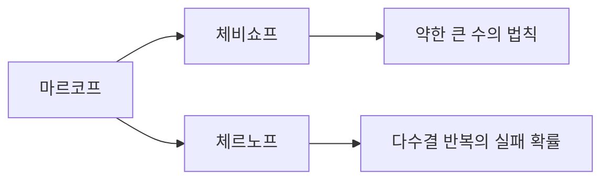



요약

분포를 정확히 몰라도 평균이나 분산만 알면 "평균에서 크게 벗어날 확률"이 얼마 이하인지 보장할 수 있다. 평균만 쓰는 마르코프, 분산까지 쓰는 체비쇼프, 독립인 것들의 합에 쓰는 체르노프 순으로 가정이 늘고 한계가 급격히 좁아진다. 무작위 알고리즘이 "높은 확률로" 잘 동작한다는 증명은 대부분 이 도구로 한다. 다만 이 한계들은 최악의 분포까지 감싸야 해서 실제 확률보다 훨씬 클 수 있고, 체르노프는 독립이 깨지면 쓸 수 없다.

## 예시로 보기

공정한 동전을 100번 던져 앞면 수 $$X$$가 75 이상일 확률은? 평균은 50, 분산은 25다.

| 도구 | 쓰는 정보 | 한계 |
|---|---|---|
| 마르코프 | $$X \ge 0$$, 평균 50 | $$\frac{50}{75} \approx 0.667$$ |
| 체비쇼프 | 분산 25 | $$\frac{25}{25^2} = 0.04$$ |
| 체르노프 | 독립 시행 100번의 합 | $$e^{-25/6} \approx 0.0155$$ |
| 정확한 값 | 이항분포 전체 | 약 $$2.8 \times 10^{-7}$$ |

정보를 더 쓸수록 한계가 좁아지지만, 가장 좋은 체르노프도 참값보다 5만 배쯤 크다. 표의 세 줄이 아래 정리의 세 부등식이다.

세로축은 로그 눈금이다. $$a$$가 커질수록 참값(회색)은 빠르게 떨어진다. 마르코프 한계는 거의 그대로이고, 체비쇼프 한계도 천천히 준다. 체르노프 한계만 참값처럼 휘어 내려가지만, 그래도 간격이 크게 남는다[^s1].

## 정의

세 부등식

1. **마르코프:** $$X \ge 0$$이고 $$a > 0$$이면 $$P(X \ge a) \le \frac{\mathbb{E}[X]}{a}$$($$\mathbb{E}[\cdot]$$은 평균(기댓값)).
2. **체비쇼프:** 평균 $$\mu$$, 분산 $$\sigma^2$$이 유한하고 $$k > 0$$이면 $$P(\vert X - \mu\vert  \ge k\sigma) \le \frac{1}{k^2}$$.
3. **체르노프(곱셈형):** $$X$$가 서로 독립인 0/1 확률변수들의 합이고 $$\mu = \mathbb{E}[X]$$, $$0 < \delta \le 1$$이면

$$P(X \ge (1 + \delta)\mu) \le e^{-\delta^2\mu/3},\qquad P(X \le (1 - \delta)\mu) \le e^{-\delta^2\mu/2}.$$

마르코프는 "평균 50인 양수 값이 75를 넘는 경우가 많으면 평균이 50보다 커진다"는 말이다. 체비쇼프는 "평균에서 표준편차 3개 이상 벗어날 확률은 어떤 분포든 $$\frac19$$ 이하"다. 체르노프는 독립인 것들의 합이 평균에서 벗어날 확률이 지수적으로 작다는 말이다[^1][^2].

**가정과 그 필요성.**

| 가정 | 빠지면 |
|---|---|
| 마르코프의 $$X \ge 0$$ | $$X$$가 반반으로 $$\pm1$$이면 평균 0인데 $$P(X \ge 1) = \frac12 > \frac{0}{1}$$ |
| 체비쇼프의 분산 유한 | 분산이 무한한 분포에서는 우변이 의미를 잃는다 |
| 체르노프의 독립 | 동전 하나를 100번 복사해 더하면 $$X$$는 0이나 100뿐이라 $$P(X \ge 75) = \frac12$$. 지수적으로 작지 않다 |

**얼마나 빡빡한가.** 마르코프는 $$X$$가 확률 $$\frac{\mu}{a}$$로 $$a$$이고 아니면 0일 때 등호다. 체비쇼프는 $$-k, 0, k$$에 확률 $$\frac{1}{2k^2}, 1 - \frac{1}{k^2}, \frac{1}{2k^2}$$을 준 분포에서 등호다. 평균과 분산만으로는 더 좋은 한계가 없다는 뜻이다.

## 증명

전략: 마르코프 하나를 증명하고, 나머지는 $$X$$를 적당히 바꿔 마르코프에 넣는다.

세 부등식은 모두 마르코프 하나에서 나온다. 체비쇼프는 [큰 수의 법칙](/Hongs_Blog/studies/probability-statistics/lln/)의 증명으로, 체르노프는 아래 예제의 다수결 분석으로 이어진다.[^s2]

증명 펼치기

1. *마르코프:* 지시 확률변수로 $$a \cdot I_{\{X \ge a\}} \le X$$다. $$X \ge a$$면 좌변 $$a \le X$$, 아니면 좌변 $$0 \le X$$(여기서 $$X \ge 0$$을 쓴다). 양변의 기댓값을 취하면 $$a\,P(X \ge a) \le \mathbb{E}[X]$$.
2. *체비쇼프:* $$(X - \mu)^2 \ge 0$$에 마르코프를 쓰면 $$P((X - \mu)^2 \ge k^2\sigma^2) \le \frac{\sigma^2}{k^2\sigma^2}$$. 좌변의 사건은 $$\vert X - \mu\vert  \ge k\sigma$$와 같다.
3. *체르노프 [증명 스케치]:* $$t > 0$$에 대해 $$P(X \ge c) = P(e^{tX} \ge e^{tc}) \le \frac{\mathbb{E}[e^{tX}]}{e^{tc}}$$(마르코프). 독립이라 $$\mathbb{E}[e^{tX}] = \prod_i\mathbb{E}[e^{tX_i}]$$로 쪼개지고, $$1 + x \le e^x$$로 각 인수를 $$e^{p_i(e^t - 1)}$$ 이하로 누른 뒤 $$t$$를 가장 좋게 고르면 위의 꼴이 된다[^2]. ∎

### 스스로 설명해 보기

1. 증명 1단계의 부등식 $$a \cdot I_{\{X \ge a\}} \le X$$는 $$X$$가 음수일 수 있으면 왜 깨지는가?

$$X < a$$인 경우 좌변은 0인데, $$X$$가 음수면 $$0 \le X$$가 거짓이다. 그러면 기댓값을 취해도 부등식이 보장되지 않는다.

2. 체르노프 증명에서 독립은 어디에 쓰이는가?

$$\mathbb{E}[e^{tX}] = \mathbb{E}\left[\prod_i e^{tX_i}\right]$$를 $$\prod_i\mathbb{E}[e^{tX_i}]$$로 나누는 단계다. [곱의 기댓값](/Hongs_Blog/studies/probability-statistics/expectation/)이 기댓값의 곱이 되려면 독립이 필요하다.

3. 세 증명에 공통된 핵심 아이디어는?

"나쁜 사건"을 음이 아닌 어떤 양이 큰 사건으로 바꾸고 마르코프를 쓴다. 어떤 양을 고르느냐($$X$$, $$(X - \mu)^2$$, $$e^{tX}$$)에 따라 쓰는 정보와 한계의 세기가 달라진다.

## 예제

**무작위 알고리즘의 성공 확률 끌어올리기.** 답을 확률 $$\frac34$$로 맞히는 무작위 알고리즘을 독립으로 $$n$$번 돌려 다수결로 답한다. 다수결이 틀릴 확률은?

1. *모델:* 맞힌 횟수 $$X$$는 독립 시행의 합, $$\mu = \frac34 n$$.
2. *틀리는 사건:* 맞힌 횟수가 절반 이하, $$X \le \frac n2 = \left(1 - \frac13\right)\mu$$. 곧 $$\delta = \frac13$$.
3. *체르노프 아래쪽:* $$P \le e^{-\delta^2\mu/2} = e^{-\frac19 \cdot \frac34 n/2} = e^{-n/24}$$.
4. *결론:* $$n = 240$$이면 $$e^{-10} \approx 4.5 \times 10^{-5}$$ 이하다. 반복 횟수를 늘리면 실패 확률이 지수적으로 준다. 이항분포로 정확히 계산한 실패 확률은 약 $$8 \times 10^{-17}$$로 한계보다 훨씬 작다.

검증: 무작위 분포 500개에서 마르코프·체비쇼프(분수로 정확히), 두 등호 사례, 예시 표의 네 값, 이항분포 300가지($$n \le 200$$)에서 체르노프 위·아래 한계, 가정을 빼면 깨지는 두 반례, 카드의 값 — [20_tail-bounds_verify.py](/Hongs_Blog/studies/probability-statistics/code/20_tail-bounds_verify/)

## 활용

- **무작위 알고리즘의 보장.** 무작위 퀵정렬이 $$O(n\log n)$$보다 훨씬 오래 걸릴 확률, 해시 테이블의 가장 긴 체인, 부하 분산에서 가장 바쁜 서버의 부하를 체르노프와 합집합 한계로 막는다([합집합 한계](/Hongs_Blog/studies/probability-statistics/probability-axioms/)).
- **표본 크기 정하기.** 원하는 오차와 실패 확률에서 필요한 표본 수를 거꾸로 구한다([큰 수의 법칙](/Hongs_Blog/studies/probability-statistics/lln/)).
- **모니터링.** 분포를 모르는 지표에서 "평균의 10배를 넘는 일은 10% 이하"(마르코프) 같은 보수적 경보 기준을 잡는다.

## 연결

- 선수: [분산과 표준편차](/Hongs_Blog/studies/probability-statistics/variance/)
- 이어지는 개념: [큰 수의 법칙](/Hongs_Blog/studies/probability-statistics/lln/)(체비쇼프로 증명), [해싱과 무작위 알고리즘의 확률](/Hongs_Blog/studies/probability-statistics/randomized-analysis/)

## 자주 하는 오해

"부등식이 준 한계가 실제 확률과 비슷하다"

틀렸다. 한계를 계산하면 구체적인 수가 나와서 그 값이 실제 확률처럼 느껴진다. 하지만 이 부등식들은 평균과 분산이 같은 **모든** 분포에 대해 맞아야 해서, 가장 나쁜 분포에 맞춰져 있다. 예시에서 체비쇼프 0.04는 참값 $$2.8 \times 10^{-7}$$보다 10만 배 이상 크다. 한계는 "이보다 나쁠 수는 없다"는 보장으로 쓰고, 실제 확률이 필요하면 분포를 써서 계산한다.

## 확인 문제

**C1** 응답 시간의 평균이 100 ms라는 것만 안다. 1초 이상 걸릴 확률의 위쪽 한계는?

**답:** 응답 시간은 음이 아니므로 마르코프로 $$P(X \ge 1000) \le \frac{100}{1000} = 0.1$$.

**C2** 평균 100, 표준편차 10인 값이 70 이하이거나 130 이상일 확률의 한계는?

**답:** 평균에서 표준편차 3개 벗어남이라 체비쇼프로 $$\frac{1}{3^2} = \frac19 \approx 0.11$$ 이하.

**C3** 마르코프 부등식에 $$X \ge 0$$ 조건이 필요한 이유를 반례로 보여라.

**답:** $$X$$가 반반으로 $$-1$$ 또는 $$1$$이면 평균이 0이라 마르코프 우변은 $$\frac{0}{1} = 0$$인데, $$P(X \ge 1) = \frac12$$다. 음수 값이 평균을 끌어내려 큰 값의 확률을 숨긴다.

**C4** 다음 각각에 쓸 수 있는 가장 강한 부등식은? (가) 평균만 아는 음이 아닌 값 (나) 평균과 분산을 아는 값 (다) 독립인 패킷 1만 개 중 손실 수

**답:** (가) 마르코프 (나) 체비쇼프 (다) 체르노프. 손실 수는 독립인 0/1의 합이라 지수적 한계를 쓸 수 있다.

[^1]: Blitzstein, Hwang, *Introduction to Probability* 2판, 10.1절 "Inequalities"(마르코프, 체비쇼프, 체르노프 부등식).
[^2]: Mitzenmacher, Upfal, *Probability and Computing*, 3장(마르코프·체비쇼프 부등식), 4장(체르노프 한계의 유도와 곱셈형 꼴, 무작위 알고리즘에의 응용).
[^s1]: 에이전트 보충. 그림 한 장은 원본에 없다. [20_tail-bounds_plot.py](/Hongs_Blog/studies/probability-statistics/code/20_tail-bounds_plot/)로 그렸고, 그림에 쓴 값($$a = 75$$에서 0.667·0.04·0.0155·$$2.8 \times 10^{-7}$$, 모든 $$a$$에서 참값 ≤ 체르노프·체비쇼프)을 같은 코드로 확인했다.
[^s2]: 에이전트 보충. 다이어그램 1개는 원본에 없다. 이 문서 증명의 순서와 연결 절, [큰 수의 법칙](/Hongs_Blog/studies/probability-statistics/lln/)의 증명(체비쇼프 사용)을 그렸다.

