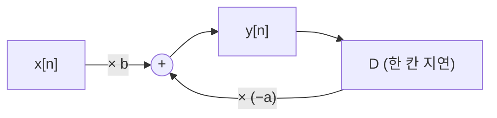
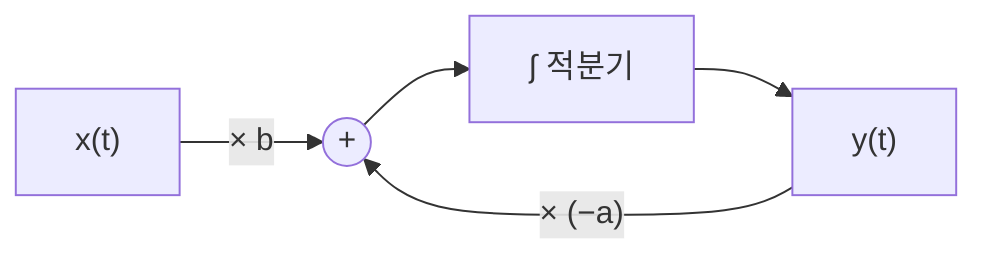



요약

차분방정식이나 미분방정식을 더하기, 상수 곱하기, 한 칸 늦추기(또는 적분) 세 가지 부품을 선으로 이은 그림으로 바꾼 것이다. 식을 그림으로 보면 출력이 다시 입력 쪽으로 돌아가는 되먹임(피드백) 고리가 눈에 보이고, 그대로 디지털 회로나 프로그램으로 만들 수 있다. 연속 시간에서는 미분기 대신 적분기로 그리는데, 미분기는 만들기 어렵고 잡음에 약하기 때문이다.

## 예시로 보기

$$y[n] + ay[n-1] = bx[n]$$을 $$y[n] = -ay[n-1] + bx[n]$$으로 고쳐 쓰면, 부품 세 개로 그릴 수 있다(그림 2.28)[^1].

지연 상자 D가 지난 출력 $$y[n-1]$$을 기억해 두었다가 $$-a$$를 곱해 다시 더한다. 이 고리가 피드백이고, 지연기가 메모리 역할을 하므로 초기 조건(D에 처음 들어 있는 값)이 필요하다[^1].

## 정의

**이산 시간 기본 부품**(그림 2.27)[^2]. 가산기($$x_1[n] + x_2[n]$$), 계수 곱셈기($$ax[n]$$), 단위 지연기($$x[n] \to x[n-1]$$, 상자 D).

**연속 시간**: $$\frac{dy}{dt} + ay = bx$$를 그대로 그리면 미분기가 필요하다(그림 2.29~2.30)[^3]. 미분기는 만들기 어렵고 오차·잡음에 민감하다. 그래서 식을 $$\frac{dy}{dt} = bx - ay$$로 바꾸고 양변을 적분한다[^4].

$$y(t) = \int_{-\infty}^{t}\bigl[bx(\tau) - ay(\tau)\bigr]d\tau \qquad (y(-\infty) = 0 \text{ 가정})$$

적분기가 연속 시간 시스템의 메모리다. 특정 시각 $$t_0$$부터 보면 $$y(t) = y(t_0) + \int_{t_0}^{t}[bx - ay]d\tau$$이고, $$y(t_0)$$이 적분기가 그때까지 저장한 값, 곧 초기 조건이다(그림 2.32)[^4].

| | 이산 시간 | 연속 시간 |
|---|---|---|
| 메모리 부품 | 단위 지연기 D | 적분기 ∫ |
| 초기 조건 | D에 처음 든 값 $$y[-1]$$ | 적분기의 처음 값 $$y(t_0)$$ |

## 활용

- 아날로그 컴퓨터는 적분기를 이어 미분방정식을 풀었다(그림 2.32 방식)[^4].
- 디지털 하드웨어(FPGA, DSP 칩)의 필터는 지연 레지스터, 곱셈기, 가산기로 이 그림을 그대로 만든다[^5].
- Simulink 같은 도구도 같은 부품을 이어 시스템을 시뮬레이션한다(2주차 RC 회로 예).

## 연결

- 선수: [차분방정식으로 표현한 LTI 시스템](/Hongs_Blog/studies/signals-and-systems/difference-equation-system/), [시스템과 시스템 연결](/Hongs_Blog/studies/signals-and-systems/systems-interconnection/) (피드백 연결)
- [미분방정식으로 표현한 LTI 시스템](/Hongs_Blog/studies/signals-and-systems/lccde-system/)

## 확인 문제

**C1** $$y[n] = 0.5y[n-1] + 2x[n] - x[n-1]$$을 블록 다이어그램 부품으로 말로 그려 보라. 지연기는 몇 개 필요한가?

**답:** $$x[n]$$에 2를 곱한 선, $$x[n]$$을 D 하나로 늦춰 $$-1$$을 곱한 선, $$y[n]$$을 D 하나로 늦춰 0.5를 곱한 선을 한 가산기에 모으고, 그 출력이 $$y[n]$$이다. 지연기 2개(입력용 1, 출력용 1).

**C2** 연속 시간 시스템을 그릴 때 미분기 대신 적분기를 쓰는 이유는?

**답:** 미분기는 만들기 어렵고, 빠르게 흔들리는 잡음을 크게 키워 오차에 민감하다. 식을 적분 꼴로 바꾸면 적분기만으로 같은 시스템을 만들 수 있고, 적분기는 잡음을 평균 내어 줄인다.

[^1]: 3-1학기/신호 및 시스템/1.수업자료/06.Week06_CH02_2_handout.pdf, p.33 (그림 2.28)
[^2]: 같은 자료, p.32 (그림 2.27)
[^3]: 같은 자료, p.34 (그림 2.29, 2.30)
[^4]: 같은 자료, p.35 (그림 2.31, 2.32)
[^5]: 같은 자료, p.32 ("디지털 HW 구성")

