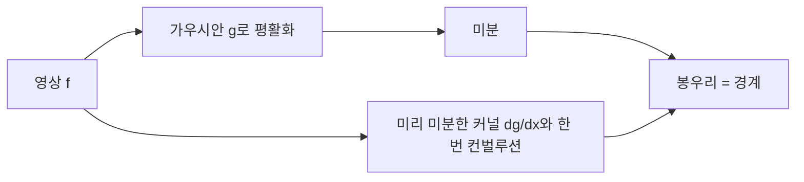



요약

사진에서 물체의 테두리(경계)는 밝기가 갑자기 바뀌는 곳이다. 그래서 밝기를 위치로 미분하면 경계에서 값이 크게 튀어 경계를 찾을 수 있다. 문제는 미분이 높은 주파수를 키우는 필터라 잡음까지 키운다는 것이다. 그래서 먼저 주변 화소와 평균 내어 잡음을 줄이고(평활화, 저역 통과) 미분한다. 두 단계는 컨벌루션이라 미리 하나의 필터로 합쳐 둘 수 있다.

## 예시로 보기

흰 바탕에 검은 세로 띠가 있는 사진을 가로줄 하나로 잘라 밝기를 그리면, 띠의 왼쪽 끝에서 밝기가 뚝 떨어지고 오른쪽 끝에서 다시 오른다. 이것을 미분하면 왼쪽 끝에서 아래로 뾰족, 오른쪽 끝에서 위로 뾰족한 봉우리가 생긴다. 경계는 도함수의 극값이다[^1].

같은 사진에 잡음이 끼면 사정이 다르다. 밝기 그래프는 경계 근처를 빼면 거의 평평하지만, 미분하면 잡음의 작은 떨림이 모두 큰 봉우리가 되어 경계가 어디인지 알 수 없다[^2]. 잡음 화소는 이웃과 값이 크게 다르기 때문이다.

## 정의

**유한 차분.** 디지털 영상의 화소 간격 $$\Delta x = 1$$을 가장 작은 단위로 보고, 미분을 이웃 값의 차로 근사한다[^3].

$$\frac{\partial f}{\partial x} \approx f(x+1, y) - f(x, y) \qquad \text{(커널 } [-1\ \ 1]\text{)}$$

$$\frac{\partial^2 f}{\partial x^2} \approx f(x+1) + f(x-1) - 2f(x) \qquad \text{(커널 } [1\ \ {-2}\ \ 1]\text{)}$$

차분은 커널과의 컨벌루션이다. 가로 방향 차분은 세로 경계를, 세로 방향 차분은 가로 경계를 드러낸다(호랑이 사진 예)[^4].

**영상 기울기(그래디언트).** 2차원 영상 $$f(x, y)$$의 기울기는 두 방향 편미분을 모은 벡터다[^5].

$$\nabla f = \left[\frac{\partial f}{\partial x}, \frac{\partial f}{\partial y}\right], \quad \theta = \tan^{-1}\left(\frac{\partial f/\partial y}{\partial f/\partial x}\right), \quad \Vert \nabla f\Vert  = \sqrt{\left(\frac{\partial f}{\partial x}\right)^2 + \left(\frac{\partial f}{\partial y}\right)^2}$$

기울기는 밝기가 가장 빨리 커지는 방향을 가리키고, 그 크기 $$\Vert \nabla f\Vert $$가 경계의 세기다. 경계의 방향은 기울기 방향에 수직이다. 영상이 가로·세로로 주기적으로 반복된다고 보면, 밝기가 천천히 변하는 영역은 낮은 고조파, 경계는 높은 고조파로 나타난다[^6]. 그래서 미분(고주파 강조)이 경계를 선명하게 한다.

**먼저 평활화.** 평활화 커널 $$g$$(예: 가우시안)와 먼저 컨벌루션한 뒤 미분하고, $$\frac{d}{dx}(f * g)$$의 봉우리를 경계로 찾는다[^7].

**컨벌루션의 미분 정리.** 미분도 컨벌루션이고 컨벌루션은 결합법칙을 따르므로[^8]

$$\frac{d}{dx}(f * g) = f * \frac{dg}{dx}$$

커널을 미리 미분해 두면($$\frac{dg}{dx}$$, 가우시안 미분 커널) 영상에 컨벌루션을 한 번만 하면 된다.

두 길은 같은 봉우리에 닿는다. 커널을 미리 미분한 길은 영상에 컨벌루션을 한 번만 한다.[^s3]

**평균 필터.** 이웃 $$m \times m$$ 화소의 평균으로 바꾼다. $$m = 3$$이면 $$A_{\text{avg}} = \frac19\begin{bmatrix}1&1&1\\1&1&1\\1&1&1\end{bmatrix}$$이다. 커널의 합이 1이 아니면 영상이 원래보다 밝아지므로 합으로 나눈다[^9]. 너비 $$2W$$인 1차원 평균(상자) 커널의 주파수 특성은 $$\frac{2\sin(\omega W)}{\omega}$$(sinc 꼴)다. 상자 필터로 흐리게 하면 점광원 하나가 작은 사각형으로 번져, 초점이 나간 렌즈의 둥근 흐림과 다르다. 가우시안 커널은 주파수 특성도 매끄러운 종 모양이라 이런 문제가 적다[^10].

**PSNR(최대 신호 대 잡음비).** 원본 $$x$$와 복원 영상 $$\hat x$$의 차이 $$e = x - \hat x$$를 잡음으로 보고, 가능한 최대 신호 크기에 비해 오차가 얼마나 작은지를 데시벨로 나타낸다[^11].

$$\mathrm{MSE} = \frac1N\sum_{n=0}^{N-1}(x[n] - \hat x[n])^2, \qquad \mathrm{PSNR} = 10\log_{10}\frac{\mathrm{MAX}^2}{\mathrm{MSE}} = 20\log_{10}\mathrm{MAX} - 10\log_{10}\mathrm{MSE}$$

$$\mathrm{MAX}$$는 화소가 가질 수 있는 최댓값(8비트면 255)이다. PSNR이 높을수록 오차가 작아 복원 영상이 원본에 가깝고, 낮을수록 왜곡·잡음이 크다. 일반적인 신호 대 잡음비는 $$\mathrm{SNR} = \frac{\text{신호 전력}}{\text{잡음 전력}}$$이다.

## 예제

잡음 섞인 1차원 계단(2000개 화소, 경계 1000번째, 계단 높이 1, 잡음 표준편차 0.3)을 생각하자[^s1].

1. 그대로 차분하면 잡음의 떨림이 경계의 점프(1)보다 더 큰 봉우리를 만들어, 가장 큰 값을 골라도 경계가 아니다.
2. 폭 $$\sigma = 50$$인 가우시안으로 평활화하면 계단이 매끄러운 언덕이 된다.
3. 그것을 차분하면 1000번째 근처에 봉우리 하나가 선다.
4. 가우시안을 먼저 미분한 커널 $$\frac{dg}{dx}$$와 한 번만 컨벌루션해도 같은 결과다.

위 예제의 1단계(그대로 차분)와 4단계(가우시안 미분 커널과 컨벌루션) 결과를 나란히 그렸다[^s2].

검증: $$[-1, 1]$$, $$[1, -2, 1]$$ 커널이 차분 공식과 같음, 잡음 섞인 계단에서 평활화 후 미분의 봉우리가 경계 ±15 안, 미분 정리 $$\frac{d}{dx}(f*g) = f*\frac{dg}{dx}$$가 $$10^{-9}$$ 안에서 같음, 평균 필터의 합 1, 상자 커널의 변환 $$\frac{2\sin\omega W}{\omega}$$, PSNR 두 식의 일치 확인 — [37_edge-detection-smoothing_verify.py](/Hongs_Blog/studies/signals-and-systems/code/37_edge-detection-smoothing_verify/)

## 활용

- 컴퓨터 비전의 경계 검출(소벨, 캐니 필터)은 이 "평활화 + 미분" 구조다. 캐니 경계 검출기는 가우시안 미분 커널을 쓴다[^s1].
- 사진 앱의 흐림 효과는 평균·가우시안 필터, 선명하게 하기는 고역 통과 성분을 더하는 것이다.
- PSNR은 JPEG 같은 압축 방식이 화질을 얼마나 지키는지 비교하는 표준 척도다.
- 이 방법은 [인과성](/Hongs_Blog/studies/signals-and-systems/causality/)이 필요 없다. 독립 변수가 시간이 아니라 위치라 좌우 이웃을 모두 쓸 수 있다.

## 연결

- 선수: [주파수 형성 필터와 주파수 선택 필터](/Hongs_Blog/studies/signals-and-systems/frequency-filters/) (미분기 = 고주파 강조, 평균 = 저역 통과), [컨벌루션의 성질](/Hongs_Blog/studies/signals-and-systems/convolution-properties/) (결합법칙)
- 수학 쪽: [그래디언트와 방향도함수](/Hongs_Blog/studies/calculus/gradient/)

## 과목별 관점

**휴먼 인터페이스 미디어 (4-1학기).** 강의 6은 같은 평균·미분 커널을 2차원 "움직이는 창" $$G[i, j] = \sum_u\sum_v H[u, v]F[i - u, j - v]$$로 다룬다[^h1]. 3×3 평균 $$\frac{1}{9}$$, 가중 평균 $$\frac{1}{16}\begin{bmatrix}1&2&1\\2&4&2\\1&2&1\end{bmatrix}$$, 미분 $$[-1\ \ 1]$$과 $$[-1\ \ 1]^\top$$, 창 크기 3·5·9·17에 따른 흐림, 임펄스와의 합성곱으로 영상 옮기기가 나온다: [2차원 합성곱](/Hongs_Blog/studies/human-interface-media/two-dimensional-convolution/).

## 확인 문제

**C1** 잡음이 있는 영상을 그대로 미분하면 경계를 찾기 어려운 이유를 주파수로 설명하라.

**답:** 미분기의 주파수 응답은 $$\vert H\vert  = \vert \omega\vert $$로 주파수가 높을수록 크게 키운다. 잡음은 이웃 화소와 값이 크게 다른 빠른 변화, 곧 고주파 성분이라 미분하면 경계보다 더 크게 부풀 수 있다.

**C2** $$\frac{d}{dx}(f * g) = f * \frac{dg}{dx}$$가 맞는 근거는?

**답:** 미분(차분)도 어떤 커널과의 컨벌루션이고, 컨벌루션은 결합·교환법칙을 따른다. 그래서 $$d * (f * g) = f * (d * g)$$다.

**C3** 수열 $$f = [2, 2, 2, 8, 8, 8]$$에 커널 $$[-1, 1]$$을 적용한 차분값(뒤 값 − 앞 값)을 쓰고, 경계가 어디인지 말하라.

**답:** $$0, 0, 6, 0, 0$$. 값이 6인 곳(셋째와 넷째 사이)이 경계다.

[^1]: 신호 및 시스템 12회 강의 자료 「Week12_CH03_4_handout」, p.7 (L. Lazebnik 자료)
[^2]: 같은 자료, p.11~12 (S. Seitz 자료)
[^3]: 같은 자료, p.9
[^4]: 같은 자료, p.10
[^5]: 같은 자료, p.8
[^6]: 같은 자료, p.6
[^7]: 같은 자료, p.13
[^8]: 같은 자료, p.14
[^9]: 같은 자료, p.34
[^10]: 같은 자료, p.34~35
[^11]: 같은 자료, p.4
[^s1]: 보충 2000개 화소 계단 예(원본 그림 13~14와 같은 설정을 숫자로 재현), 소벨·캐니 필터, 확인 문제는 원본에 없다. 계산은 검증 코드로 확인했다.
[^s2]: 보충 그림 1장은 원본에 없다. [37_edge-detection-smoothing_plot.py](/Hongs_Blog/studies/signals-and-systems/code/37_edge-detection-smoothing_plot/)로 그렸고, 같은 코드로 다음을 확인했다: 봉우리가 경계 ±15 안, 그대로 차분한 잡음 봉우리가 경계 값보다 큼, $$\frac{d}{dx}(f * g) = f * \frac{dg}{dx}$$.
[^h1]: 휴먼 인터페이스 미디어 6회 강의 자료 「HIM_강의06_모양맞추기」, p.23~42 (움직이는 창, 평균·가중 평균·미분 필터, 창 크기, 임펄스 합성곱)
[^s3]: 보충 다이어그램 1개는 원본에 없다. 정의의 먼저 평활화·컨벌루션의 미분 정리 절(12주차 자료 p.13~14)을 근거로 그렸다.

