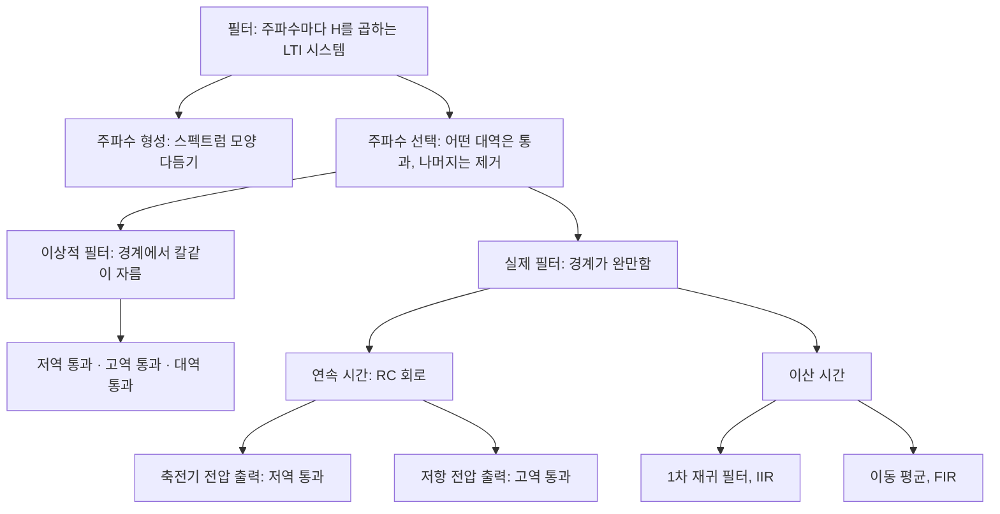



요약

필터는 신호의 주파수 성분마다 크기를 다르게 바꾸는 LTI 시스템이다. 오디오의 저음·고음 조절처럼 스펙트럼의 모양을 다듬는 것이 주파수 형성 필터, 라디오가 원하는 채널만 남기듯 어떤 주파수대는 통과시키고 나머지는 없애는 것이 주파수 선택 필터다. 이상적인 필터는 경계에서 칼같이 자르지만 그대로 만들 수는 없다. 실제 필터(RC 회로, 이동 평균)는 경계가 완만하고, 경계를 날카롭게 할수록 시간 영역에서 반응이 느려지는 맞바꿈이 있다.

## 예시로 보기

가장 간단한 이산 필터는 두 점의 평균 $$y[n] = \frac12(x[n] + x[n-1])$$이다[^1].

- 임펄스 응답 $$h[n] = \frac12(\delta[n] + \delta[n-1])$$, 주파수 응답 $$H(e^{j\omega}) = \frac12(1 + e^{-j\omega}) = e^{-j\omega/2}\cos\frac\omega2$$.
- 상수 입력 $$x[n] = K$$(주파수 0)를 넣으면 $$H(e^{j0}) = 1$$이라 그대로 $$K$$가 나온다.
- 가장 빠르게 흔들리는 입력 $$x[n] = K(-1)^n = Ke^{j\pi n}$$를 넣으면 $$H(e^{j\pi}) = \cos\frac\pi2 = 0$$이라 출력이 0이다.

느린 변화는 남기고 빠른 흔들림은 없앤다. 저역 통과 필터다. 주가 그래프에서 장기 추세(저주파)가 단기 등락(고주파)보다 중요할 때 이동 평균을 쓰는 이유다[^1].

## 정의

출력 계수는 입력 계수와 주파수 응답의 곱이므로($$b_k = a_kH$$), 필터 설계는 $$H$$의 모양을 정하는 일이다[^2].

| 종류 | 하는 일 | 예 |
|---|---|---|
| 주파수 형성 필터 | 주파수 성분의 상대적 크기를 바꿔 스펙트럼 모양을 다듬는다 | 음질 조절(저음·고음), 스피커 특성을 보정하는 이퀄라이저, 미분기 |
| 주파수 선택 필터 | 어떤 대역은 통과, 나머지는 제거 | 잡음 제거, 방송 채널 분리 |

주파수 응답의 크기는 흔히 데시벨로 나타낸다: $$20\log_{10}\vert H(j\omega)\vert $$ dB[^3]. $$\vert H\vert  = \frac{1}{\sqrt2}$$이면 약 $$-3$$dB다[^s1].

**이상적 주파수 선택 필터**[^4]. 통과 대역의 복소 지수는 왜곡 없이(크기 1로) 통과시키고 나머지는 완전히 없앤다. 통과 대역과 정지 대역의 경계가 차단 주파수다.

$$\text{저역 통과: } H(j\omega) = \begin{cases}1 & \vert \omega\vert  \le \omega_c\\ 0 & \vert \omega\vert  > \omega_c\end{cases}$$

고역 통과는 반대로 $$\vert \omega\vert  > \omega_c$$를 통과, 대역 통과는 $$\omega_{c1} < \vert \omega\vert  < \omega_{c2}$$를 통과시킨다(그림 3.26~3.27). 실수 정현파는 $$e^{j\omega t}$$와 $$e^{-j\omega t}$$ 두 성분이라 응답이 $$\omega = 0$$에 대해 대칭이다. 이산 시간 필터는 $$H(e^{j\omega})$$가 주기 $$2\pi$$라, $$\pi$$의 짝수배 근처가 저주파, 홀수배 근처가 고주파다(그림 3.28)[^5].

이 문서의 필터는 모두 이 갈래 중 하나에 들어간다. 아래 두 절은 실제 필터 가지를 연속 시간, 이산 시간 순서로 다룬다.[^s3]

### 연속 시간 실제 필터: RC 회로

**RC 저역 통과**(축전기 전압을 출력)[^6]. $$RC\frac{dv_c}{dt} + v_c = v_s$$에 $$v_s = e^{j\omega t}$$, $$v_c = H(j\omega)e^{j\omega t}$$를 넣으면 $$(RCj\omega + 1)H = 1$$.

$$H(j\omega) = \frac{1}{1 + j\omega RC}, \quad \vert H(j\omega)\vert  = \frac{1}{\sqrt{1 + (RC\omega)^2}}, \quad \angle H(j\omega) = -\tan^{-1}(RC\omega)$$

$$\omega = 0$$ 근처에서 $$\vert H\vert  \approx 1$$이고 $$\omega$$가 커지면 서서히 준다. 경계가 완만한 비이상적 저역 통과 필터다(그림 3.30).

**시간과 주파수의 맞바꿈**[^7]. 임펄스 응답 $$h(t) = \frac{1}{RC}e^{-t/RC}u(t)$$, 계단 응답 $$s(t) = (1 - e^{-t/RC})u(t)$$. $$RC$$가 크면 차단 주파수 $$\frac{1}{RC}$$가 낮아져 높은 주파수를 더 잘 거르지만, 계단 응답이 1에 닿는 데 오래 걸린다. 빨리 반응하려면 $$RC$$가 작아야 하고, 그러면 높은 주파수가 더 많이 통과한다.

$$RC = 1$$이면 $$\omega$$가 커질 때 $$\vert H\vert $$가 빨리 줄어 높은 주파수를 잘 거르지만, 계단 응답은 $$RC = 0.25$$보다 훨씬 늦게 1에 닿는다[^s2].

**RC 고역 통과**(저항 전압을 출력)[^8]. $$RC\frac{dv_r}{dt} + v_r = RC\frac{dv_s}{dt}$$에서

$$G(j\omega) = \frac{j\omega RC}{1 + j\omega RC}, \quad \vert G(j\omega)\vert  = \frac{RC\vert \omega\vert }{\sqrt{1 + (RC\omega)^2}}, \quad \angle G(j\omega) = \tan^{-1}\frac{1}{RC\omega}\ (\omega > 0)$$

$$v_r = v_s - v_c$$이므로 $$G = 1 - H$$다. 계단 응답은 $$v_r(t) = e^{-t/RC}u(t)$$로, 처음 1에서 0으로 줄어든다(그림 3.33).

12주차 자료는 두 크기를 약분하지 않은 꼴 $$\frac{\sqrt{1 + (RC\omega)^2}}{1 + (RC\omega)^2}$$, $$\frac{\sqrt{(RC\omega)^4 + (RC\omega)^2}}{1 + (RC\omega)^2}$$로 적었다. 분자·분모를 $$\sqrt{1 + (RC\omega)^2}$$로 나누면 위의 꼴과 같다[^8].

$$RC = 0.5$$일 때다. 저역 통과(파랑)와 고역 통과(주황)는 차단 주파수 $$\omega = 2$$에서 $$\frac{1}{\sqrt2}$$로 만나고, 이상적 필터(점선)와 달리 경계 너머에서도 0이 되지 않는다[^s2].

### 이산 시간 실제 필터

**1차 재귀 필터(IIR)** $$y[n] - ay[n-1] = x[n]$$, $$\vert a\vert  < 1$$[^9]. $$x = e^{j\omega n}$$을 넣으면

$$H(e^{j\omega}) = \frac{1}{1 - ae^{-j\omega}}$$

- $$a = 0.6$$: $$\vert H(e^{j0})\vert  = \frac{1}{0.4} = 2.5$$, $$\vert H(e^{j\pi})\vert  = \frac{1}{1.6} = 0.625$$. 저역 통과.
- $$a = -0.6$$: 반대로 $$\omega = \pi$$ 근처에서 2.5, $$\omega = 0$$에서 0.625. 고역 통과(그림 3.34).
- 계단 응답 $$s[n] = \frac{1 - a^{n+1}}{1 - a}u[n] \to \frac{1}{1-a}$$. $$a = 0.9$$면 수렴값 10에 $$n = 20$$에서도 8.906, $$a = 0.1$$이면 수렴값 1.111…에 $$n = 5$$에서 이미 1.11111. $$\vert a\vert $$가 작을수록 빨리 반응한다. $$\vert a\vert  \ge 1$$이면 불안정하다[^10].

**비재귀 필터(FIR) 이동 평균**[^11]. 3점 평균 $$y[n] = \frac13(x[n-1] + x[n] + x[n+1])$$은

$$H(e^{j\omega}) = \frac13(e^{-j\omega} + 1 + e^{j\omega}) = \frac13(1 + 2\cos\omega)$$

$$\omega = 0$$에서 1, $$\omega = \frac{2\pi}{3}$$에서 0이다. 저역 통과지만 경계가 완만하다(그림 3.35). $$N + M + 1$$점으로 넓히면

$$H(e^{j\omega}) = \frac{1}{N + M + 1}e^{j\omega(N - M)/2}\frac{\sin[\omega(M + N + 1)/2]}{\sin(\omega/2)}$$

이고, 점의 개수를 늘릴수록 통과 대역이 좁아진다($$N + M + 1 = 33, 65$$, 그림 3.36)[^12].

**단순 고역 통과** $$y[n] = \frac12(x[n] - x[n-1])$$: $$H(e^{j\omega}) = \frac12(1 - e^{-j\omega}) = je^{-j\omega/2}\sin\frac\omega2$$. $$\omega = 0$$에서 0, $$\omega = \pi$$에서 크기 1(그림 3.37)[^13].

$$\omega = 0$$ 근처가 저주파, $$\pm\pi$$ 근처가 고주파다. $$a = 0.6$$, 3점 평균, 2점 평균은 가운데가 높은 저역 통과이고, $$a = -0.6$$은 양 끝이 높은 고역 통과다[^s2].

**미분기**(주파수 형성)[^14]. $$y = \frac{dx}{dt}$$이면 $$H(j\omega) = j\omega$$. 크기 $$\vert \omega\vert $$가 주파수에 비례해 커지고 위상은 $$\pm\frac\pi2$$다. $$\cos k\omega_0t \to k\omega_0\cos(k\omega_0t + \frac\pi2)$$처럼 높은 주파수일수록 크게 키워, 빠른 변화(전이)를 강조한다(그림 3.23).

### 스스로 설명해 보기

1. RC 고역 통과의 $$G(j\omega)$$가 $$1 - H(j\omega)$$인 이유는?

회로에서 $$v_s = v_r + v_c$$(키르히호프 전압 법칙)이다. 입력 $$e^{j\omega t}$$에 대해 $$v_c = He^{j\omega t}$$이므로 $$v_r = (1 - H)e^{j\omega t}$$, 곧 $$G = 1 - H = \frac{j\omega RC}{1 + j\omega RC}$$다.

2. $$a = -0.6$$인 1차 재귀 필터가 고역 통과인 이유는?

$$\vert H(e^{j\omega})\vert  = \frac{1}{\vert 1 + 0.6e^{-j\omega}\vert }$$이다. $$\omega = \pi$$에서 $$e^{-j\pi} = -1$$이라 분모가 $$0.4$$로 가장 작아 크기가 2.5로 가장 크고, $$\omega = 0$$에서 분모가 1.6이라 0.625로 작다.

핵심 아이디어는?

필터는 주파수마다 곱하는 수 $$H$$를 정하는 것이고, 미분방정식·차분방정식의 계수가 그 $$H$$의 모양을 정한다.

## 예제

$$RC = 0.5$$인 RC 저역 통과에서 차단 주파수 $$\omega = \frac{1}{RC} = 2$$ rad/s에서는 $$\vert H\vert  = \frac{1}{\sqrt{1 + 1}} = \frac{1}{\sqrt2}$$(약 $$-3$$dB), 위상 $$-45°$$다. 계단 응답은 $$t = RC = 0.5$$초에 최종값의 $$1 - e^{-1} \approx 63\%$$에 닿는다[^s1].

검증: 미분기의 크기·위상, RC 저역·고역 통과의 크기·위상과 $$H + G = 1$$, $$-3$$dB, 1차 재귀 필터의 2.5·0.625와 계단 응답 8.906·1.11111, 2점·3점·일반 이동 평균의 닫힌 꼴, 단순 고역 통과 확인 — [36_frequency-filters_verify.py](/Hongs_Blog/studies/signals-and-systems/code/36_frequency-filters_verify/)

## 활용

- 오디오: 20~40Hz는 깊은 저음, 5~7kHz 근처는 맑고 밝은 소리를 만든다. 음질 조절 장치는 이런 대역마다 $$\vert H\vert $$를 올리고 내린다. 사람 목소리는 약 300~3,000Hz, 사람이 들을 수 있는 소리는 약 20~20,000Hz이고, CD는 44.1kHz로 표본화해 20kHz까지 재생한다[^3].
- 통신: 방송은 채널마다 다른 주파수에 정보를 싣고, 수신기는 주파수 선택 필터로 채널을 고른다[^4].
- 흔한 실수: 이산 시간 필터의 고주파를 "큰 $$\omega$$"로 생각하는 것. 이산 시간에서는 $$\omega = \pi$$가 가장 높고 $$2\pi$$는 다시 저주파다.

## 연결

- 선수: [푸리에 급수와 LTI 시스템](/Hongs_Blog/studies/signals-and-systems/fourier-series-lti/), [미분방정식으로 표현한 LTI 시스템](/Hongs_Blog/studies/signals-and-systems/lccde-system/), [차분방정식으로 표현한 LTI 시스템](/Hongs_Blog/studies/signals-and-systems/difference-equation-system/)
- 영상에 쓰기: [영상의 경계 검출과 평활화](/Hongs_Blog/studies/signals-and-systems/edge-detection-smoothing/)
- 이산 시간 주파수의 범위: [이산 시간 복소 지수 신호](/Hongs_Blog/studies/signals-and-systems/dt-complex-exponential/)

## 자주 하는 오해

"RC 저역 통과 필터는 차단 주파수 $$\frac{1}{RC}$$보다 높은 주파수를 완전히 없앤다."

틀렸다. "차단"이라는 이름 때문에 그럴듯하다. 실제 RC 필터의 $$\vert H\vert $$는 $$\frac{1}{\sqrt{1 + (RC\omega)^2}}$$로 서서히 줄 뿐 0이 되지 않는다. 확인: $$\omega = \frac{10}{RC}$$에서도 $$\vert H\vert  \approx 0.0995$$로, 약 10%가 남는다. 칼같이 자르는 것은 이상적 필터뿐이다.

## 확인 문제

**C1** 다음은 저역 통과, 고역 통과, 주파수 형성 중 무엇인가? ① $$y[n] = \frac12(x[n] + x[n-1])$$ ② $$y[n] = \frac12(x[n] - x[n-1])$$ ③ $$y(t) = \frac{dx}{dt}$$ ④ $$y[n] + 0.6y[n-1] = x[n]$$

**답:** ① 저역 통과 ② 고역 통과 ③ 주파수 형성(고주파 강조, 고역 통과 성질) ④ 고역 통과 ($$a = -0.6$$).

**C2** 3점 이동 평균 $$H(e^{j\omega}) = \frac13(1 + 2\cos\omega)$$에 $$x[n] = \cos\frac{\pi n}{2}$$를 넣으면 출력은?

**답:** $$H(e^{j\pi/2}) = \frac13(1 + 0) = \frac13$$ (실수라 위상 변화 없음). $$y[n] = \frac13\cos\frac{\pi n}{2}$$.

**C3** RC 저역 통과 필터에서 $$RC$$를 키우면 주파수 영역과 시간 영역에서 각각 무엇이 달라지는가?

**답:** 주파수: 차단 주파수 $$\frac{1}{RC}$$가 낮아져 높은 주파수를 더 많이 줄인다. 시간: 계단 응답 $$1 - e^{-t/RC}$$가 1에 닿는 데 오래 걸린다(느린 반응). 둘을 동시에 좋게 할 수 없다.

**C4** 이산 시간 이상적 저역 통과 필터의 $$\vert H(e^{j\omega})\vert $$를 $$-2\pi \le \omega \le 2\pi$$에서 말로 그려 보라.

**답:** $$\vert \omega\vert  \le \omega_c$$에서 1, $$\omega_c < \vert \omega\vert  < 2\pi - \omega_c$$에서 0, $$2\pi - \omega_c \le \vert \omega\vert  \le 2\pi$$에서 다시 1. 주기 $$2\pi$$라 $$\pm2\pi$$ 근처에 같은 통과 대역이 되풀이된다.

**C5** $$y[n] - 0.5y[n-1] = x[n]$$의 $$\vert H(e^{j0})\vert $$와 $$\vert H(e^{j\pi})\vert $$는?

**답:** $$\frac{1}{1 - 0.5} = 2$$, $$\frac{1}{1 + 0.5} = \frac23$$.

[^1]: 신호 및 시스템 12회 강의 자료 「Week12_CH03_4_handout」, p.15, p.18 (그림 3.25)
[^2]: 같은 자료, p.1
[^3]: 같은 자료, p.2
[^4]: 같은 자료, p.19~20 (그림 3.26)
[^5]: 같은 자료, p.17, p.21~22 (그림 3.27, 3.28)
[^6]: 같은 자료, p.23~24 (그림 3.29, 3.30)
[^7]: 같은 자료, p.25 (그림 3.31)
[^8]: 같은 자료, p.26~27 (그림 3.32, 3.33)
[^9]: 같은 자료, p.27~28 (그림 3.34)
[^10]: 같은 자료, p.28
[^11]: 같은 자료, p.30 (그림 3.35)
[^12]: 같은 자료, p.31 (그림 3.36)
[^13]: 같은 자료, p.32 (그림 3.37)
[^14]: 같은 자료, p.5~6 (그림 3.23)
[^s1]: 보충 $$-3$$dB 값, $$RC = 0.5$$ 예, 오해 항목의 수치, 스스로 설명해 보기, 확인 문제 C2~C5는 원본에 없다. 계산은 검증 코드로 확인했다.
[^s2]: 보충 그림 3장은 원본에 없다. [36_frequency-filters_plot.py](/Hongs_Blog/studies/signals-and-systems/code/36_frequency-filters_plot/)로 그렸고, 같은 코드로 다음을 확인했다: $$\vert H(j2)\vert  = \frac{1}{\sqrt2}$$와 위상 $$-45°$$, $$H + G = 1$$, $$\omega = \frac{10}{RC}$$에서 $$\vert H\vert  \approx 0.0995$$, 1차 재귀의 2.5와 0.625, 3점 평균의 영점 $$\frac{2\pi}{3}$$.
[^s3]: 보충 다이어그램 1개는 원본에 없다. 정의의 종류 표, 이상적 필터, RC 회로, 이산 시간 실제 필터 절(12주차 자료 p.1, p.19~32)을 근거로 그렸다.

