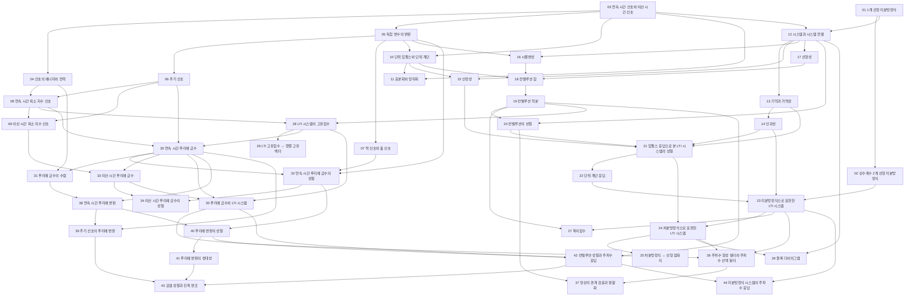


## 먼저 알아야 할 것
- [복소수의 극형식과 오일러 공식](/Hongs_Blog/studies/college-math/euler-formula/) (1주차 오일러 등식, 복소수 사칙 연산과 같은 내용)
- [수열의 극한과 e](/Hongs_Blog/studies/calculus/sequence-limits/) (1주차 자연상수와 복리 계산)
- [사인파](/Hongs_Blog/studies/college-math/sinusoid/), [미분방정식과 오일러 방법](/Hongs_Blog/studies/calculus/ode-euler/), [고윳값과 고유벡터](/Hongs_Blog/studies/linear-algebra/eigenvalues/) (7주차)
- 교재: Oppenheim·Willsky, *Signals and Systems* 2판. 핸드아웃의 그림·예제 번호가 이 교재를 따른다.

## 1주차 · 복습: 자연상수, 오일러 등식, 미분방정식

읽기 전에

1. $$y'' - y' - 6y = 0$$에 $$e^{\lambda x}$$를 넣으면 무엇이 남을까? → [상수계수 2계 선형 미분방정식](/Hongs_Blog/studies/signals-and-systems/second-order-linear-ode/)
2. $$y' + p(x)y = g(x)$$의 왼쪽을 '무엇의 미분' 하나로 만들려면 양변에 무엇을 곱해야 할까? → [1계 선형 미분방정식](/Hongs_Blog/studies/signals-and-systems/first-order-linear-ode/)

| 번호 | 개념 | 한 줄 | 개념 코드 | 연습 |
|---|---|---|---|---|
| 01 | [1계 선형 미분방정식](/Hongs_Blog/studies/signals-and-systems/first-order-linear-ode/) | 지금 값으로 변화율이 정해지는 식. 적분인자로 한 번에 푼다 | [verify](/Hongs_Blog/studies/signals-and-systems/code/01_first-order-linear-ode_verify/) | — |
| 02 | [상수계수 2계 선형 미분방정식](/Hongs_Blog/studies/signals-and-systems/second-order-linear-ode/) | $$e^{\lambda x}$$를 넣어 특성방정식으로. 실근·중근·복소근 | [verify](/Hongs_Blog/studies/signals-and-systems/code/02_second-order-linear-ode_verify/) | [예제 사다리](/Hongs_Blog/studies/signals-and-systems/ode-ladder/) · [문제 코드](/Hongs_Blog/studies/signals-and-systems/code/02_ode-ladder_p1/) |

자료: Week01_1_자연상수와 오일러 등식 · Week01_2_미분방정식
필기: 아직 없다.
떠올려 보기: 노트를 닫고 특성근의 세 경우(서로 다른 실근, 중근, 복소근)의 일반해를 써 본다.

## 2주차 · 1장 신호의 종류, 에너지, 시간축 변환

읽기 전에

1. $$\cos 2\pi t$$와 1초짜리 펄스 중 에너지가 무한대인 것은? → [신호의 에너지와 전력](/Hongs_Blog/studies/signals-and-systems/signal-energy-power/)
2. $$x(2t)$$는 $$x(t)$$보다 넓을까, 좁을까? → [독립 변수의 변환](/Hongs_Blog/studies/signals-and-systems/independent-variable-transform/)

| 번호 | 개념 | 한 줄 | 개념 코드 | 연습 |
|---|---|---|---|---|
| 03 | [연속 시간 신호와 이산 시간 신호](/Hongs_Blog/studies/signals-and-systems/ct-dt-signals/) | 모든 순간에 값이 있나, 정해진 순간에만 있나 | — | — |
| 04 | [신호의 에너지와 전력](/Hongs_Blog/studies/signals-and-systems/signal-energy-power/) | 크기 제곱의 합(에너지)과 시간 평균(전력) | [verify](/Hongs_Blog/studies/signals-and-systems/code/04_signal-energy-power_verify/) | — |
| 05 | [독립 변수의 변환](/Hongs_Blog/studies/signals-and-systems/independent-variable-transform/) | 이동, 반전, 척도. 이동 먼저 하고 척도 | [verify](/Hongs_Blog/studies/signals-and-systems/code/05_independent-variable-transform_verify/) | — |
| 06 | [주기 신호](/Hongs_Blog/studies/signals-and-systems/periodic-signals/) | $$T$$만큼 밀어도 같은 신호. 가장 작은 $$T$$가 기본 주기 | — | — |
| 07 | [짝 신호와 홀 신호](/Hongs_Blog/studies/signals-and-systems/even-odd-signals/) | 뒤집어도 같은 신호와 부호만 바뀌는 신호. 모든 신호는 둘의 합 | [verify](/Hongs_Blog/studies/signals-and-systems/code/07_even-odd-signals_verify/) | — |

자료: Week02_CH01_1_handout
필기: 아직 없다.
떠올려 보기: 노트를 닫고 그림 1.13의 $$x(t)$$로 $$x(-t+1)$$과 $$x(\frac32 t + 1)$$을 그려 본다.

## 3주차 · 1장 지수·정현파 신호, 임펄스와 계단

읽기 전에

1. $$\cos(7\pi n)$$과 $$\cos(\pi n)$$은 다른 신호일까? → [이산 시간 복소 지수 신호](/Hongs_Blog/studies/signals-and-systems/dt-complex-exponential/)
2. 높이가 무한대인데 넓이가 1인 신호에 $$x(t)$$를 곱해 적분하면 무엇이 남을까? → [단위 임펄스와 단위 계단](/Hongs_Blog/studies/signals-and-systems/unit-impulse-step/)

| 번호 | 개념 | 한 줄 | 개념 코드 | 연습 |
|---|---|---|---|---|
| 08 | [연속 시간 복소 지수 신호](/Hongs_Blog/studies/signals-and-systems/ct-complex-exponential/) | 원 위를 도는 점. 정현파, 페이저, 고조파 (강조)[^강조] | [verify](/Hongs_Blog/studies/signals-and-systems/code/08_ct-complex-exponential_verify/) | — |
| 09 | [이산 시간 복소 지수 신호](/Hongs_Blog/studies/signals-and-systems/dt-complex-exponential/) | $$\omega_0$$가 $$2\pi$$마다 같고, $$\omega_0/2\pi$$가 유리수일 때만 주기적 (강조)[^강조] | [verify](/Hongs_Blog/studies/signals-and-systems/code/09_dt-complex-exponential_verify/) | [예제 사다리](/Hongs_Blog/studies/signals-and-systems/dt-period-ladder/) · [문제 코드](/Hongs_Blog/studies/signals-and-systems/code/09_dt-period-ladder_p4/) |
| 10 | [단위 임펄스와 단위 계단](/Hongs_Blog/studies/signals-and-systems/unit-impulse-step/) | 넓이 1인 바늘과 스위치. 미분·누적 관계와 표본화 성질 (강조)[^강조] | [verify](/Hongs_Blog/studies/signals-and-systems/code/10_unit-impulse-step_verify/) | — |
| 11 | [표본화와 양자화](/Hongs_Blog/studies/signals-and-systems/sampling-quantization/) | 시간을 끊고(표본화) 값을 끊는다(양자화) | [verify](/Hongs_Blog/studies/signals-and-systems/code/11_sampling-quantization_verify/) | — |

자료: Week03_CH01_2_handout
필기: 아직 없다.
떠올려 보기: 노트를 닫고 표 1.1(연속·이산 복소 지수 비교)을 다시 써 본다.

## 4주차 · 1장 시스템과 시스템의 성질

읽기 전에

1. $$y = 2x + 3$$은 선형 시스템일까? → [선형성](/Hongs_Blog/studies/signals-and-systems/linearity/)
2. $$y(t) = x(2t)$$에 입력을 2초 늦게 넣으면 출력은 몇 초 늦을까? → [시불변성](/Hongs_Blog/studies/signals-and-systems/time-invariance/)

| 번호 | 개념 | 한 줄 | 개념 코드 | 연습 |
|---|---|---|---|---|
| 12 | [시스템과 시스템 연결](/Hongs_Blog/studies/signals-and-systems/systems-interconnection/) | 입력을 출력으로 바꾸는 상자. 직렬·병렬·피드백 | — | — |
| 13 | [기억과 가역성](/Hongs_Blog/studies/signals-and-systems/memory-invertibility/) | 지금 입력만 쓰는가, 출력으로 입력을 되찾을 수 있는가 | — | — |
| 14 | [인과성](/Hongs_Blog/studies/signals-and-systems/causality/) | 미래 입력을 쓰지 않는다 | [verify](/Hongs_Blog/studies/signals-and-systems/code/14_causality_verify/) | — |
| 15 | [안정성](/Hongs_Blog/studies/signals-and-systems/stability/) | 유계 입력에 유계 출력 | [verify](/Hongs_Blog/studies/signals-and-systems/code/15_stability_verify/) | — |
| 16 | [시불변성](/Hongs_Blog/studies/signals-and-systems/time-invariance/) | 늦게 넣으면 그만큼 늦게 나온다 | [verify](/Hongs_Blog/studies/signals-and-systems/code/16_time-invariance_verify/) | — |
| 17 | [선형성](/Hongs_Blog/studies/signals-and-systems/linearity/) | 따로 넣고 더한 것 = 더해서 넣은 것 (강조)[^강조] | [verify](/Hongs_Blog/studies/signals-and-systems/code/17_linearity_verify/) | [예제 사다리](/Hongs_Blog/studies/signals-and-systems/system-properties-ladder/) · [문제 코드](/Hongs_Blog/studies/signals-and-systems/code/17_system-properties-ladder_p4/) |

자료: Week04_CH01_3_handout
필기: 아직 없다.
떠올려 보기: 노트를 닫고 시스템 성질 여섯 개의 정의를 한 줄씩 쓰고, 각각을 깨는 예를 하나씩 든다.

## 5주차 · 2장 LTI 시스템과 컨벌루션 (1)

읽기 전에

1. 임펄스 하나에 대한 반응만 알면 아무 입력의 출력도 계산할 수 있을까? 어떤 조건이 필요할까? → [컨벌루션 합](/Hongs_Blog/studies/signals-and-systems/convolution-sum/)
2. 폭 1인 사각 펄스를 자기 자신과 컨벌루션하면 어떤 모양이 될까? → [컨벌루션 적분](/Hongs_Blog/studies/signals-and-systems/convolution-integral/)

| 번호 | 개념 | 한 줄 | 개념 코드 | 연습 |
|---|---|---|---|---|
| 18 | [컨벌루션 합](/Hongs_Blog/studies/signals-and-systems/convolution-sum/) | 입력을 임펄스로 쪼개고, 옮긴 $$h$$를 키워 더한다 (강조)[^강조] | [impl](/Hongs_Blog/studies/signals-and-systems/code/18_convolution-sum_impl/) | — |
| 19 | [컨벌루션 적분](/Hongs_Blog/studies/signals-and-systems/convolution-integral/) | 계단 근사의 극한. 뒤집고 밀어 겹친 넓이 (강조)[^강조] | [verify](/Hongs_Blog/studies/signals-and-systems/code/19_convolution-integral_verify/) | [예제 사다리](/Hongs_Blog/studies/signals-and-systems/convolution-ladder/) · [문제 코드](/Hongs_Blog/studies/signals-and-systems/code/19_convolution-ladder_p4/) |

자료: Week05_CH02_1_handout
필기: 아직 없다.
떠올려 보기: 노트를 닫고 예제 2.4의 다섯 구간을 그림과 함께 다시 나누어 본다.

## 6주차 · 2장 LTI 시스템과 컨벌루션 (2)

읽기 전에

1. 누산기 $$h[n] = u[n]$$는 안정할까? $$h$$만 보고 판정할 수 있을까? → [임펄스 응답으로 본 LTI 시스템의 성질](/Hongs_Blog/studies/signals-and-systems/lti-system-properties/)
2. $$y[n] = 0.5y[n-1] + x[n]$$의 임펄스 응답은 몇 칸 뒤에 끝날까? → [차분방정식으로 표현한 LTI 시스템](/Hongs_Blog/studies/signals-and-systems/difference-equation-system/)

| 번호 | 개념 | 한 줄 | 개념 코드 | 연습 |
|---|---|---|---|---|
| 20 | [컨벌루션의 성질](/Hongs_Blog/studies/signals-and-systems/convolution-properties/) | 교환·분배·결합. 직렬은 $$h_1 * h_2$$, 병렬은 $$h_1 + h_2$$ | [verify](/Hongs_Blog/studies/signals-and-systems/code/20_convolution-properties_verify/) | — |
| 21 | [임펄스 응답으로 본 LTI 시스템의 성질](/Hongs_Blog/studies/signals-and-systems/lti-system-properties/) | $$h$$만 보고 기억·가역·인과·안정을 판정 | [verify](/Hongs_Blog/studies/signals-and-systems/code/21_lti-system-properties_verify/) | — |
| 22 | [단위 계단 응답](/Hongs_Blog/studies/signals-and-systems/step-response/) | 계단을 넣은 출력. $$h$$를 쌓으면 $$s$$, $$s$$의 차이가 $$h$$ | [verify](/Hongs_Blog/studies/signals-and-systems/code/22_step-response_verify/) | — |
| 23 | [미분방정식으로 표현한 LTI 시스템](/Hongs_Blog/studies/signals-and-systems/lccde-system/) | 초기 휴지 조건을 붙이면 인과 LTI. 자연 응답 + 강제 응답 | [verify](/Hongs_Blog/studies/signals-and-systems/code/23_lccde-system_verify/) | — |
| 24 | [차분방정식으로 표현한 LTI 시스템](/Hongs_Blog/studies/signals-and-systems/difference-equation-system/) | 과거 출력을 다시 쓰면 IIR, 안 쓰면 FIR | [verify](/Hongs_Blog/studies/signals-and-systems/code/24_difference-equation-system_verify/) | — |
| 25 | [차분방정식 ↔ 선형 점화식](/Hongs_Blog/studies/signals-and-systems/difference-equation-recurrence-bridge/) | 같은 식, 같은 풀이. 시스템 쪽에만 입력과 임펄스 응답이 있다 | — | — |
| 26 | [블록 다이어그램](/Hongs_Blog/studies/signals-and-systems/block-diagram/) | 더하기·곱하기·지연(적분) 세 부품으로 그린 식 | — | — |

자료: Week06_CH02_2_handout
필기: 아직 없다.
떠올려 보기: 노트를 닫고 $$\dot y + ay = bx$$와 $$y[n] - ay[n-1] = bx[n]$$의 계단 응답과 임펄스 응답을 나란히 유도해 본다.

## 7주차 · 특이함수와 3장 도입

읽기 전에

1. 사각 펄스와 삼각 펄스를 시스템에 넣으면, 펄스가 아주 짧을 때 응답이 다를까? → [특이함수](/Hongs_Blog/studies/signals-and-systems/singularity-functions/)
2. 넓이 1인 짧은 펄스 두 개를 컨벌루션하면 어떤 모양이 될까? → [특이함수](/Hongs_Blog/studies/signals-and-systems/singularity-functions/)

| 번호 | 개념 | 한 줄 | 개념 코드 | 연습 |
|---|---|---|---|---|
| 27 | [특이함수](/Hongs_Blog/studies/signals-and-systems/singularity-functions/) | 넓이 1인 짧은 펄스는 모양과 상관없이 임펄스처럼 행동 | [verify](/Hongs_Blog/studies/signals-and-systems/code/27_singularity-functions_verify/) | — |
| 28 | [LTI 시스템의 고유함수](/Hongs_Blog/studies/signals-and-systems/lti-eigenfunction/) | $$e^{st}$$는 LTI를 지나도 모양 그대로, $$H(s)$$만 곱해진다 (강조)[^강조] | [verify](/Hongs_Blog/studies/signals-and-systems/code/28_lti-eigenfunction_verify/) | — |
| 29 | [LTI 고유함수 ↔ 행렬 고유벡터](/Hongs_Blog/studies/signals-and-systems/eigenfunction-eigenvector-bridge/) | 고유벡터로 나누면 행렬 곱이 곱셈, 고유함수로 나누면 컨벌루션이 곱셈 | — | — |
| 30 | [연속 시간 푸리에 급수](/Hongs_Blog/studies/signals-and-systems/ct-fourier-series/) | 주기 신호 = 고조파의 합. 직교성으로 계수를 읽는다 (강조)[^강조] | [verify](/Hongs_Blog/studies/signals-and-systems/code/30_ct-fourier-series_verify/) | [예제 사다리](/Hongs_Blog/studies/signals-and-systems/fourier-coefficient-ladder/) · [문제 코드](/Hongs_Blog/studies/signals-and-systems/code/30_fourier-coefficient-ladder_p4/) |

자료: Week07_CH03_1_handout
필기: 아직 없다.
떠올려 보기: 노트를 닫고 단위 임펄스를 '짧은 펄스의 극한'과 '컨벌루션 항등원' 두 방식으로 설명해 본다. 이어서 $$e^{st}$$가 LTI의 고유함수인 이유를 증명하고 푸리에 급수의 분석식을 유도해 본다.

## 9주차 · 3장 푸리에 급수 (1)

읽기 전에

1. 사각파를 고조파로 아무리 많이 더해도 남는 것이 있을까? → [푸리에 급수의 수렴](/Hongs_Blog/studies/signals-and-systems/fourier-series-convergence/)
2. 신호를 3초 늦추면 푸리에 계수의 크기는 바뀔까? → [연속 시간 푸리에 급수의 성질](/Hongs_Blog/studies/signals-and-systems/ctfs-properties/)

| 번호 | 개념 | 한 줄 | 개념 코드 | 연습 |
|---|---|---|---|---|
| 31 | [푸리에 급수의 수렴](/Hongs_Blog/studies/signals-and-systems/fourier-series-convergence/) | 에너지 유한이면 오차 에너지 0, 불연속점은 평균, 깁스 9% | [verify](/Hongs_Blog/studies/signals-and-systems/code/31_fourier-series-convergence_verify/) | — |
| 32 | [연속 시간 푸리에 급수의 성질](/Hongs_Blog/studies/signals-and-systems/ctfs-properties/) | 이동은 위상, 미분은 $$jk\omega_0$$배, 곱셈은 계수 컨벌루션, 파스발 | [verify](/Hongs_Blog/studies/signals-and-systems/code/32_ctfs-properties_verify/) | — |

자료: Week09_CH03_2_handout
필기: 아직 없다.
떠올려 보기: 노트를 닫고 표 3.1에서 시간 이동, 반전, 미분, 곱셈, 파스발을 계수 쪽 식으로 써 본다.

## 10주차 · 3장 푸리에 급수 (2)

읽기 전에

1. 주기 4인 수열을 나타내려면 고조파가 몇 개 필요할까? → [이산 시간 푸리에 급수](/Hongs_Blog/studies/signals-and-systems/dt-fourier-series/)
2. 주기 신호를 LTI 시스템에 넣으면 출력의 푸리에 계수는 어떻게 될까? → [푸리에 급수와 LTI 시스템](/Hongs_Blog/studies/signals-and-systems/fourier-series-lti/)

| 번호 | 개념 | 한 줄 | 개념 코드 | 연습 |
|---|---|---|---|---|
| 33 | [이산 시간 푸리에 급수](/Hongs_Blog/studies/signals-and-systems/dt-fourier-series/) | 고조파가 $$N$$개뿐인 유한합. 수렴 문제 없음 | [verify](/Hongs_Blog/studies/signals-and-systems/code/33_dt-fourier-series_verify/) | — |
| 34 | [이산 시간 푸리에 급수의 성질](/Hongs_Blog/studies/signals-and-systems/dtfs-properties/) | 표 3.2. 첫 번째 차, 누적 합, 주기 컨벌루션 $$Na_kb_k$$ | [verify](/Hongs_Blog/studies/signals-and-systems/code/34_dtfs-properties_verify/) | — |
| 35 | [푸리에 급수와 LTI 시스템](/Hongs_Blog/studies/signals-and-systems/fourier-series-lti/) | 출력 계수 = 입력 계수 × 주파수 응답 (강조)[^강조] | [verify](/Hongs_Blog/studies/signals-and-systems/code/35_fourier-series-lti_verify/) | — |

자료: Week10_CH03_3_handout
필기: 아직 없다.
떠올려 보기: 노트를 닫고 예제 3.12 이산 구형파의 계수를 등비수열 합으로 다시 유도해 본다.

## 12주차 · 3장 푸리에 급수 (3)

읽기 전에

1. 두 점의 평균을 내는 필터에 $$(-1)^n$$을 넣으면 무엇이 나올까? → [주파수 형성 필터와 주파수 선택 필터](/Hongs_Blog/studies/signals-and-systems/frequency-filters/)
2. 잡음 섞인 사진을 그대로 미분하면 경계가 잘 보일까? → [영상의 경계 검출과 평활화](/Hongs_Blog/studies/signals-and-systems/edge-detection-smoothing/)

| 번호 | 개념 | 한 줄 | 개념 코드 | 연습 |
|---|---|---|---|---|
| 36 | [주파수 형성 필터와 주파수 선택 필터](/Hongs_Blog/studies/signals-and-systems/frequency-filters/) | 저역·고역·대역 통과. RC 회로, 1차 재귀, 이동 평균 | [verify](/Hongs_Blog/studies/signals-and-systems/code/36_frequency-filters_verify/) | — |
| 37 | [영상의 경계 검출과 평활화](/Hongs_Blog/studies/signals-and-systems/edge-detection-smoothing/) | 평활화한 뒤 미분해 경계 찾기. PSNR | [verify](/Hongs_Blog/studies/signals-and-systems/code/37_edge-detection-smoothing_verify/) | — |

자료: Week12_CH03_4_handout
필기: 아직 없다.
떠올려 보기: 노트를 닫고 RC 저역·고역 통과와 1차 재귀 필터의 $$H$$를 유도하고 $$\vert H\vert $$를 대략 그려 본다.

## 14주차 · 4장 연속 시간 푸리에 변환

읽기 전에

1. 주기 신호의 주기를 무한히 늘리면 푸리에 계수는 어떻게 될까? → [연속 시간 푸리에 변환](/Hongs_Blog/studies/signals-and-systems/ct-fourier-transform/)
2. 녹음을 두 배 빨리 틀면 스펙트럼은 넓어질까, 좁아질까? → [푸리에 변환의 성질](/Hongs_Blog/studies/signals-and-systems/fourier-transform-properties/)

| 번호 | 개념 | 한 줄 | 개념 코드 | 연습 |
|---|---|---|---|---|
| 38 | [연속 시간 푸리에 변환](/Hongs_Blog/studies/signals-and-systems/ct-fourier-transform/) | 주기를 무한히 늘린 푸리에 급수. 사각형 ↔ sinc (강조)[^강조] | [verify](/Hongs_Blog/studies/signals-and-systems/code/38_ct-fourier-transform_verify/) | — |
| 39 | [주기 신호의 푸리에 변환](/Hongs_Blog/studies/signals-and-systems/periodic-fourier-transform/) | 고조파 자리에 넓이 $$2\pi a_k$$인 임펄스 | [verify](/Hongs_Blog/studies/signals-and-systems/code/39_periodic-fourier-transform_verify/) | — |
| 40 | [푸리에 변환의 성질](/Hongs_Blog/studies/signals-and-systems/fourier-transform-properties/) | 표 4.1. 이동은 위상, 척도는 반비례, 미분은 $$j\omega$$, 파스발 | [verify](/Hongs_Blog/studies/signals-and-systems/code/40_fourier-transform-properties_verify/) | — |
| 41 | [푸리에 변환의 쌍대성](/Hongs_Blog/studies/signals-and-systems/fourier-duality/) | 시간과 주파수의 역할을 바꾼 쌍이 늘 있다 | [verify](/Hongs_Blog/studies/signals-and-systems/code/41_duality_verify/) | — |

자료: Week14_CH04_1_handout · Week14_CH04_2_handout
필기: 아직 없다.
떠올려 보기: 노트를 닫고 표 4.1의 시간 이동, 척도, 미분, 적분, 파스발과 기본 쌍(지수, 사각 펄스, sinc, 임펄스, 계단)을 써 본다.

## 15주차 · 4장 푸리에 변환의 성질과 응용

읽기 전에

1. 컨벌루션을 주파수 영역에서 하면 무엇이 될까? → [컨벌루션 성질과 주파수 응답](/Hongs_Blog/studies/signals-and-systems/convolution-property/)
2. 목소리에 $$\cos\omega_0 t$$를 곱하면 스펙트럼은 어디로 갈까? → [곱셈 성질과 진폭 변조](/Hongs_Blog/studies/signals-and-systems/multiplication-modulation/)

| 번호 | 개념 | 한 줄 | 개념 코드 | 연습 |
|---|---|---|---|---|
| 42 | [컨벌루션 성질과 주파수 응답](/Hongs_Blog/studies/signals-and-systems/convolution-property/) | $$y = h * x \leftrightarrow Y = HX$$. 이상적 필터는 비인과 (강조)[^강조] | [verify](/Hongs_Blog/studies/signals-and-systems/code/42_convolution-property_verify/) | — |
| 43 | [곱셈 성질과 진폭 변조](/Hongs_Blog/studies/signals-and-systems/multiplication-modulation/) | 시간에서 곱하면 스펙트럼 이동. AM 변조와 복조 | [verify](/Hongs_Blog/studies/signals-and-systems/code/43_multiplication-modulation_verify/) | — |
| 44 | [미분방정식 시스템의 주파수 응답](/Hongs_Blog/studies/signals-and-systems/lccde-frequency-response/) | $$H$$는 $$j\omega$$의 유리함수. 부분 분수로 역변환 | [verify](/Hongs_Blog/studies/signals-and-systems/code/44_lccde-frequency-response_verify/) | [예제 사다리](/Hongs_Blog/studies/signals-and-systems/inverse-transform-ladder/) · [문제 코드](/Hongs_Blog/studies/signals-and-systems/code/44_inverse-transform-ladder_p4/) |

자료: Week15_CH04_3_handout
필기: 아직 없다.
떠올려 보기: 노트를 닫고 예제 4.26을 주파수 응답 → 곱 → 부분 분수 → 역변환 순서로 다시 풀어 본다.

## 다른 과목과의 연결
- [차분방정식 ↔ 선형 점화식](/Hongs_Blog/studies/signals-and-systems/difference-equation-recurrence-bridge/) (공학수학 이산수학)
- 후보: [선형변환](/Hongs_Blog/studies/linear-algebra/linear-transformations/) ↔ 선형 시스템 (중첩과 선형변환의 정의가 같다).

## 흐름


